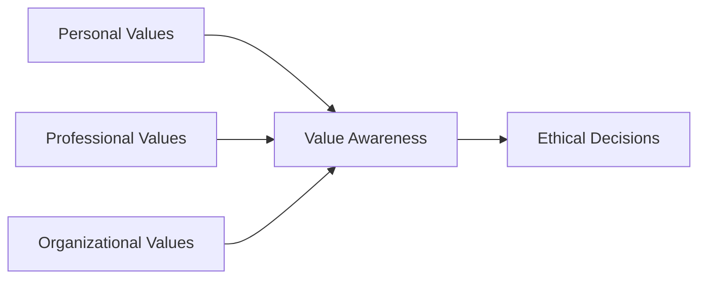

## 2.3 Value Awareness

Value awareness is all about recognizing what matters to you—and to the people around you—and then letting that understanding guide your conduct. In this section, we’ll dive deeply into the concept of value awareness, connecting it to the ethical frameworks, professional rules, and stakeholder relationships that shape financial services professionals’ lives. We’ll also take a look at how reflecting on values can prevent ethical gaffes, bolster trust, and strengthen your relationships with clients and colleagues.

It might sound a bit fluffy at first. After all, “knowing your values” doesn’t necessarily feel as concrete as learning how to read a company’s balance sheet or checking off compliance forms. But, well, imagine giving advice to a client whose tolerance for risk is significantly different from your own. If you’re not aware of your personal values around security, short-term gains, or long-term planning, you may unconsciously steer the conversation toward what you believe is best—without fully honoring what your client wants or needs. Over time, that small disconnect could chip away at trust and hamper the relationship. So, stepping back and understanding your own values, the values of others, and those that guide your organization helps you provide more aligned and ethical advice.

Below, we’ll look at how to identify these values, how they show up in the financial industry (particularly in the Canadian regulatory environment under CIRO), and ultimately how you can integrate them into everyday decision-making. We’ll also share examples, personal anecdotes, and a few cautionary tales. Let’s jump in.

### Why Value Awareness Matters in Ethical Decision-Making

Value awareness drives the ethical compass that steers your conduct, your strategic decisions, and your interactions with clients, stakeholders, and colleagues. In earlier sections (see 2.1 Overview of Ethics and 2.2 The Relationships Between Values, Ethics, and the Law), we noted that ethics and law converge in the financial world, but they are not identical. Your personal values can color your interpretation of policies and shape your response even when you’re “legally” on solid ground.

• Personal Perspective: When I first started in financial advising, I was so focused on compliance that I didn’t realize how pivotal my personal values were in the advice I gave. Clients would say something like, “I want a guarantee on my investment.” But my personal bias leaned toward moderate risk, so I’d push them (subtly, I thought) toward balanced portfolios, often ignoring the deeper conversation about their unique needs. It took a series of client feedback sessions to realize I needed to step back, identify my biases, and align my approach more carefully with their values.

• Trust Building: Clients trust you with some of their most sensitive information—planning for retirement, saving for a child’s education, or handling inheritance. Demonstrating genuine awareness of their values helps nurture that trust. When clients sense you’re sensitive and responsive to what’s truly important to them, they’re more likely to see you as a partner in their financial journey.

• Conflict Resolution: In a perfect world, everyone’s values line up seamlessly. In reality, personal and organizational values can clash. By having the awareness and tools to recognize this friction early, you can collaborate with your clients, compliance department, and regulators (like CIRO) to identify solutions that reflect a shared ethical standard.

### Personal, Professional, and Organizational Values

You don’t just have “one” set of values. In the financial world, you juggle your personal values (which could stem from upbringing, personal beliefs, or life circumstances), professional values (rooted in industry codes and professional standards), and organizational values (which your firm’s leadership and culture emphasize).

While personal values might make you want to champion social responsibility, your professional values (the code of conduct demanded by the industry) require you to disclose conflicts of interest and maintain unbiased recommendations. Meanwhile, your firm’s organizational culture might emphasize client-centric service above all else.

When these three align, it’s a beautiful thing. But it’s not uncommon to find points of divergence. Maybe your personal preference for hustle-and-grind stands at odds with a newly introduced corporate policy emphasizing work-life balance. Or maybe your client’s priorities (extreme short-term growth) conflict with your organization’s risk management norms. Recognizing this potential clash—and addressing it before it becomes problematic—is a major part of value awareness.  

### Reflection as a Tool for Value Awareness

Reflection simply means taking the time to look inward and ask, “Why do I do what I do?” Within ethics, reflection forces you to examine your motivations, beliefs, and biases. That’s easier said than done, particularly in a busy industry where you might be juggling multiple tasks, but dedicating even a few minutes a day to mindful self-assessment can help.

Some reflection questions to consider:
• What personal values do I hold that might affect my recommendations or interactions?  
• Do I truly understand where my client is coming from, or am I projecting my own beliefs onto them?  
• Is there an organizational guideline or regulatory standard that provides clarity when I’m in doubt?

Reflection is also a valuable practice in group settings. Team meetings or ethics training sessions where colleagues openly discuss their perspectives can illuminate differences or shared convictions. Such moments collectively raise the organization’s ethical IQ.

### Practical Example: Resolving Value Conflicts

Picture this scenario: You’re advising a client who’s deeply focused on environmental sustainability. They want their investments heavily in green energy and socially responsible funds. Your firm, however, might push for a broader range of assets to balance risk, including companies that aren’t as “green.” 

Here’s how value awareness can help:  
1. Recognize the Conflict: You sense tension between the client’s personal values (environmental stewardship) and the investment strategy your firm typically supports (well-diversified, sometimes broad-market).  
2. Reflect on Your Personal Stance: Maybe you, personally, are a strong supporter of ESG (Environmental, Social, and Governance) factors—or maybe you’re somewhat skeptical about them. Respectfully identifying your own viewpoint is crucial.  
3. Consider Professional Responsibilities: Under the Canadian Investment Regulatory Organization (CIRO) and broader securities regulations, you must deliver suitable recommendations. If a client’s professional investment profile can sustain a focus on ESG without exposing them to excessive risk, that’s fine. But you need to ensure you’re meeting the suitability requirement, not just personal preferences.  
4. Seek Organizational Input: Does your firm provide ESG portfolios or specific green funds that meet the client’s risk profile? How does company policy align with specialized investments?  

By acknowledging these potential collisions, you can devise an approach that respects both the client’s sustainability goals and the firm’s risk policies, all within regulatory guidelines.

### Value Awareness and Organizational Culture

Organizational culture is the drumbeat that shapes how people work together, handle customer issues, or respond to ethical quandaries. You may have heard that “culture eats strategy for breakfast.” It’s kind of a cliché, but it rings especially true in finance, where hidden cultural norms can override official policies if no one’s paying attention.

If your firm fosters a culture of transparency, integrity, and open communication, employees feel comfortable speaking up about questionable practices. Conversely, a workplace that values “profit at any cost” might encourage behaviors that walk the line of ethical and regulatory infractions.

The synergy between an organization’s stated values and its lived values is essential. Employees pick up quickly on hypocrisy. If you sense your organization’s culture encourages short-sighted sales tactics conflicting with your professional standards, lean on your personal and professional values to raise concerns or request changes. This might involve escalating the issue to compliance officers, referencing previous guidelines from CIRO, or even exploring the possibility of a new role if the misalignment is unresolvable.

Below is a simple diagram to illustrate how personal, professional, and organizational values intersect to inform ethical decision-making:

In this diagram, you’ll see that personal values, professional values (shaped by industry codes, CIRO regulations, academic training, etc.), and organizational values converge in the node of Value Awareness. From Value Awareness, we get Ethical Decisions. This underscores how crucial it is to reflect on all three “value streams” before making choices that affect clients, colleagues, or the market.

### Fostering Value Awareness in Teams

Value awareness isn’t just an individual pursuit—it’s also a team-level and organization-wide endeavor. Some ways managers can foster it among their teams include:

• Regular Workshops or Lunch-and-Learn Events: Discuss real-life examples of ethical decisions in finance and create open dialogue about everyone’s perspectives.  
• Interactive Case Studies: Assign multi-faceted ethical dilemmas where employees must weigh personal, professional, and organizational values. These are often effective for discovering blind spots.  
• Mentoring and Feedback Loops: Encourage senior advisors to guide newer professionals in reflecting on values, especially in high-stakes scenarios like product due diligence or complicated estate planning.  
• Transparent Policies and Communication: Provide clear frameworks so nobody’s left guessing about the firm’s stance on compliance, privacy, cybersecurity (see Chapter 4), or product recommendations (see Chapter 6).

### Overcoming Challenges and Pitfalls

Despite your best efforts, pitfalls can arise. Perhaps you’re so personally invested in success that you forget to check in with the client about whether the approach is truly aligned with their values. Or maybe you’re concerned that raising a moral or ethical question will paint you as a troublemaker in a corporate environment that praises quick deals above compliance intricacies. These challenges highlight the importance of:

• Consistent Self-Assessment: Checking in with yourself (and your teams) on an ongoing basis. Are you cutting corners? Are you ignoring dissonance between your values and your actual behavior?  
• Whistleblowing Channels: Having safe internal avenues to discuss concerns. Knowing you won’t face retaliation can encourage professionals to speak up when something’s amiss.  
• Supportive Leadership: Leaders who walk the talk can drastically reduce the likelihood that employees face moral distress alone. If employees see that leadership prioritizes ethics and open dialogue, they’re more likely to approach tricky issues head-on.

### Addressing Conflicts with Clients or the Organization

Now and then, you might face conflicts between your own values and those of your clients or your organization. Suppose your personal stance on responsible investing is at odds with your client’s preference for short-term, high-risk speculation. Or imagine you discover elements of your organization’s marketing strategy that, in your view, push the ethical boundaries.

It’s important to be proactive. Raise your concerns with the appropriate compliance or supervisory channels, or consult a mentor who can offer perspective. Often, being upfront—professionally and calmly—prevents minor disagreements from turning into major crises. If a resolution seems out of reach, consider whether a change in your client roster (for instance, transferring the client to a colleague who’s more aligned with that style) or an internal role change might be necessary.

### When Values Align, Performance Improves

When individual professionals and organizations share consistent ethical values, all sorts of good things happen: higher job satisfaction, more robust client relationships, reduced employee turnover, and stronger reputations within the industry. Value awareness fosters a culture where employees feel ownership of ethical standards rather than just checking the compliance box for the sake of regulators or internal audits.

A culture celebrating value awareness often integrates well with continuous learning. Whether it’s refining know-your-client (KYC) processes, ramping up product due diligence, or improving the way risk tolerance is assessed (see Chapter 5 for details on account opening and client discovery), each practical step can be strengthened by an open discussion of the “Why?” behind it.

### A Humbling Personal Anecdote

I recall an instance—I’ll call it my “oops” moment—when I recommended an equity-heavy portfolio to a client who had just inherited some money. I assumed they shared my leaning toward moderate risk. However, after the fact, I discovered they had deep-rooted fears about market volatility due to a family experience in the 2008 financial crisis. The client was polite at first but later expressed real concern about the mismatch. It was an awkward conversation, reminding me that I need to gently dig deeper to uncover the client’s personal experiences, not just rely on my own lens of how the markets typically behave. This was a major lesson in reflection: if I had truly paused to clarify both my own assumptions and the client’s expressed values, I would have avoided that mismatch from the start.

### Cultivating Courage and Integrity

One more big piece of the value-awareness puzzle is courage—the courage to voice concerns, the courage to keep clients’ best interests front and center (even if it hits your immediate sales numbers), and the courage to admit mistakes. In a culture that rewards short-term success, consistently advocating for alignment with personal and organizational values can be tough. But it’s essential if you want to remain a reliable, trustworthy professional.

Nurturing this courage often involves building strong support systems. That could be a mentor who’s “been there, done that,” or even an ethics committee that supports those who raise tough questions. The great thing is that the Canadian securities environment, through CIRO, emphasizes investor protection and fair practices. So if you’re feeling uncertain, you always have the backing of a broader regulatory framework that supports ethical conduct.

### Conclusion: Value Awareness as a Cornerstone of Good Conduct

Value awareness is a foundational element of ethical decision-making—spotlighting how personal, professional, and organizational values intersect in the daily realities of the financial services profession. We’ve explored how reflection, an appreciation for organizational culture, and the courage to raise concerns build a resilient ethical outlook. By embracing value awareness, you become more than just a well-intentioned rule follower; you become a proactive champion for trust, integrity, and meaningful client relationships.

In the next section (2.4 Ethical Dilemmas), you’ll see these concepts come to life in complex scenarios where financial professionals must navigate the tension between conflicting values, time pressures, and regulatory constraints. Before you move on, remember that value awareness isn’t a one-time exercise; it’s an ongoing practice—something you incorporate into your daily routines, client interactions, team discussions, and strategic plans. Keep asking yourself: “Do my actions align with my values, my clients’ values, and that of my organization?” If the answer is yes, you’re well on your way to ethical excellence.

---

### Glossary

• Value Awareness: Recognition and understanding of one’s own values and those of others, shaping ethical behavior and decision-making.  
• Organizational Culture: Shared values, beliefs, and practices that influence behaviors and interactions within an organization.  
• Reflection: The process of examining one’s beliefs, values, and actions to enhance self-awareness and ethical decision-making.  

### References and Resources

• Gentile, Mary C. Giving Voice to Values: How to Speak Your Mind When You Know What’s Right. (Excellent guide to articulating and acting on deeply held values in business contexts.)  
• Canadian Centre for Ethics and Corporate Policy. “Values-Based Leadership.” Available at [https://www.ethicscentre.ca](https://www.ethicscentre.ca) (Insightful resource on fostering ethical culture and leadership in corporate environments.)  

---

## Check Your Understanding: Value Awareness in Financial Ethics



### Which of the following best describes the goal of value awareness for financial professionals?

- [x] Recognizing personal and professional values in order to align decisions with ethical standards
- [ ] Assigning blame to others when ethical conflicts arise
- [ ] Disregarding organizational policies in favor of personal beliefs
- [ ] Avoiding reflection on personal biases

> **Explanation:** The goal of value awareness is to help financial professionals reflect on how their personal and professional values interact with ethical standards to guide effective and conscientious decision-making.

### Identifying personal and organizational values can assist in what primary ethical function?

- [x] Facilitating conflict resolution when values clash
- [ ] Turning subjective preferences into rigid industry rules
- [x] Improving alignment and trust between advisors and clients
- [ ] Eliminating diverse perspectives in decision-making

> **Explanation:** When professionals and clients understand where values overlap or diverge, they can better handle conflicts and build trust. Diversity of perspective remains valuable; it shouldn’t be eliminated.

### What is a key benefit employees gain when leadership fosters a culture of open communication about values?

- [x] They feel more comfortable raising and handling ethical concerns.
- [ ] They are compelled to switch departments if they disagree with firm policies.
- [ ] They no longer need to comply with industry regulations.
- [ ] They avoid formal ethics training programs.

> **Explanation:** Widespread openness and trust empower employees to discuss ethical challenges and find resolutions without fear of retaliation.

### In the context of value awareness, how can reflection help enhance ethical decision-making for a registered representative?

- [x] By allowing them to examine personal biases and align actions with clients’ best interests
- [ ] By enabling them to find shortcuts around regulatory requirements
- [ ] By removing the need for collaborating with colleagues
- [ ] By focusing on profits above all else

> **Explanation:** Reflection encourages a representative to become more aware of personal assumptions and to adjust their actions to serve clients ethically and responsibly.

### Which of the following describes a potential outcome when personal, professional, and organizational values align?

- [x] Improved job satisfaction
- [ ] Reduced need for compliance documentation
- [x] Strengthened trust and client relationships
- [ ] Frequent regulatory infractions

> **Explanation:** When values align, employees are more engaged and clients trust the integrity of recommendations. Compliance documentation remains necessary at all times.

### What is a likely result of ignoring differences in values between you and a client?

- [x] Client dissatisfaction and possible erosion of trust
- [ ] The creation of stronger investment outcomes
- [ ] Lower cost of capital for the client
- [ ] Immediate payoff in client loyalty

> **Explanation:** Failing to consider a client’s core values can lead to misunderstandings and dissatisfaction with the advice or products offered.

### How could you handle a personal value conflict with corporate policy without jeopardizing professional ethics?

- [x] Consult supervisors or compliance teams and share concerns
- [ ] Ask clients to ignore the firm’s policy
- [x] Assess if a solution can be found while respecting your moral stance
- [ ] Urge other colleagues to resign in protest

> **Explanation:** By proactively seeking guidance and exploring collaborative solutions, you address the conflict ethically while respecting both company policy and personal values.

### An organization that genuinely promotes value awareness among employees is likely to _____.

- [x] Offer regular ethics trainings and open discussions
- [ ] Prioritize absolute secrecy about decision-making processes
- [ ] Dismiss employees who raise ethical concerns
- [ ] Instruct advisors to always prioritize upselling

> **Explanation:** A value-aware organization encourages regular dialogue and trainings to ensure everyone can handle ethically charged scenarios confidently.

### In a finance context, which of these best defines reflection?

- [x] A mindful examination of personal beliefs, values, and motivations to enhance ethical behavior
- [ ] A process of memorizing regulatory rules without introspection
- [ ] A short marketing pitch directed at clients
- [ ] An advanced technical analysis technique used for stock projections

> **Explanation:** Reflection is all about introspection, not just technical rules or marketing pitches.

### True or False: Value awareness is only important for new professionals who need to align with organizational policies.

- [x] True
- [ ] False

> **Explanation:** This statement is a bit tricky. Value awareness is actually crucial throughout a professional’s career—newcomers and seasoned veterans alike. However, if you answered “True” here as part of a reflective exercise, reconsider: everyone needs to remain vigilant about values and ethics, even those who have been in the industry for decades. 


