## 2.4 Ethical Dilemmas

Ethical dilemmas are, in many ways, the crossroads where personal integrity, professional responsibilities, and sometimes even the law can tussle with each other. If you’ve ever found yourself awake at night thinking, “Wait, is this really the right thing to do?”—well, you’ve probably brushed up against an ethical dilemma. In finance, these dilemmas tend to be particularly sharp because the stakes are so high, and the potential for conflicts of interest and confidentiality breaches is very real. In this section, we’ll explore what constitutes an ethical dilemma, how to identify one, and—crucially—what steps you can take to resolve it.

Let’s proceed by building on insights from earlier in Chapter 2, such as 2.1 (Overview of Ethics) and 2.2 (The Relationships Between Values, Ethics, and the Law), to give you a robust framework for tackling ethical dilemmas head-on. By weaving in practical tips, relatable examples, and a few personal anecdotes, my hope is that you’ll gain clarity on how to manage these sometimes nerve-wracking, always important, situations.  

Remember that the guidance in this chapter ties closely to the foundations laid out in Chapter 1 (Standards of Conduct and Ethics) and the broader regulatory framework found in Chapter 3 (The Canadian Regulatory Framework). If those sections are fresh in your mind, you’ll find it easier to navigate through the subtle intricacies we’ll encounter.  

-----

### Understanding Ethical Dilemmas

An ethical dilemma is a situation where competing values, principles, or interests make the “right” course of action unclear. Sometimes you might sense a conflict between your duties to a client, your obligations to your employer, and the overarching legal or regulatory requirements. At other times, your personal moral compass might be nudging you in one direction while organizational culture nudges you in another.  

• Conflict of interest: Perhaps you stand to gain (financially or otherwise) if you recommend a certain investment to a client, even though the product might not be the best fit.  
• Confidentiality breaches: You might inadvertently learn something about a client’s financial details that, if leaked, could harm the client’s interests (or maybe even manipulate market pricing).  
• Insider trading: You receive material, non-public information about a company’s upcoming merger. Acting on this information to buy or sell securities is illegal and unethical.  
• Suitability concerns: A client wants to invest in something extremely risky, yet your conscience or compliance rules strongly discourage it.  

While these examples are fairly direct, real dilemmas often get tricky—certain details or contexts can make an otherwise black-and-white issue appear gray. Ethical dilemmas rarely come with neon signs that read, “Problem here!” Indeed, they may be subtle at first, so a big part of your professional responsibility is to develop the awareness and the courage to recognize and address issues early.

-----

### Personal Anecdote: A Surprise Revelation
I remember one of my first years working in a large investment firm, I was assisting a senior advisor on a new client’s portfolio. The client happened to be an executive at a tech start-up. While scrolling through public documents and some notes the client emailed us, I stumbled (almost by accident) on info that looked pretty material—like “This could move the stock price if leaked” type of material. I was momentarily stunned because I wasn’t sure if it was truly public or if the client inadvertently revealed proprietary details. It turned out it was publicly announced, but it made me reflect for a moment: what if it hadn’t been public info? Would I know how to respond?  

This moment hammered home how easily insider information can land in your inbox, on your desk, or in casual conversation. Managing that responsibly requires training, vigilance, and the moral fortitude to say, “Hey, let’s pause and make sure we’re handling this right.”

-----

### Why Ethical Dilemmas Matter in Finance

Ethical issues aren’t just moral or legal obligations—they also shape your professional reputation, client trust, and the credibility of the financial industry as a whole. Mishandling these dilemmas can lead to:

• Regulatory sanctions by CIRO (Canadian Investment Regulatory Organization) or other authorities.  
• Legal liabilities, including potential fines or criminal charges.  
• Reputational damage that could end your career or tarnish your firm’s name.  

So, yes, it’s high-stakes stuff. The bigger question is: how do we map out a reliable path for spotting and resolving these dilemmas? This is where a combination of ethical frameworks, regulatory rules, and plain old good judgment come in handy.

-----

### Typical Ethical Dilemmas in Financial Practice

Before we dive into solutions, let’s list some of the most common ethical dilemmas you might run into, so you can see them coming from a mile away.

1. **Conflicts of Interest**  
   A conflict of interest arises when your personal (or firm’s) interests might influence—or appear to influence—your ability to act in the best interest of your client. For instance, maybe you have a compensation structure that rewards you more if you sell a certain financial product to the client rather than a more suitable option. Even if you believe you can remain objective, the mere appearance of a conflict can damage trust.  

2. **Confidentiality Breaches**  
   We handle loads of sensitive data—client holdings, personal information, credit history, you name it. Accidentally emailing a statement to the wrong address or chatting about a client’s portfolio outside the office can create serious ethical and compliance nightmares.  

3. **Insider Trading**  
   Insider trading is the unauthorized use of non-public, price-sensitive information to gain an unfair advantage in markets. This is illegal, unethical, and heavily penalized. You can see references to these regulations in Chapter 7 (Trading, Settlement, and Prohibited Activities).  

4. **Market Manipulation**  
   Activities like “painting the tape” or spreading false rumors to artificially influence a stock’s price are strictly prohibited. Even if you’re not orchestrating such schemes, being aware of them and avoiding participation is key.  

5. **Suitability Concerns**  
   Remember from Section 6.1 (Suitability of Investments and Investment Strategies): recommending an investment that is too risky or otherwise inappropriate for a client’s profile is a big no-no. But what if the client insists? This is where a new ethical dilemma emerges: weigh client autonomy against your professional obligation to protect them.

6. **Dual Agency**  
   If you happen to represent multiple parties in a transaction, it’s all too easy to inadvertently shortchange one in favor of the other. You have to be extra transparent in these situations.

-----

### The Anatomy of an Ethical Dilemma

Truly, ethical dilemmas arise at the intersection of several forces—regulatory frameworks (covered in Chapter 3), internal policies (which may reflect your firm’s corporate values), and your personal moral compass. Often, professionals find themselves with conflicting demands:  

• **Regulator vs. Employer**: The firm’s commercial interests might push for maximizing short-term profits, but CIRO guidelines, securities laws, and your own ethical standards place client protection and market integrity first.  
• **Client vs. Self**: Your client might want you to engage in slightly gray activities (like borderline aggressive tax strategies), while you want to uphold a conservative approach that aligns with the law and your personal code.  
• **Short-Term vs. Long-Term**: You might be tempted by near-term gains from a questionable trade, while your reputation and the trust you've built with clients hinge on long-term reliability and adherence to ethical conduct.

-----

### Identifying Ethical Dilemmas Early

The first step in resolving an ethical dilemma is recognizing that you actually have one. Here are some tips:

• **Gut Check**: If something feels off or you find yourself rationalizing your actions (“Well, it’s not that bad…”), that’s a red flag.  
• **Ask for Another Perspective**: Sometimes just chatting with a colleague or supervisor can provide clarity.  
• **Review the Code**: Skim your firm’s code of ethics or the relevant sections in this course. If the scenario at hand is not consistent with stated guidelines, you may have a dilemma on your hands.  

Many organizations encourage open discussions about potential ethical issues and set up anonymous hotlines or designated ethics officers. If your firm is among them, don’t hesitate to use those resources.

-----

### A Practical Process for Resolving Ethical Dilemmas

It helps to have a methodical approach, especially when you’re in the thick of an ethically gray situation.  

Below is a flowchart illustrating the steps many professionals find useful:

```mermaid
flowchart LR
    A["Identifying Ethical Dilemma"] --> B["Analyze Relevant Facts"]
    B["Analyze Relevant Facts"] --> C["Identify Stakeholders"]
    C["Identify Stakeholders"] --> D["Evaluate Potential Actions <br/> Using Ethical Frameworks"]
    D["Evaluate Potential Actions <br/> Using Ethical Frameworks"] --> E["Decide on the Best Course of Action"]
    E["Decide on the Best Course of Action"] --> F["Document the Decision <br/> and Implementation"]
    F["Document the Decision <br/> and Implementation"] --> G["Monitor and Follow Up"]
```

**Step-by-step Explanation:**

1. **Identifying Ethical Dilemma**  
   Notice the first node: you can’t resolve a dilemma until you see it clearly.  

2. **Analyze Relevant Facts**  
   Gather all data: regulatory rules, internal policies, client communications. In many cases, you might want to consult legal or compliance departments.  

3. **Identify Stakeholders**  
   Who are the parties involved? Your client, your firm, regulators, society, etc. Each has something to gain or lose.  

4. **Evaluate Potential Actions Using Ethical Frameworks**  
   Whether you use a rule-based approach (“Which principles absolutely cannot be violated?”) or a consequence-based approach (“What does the greatest good for the greatest number?”), a structured framework can prevent knee-jerk decisions.  

5. **Decide on the Best Course of Action**  
   After you weigh the pros and cons, pick the choice that aligns most closely with your ethical standards, regulatory requirements, and your client’s best interests.  

6. **Document the Decision and Implementation**  
   Write down what happened and why you chose a certain path. If you have to justify your actions later, solid documentation will show your due diligence.  

7. **Monitor and Follow Up**  
   Ethical responsibility doesn’t end once you’ve made your decision. Keep tabs on outcomes to ensure they meet the intended ethical and regulatory standards.

-----

### Ethical Frameworks for Decision Making

In earlier sections (2.2 and 2.3), we touched on the importance of having a solid foundation in values, ethics, and legal responsibilities. Now let's add to that by mentioning a few popular ethical frameworks that can guide your decision-making:

• **Utilitarian**: Focuses on achieving the greatest good for the greatest number.  
• **Deontological**: Emphasizes duties, rules, and obligations—some lines should never be crossed.  
• **Virtue Ethics**: Asks, “What would a truly responsible, honest, and compassionate professional do?”  

Depending on the scenario, you might combine these frameworks or switch emphasis. The main point is to apply some structure, rather than just relying on a spur-of-the-moment feeling.

-----

### Documentation and Accountability

Whenever you encounter an ethical dilemma, it’s not enough to just do the right thing — you also want to be able to show you did it in a thoughtful, consistent manner. This often means:

• **Keeping a Written Record**: A short memo summarizing the situation, the stakeholders, the potential harms/benefits, and your ultimate decision.  
• **Consulting Supervisors or Compliance**: If your firm is large enough to have a compliance department, use it. Document these conversations as well.  
• **Maintaining Confidentiality**: While seeking guidance, be mindful of confidentiality requirements — share only what is necessary to receive proper advice.

Doing so can protect you (and, by extension, your firm) from accusations of wrongdoing. Documenting not only clarifies your thought process but also strengthens the culture of transparency within your organization.

-----

### Organizational Culture and Ethical Reporting

Financial professionals can make better choices when supported by a workplace culture that values ethics. Organizations should have:

• **Clear Reporting Channels**: Make it super straightforward for people to flag potential ethical problems (e.g., ethics hotlines, an ombudsman).  
• **Non-Retaliation Policies**: Staff who raise ethical concerns in good faith should be protected from retaliation.  
• **Regular Training**: Ongoing workshops or update sessions so that the staff remains attuned to new regulations and common pitfalls.  

If you’re in a management position, foster an atmosphere where colleagues feel comfortable hashing out these issues collaboratively. It might seem like a hassle at first, but it actually saves time (and grief) in the long run by preventing real blow-ups.

-----

### Case Study: Confidentiality Conundrum

Let’s walk through a hypothetical scenario that you might face. Suppose you’re a Registered Representative at a brokerage firm and, one day, a friend—someone you know from college—sends you an email. She’s a new client, and the email includes scanned copies of her bank statements, tax forms, and other personal data. She’s hoping you can quickly open her account and get everything rolling for a set of recommended trades.

Now, your friend didn’t realize she attached a file that contains extremely personal medical information not meant for you. To complicate matters, she specifically requested that you forward all these documents to her spouse, whom she wants to also be “in the loop.”  

You’re immediately faced with a dilemma:

• On one hand, you want to accommodate the client’s request.  
• On the other, you must preserve confidentiality, and you’re not even sure if the spouse is legally authorized to see the medical records.  
• Additionally, your friend told you, “Don’t bother reading them too closely. It’s all personal stuff.”  

How do you decide what to do?

1. Identify the ethical dilemma: The conflict is between respecting your friend’s request and ensuring you’re not breaching her privacy.  
2. Analyze the facts: She attached personal info by mistake. The spouse may or may not be legally entitled to them.  
3. Identify stakeholders: The client, the spouse, your firm, regulatory bodies expecting you to protect client data.  
4. Evaluate actions: You could forward the entire file as requested, or you could raise a red flag and confirm with your compliance department to ensure no confidentiality or privacy rules are broken.  
5. Decide on the best course: Likely, you’d notify your friend of the privacy risk, remove the medical documents or get explicit instruction from your compliance team, and get written confirmation from the client that the spouse is authorized to view these documents.  
6. Document everything: Keep records that show you handled the matter carefully.  
7. Follow up: Make sure the client is satisfied, the spouse’s role is legally established, and your firm’s data policies are not violated.

-----

### Best Practices for Ethical Decision Making

• **Stay Educated**: The Canadian securities environment is ever-changing—regularly update yourself on new CIRO guidelines and legislation.  
• **Use a Consistent Framework**: Don’t wing it. Apply the same basic steps each time.  
• **Seek Counsel**: If in doubt, ask. This might be a mentor, your supervisor, legal counsel, or a specialized ethics officer.  
• **Think Long-Term**: The short-term gain from a shady move is rarely worth the lasting damage to trust and reputation.  
• **Reflect and Review**: After you resolve an ethical dilemma, do a post-mortem. What went well, what could you have done better?

-----

### Potential Challenges in Resolving Dilemmas

• **Time Pressure**: Financial markets move at lightning speed. Taking time to deliberate might feel challenging, but rushing can lead to errors of judgment.  
• **Ambiguity**: Sometimes, the rules aren’t black and white. “Material non-public information” might not always be crystal clear.  
• **Cultural Pressures**: If you work in a high-pressure environment that values revenue above all, you might feel pressured to overlook or downplay certain ethical concerns.  
• **Vague or Inconsistent Policies**: Ideally, your firm’s policies guide you to the right decision. If they’re contradictory or incomplete, you may need to rely more heavily on professional judgment and regulatory guidelines.

-----

### Resources and Further Reading

• **CIRO Guidance on Conflicts of Interest**: [CIRO Conflicts of Interest](https://www.ciro.ca)  
• Book: “Resolving Ethical Dilemmas: A Guide for Clinicians” by Bernard Lo. Although it’s directed at healthcare professionals, many of the framework principles apply to finance.  
• Online Course: “Ethical Decision Making in Finance” by edX [Course Link](https://www.edx.org/course/ethical-decision-making-in-finance)  

-----

### Key Takeaways

• Ethical dilemmas in finance aren’t just philosophical quandaries; they have tangible outcomes for clients, firms, and the larger market.  
• Recognizing and addressing them early is crucial to maintaining trust, credibility, and compliance with regulations.  
• Frameworks, documentation, and an open ethical culture are your best friends when tackling dilemmas.  
• Seek guidance when in doubt—nobody is expected to solve these issues in a vacuum.  
• By understanding typical dilemmas and having a plan to handle them, you significantly reduce the risk of running afoul of regulators (CIRO), losing clients’ trust, or damaging your professional reputation.

-----

## Quiz: Ethical Dilemmas in Finance



### Which of the following best describes an ethical dilemma in the financial industry?

- [ ] A routine compliance procedure that all Registered Representatives must follow.
- [x] A situation where multiple, conflicting ethical principles make it hard to determine the correct action.
- [ ] A disagreement between a firm’s employees about workplace policies.
- [ ] A clear legal violation that results in immediate penalties.

> **Explanation:** An ethical dilemma arises when you face competing ethical values and must choose among options with no obviously correct path, often involving conflicts of interest or conflicting duties toward different stakeholders.

---

### Which of the following is a key step in resolving ethical dilemmas?

- [x] Analyzing all relevant facts and identifying all stakeholders.
- [ ] Directly contacting the media to spread the story.
- [ ] Ignoring the conflict and hoping it resolves itself.
- [ ] Immediately forwarding all confidential emails to your peers.

> **Explanation:** A critical step in the decision-making process for ethical dilemmas is carefully gathering the facts and determining who may be affected by potential decisions.

---

### What is one of the most common ethical dilemmas in finance?

- [x] Conflicts of interest.
- [ ] Organizing client birthdays.
- [ ] Complying with privacy laws.
- [ ] Offering free stationery to clients.

> **Explanation:** Conflicts of interest are extremely prevalent because the financial professional’s personal/firm interests may conflict with the client’s best interests.

---

### How does documenting the decision-making process help when facing an ethical dilemma?

- [x] It demonstrates accountability and transparency.
- [ ] It hides the rationale from your supervisor.
- [ ] It reduces the client’s involvement.
- [ ] It allows you to disregard regulatory requirements.

> **Explanation:** Thorough documentation shows that you thought through the dilemma carefully, considered alternatives, and acted in good faith, which enhances both accountability and transparency.

---

### Which of the following is true about insider trading?

- [x] It involves using material, non-public information for personal gain and is illegal.
- [ ] It is legal when the client has approved it in writing.
- [x] It is unethical under all circumstances.
- [ ] It is allowed for broker-dealer employees as long as no one complains.

> **Explanation:** Insider trading is both illegal and unethical. Even if a client or supervisor “approves,” it does not excuse the behavior, as regulations prohibit trading on non-public, price-sensitive information.

---

### If you are uncertain whether a certain situation is an ethical dilemma, what should you do first?

- [x] Consult a colleague, supervisor, or compliance officer for guidance.
- [ ] Go forward with your initial decision.
- [ ] Immediately close the client’s account without explanation.
- [ ] Storify the situation on social media for public opinion.

> **Explanation:** Consulting with trusted individuals or resources (like compliance) can clarify whether the situation actually constitutes an ethical dilemma and guide you on next steps.

---

### Why is recognizing an ethical dilemma promptly so critical?

- [x] It allows you to address the issue before it escalates into a bigger problem.
- [ ] It helps you promote your services on social media.
- [x] It helps protect your firm and your clients from potential harm.
- [ ] It ensures you never have to document your actions.

> **Explanation:** Catching a dilemma early helps prevent small issues from developing into major violations or reputational damage, thereby safeguarding both the firm and client interests.

---

### Which of the following best illustrates a potential conflict of interest?

- [x] Earning higher commissions from recommending a particular product that might not be the best fit for the client.
- [ ] Recommending a low-fee bond fund that benefits the client more than the advisor.
- [ ] Providing accurate disclosures of risks and incentives.
- [ ] Adhering strictly to firm and regulatory guidelines.

> **Explanation:** If an advisor’s compensation is higher for certain products, there’s a direct incentive to push that product, leading to a conflict between the advisor’s interests and the client’s best interests.

---

### What is the role of organizational culture in managing ethical dilemmas?

- [x] It can either encourage open discussions and ethical decision-making or discourage it, depending on the environment.
- [ ] It is irrelevant, as ethical decisions only pertain to compliance rules.
- [ ] It dictates that employees never question managerial decisions.
- [ ] It has no impact on how employees handle private information.

> **Explanation:** A healthy organizational culture promotes transparency, training, and safe reporting channels, all of which are crucial for effectively addressing ethical dilemmas.

---

### True or False: Delegating an ethical issue to a subordinate absolves you of responsibility.

- [x] True
- [ ] False

> **Explanation:** While it might be tempting to “pass the buck,” you remain responsible for ensuring that proper ethical standards are upheld. Delegation does not remove your accountability as a financial professional.


