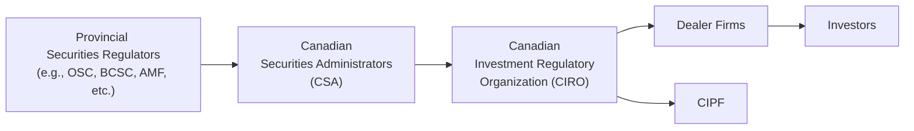

## 3.1 General Principles of Securities Regulation

Securities regulation might sound complicated, but it’s essentially about making sure the securities markets operate fairly and transparently under rules that protect investors. And I’ll admit, the first time I heard about regulatory frameworks, I was like, “Um… do we really need all these rules?” But once you think about it, you realize that strong regulations build trust. They’re designed to protect regular folks (yes, including you and me) and to keep markets stable and orderly.

Securities regulation in Canada follows a few big, guiding principles. It’s overseen largely at the provincial or territorial level, though all these regulators collaborate under an umbrella organization called the Canadian Securities Administrators (CSA). On top of that, we have a Self-Regulatory Organization (SRO) known as the Canadian Investment Regulatory Organization (CIRO), which oversees investment dealers, mutual fund dealers, and marketplace integrity. So don’t worry if all of this seems like a maze—by the end of this section, you’ll see how each part fits together to create a framework that keeps the capital markets running smoothly.

### Why Regulation Matters

I once had a friend—let’s call him Ryan—who got super excited about investing after seeing a news segment on “hot tech stocks.” Without any research, he put a good chunk of his savings into a small tech company that talked a big game about a revolutionary new product. Turns out, that company had been making pretty lofty claims without disclosing some critical financial details. Ryan lost most of his initial investment, and he was understandably frustrated that he didn’t have the full story. That’s exactly the kind of situation securities regulation aims to prevent.  

Regulations try to ensure:

• Investors (like Ryan) have access to accurate and timely information.  
• Issuers (the companies that sell securities) follow strict rules about disclosing material facts.  
• Anyone who misleads or manipulates the market faces consequences.  

Ultimately, a well-regulated market attracts investors because they can participate with some confidence that the game isn’t rigged. A stable market also lets companies raise capital more efficiently, which is crucial for economic growth.

### The Big Picture of Canadian Securities Regulation

So how does it all fit together? In Canada, we have 13 securities regulators—one for each province and territory. For instance, Ontario has the Ontario Securities Commission (OSC), British Columbia has the British Columbia Securities Commission (BCSC), and Quebec has the Autorité des marchés financiers (AMF). Even though each regulator has its own set of laws and rules, they collaborate and coordinate through an umbrella group called the Canadian Securities Administrators (CSA).

#### A Quick Peek at the System

Below is a simplified Mermaid diagram that shows how these organizations connect with each other, including CIRO and the Canadian Investor Protection Fund (CIPF).

• A: Each province and territory has its own securities commission or authority.  
• B: The CSA brings all these regulators together to streamline policy and foster national cooperation.  
• C: CIRO is the national self-regulatory body that now oversees the activities formerly regulated by the Mutual Fund Dealers Association (MFDA) and the Investment Industry Regulatory Organization of Canada (IIROC). Those historical SROs no longer exist separately.  
• D: Dealer firms (investment dealers and mutual fund dealers) must follow CIRO’s rules.  
• E: Investors ultimately benefit from coordinated regulation, investor education, and protective measures.  
• F: CIPF safeguards eligible client investment accounts if a member dealer becomes insolvent.  

It might look like a lot of different layers, but the goal is pretty straightforward: consistent protection and oversight from coast to coast.  

### Core Principles of Securities Regulation

The framework for securities regulation in Canada revolves around four key principles:  

#### Investor Protection

This is front and center. Investor protection is about ensuring no one is taken advantage of or misled. If you’re someone who’s buying stocks, bonds, mutual funds, or other investment products, the regulator wants to be sure you have fair and equal access to the facts:

• Full Disclosure: Companies must disclose all “material” information—anything that could influence an investor’s decision.  
• Enforcement and Penalties: Regulators have the power to investigate violations (like fraudulent disclosures or insider trading) and impose penalties.  
• Product Approval: Some investment products need to go through intense scrutiny before hitting the market, ensuring they meet certain standards of quality and safety.  

Let’s say a dealership wants to introduce a new product type, like a complex derivative. Before they can start marketing it widely, the regulators (and sometimes CIRO) review the product’s structure, the associated risks, and the clarity of its disclosure documents. That way, unsuspecting investors aren’t blindsided by hidden risks.

#### Fair and Efficient Markets

“Fair” means no insider has an unfair advantage, and “efficient” implies markets function in a way that helps produce accurate prices and ample liquidity. So if you want to sell your shares, you can do so (more or less) at a market price without causing huge ripples.

• Market Transparency: Traders and investors should have access to real-time or reasonably up-to-date market data.  
• Equal Opportunity: Insider trading laws prohibit corporate insiders or connected parties from trading on non-public, price-sensitive information.  
• Orderly Conduct: Fraud, manipulation, and distortion of market prices are big no-no’s.  

Most of the rules in this area revolve around fostering healthy competition, ensuring that trades happen in an open environment, and punishing manipulative practices like “pump-and-dump” schemes or blatant misrepresentation.

#### Reduction of Systemic Risk

Systemic risk is that sneaky domino effect where one failure leads to bigger problems. It’s the sort of risk that, if unchecked, could cause the entire financial system to buckle. A big lesson came during the 2008 global financial crisis, where the downfall of a few institutions rattled markets worldwide.

• Capital Requirements: Financial firms (e.g., brokerages, banks) must maintain certain capital reserves relative to their exposure. If they don’t have enough capital, a market downturn could push them into default, which then wreaks havoc on the entire system.  
• Supervision of Key Market Players: Regulators keep close tabs on large institutions or “systemically important” firms.  
• Stress Testing: Many regulatory bodies conduct or require stress tests to gauge how institutions can handle economic upheaval or liquidity crunches.  

As a personal note, I’ll never forget how it felt to watch large global banks teeter on the brink of collapse in 2008. It was a real eye-opener that strong oversight isn’t optional.

#### Public Confidence

Let’s face it: People invest in markets partly because they trust that the system is fair. Public confidence is crucial, so regulators go to lengths to maintain that trust:

• Rigorous Enforcement: If someone commits securities fraud, there are legal ramifications—from hefty fines to jail time.  
• Transparent Policies: Regulatory bodies publish guidance, policy statements, and staff notices, so everyone knows what to expect.  
• Accessibility and Education: Investor education programs, like those from CIRO, help the public learn about financial products, risk management, and their legal rights.  

When the public sees that dishonest players get caught and penalized, it sends a clear message that wrongdoing won’t be tolerated. This fosters a sense of security and trust, encouraging broader market participation.

### Collaboration Among Provincial Regulators

In some countries, you’ll see a single national securities regulator. But, Canada’s regulatory structure is unique due to its federalism. Each province or territory writes its own securities laws, but to reduce duplication and confusion, regulators formed the CSA:

• Common Goals: Even if the rules differ slightly, the overarching aim is consistent investor protection and transparent capital markets nationwide.  
• Harmonized Securities Laws: The CSA strives to produce “national instruments” that apply across all jurisdictions, ensuring consistent guidelines for disclosure, insider trading, and enforcement.  
• Streamlined Processes: Through the “passport system,” a company that wants to offer securities in multiple provinces can often file paperwork in its principal regulator’s jurisdiction, which is then accepted by the others.  

If you’re into analogies: The CSA is like a big potluck where each province brings its own dish, but they coordinate so the meal works for everyone, not just for Ontario or Quebec.  

### CIRO’s Role in the Regulatory Landscape

As of the beginning of 2023, Canada saw the amalgamation of the Mutual Fund Dealers Association (MFDA) and the Investment Industry Regulatory Organization of Canada (IIROC) into one SRO: the Canadian Investment Regulatory Organization (CIRO). Historically, MFDA handled mutual fund dealers, while IIROC oversaw investment dealers. Now, CIRO represents a comprehensive self-regulatory body in charge of ensuring:

• Dealer Oversight: CIRO sets proficiency frameworks, operational standards, and compliance requirements for member dealers.  
• Market Integrity: CIRO monitors equity and debt marketplaces for improper conduct or manipulative trading.  
• Ethical Standards: CIRO fosters professional ethics among registered representatives, requiring them to abide by its rules of conduct.  

This single SRO model aims to reduce redundancies, create a unified rulebook, and ultimately help ensure consistent enforcement across all dealer platforms. If you’re a newly registered representative, you’ll want to study CIRO’s rules closely, as they’re essentially your day-to-day guide on how business must be conducted.

### The Importance of Disclosure

When we talk about investor protection, “disclosure” is a buzzword that pops up often. Disclosure means an issuing company (like a firm selling shares or bonds to the public) must reveal all material facts that an investor would need to know before deciding to invest. Material information could include:

• Financial Statements: Balance sheets, income statements, cash flow statements—audited according to accepted accounting standards.  
• Management Discussion & Analysis (MD&A): An explanation of the company’s performance, trends, and risks that may not be obvious from raw numbers.  
• Risk Factors: Specific operational or market-driven risks, such as the risk of new competitors, potential changes in regulation, or commodity price volatility.  

If an issuer fails to disclose key data—like a serious lawsuit or a sudden leadership change—it undermines the trust that regulation is meant to foster. That’s why regulators require timely updates, including press releases and material change reports.

### Enforcement and Liability

Wondering what happens if someone breaks these rules? Enforcement can take many forms:

• Administrative Penalties: Monetary fines, suspension of registration, or restrictions on future activities in the securities industry.  
• Criminal Charges: In cases of serious fraud or market manipulation, individuals can face criminal charges that lead to substantial fines or prison sentences.  
• Civil Litigation: Investors who’ve suffered losses due to misleading or inaccurate disclosure might bring civil suits against the responsible issuers or directors.  

In the old days, you might hear about IIROC or the MFDA holding a disciplinary hearing. But as of 2023, CIRO is the single self-regulatory entity. It can impose penalties and sanctions on its members if they breach CIRO rules. On top of that, the provincial regulators—like the OSC—continue to have broad enforcement powers too. Nobody likes penalties, so it’s in everyone’s interest to follow the rules.

### Transparency and Market Efficiency

Transparency might seem like a buzzword, but it’s vital. Markets function best when investors can make informed decisions. That means timely, accurate, and complete information about:

• Corporate Financials and Strategy  
• Trading Activity and Pricing Data  
• Regulatory Notices and Policy Changes  

Efficient markets, in theory, incorporate all available information into security prices. If one group has secret, insider info—say a new product is about to bomb in the market—then that group has an unfair advantage. This is precisely why insider trading laws exist: they stop insiders from acting on these unknown facts before the general market is aware.

### Managing Systemic Risks

Ah, that dreaded domino effect. Systemic risk can cause widespread financial panic and do big damage to the economy. Regulators try to get ahead of these potential crises by requiring firms to keep robust capital reserves and by carefully monitoring leverage levels. They also keep an eye on the bigger players in the market. The 2008 crisis taught everyone that if a large institution falters, it can take everyone else down with it.

Some folks might groan about extra filling out forms or capital ratio requirements, but these measures can prevent a meltdown when markets take a downturn. It’s sort of like an emergency fund for the whole financial system.

### Upholding Public Confidence

At the end of the day, all these principles—investor protection, fair and efficient markets, reduction of systemic risk, and transparency—are about earning and maintaining public trust. Without the public feeling safe enough to invest, capital markets slow down, growth stalls, and it becomes harder for businesses to fund projects. When enforcement staff respond swiftly to wrongdoing, it sends a clear message: “We value fairness. We’ll protect you.” That’s how you keep people in the market, fueling the engine of economic development.

### Common Pitfalls and How to Avoid Them

Even with a solid regulatory framework, people and firms sometimes step into trouble. Some common missteps:

• Inadequate Disclosure: Leaving out key details or burying essential information in legal jargon.  
• Conflicts of Interest: Recommending products that primarily benefit a firm or advisor instead of meeting client needs.  
• Insider Trading: Trading on material, non-public info. This is both unethical and illegal.  
• Failure to Know Your Client: Not gathering accurate information about a client’s risk tolerance, knowledge, and financial situation can lead to unsuitable investments.  

The surefire way around these pitfalls is education, diligence, and honest communication. If a detail might be important to investors, disclose it. If a product might be too risky, say so. Always put the client’s interest first.

### Real-World Example: The ABC Mining Case Study

Let’s imagine a scenario (entirely hypothetical—though it mirrors countless real cases) to highlight why general principles matter:

• ABC Mining Inc. is a junior mining company claiming it will revolutionize the extraction of a rare mineral.  
• ABC has limited operational history, big dreams, and an ongoing push to raise money by issuing shares.  
• In its investor presentations, ABC touts an “innovative technique” but doesn’t disclose that it lacks scientific validation and is under licensing disputes.  
• Investors flock to ABC’s shares thinking it’s the next big thing. The stock soars. Then regulators discover ABC withheld critical risk factors.  

Investor confidence plunges, and many folks see their entire investment shrink drastically when the truth comes out. Regulators fine ABC, the directors might face personal liability claims, and the stock’s reputation is tarnished. This scenario underscores how failing to align with these principles can lead to disastrous outcomes for everyone involved.

### Tying It All Together

Canadian securities regulation may be administered provincially, but it’s built on shared principles that shape the entire market:

• Put the investor first—through fair treatment and full disclosure.  
• Keep markets open and transparent.  
• Reduce risks that could derail the entire financial system.  
• Build and preserve public trust in capital markets.  

These principles matter not just to policy wonks or compliance officers, but to anyone dreaming of a secure financial future. And if you plan to work as a registered representative, they form the bedrock of everything you’ll do. Make sure to keep them in mind when analyzing or recommending any investment to a client.  

For specific details on the major government bodies active in regulations—like the OSC or AMF—check out the discussion in the next section: “3.2 Key Government Players Involved in Securities Regulation.”  

---

### Glossary

• Securities Regulation: The set of laws, rules, and guidelines governing the issuance, trading, and management of securities.  
• Transparency: The availability of clear, accurate, and timely information to investors and market participants.  
• Systemic Risk: The risk that the failure of one financial institution or market participant could trigger widespread instability in the financial system.  
• Liquidity: The ease with which securities can be bought or sold without significantly affecting their price.  
• Disclosure: The process by which issuers provide relevant financial and operational information to investors.

### References and Additional Resources

• Canadian Securities Administrators (CSA):  
  [https://www.securities-administrators.ca](https://www.securities-administrators.ca)  
• Book: “Canadian Securities Regulation” by David Johnston, Kathleen Doyle Rockwell, & Cristie Ford  
• CSI’s “Canadian Securities Course (CSC®)”:  
  [https://www.csi.ca/student/en_ca/courses/csi/csc.xhtml](https://www.csi.ca/student/en_ca/courses/csi/csc.xhtml)  
• CIRO Resource Center (for the latest rules and updates):  
  [https://www.ciro.ca](https://www.ciro.ca)

---

## Test Your Knowledge: Principles of Canadian Securities Regulation



### 1. Which key principle of securities regulation ensures that relevant information about a company is made available to all investors?  
- [ ] Market Efficiency  
- [x] Full Disclosure  
- [ ] Available Liquidity  
- [ ] Corporate Accounting  

> **Explanation:** Full disclosure is essential so that investors receive all material information and can make informed decisions.

### 2. How does the Canadian Securities Administrators (CSA) help streamline securities regulation across Canada?  
- [ ] By removing the need for provincial regulators   
- [x] By harmonizing rule-making and coordinating policies across multiple jurisdictions   
- [ ] By replacing all SRO roles   
- [ ] By eliminating disclosure requirements for smaller companies  

> **Explanation:** Each province still has its own regulator, but the CSA helps harmonize rules, improving consistency and reducing duplication.

### 3. Which of the following is a primary role of the Canadian Investment Regulatory Organization (CIRO)?  
- [ ] Monitoring interest rates set by the Bank of Canada  
- [x] Overseeing investment dealers and mutual fund dealers  
- [ ] Appointing provincial securities regulators  
- [ ] Providing legal advice to individual investors  

> **Explanation:** CIRO is Canada’s self-regulatory organization that merged the roles of the historical MFDA and IIROC, overseeing dealer conduct and marketplace integrity.

### 4. Why is reducing systemic risk a major focus of securities regulation?  
- [x] Because a single institutional failure can lead to widespread market instability  
- [ ] Because it ensures companies always meet their quarterly earnings projections  
- [ ] Because it replaces the role of the central bank  
- [ ] Because it makes obtaining loans easier for average investors  

> **Explanation:** Systemic risk involves the risk that one entity’s failure can trigger a chain reaction, destabilizing the entire financial system.

### 5. What could happen if a company provides insufficient or misleading disclosure when issuing new shares?  
- [x] Investors may base decisions on incomplete facts, resulting in potential losses  
- [ ] The company can list its shares on multiple international exchanges  
- [x] Regulatory authorities may impose fines or penalties  
- [ ] Share prices automatically rise because of limited information  

> **Explanation:** Misleading or incomplete disclosure undermines both investor confidence and market integrity, often leading to regulatory action and investor losses.

### 6. What is one benefit of an efficient market?  
- [x] Securities prices tend to reflect the available public information more accurately  
- [ ] Unlimited risk-free returns for investors  
- [ ] Fewer capital requirements for firms  
- [ ] Guaranteed protection from price drops  

> **Explanation:** In an efficient market, new information is quickly reflected in security prices, making the market more predictable and transparent for participants.

### 7. Which of the following practices is considered illegal insider trading?  
- [x] Trading a stock based on confidential information about an unreleased product failure  
- [ ] Buying a stock after reading a widely published analyst report  
- [x] Selling shares after learning non-public information about looming regulatory actions  
- [ ] Trading indexes without any specific insider tip  

> **Explanation:** Insider trading involves using material, non-public information to profit or avoid losses, and is strictly prohibited under securities law.

### 8. How do capital requirements help reduce systemic risk?  
- [x] They require firms to maintain sufficient financial buffers to withstand losses  
- [ ] They ensure all investors are refunded their losses  
- [ ] They are meant to replace the role of insurance contracts  
- [ ] They are entirely optional guidelines for dealers  

> **Explanation:** Capital requirements force financial institutions to hold enough capital to cover losses in the event of market downturns, reducing the spillover effects of a single firm’s failure.

### 9. Why do regulators enforce penalties for unethical practices such as market manipulation?  
- [x] To maintain public confidence and protect the integrity of the market  
- [ ] To discourage research and analysis  
- [ ] To allow only large institutions to trade  
- [ ] To force small companies out of the market  

> **Explanation:** Penalties, including fines and suspensions, preserve fairness and protect investors by punishing and deterring dishonest behavior.

### 10. Disclosure is considered essential because it:  
- [x] Helps investors make informed decisions  
- [ ] Replaces the need for corporate audits  
- [ ] Ensures only professional traders have relevant information  
- [ ] Eliminates all investment risk  

> **Explanation:** Timely and accurate disclosure provides critical information that allows investors to assess risks and rewards, even though it can’t eliminate risk altogether.


