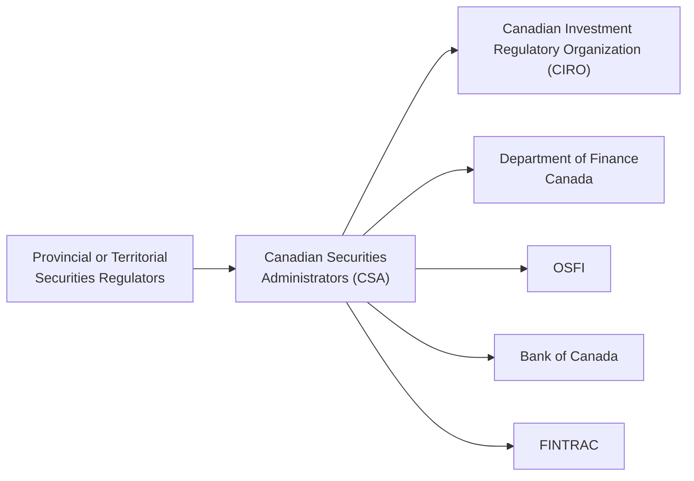

## 3.2 Key Government Players Involved in Securities Regulation

When I first dipped my toes into the world of Canadian securities regulation—this was back in my early days as a bright-eyed finance intern—I remember feeling a bit overwhelmed by the sheer number of bodies involved. I got told, “Oh, you have to check the provincial commission for the rules, and also the CSA, plus OSFI, and don’t forget CIRO!” Well, I just about threw my hands in the air in confusion. But the more I studied and asked questions, the more it started to make sense. So, I’d like to walk you through it in a friendly, conversational way. In this section, we’ll explore the different government players involved in Canadian securities regulation—who they are, what they do, and how they fit together.

You might recall from Chapter 3.1: General Principles of Securities Regulation that Canada does not have a single national securities regulator; instead, each province and territory has its own securities commissions to enforce local laws. That’s actually quite a unique system, and it’s complemented by several federal agencies and an overarching structure designed to keep things efficient and consistent across the country. Let’s check them out.

---

### Overview of Canada’s Securities Regulatory Network

I like to think of the Canadian regulatory framework as a team of specialized players. Some operate at the provincial level; others operate at the federal level, but they all share the same goal: maintaining a fair, transparent, and stable marketplace. Here’s a simple high-level diagram:

• A represents each provincial or territorial regulator.  
• B is the Canadian Securities Administrators (CSA), which ties it all together.  
• C is CIRO, the self-regulatory organization (SRO) for investment and mutual fund dealers.  
• D, E, F, and G represent the federal financial authorities.

While this diagram simplifies some complexities, it helps visualize how everyone interacts under the larger umbrella of Canadian securities regulation.

---

### Provincial and Territorial Securities Regulators

Let’s start at the ground level—provincial and territorial securities regulators. Depending on where you’re located, you’ll encounter organizations like the Ontario Securities Commission (OSC), the Autorité des marchés financiers (AMF) in Quebec, the British Columbia Securities Commission (BCSC), and so on. Each province or territory in Canada takes responsibility for creating and enforcing its own securities laws—a structure that can feel a bit fragmented at times.

#### Key Responsibilities:
• Registering individuals and firms dealing in securities within their respective jurisdictions.  
• Reviewing and approving prospectuses (which detail the securities being offered to the public).  
• Enforcing securities legislation through various means, such as fines or disciplinary hearings.  
• Implementing compliance guidelines to align with the broader national standards set out by the Canadian Securities Administrators (CSA).

One practical example: If you’re an Alberta-based investment dealer who wants to open an office in Ontario, you’ll probably need registration and approval from both the Alberta Securities Commission (ASC) and the Ontario Securities Commission (OSC). Yes, it can be time-consuming, but hey, that’s life in a multi-jurisdictional regulatory setting.

---

### Canadian Securities Administrators (CSA)

Never heard of the CSA? Think of them as a specialized team or coordinating body. The Canadian Securities Administrators is an umbrella organization of all the provincial and territorial securities regulators. They’re not actually a separate regulator per se, but rather a coalition that designs harmonized policies across Canada’s securities landscape.

#### Role of the CSA:
• Creating and administering national instruments—these are rules or regulations that each province and territory can adopt to maintain consistency in disclosure standards, registration requirements, and so on.  
• Streamlining the regulatory process. For instance, the “passport system” means that once a firm is registered in one jurisdiction, it is typically recognized (or “passported”) in other participating jurisdictions.  
• Running regulatory projects that require a national or cross-jurisdictional approach (e.g., addressing new issues in fintech or cryptoasset regulation).  

This approach ensures that an investor in, say, Saskatchewan enjoys comparable protections to an investor in Nova Scotia. The CSA’s official website is brimming with updates about current policy initiatives and upcoming rules—worth checking out at [https://www.securities-administrators.ca](https://www.securities-administrators.ca).

---

### Canadian Investment Regulatory Organization (CIRO)

You’ll see references to “New SRO” in older documents, or possibly references to IIROC (the Investment Industry Regulatory Organization of Canada) and the MFDA (Mutual Fund Dealers Association of Canada). As of January 1, 2023, these two former SROs amalgamated into one brand-new entity known as the Canadian Investment Regulatory Organization (CIRO). It’s a single, national self-regulatory organization that oversees both investment dealers and mutual fund dealers, as well as market integrity on Canadian equity and debt marketplaces.

CIRO is essentially the frontline for craft and conduct regulation in brokerage and mutual fund dealing. If you’re working in client-facing sales or advisory roles, you’ll find that CIRO sets the day-to-day conduct standards you must follow, from how you disclose fees to how you handle client complaints.

#### Why CIRO Matters:
• They enforce compliance with securities laws and professional standards on member firms.  
• They set qualification requirements for financial professionals (e.g., passing certain exams) to ensure competence.  
• They carry out audits and investigations of member firms.  
• They impose penalties or sanctions where standards are not met—maintaining public confidence in the financial markets.

For more current insight into CIRO’s regulatory rulebook, check out [https://www.ciro.ca](https://www.ciro.ca). And if you’re curious about how this newly consolidated SRO is structured or how it unifies previous IIROC and MFDA rules, you can read more in Chapter 3.3: Self-Regulatory Organization (CIRO).

---

### Office of the Superintendent of Financial Institutions (OSFI)

Switching gears to the federal side, we have the Office of the Superintendent of Financial Institutions (OSFI). If provincial securities commissions oversee the licensing and compliance of investment dealers, OSFI is in charge of regulating and supervising federally regulated financial institutions such as banks, insurance companies, and trust companies. They also look after federally regulated pension plans.

#### OSFI’s Key Functions:
• Setting capital adequacy and liquidity standards for banks (think of those big names like RBC, TD, BMO, etc.).  
• Monitoring the solvency of institutions to ensure they can meet their obligations to depositors, policyholders, and clients.  
• Conducting regular risk assessments and on-site inspections.  
• Acting preemptively whenever it identifies practices or emerging trends that might threaten a financial institution’s soundness.

OSFI’s role is vital because stable banks ultimately support stable capital markets. They coordinate with the Bank of Canada and the Department of Finance to keep an eye on any system-wide risks. So if you ever wonder why your bank consistently tries to maintain robust capital buffers and must disclose so many financial details, OSFI is a big reason behind it.

---

### Bank of Canada

The Bank of Canada is another pillar in the federal structure. Most of us know the Bank of Canada as the body that sets the country’s monetary policy (like adjusting interest rates to manage inflation). But apart from that, the Bank also oversees key elements of the financial system.

#### Bank of Canada Responsibilities:
• Monitoring and safeguarding overall financial system stability. They pay attention to market liquidity, systemic risks, and more.  
• Operating and overseeing critical payment and settlement systems. This includes systems that handle large-value payments, so that transactions in the securities markets can settle smoothly.  
• Acting as the “lender of last resort” for the banking system—meaning they provide liquidity to financial institutions in times of crisis.

All this ties back to the securities market in subtle ways. If there’s a disruption in liquidity or a major shock to the system (like what happened during the 2008 financial crisis), the Bank of Canada’s role in maintaining confidence and supporting the payment infrastructure becomes crucial. Without stable monetary policy and payment systems, trading in securities would quickly become chaotic.

---

### Department of Finance Canada

Now, let’s talk about the folks in the federal government who write a good chunk of the rules. The Department of Finance Canada helps shape federal financial sector policy, including legislation that impacts the securities industry. If new statutes or amendments to existing acts (like the Bank Act) are being proposed, you can be sure the Department of Finance played a role.

#### How the Department of Finance Impacts Securities Regulation:
• Drafting legislation relevant to capital markets or which influences the banks, insurance companies, or pension plans.  
• Setting the policy direction for collaborative efforts between the federal government and the provinces.  
• Coordinating with global financial organizations, such as the Financial Stability Board, to align Canada’s policies with international standards.

Sometimes I wonder, “Do we really need so many cooks in the kitchen?” But given the complexity of modern financial systems, it does make sense that specialized groups each handle their piece of the puzzle. The Department of Finance uses feedback from OSFI, CIRO, the Bank of Canada, and the provincial regulators to ensure national consistency where needed, while still respecting provincial autonomy.

---

### Financial Transactions and Reports Analysis Centre of Canada (FINTRAC)

We can’t forget about money laundering and terrorist financing issues. FINTRAC, short for the Financial Transactions and Reports Analysis Centre of Canada, plays the lead role in Canada’s anti-money laundering (AML) and anti-terrorist financing efforts. If you read Chapter 3.5: Money Laundering and Terrorist Financing in the Securities Industry, you’ll note that securities dealers and advisors have obligations to report suspicious transactions to FINTRAC.

#### Core Mandate of FINTRAC:
• Collect and analyze financial transaction data from banks, investment dealers, casinos, and other reporting entities.  
• Provide intelligence to law enforcement agencies about potential laundering or terrorist fundraising operations.  
• Enforce compliance with the Proceeds of Crime (Money Laundering) and Terrorist Financing Act (PCMLTFA).  

Let’s say your client attempts to deposit a very large amount of cash—well beyond anything typical for their occupation—and you suspect it might be illicit. Your firm’s compliance department may need to file a Suspicious Transaction Report (STR) with FINTRAC. And it’s FINTRAC’s job to sift through reams of such data, connect the dots, and refer any significant leads to law enforcement or national security agencies.

Given the seriousness of these issues, FINTRAC imposes stiff penalties for non-compliance. So you want to be sure your Know-Your-Client (KYC) processes, recordkeeping, and reporting mechanisms are up to par—a theme we cover throughout Chapters 4 and 5 on working with clients and opening accounts.

---

### Practical Example: How These Agencies Interact

Let’s go through a quick hypothetical scenario: Suppose a major bank (regulated by OSFI) chooses to underwrite a new public share offering. The bank’s brokerage arm (a CIRO member) files a prospectus with the provincial securities regulator in the principal jurisdiction (e.g., Ontario Securities Commission). The CSA’s national instrument on prospectus regulations streamlines the process so that once approved in Ontario—assuming it’s a passport model—the offering may be cleared in other provinces. Meanwhile, the Bank of Canada might be monitoring the market environment to gauge the probable economic impacts of this capital raise, and FINTRAC is collecting information on the funds flowing in from investors to ensure there’s no suspicious activity involved.

These roles are distinct, yet interconnected. Everyone is working in sync, even if it sometimes feels like there are a lot of moving parts.

---

### Common Challenges and Best Practices

• **Challenge:** Multiple jurisdictions.  
  • **Best Practice:** Rely on the CSA’s coordinated efforts (e.g., passport systems) to streamline registration and compliance. Maintain strong internal processes so that your firm meets multi-provincial requirements.  

• **Challenge:** Complex SRO Rules.  
  • **Best Practice:** Integrate the CIRO rulebook with your internal compliance manuals and keep an eye on updates. Remember, consistent staff training is key—especially for front-line staff who handle client accounts.  

• **Challenge:** AML and Anti-Terrorist Financing Requirements.  
  • **Best Practice:** Actively review and update your AML compliance procedures, train staff rigorously on red flags, and ensure prompt reporting to FINTRAC if suspicious activity arises.  

• **Challenge:** Overlapping Federal Oversight.  
  • **Best Practice:** Keep on top of communications from OSFI, the Bank of Canada, and the Department of Finance. For example, if OSFI updates guidelines on capital requirements, that might affect how much capital your firm (or your dealer’s parent bank) must hold.  

By staying proactive, you can catch regulatory changes early and avoid compliance pitfalls.

---

### Real-World Case Study: The Co-Regulatory Setup in Action

Let’s imagine a small boutique investment firm based in British Columbia that’s looking to break into the Ontario market. Here’s how they navigate the system:

1. Provincial Registration:  
   • They confirm with the BC Securities Commission (BCSC) that they’re in good standing.  
   • Through the CSA’s “passport system,” they submit an application recognizing their BC registration in Ontario.  

2. SRO Membership (CIRO):  
   • If they trade in equity and fixed-income securities or offer mutual funds, they must be CIRO members. They confirm membership compliance requirements, such as proficiency standards for representatives and guidelines on how to handle complaints.

3. OSFI’s Indirect Oversight:  
   • The firm, if it’s not a bank or an insurance company, might not deal directly with OSFI. But if it’s owned by a larger federally regulated parent institution, OSFI’s capital and risk management guidelines could shape the parent’s policies that cascade down to the boutique.

4. Bank of Canada:  
   • On a day-to-day basis, the boutique may not directly interact with the Bank of Canada. However, they rely on stable interest rate policies and settlement systems for executing and clearing trades.

5. FINTRAC Compliance:  
   • The firm designs robust client screening processes. They train staff to identify high-risk accounts and watch for unusual transaction patterns. They file Large Cash Transaction Reports (LCTRs) and Suspicious Transaction Reports (STRs) whenever necessary.

6. Ongoing Monitoring and Updates:  
   • The firm actively follows bulletins from both BCSC and the OSC. They keep up with CSA notices to remain aligned with any new national instruments or rule amendments. They attend CIRO compliance conferences to ensure they’re in line with best practices.

Even though it might seem complicated, the advantage is that each regulator can specialize in its own domain. Ultimately, this multi-layered approach aims to protect investors, maintain market integrity, and uphold public confidence in the Canadian financial system.

---

### Glossary

• **CSA (Canadian Securities Administrators)**: A cooperative group of provincial and territorial regulators that work to harmonize securities regulation in Canada.  
• **CIRO (Canadian Investment Regulatory Organization)**: The single self-regulatory organization overseeing investment dealers, mutual fund dealers, and market integrity under one roof.  
• **OSFI (Office of the Superintendent of Financial Institutions)**: The federal body that supervises banks, insurance companies, and pension plans to ensure their safety and soundness.  
• **FINTRAC (Financial Transactions and Reports Analysis Centre of Canada)**: The agency responsible for collecting and analyzing financial transaction data to prevent money laundering and terrorist financing.

---

### Additional Resources

• **Canadian Securities Administrators (CSA)**:  
  [https://www.securities-administrators.ca](https://www.securities-administrators.ca)

• **Canadian Investment Regulatory Organization (CIRO)**:  
  [https://www.ciro.ca](https://www.ciro.ca)

• **Office of the Superintendent of Financial Institutions (OSFI)**:  
  [https://www.osfi-bsif.gc.ca](https://www.osfi-bsif.gc.ca)

• **FINTRAC**:  
  [https://www.fintrac-canafe.gc.ca](https://www.fintrac-canafe.gc.ca)

If you’re looking for next steps, you might also explore publications from the Bank of Canada or policy announcements from the Department of Finance Canada to deepen your understanding. Stuff like economic commentaries by the Bank of Canada can offer insight into how broader economic policy influences securities markets.

---

## Quiz: Canadian Securities Regulators and Their Roles



### Which organization is responsible for harmonizing provincial and territorial securities regulations across Canada?

- [ ] CIRO
- [x] CSA
- [ ] OSFI
- [ ] FINTRAC

> **Explanation:** The Canadian Securities Administrators (CSA) is an umbrella organization of Canada’s provincial and territorial securities regulators, working to coordinate and harmonize regulation across the country.

### Which of the following substantially replaced IIROC and MFDA to oversee investment dealers and mutual fund dealers in Canada?

- [ ] OSC
- [x] CIRO
- [ ] BCSC
- [ ] CSA

> **Explanation:** As of January 1, 2023, the Canadian Investment Regulatory Organization (CIRO) was formed by consolidating the former IIROC and MFDA. CIRO is now the single national self-regulatory body for investment dealers and mutual fund dealers.

### Which federal agency supervises banks, insurance companies, and pension plans to ensure their safety and soundness?

- [x] OSFI
- [ ] The Bank of Canada
- [ ] FINTRAC
- [ ] CSA

> **Explanation:** The Office of the Superintendent of Financial Institutions (OSFI) does exactly that—oversees federally regulated financial institutions to maintain public confidence in the system.

### Which federal institution sets Canada’s monetary policy and acts as a lender of last resort to maintain stability?

- [ ] OSC
- [ ] OSFI
- [ ] FINTRAC
- [x] Bank of Canada

> **Explanation:** The Bank of Canada is responsible for monetary policy, managing interest rates, and serving as a lender of last resort.

### Which federal organization develops financial sector policy and legislation that can impact securities activities at a national level?

- [x] Department of Finance Canada
- [ ] Bank of Canada
- [ ] FINTRAC
- [ ] CSA

> **Explanation:** The Department of Finance Canada initiates and refines policies and legislation affecting the entire financial system, including securities markets.

### FINTRAC primarily deals with:

- [x] Anti-money laundering and terrorist financing
- [ ] Financial stability and monetary policy
- [ ] Securities registration and disclosure
- [ ] Capital adequacy of banks

> **Explanation:** FINTRAC collects, analyzes, and discloses information about financial transactions to detect and deter money laundering and terrorist financing.

### Under the co-regulatory system, which entity primarily administers prospectus requirements for investments being offered in a specific province?

- [x] The respective provincial or territorial securities regulator
- [ ] The Bank of Canada
- [ ] FINTRAC
- [ ] The Department of Finance Canada

> **Explanation:** Each province or territory has its own securities regulator that reviews and approves the offering documents in that jurisdiction.

### Which body often sets the day-to-day compliance and conduct standards for investment dealer firms?

- [ ] CSA
- [x] CIRO
- [ ] OSFI
- [ ] FINTRAC

> **Explanation:** CIRO is the self-regulatory organization that enforces professional conduct and day-to-day compliance requirements for investment firms and mutual fund dealers.

### The Office of the Superintendent of Financial Institutions (OSFI) coordinates closely with which entities to detect potential system-wide financial risks?

- [ ] Only CIRO
- [x] The Bank of Canada and the Department of Finance
- [ ] FINTRAC exclusively
- [ ] International Monetary Fund only

> **Explanation:** OSFI works alongside the Bank of Canada, the Department of Finance, and other regulatory bodies to identify and respond to potential systemic risks.

### True or False: The newly formed CIRO oversees both investment dealers and mutual fund dealers.

- [x] True
- [ ] False

> **Explanation:** CIRO became the single self-regulatory organization for both investment dealers and mutual fund dealers, replacing the separate roles of IIROC and MFDA.


