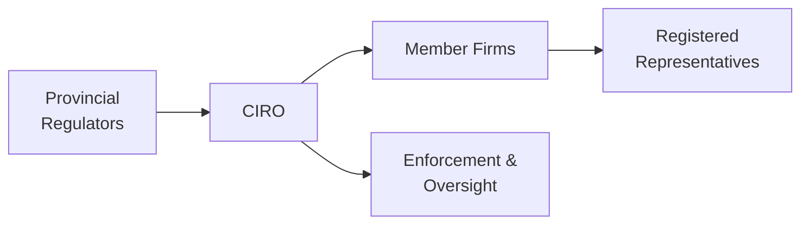

## 3.3 Self-Regulatory Organization (CIRO)

If you’ve ever wondered how Canada’s investment system stays on track—protecting investors, encouraging market integrity, and keeping everyone honest—then you’ll definitely want to know about the Canadian Investment Regulatory Organization (CIRO). I remember my first day at a brokerage when a coworker casually asked, “Do you know what an SRO does?” I just stared blankly, unsure how to respond. It took me a while to realize that SROs are basically the gatekeepers (and the champions) of good conduct in our industry. Now, let’s explore what CIRO is all about, why it matters, and how it fits into the broader regulatory framework in Canada.

### Introduction to CIRO

CIRO, or the Canadian Investment Regulatory Organization, is the national self-regulatory organization (SRO) overseeing investment dealers, mutual fund dealers, and aspects of marketplace oversight in Canada. It might sound like a mouthful, but “self-regulatory” essentially means that CIRO is empowered to create and enforce rules for its members, subject to oversight by provincial and territorial regulators. It’s a bit like the coaching staff of a sports team: they set the plays (rules) and oversee performance (compliance), but they still have to abide by the broader league regulations (the securities commissions).

#### A Brief Historical Note
• Prior to 2023, the Mutual Fund Dealers Association of Canada (MFDA) and the Investment Industry Regulatory Organization of Canada (IIROC) existed as separate SROs.  
• On January 1, 2023, these two organizations combined their forces to form what was initially known as the “New SRO.”  
• Effective June 1, 2023, that entity was renamed “CIRO,” marking a new era in self-regulation.  
So, MFDA and IIROC are now historical references. These days, CIRO stands alone as the main SRO, ensuring that all oversight functions for both mutual fund dealers and investment dealers operate under one roof.

### Why Do We Have an SRO?

You might think, “Isn’t there already enough oversight from the government and provincial regulators?” Possibly, but having a dedicated self-regulatory body allows for real-time, specialized supervision of industry practices. CIRO staff are experienced in the nitty-gritty of the securities world—it’s their domain. An SRO can react quickly to industry changes and tailor rules to address specific risks and trends, all while complementing the overarching guidance from provincial securities commissions.

Essentially, CIRO strives to ensure:  
• Fair and efficient capital markets.  
• High standards of conduct for investment professionals.  
• Investor confidence in those providing advice and managing assets.  

### CIRO’s Roles and Responsibilities

There’s a lot on CIRO’s plate. Don’t worry if it feels overwhelming; let’s break it down piece by piece, focusing on the key responsibilities that keep our markets fair, honest, and investor-friendly.

#### Registration and Oversight

CIRO serves as the “gatekeeper” for registration. In other words, if an individual wants to become a Registered Representative (RR) dealing with securities—be that mutual funds, equities, bonds, or derivatives—CIRO is the pivotal link (in conjunction with the provincial regulators) that ensures each applicant meets strict requirements. This oversight covers:

• Background checks and ongoing screening of RRs and other approved individuals.  
• Monitoring business activities to ensure compliance with relevant regulations.  
• Regular reviews and audits of member firms for reliability and integrity.  

You might think, “Well, that sounds like a lot of policing.” Truth be told, it is. Think of a local health department that checks restaurants for cleanliness; customers feel safer eating out, knowing someone’s looking out for them. In finance, it’s kinda the same thing—CIRO ensures your “financial meal” is safe to consume.

#### Rule Enforcement

Once someone is registered, CIRO doesn’t just disappear. It maintains a continuous enforcement presence:

• Conducting periodic on-site compliance reviews.  
• Initiating investigations when signs of malpractice appear.  
• Using disciplinary proceedings to tackle breaches of regulations.  

If you want to see how this plays out, consider a scenario where an investment dealer is suspected of using confidential client information improperly. CIRO might launch an investigation, gather evidence, and—if wrongdoing is confirmed—impose penalties such as fines, suspensions, or even permanent bans on the individuals involved. This robust disciplinary system aims to foster trust in the markets.

#### Setting Proficiency Standards and Continuing Education

Have you ever worried about whether your investment advisor actually knows what they’re talking about? CIRO addresses that by setting mandatory proficiency and continuing education requirements for all Registered Representatives. Here’s what that looks like:

• Initial proficiency standards, including completion of industry-recognized courses like the Canadian Securities Course (CSC®) and the Conduct and Practices Handbook (CPH®).  
• Ongoing continuing education (CE) requirements so that RRs stay up to date with regulatory changes, new product developments, and evolving best practices.  

This approach is really just like doctors or nurses having to renew their professional licenses—CIRO ensures industry professionals keep their knowledge fresh and relevant, ultimately benefiting investors.

#### Investor Protection and Ethics

CIRO doesn’t just set rules for the fun of it; it’s all about promoting investor protection. Whether it’s preventing misleading promotions, ensuring that advisors “Know Your Client” (KYC), or requiring transparent fee disclosures, the organization emphasizes client interests. It also coordinates efforts with the Canadian Investor Protection Fund (CIPF), which acts as a safety net for client assets if a member firm goes insolvent. Now, if you recall pre-2023, there used to be separate protection funds—CIPF for IIROC members and the MFDA IPC for MFDA members—but as of January 1, 2023, they merged into a single CIPF that is wholly independent of CIRO.

### Collaboration with Provincial/Territorial Regulators

CIRO doesn’t exist in a vacuum. Provincial and territorial regulators (like the Ontario Securities Commission or the British Columbia Securities Commission) watch over CIRO, providing the statutory authority that allows the SRO to function. In return, CIRO helps:

• Implement and enforce provincial securities laws.  
• Write new rule proposals and share them with regulators for final approval.  
• Share enforcement data, complaint information, and best practices to maintain consistent standards across Canada.  

### Putting It All Together: The Market Integrity Puzzle

It’s helpful to see how CIRO fits in the larger puzzle of the Canadian securities framework. Let’s visualize it:

• A["Provincial  Regulators"] stands for the architecture set by each province’s securities commission.  
• B["CIRO"] is our modern SRO, bridging the gap with direct authority over its members.  
• C["Member Firms"] includes investment and mutual fund dealers registered with CIRO.  
• D["Registered  Representatives"] are frontline professionals who interact with clients daily.  
• E["Enforcement &  Oversight"] underscores CIRO’s power to investigate, discipline, and impose regulations.

### Practical Examples and Case Studies

It might help to see some real-world illustrations of how CIRO’s authority works. Let’s walk through a couple of scenarios.

#### Case Study: Unauthorized Trading

Imagine a Registered Representative, Gail, who places trades in a client’s account without obtaining prior consent. The client notices unusual activity and files a complaint with CIRO. CIRO’s enforcement staff initiates an investigation:

1. They contact the member firm for trade documentation and recordings of phone conversations.  
2. They interview Gail, the branch manager, and a compliance officer.  
3. If CIRO finds enough evidence that Gail acted inappropriately, it proceeds with a disciplinary hearing.  
4. Depending on the severity, Gail might receive a suspension, fine, or endure conditions on her registration (like supervision or specialized training).

Throughout the process, the client receives ongoing updates, and once a decision is made, it’s typically published to maintain transparency and deter others from similar misconduct.

#### Example: New Product Approval

Let’s say a member firm wants to introduce a new structured product with exotic features—maybe it’s tied to a basket of global commodities with varying maturities. Before selling this new product to clients, the firm must ensure it meets CIRO’s rules:

• Clear product documentation, risk disclosures, and marketing materials.  
• Adequate training for staff so they understand the product’s risks and reward structures.  
• A compliance plan to ensure the product is only sold to suitable investors.  

By requiring robust due diligence up front, CIRO aims to prevent mis-selling or distribution of overly complicated instruments to unqualified investors.

### Best Practices for CIRO-Registered Professionals

If you are, or aspire to become, a Registered Representative under CIRO, here are some best practices to keep in mind:

• Always put the client first. The “Know Your Client” and “Suitability” obligations aren’t just boxes to check; they’re cornerstones of trust.  
• Disclose conflicts of interest promptly and transparently.  
• Keep up with continuing education—rules and standards evolve constantly.  
• Proactively communicate with your firm’s compliance department if you’re unsure about any regulatory requirement.  

### Common Pitfalls and How to Avoid Them

Mistakes can happen, but the repercussions in the securities world can be serious. Some common pitfalls:

• Failing to document verbal instructions from clients, which can lead to “he said, she said” disputes.  
• Overlooking unusual transactions or “red flags” that might indicate money laundering—a big no-no under anti–money laundering (AML) regulations.  
• Mixing client assets or using funds for unauthorized purposes.  

Staying on top of the rules, documenting everything thoroughly, and seeking guidance from your compliance team are solid ways to steer clear of trouble.

### Keeping the Momentum: Ongoing CIRO Initiatives

CIRO is not just about enforcement and compliance. It also invests in investor education and outreach. You might find webinars, publications, or social media posts that help the public become more informed investors. Some ongoing priorities include:

• Improving transparency around fees and investment performance.  
• Promoting inclusive investing, ensuring new investors from diverse backgrounds feel knowledgeable and confident.  
• Monitoring emerging technologies like cryptocurrency trading platforms to develop relevant SRO policy frameworks.  

### Conclusion

The creation of a single SRO through the merger of MFDA and IIROC was a significant step in ensuring that Canada’s capital markets remain well-supervised, efficient, and secure. CIRO is entrusted with making sure investment dealers, mutual fund dealers, and their representatives behave ethically, remain properly educated, and prioritize client well-being. Essentially, CIRO fosters a culture of compliance that supports both investor interests and market integrity.

If you ever find yourself managing investments or receiving advice, knowing how CIRO functions can help you navigate the financial system with confidence. The more you understand about your rights and the protections in place, the better equipped you’ll be to ask the right questions and handle your financial future. And that, in my opinion, is one of the best ways to stay in control of your money.

---

### Glossary

• **Self-Regulatory Organization (SRO):** An organization authorized by regulators to set and enforce rules that guide the conduct of industry members.  
• **Registered Representative (RR):** An individual licensed to offer investment advice and conduct securities transactions.  
• **Proficiency Standards:** The educational and professional requirements mandated by CIRO for individuals working in the Canadian securities industry.  

For further reading, check out:  
• CIRO official website: [https://www.ciro.ca](https://www.ciro.ca)  
• CSI’s Conduct and Practices Handbook Course (CPH®): [https://www.csi.ca/student/en_ca/courses/csi/cph.xhtml](https://www.csi.ca/student/en_ca/courses/csi/cph.xhtml)  

---

## Test Your Knowledge: Self-Regulatory Organization (CIRO) Quiz



### CIRO primarily operates under the oversight of which entities?

- [ ] Federal government agencies
- [x] Provincial and territorial securities regulators
- [ ] International regulatory bodies
- [ ] Educational institutions

> **Explanation:** CIRO works under the guidance of Canada’s provincial and territorial securities regulators. Those regulators grant CIRO its authority to enforce rules and oversee the conduct of its member firms.

### Which of the following best describes CIRO’s role?

- [x] It regulates the conduct of investment and mutual fund dealers, ensuring compliance with securities laws.
- [ ] It manages the Canada Pension Plan and sets interest rates on government bonds.
- [ ] It provides grants and funding to new businesses in the capital markets space.
- [ ] It operates Canada’s stock exchanges.

> **Explanation:** CIRO is the national self-regulatory organization overseeing investment dealers, mutual fund dealers, and marketplace conduct. It does not manage government funds or stock exchanges.

### Why was CIRO formed in 2023?

- [ ] To launch a new government bond program
- [ ] Due to the collapse of all Canadian banking regulations
- [x] Through the merger of the Mutual Fund Dealers Association (MFDA) and the Investment Industry Regulatory Organization of Canada (IIROC)
- [ ] To replace the Office of the Superintendent of Financial Institutions (OSFI)

> **Explanation:** CIRO was formed when MFDA and IIROC amalgamated on January 1, 2023, creating a single self-regulatory organization for both mutual fund and investment dealers.

### What is one core function of CIRO’s enforcement process?

- [ ] Filing corporate income tax returns
- [ ] Selling structured financial products to the public
- [x] Investigating breaches of securities rules and imposing disciplinary actions
- [ ] Creating new mutual funds for investors

> **Explanation:** CIRO uses its enforcement processes to investigate suspected rule breaches, conduct disciplinary hearings, and penalize misconduct.

### Suppose an RR executed unauthorized trades in a client’s account. What might be CIRO’s response?

- [x] Initiate an investigation and possibly impose fines or suspensions
- [ ] Offer free margin loans to the client
- [x] Conduct a disciplinary hearing if serious misconduct is found
- [ ] Create new policies to allow unauthorized trades

> **Explanation:** If evidence reveals misconduct, CIRO can impose disciplinary measures against the RR and issue penalties (fines, suspensions, or conditions on registration).

### Who benefits directly from CIRO’s proficiency standards and continuing education requirements?

- [x] Investors seeking advice
- [ ] Only large corporations
- [ ] Provincial governments
- [ ] Foreign currency speculators

> **Explanation:** By ensuring that advisors maintain up-to-date skills, investors benefit from more expert, ethical, and well-informed advice.

### How does CIRO coordinate with the Canadian Investor Protection Fund (CIPF)?

- [ ] CIRO and CIPF are the same entity
- [x] CIRO oversees member conduct while CIPF protects investors’ assets if a firm becomes insolvent  
- [x] They used to be separate; both MFDA IPC and CIPF merged, leaving CIPF as the sole protection fund
- [ ] CIPF handles all regulatory scrutiny, and CIRO only prosecutes criminal activities

> **Explanation:** CIRO manages the regulatory and enforcement aspect, while CIPF offers insurance-like protection for client assets in the event of a member firm’s insolvency. In 2023, CIPF combined with the MFDA IPC into a single fund.

### Which of the following is a common pitfall that can lead to CIRO disciplinary action?

- [x] Mixing client assets with the representative’s own money
- [ ] Maintaining detailed client notes
- [ ] Filing suspicious transaction reports when appropriate
- [ ] Completing required continuing education courses

> **Explanation:** Mixing a client’s assets with a representative’s personal assets is a severe violation and will likely trigger disciplinary actions. Proper documentation and ongoing education, on the other hand, are part of compliant practices.

### In CIRO’s structure, which parties are most directly responsible for client-facing investment advice?

- [ ] Provincial regulators
- [ ] CIPF
- [x] Registered Representatives
- [ ] Federal trade commissions

> **Explanation:** Registered Representatives are on the front lines, working day-to-day with clients and offering investment advice under CIRO’s oversight.

### True or False: CIRO has eliminated the need for provincial securities regulators.

- [x] True
- [ ] False

> **Explanation:** This is actually FALSE, but used here as an example of how crucial reading carefully is! CIRO has not eliminated provincial regulators—CIRO is overseen by provincial regulators. The correct answer is “False,” but the example demonstrates how easy it is to select the wrong answer when scanning too quickly.


