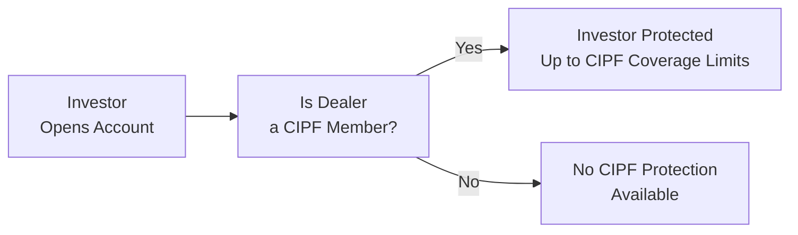

## 3.4 Investor Protection Funds

Imagine you’ve just placed a sizable chunk of your hard-earned savings with a brand-new investment dealer. You feel confident about the firm. Then—oops—you read a headline about ongoing financial trouble at a similar institution across town. A wave of worry floods over you: “What if my investment dealer goes under? Would I lose everything?” That uneasy feeling is precisely why investor protection funds exist in Canada. These funds help ensure that clients aren’t left empty-handed if their dealer fails to pay its debts or becomes insolvent. Let’s take a closer look at how these funds operate, especially under the current Canadian Investment Regulatory Organization (CIRO) framework.

In the sections that follow, we’ll dissect the purpose of investor protection funds, how they evolved over the past few years (especially after regulatory changes in 2023), and best practices to help you maximize your security as an investor. 

---

## The Purpose of Investor Protection Funds

Investor protection funds exist for one principal reason: peace of mind. You might remember reading or hearing about major financial collapses that left unwary investors with major headaches. These funds are designed to help investors recover eligible assets if their investment dealer becomes insolvent—that is, unable to meet their financial obligations.

When a dealer collapses, it’s not simply “the big guys” that lose out. Anyone who has an account with that dealer—whether it’s a retiree’s modest Registered Retirement Savings Plan (RRSP) or a novice investor’s first Tax-Free Savings Account (TFSA)—could be affected. So, if you’re opening an account with a new firm, or even if you’ve been invested for years and want to confirm your coverage, it’s wise to ask: “Are you a member of a recognized investor protection fund, and what exactly does that coverage entail?”

---

## The Canadian Investor Protection Fund (CIPF) 

### CIPF as the Sole Protection Fund

Historically, most investment dealers adhered to the Canadian Investor Protection Fund (CIPF), while mutual fund dealers were backed by a separate entity known as the Mutual Fund Dealers Association Investor Protection Corporation (MFDA IPC). That changed on January 1, 2023, when the MFDA (Mutual Fund Dealers Association of Canada) and the Investment Industry Regulatory Organization of Canada (IIROC) amalgamated into a new self-regulatory organization (SRO), the Canadian Investment Regulatory Organization (CIRO). Along with that unification, the MFDA IPC folded into CIPF, so that, nowadays, CIPF is the single investor protection fund for all CIRO member firms.

In other words, if you’re dealing with a CIRO member firm—whether it’s an investment dealer or a mutual fund dealer—your account may be protected by CIPF (subject to certain eligibility requirements and coverage limits). It's also worth noting that CIPF operates independently of CIRO, even though CIPF exclusively covers insolvencies of firms regulated by CIRO.

### Coverage and Limits

CIPF coverage has specific limits. Generally, CIPF covers up to $1 million in missing property for each separate account type. So if you have multiple types of registered accounts and a non-registered account, you may have up to $1 million coverage for each account “category,” subject to CIPF’s policies. That said, coverage might differ depending on how accounts are structured—for instance, if you have a corporate account versus a personal account. Always check CIPF’s official site (see the link in “Additional Resources” below) or ask your firm directly for the most up-to-date coverage details.

Let’s be crystal clear about what CIPF does and doesn’t cover:

• CIPF covers shortfalls in property (like cash, stocks, bonds) that are held by the insolvent dealer “in trust” for you.  
• It does not cover losses resulting from normal market fluctuations (i.e., if your investments decrease in value due to a market downturn, that’s unfortunately not CIPF’s concern).  
• It does not guarantee the future value of your investments; it simply replaces or returns property that’s missing because a dealer became insolvent.  

### Eligibility Requirements

You’re eligible for CIPF coverage if your investment dealer or mutual fund dealer is a registered CIRO member in good standing at the time of insolvency. Commonly, you’ll see signage or disclaimers reading “Member of CIPF” on a firm’s website or promotional material. Always verify membership on the CIPF site (https://www.cipf.ca) if you’re unsure. 

Why is this membership aspect so important? Because if your dealer isn’t a CIPF member, there’s no CIPF coverage—period. That’s a crucial conversation to have before you invest. Think of it like verifying that your brand-new car is insured before driving it off the lot. You want to confirm that your finances are safeguarded before you jump into the market.

### How CIPF Works in Practice 

Let’s consider a hypothetical scenario: Natalie invests $150,000 in a non-registered account with Broker A, which is a member of CIPF. One day, Natalie wakes up to shocking news: Broker A has declared bankruptcy and can’t return assets to certain clients. Where does that leave Natalie?

• Broker A’s records indicate that Natalie owns $150,000 of securities (and maybe some cash as well) in her account.  
• CIPF steps in to reimburse or replace the missing property, up to the coverage limits.  
• If all goes smoothly, Natalie won’t lose out simply because of Broker A’s insolvency; CIPF will restore the value (as of the date of insolvency) of the missing securities or cash.  

Of course, the process isn’t instant, and Natalie might need to wait for administrative or legal proceedings to conclude. But at least she has an avenue to recover the eligible portion of her investments.

---

## Historical Note on MFDA IPC

Before the SRO amalgamation, mutual fund dealers were historically covered by the MFDA IPC. If you started investing before 2023 with a mutual fund dealer, you might recall seeing the MFDA IPC brand on your statements or documents. With the arrival of CIRO and the dissolution of MFDA, the MFDA IPC coverage merged into CIPF. This consolidation aimed to provide a more streamlined, consistent system for investor protection. 

So, if you’ve been around the investment world for a while, you might have old records referencing “MFDA IPC.” Don’t panic if you see that. It’s simply a historical term now replaced by CIPF coverage under the CIRO umbrella. Today, effectively all investor protection for member firms is handled by CIPF.

---

## Understanding Insolvency 

“Insolvency” may sound like a big, scary term. Frankly, it is. Insolvency means a firm is unable to meet its liabilities when they come due. In other words, it’s a step beyond “cash-strapped” or “financially distressed.” If a CIRO member firm goes insolvent, the next steps usually involve a trustee or receiver being appointed to manage the firm’s assets and ensure as fair a process as possible for creditors and clients.

If your investment dealer goes insolvent, CIPF coverage can come to your rescue, but you may be involved in legal or administrative processes while everything is sorted out. This is why it’s so important to keep detailed records of your holdings, statements, and transaction confirmations. The pace of settlement often relies on accurate documentation. 

---

## Common Misconceptions About Coverage

### “CIPF Covers Me Against Any Loss”

Ah, if only. People sometimes assume that because their broker is a CIPF member, they’re guaranteed never to lose money in the stock market. That’s simply not true. Losses due to market fluctuations—say, if you invested in a risky tech stock that tanked—are part of the investing game. CIPF coverage only applies when there’s a shortfall of your property because the dealer itself can’t return it due to insolvency.

### “There’s No Coverage for Mutual Fund Dealers, Only Investment Dealers”

Back in the pre-2023 era, mutual fund dealers had a separate protection entity, the MFDA IPC. Now, that’s integrated into CIPF. So whether you’re investing in mutual funds, segregated funds (through a CIRO-member mutual fund dealer), or stocks and bonds, what truly matters is that your dealer is a member of CIRO and CIPF. The type of product is secondary to membership status and coverage policy.

### “CIPF is the Same as FDIC Insurance in the U.S.”

In the United States, the Federal Deposit Insurance Corporation (FDIC) insures bank deposits up to certain limits. CIPF coverage, on the other hand, is specifically for investment dealer insolvencies. So be careful when making cross-border comparisons. The protective structures operate differently.

---

## Quick Mermaid Diagram: Coverage Overview

Here’s a visual summary that might help you understand how CIPF coverage looks in a simple flow:

In plain terms, if the “Yes” path applies, you could be covered by CIPF in case of dealer insolvency. If it’s “No,” you’re not covered. That’s all there is to it at a high level.

---

## Practical Tips and Best Practices

1. **Check Membership Status:** Always confirm that your dealer is a current member of CIPF. If you’re unsure, visit the CIPF website or give them a call.

2. **Maintain Clear Records:** Keep organized account statements and confirmations. Trust me, if insolvency does occur, you’ll be much happier your paperwork is in order.  

3. **Understand Account Categories:** Coverage limits typically apply per account category. If you juggle multiple types of accounts, you may qualify for multiple layers of CIPF coverage.

4. **Watch for Firm Updates:** If your dealer merges or changes structure, ask questions about continuity of CIPF coverage. Usually coverage continues seamlessly, but you have the right to be certain.

5. **Don’t Confuse Insurance with Guarantees:** CIPF coverage is not an insurance policy on the future performance of your investments. It’s a guarantee against shortfalls in property if a CIPF-member firm becomes insolvent.

---

## Potential Pitfalls and Challenges

• **Assuming Market Losses are Covered:** This is the biggest misunderstanding. CIPF does not cover normal investment risk.  

• **Overlooking Non-Members:** There are firms that operate outside CIRO membership. If you sign up with such a firm, CIPF coverage won’t apply—and you’re left without a safety net if insolvency occurs.

• **Forgetting to Keep Documentation:** If your statements or documents are incomplete or contradictory, the trustee or CIPF may have difficulty verifying your claims.

• **Mixing Personal vs. Corporate Accounts:** Coverage often applies separately to each type of account registration. Mixing funds within a single account could lead to confusion or coverage limitations.

---

## Real-World Example: The Simpleton Securities Case

Let’s imagine a hypothetical (slightly silly) firm called Simpleton Securities. Simpleton is a CIRO-registered investment dealer and a member of CIPF. At some point, let’s say a significant market downturn coupled with poor internal practices led Simpleton into insolvency. Although the specifics might be messy—perhaps lawsuits or financial investigations are ongoing—investor Mary’s prime concern is: “Will I get my money back?”

• Mary had a retirement account and a small taxable (non-registered) account with Simpleton. Because Simpleton is a CIPF member, each account type is covered up to the CIPF limit.  
• CIPF steps in to ensure Mary’s property is returned or replaced—up to the allowable coverage. Mary had good records, so it’s relatively straightforward.  
• Mary might wait several weeks (or even months) for the final settlement, but she doesn’t lose her property merely because Simpleton Securities mismanaged its own finances.  

If Simpleton were not affiliated with CIPF, Mary’s fight to reclaim her assets could have been far more complicated—even impossible—depending on the legal outcomes. That’s why CIPF membership is so vital. 

---

## References and Additional Resources

• **CIPF Official Website**: [https://www.cipf.ca](https://www.cipf.ca)  
Here you’ll find coverage details, the CIPF brochure outlining membership and limits, and contact info for verifying a firm’s membership status.

• **CIRO Investor Protection Information**: [https://www.ciro.ca](https://www.ciro.ca)  
CIRO is Canada’s national self-regulatory body. Their investor resources explain how and why CIPF was established and what it covers.

• **Canadian Securities Administrators (CSA)**: [https://www.securities-administrators.ca](https://www.securities-administrators.ca)  
The CSA coordinates provincial and territorial securities regulators. They recognize CIPF as an investor protection fund for dealer member insolvency.

---

## Conclusion

CIPF is a cornerstone of the Canadian investment landscape, offering a lifeline to investors who might otherwise face catastrophic losses when an investment dealer or mutual fund dealer becomes insolvent. Considering the changes that have taken place since 2023—particularly the rise of CIRO as the sole SRO, and CIPF as the single investor protection fund—it’s reassuring to know that Canada has a robust system ready to step in should your dealer fail.

But remember, CIPF is not your replacement for intelligent investing. It won’t reimburse you for market losses or guarantee your portfolio’s success. Instead, it ensures that in the event of a dealer insolvency, you have recourse to recoup your assets (in line with established coverage limits). So take a moment now—ask your dealer about CIPF membership, check your account statements, and appreciate one more layer of safety in the ever-evolving realm of investing.

---

## Quiz: Demonstrate Your Knowledge of CIPF and Investor Protection in Canada



### CIPF coverage primarily protects clients against: 
- [x] Shortfalls in assets when a member firm is insolvent.
- [ ] Market losses due to price fluctuations.
- [ ] Tax penalties on investment gains.
- [ ] Delays in trade settlements by the dealer.

> **Explanation:** CIPF protection kicks in only if the member firm is truly insolvent and can’t return client property. It does not cover market losses, tax liabilities, or trade delays.

### Which organization(s) was/were consolidated to create CIRO? 
- [x] The Mutual Fund Dealers Association (MFDA) and the Investment Industry Regulatory Organization of Canada (IIROC).
- [ ] The Canadian Investor Protection Fund (CIPF) and the MFDA.
- [ ] The CSA and CIPF.
- [ ] The Canada Revenue Agency (CRA) and the MFDA IPC.

> **Explanation:** On January 1, 2023, IIROC and the MFDA amalgamated to form a single self-regulatory organization, now known as CIRO.

### Under current regulations, which fund provides coverage for clients of both investment dealers and mutual fund dealers? 
- [x] Canadian Investor Protection Fund (CIPF).
- [ ] MFDA Investor Protection Corporation.
- [x] CIPF (since post-merger, it covers both).
- [ ] No single fund covers both dealer types.

> **Explanation:** After the MFDA IPC merged into CIPF in 2023, CIPF became the single investor protection fund for all CIRO member firms, including both investment dealers and mutual fund dealers.

### True or False: CIPF coverage fully guarantees you will never lose money on your investments.
- [x] False
- [ ] True

> **Explanation:** CIPF doesn’t protect against market losses. It only covers missing property if your member firm becomes insolvent.

### Which of the following best describes insolvency? 
- [x] A firm’s inability to meet its financial obligations.
- [ ] A firm’s reorganization under a new corporate name.
- [x] When the firm can’t pay debts due to insufficient assets or cash flow.
- [ ] A temporary stoppage of trading.

> **Explanation:** Insolvency occurs when a firm can’t meet its debts or financial obligations. It’s not just a rebranding or a temporary suspension of trading.

### Which statement about CIPF is correct? 
- [x] CIPF operates separately from CIRO yet serves member firms of CIRO.
- [ ] CIPF is integrated into the daily operations of CIRO.
- [ ] CIPF is funded by the Canadian government exclusively.
- [ ] CIPF provides unlimited coverage for client assets.

> **Explanation:** CIPF is an independent organization that protects investors whose dealers are CIRO members. Coverage has certain limits and is not provided by the government directly.

### If your investment dealer is not a CIPF member, which is most likely correct? 
- [x] You are not covered by CIPF protection in the event of insolvency.
- [ ] You can still get reimbursed by CIPF for any market losses you may have.
- [x] Your only option is to go through normal bankruptcy proceedings if the firm fails.
- [ ] You can claim unlimited funds from CIPF by applying directly.

> **Explanation:** CIPF only covers clients of its member firms. If a dealer isn’t a member, CIPF coverage won’t apply and you may have to rely on normal legal channels to try to recover assets.

### Which of the following does CIPF NOT cover?
- [x] Negative investment returns due to market fluctuations.
- [ ] Missing securities if a CIRO member firm becomes insolvent.
- [ ] Missing cash from a broker’s trust account after a firm’s insolvency.
- [ ] Multiple account types up to coverage limits.

> **Explanation:** CIPF purely covers shortfalls related to a dealer’s insolvency. Standard investment losses due to market price declines are not included.

### When verifying coverage, which step should an investor generally take first?
- [x] Confirm the dealer’s membership with CIPF on the CIPF website.
- [ ] Purchase extra private insurance for market-related losses.
- [ ] Contact the Canada Revenue Agency (CRA) to confirm coverage.
- [ ] Check the dealer’s bond rating.

> **Explanation:** The immediate step is to check CIPF membership. CIPF’s official website even has tools to locate member firms and confirm coverage status.

### CIPF coverage typically applies:
- [x] Per account category, with specific limits.
- [ ] In a single total across all accounts you hold.
- [ ] Only if you are a non-resident investor.
- [ ] Exclusively for U.S. mutual funds.

> **Explanation:** CIPF usually applies coverage limits on a per account category basis (e.g., combined RRSP accounts, TFSA, non-registered accounts, etc.). Coverage is not aggregated as one overall amount across all accounts.


