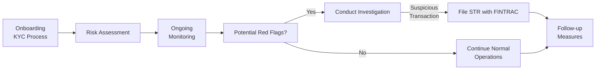

## 3.5 Money Laundering and Terrorist Financing in the Securities Industry

Imagine you’re sitting at your desk at a bustling investment firm—phones ringing, your colleagues chatting with clients, the ticker tape marching across the screen. Suddenly, a large wire transfer pops into your client’s account—an amount bigger than anything you’ve seen from them before. You call your colleague over and they give you that look, the one that says, “We need to figure out if this is okay.” That moment of hesitation, that nagging sense of “Is this money legitimate?” is precisely why anti-money laundering (AML) and anti-terrorist financing (ATF) efforts are so crucial in our industry.

In Canada’s securities environment, regulators and lawmakers have established firm rules to ensure that potential criminals (and let’s face it: criminals evolve their tactics all the time) have as few places to hide their illicit funds as possible. While we may think of money laundering as something that happens mostly in big banks, real estate deals, or shady overseas wire transfers, it actually happens in securities accounts too. And because the securities industry can deal with large sums of money moving quickly across borders, the stakes are high, and regulators expect us to be alert.

Below, we’ll explore the key components of AML and ATF programs, focusing on how they apply specifically to the securities industry in Canada. We’ll talk about the essential pillars of compliance—client identification, monitoring, reporting obligations, and more. We’ll also share some real-life experiences (nothing confidential, of course!) and best practices that can help you develop and maintain a robust AML/ATF program.

### Understanding the Background: Why AML/ATF Matters

Money laundering is essentially the process of making “dirty” money—funds derived from criminal activities—appear legitimate. Criminals need to get these illegal funds into the financial system without triggering suspicion. Terrorist financing, on the other hand, involves using legally or illegally sourced money to fund terrorist activities. Even small sums of money can be devastating if used for violent or extremist purposes.

Canada has enacted laws and regulations to combat these activities, most notably under the Proceeds of Crime (Money Laundering) and Terrorist Financing Act (PCMLTFA). The Financial Transactions and Reports Analysis Centre of Canada (FINTRAC) is the country’s financial intelligence unit, responsible for collecting, analyzing, and disclosing information to aid in the detection and prevention of money laundering and terrorist financing.

For securities firms under the oversight of the Canadian Investment Regulatory Organization (CIRO)—formed after the amalgamation of the previous SROs (IIROC and MFDA) in 2023—a failure to have proper AML/ATF measures can lead to hefty penalties, reputational damage, and even the loss of one’s registration. Besides, good AML/ATF practices help keep the financial system safe for everyone, and that’s something clients (and compliance officers) truly appreciate.

### The Key Elements of AML and ATF Programs

A good AML/ATF compliance program in the securities industry typically includes:

• Comprehensive written policies and procedures.  
• A designated compliance officer or team with responsibility for AML/ATF oversight.  
• Thorough client identification and verification (KYC procedures).  
• A risk-based approach to monitoring transactions for suspicious activity.  
• Timely reporting of suspicious or large cash transactions.  
• Ongoing training for all staff.  
• Routine testing and auditing of the program’s effectiveness.

Let’s break down some of these components in more detail.

#### Client Identification and Verification: The Foundation of KYC

You can’t detect suspicious transactions connected to money laundering or terrorist financing if you don’t really know who, or what kind of entity, is behind the account. That’s where Know Your Client (KYC) rules come in. Securities firms have long used KYC to recommend investments that are suitable for each client (see also Chapter 5: Client Discovery and Account Opening). But KYC is also essential for AML/ATF.

When onboarding a new client, you (or your back-office compliance team) must verify:

• The client’s legal name and identity (using reliable, independent source documents such as a driver’s license, passport, or corporation filings).  
• The client’s address and contact details.  
• The beneficial owners if the client is a corporation, trust, or partnership.  
• The client’s occupation (or nature of business, in the case of an entity).  
• Potential Politically Exposed Persons (PEPs) or other higher-risk attributes.

Then you document these findings, ensuring they remain readily accessible for regulators and FINTRAC, if needed. Some firms implement electronic identity verification tools to speed up the process and reduce errors. Double-checking the data is an important step—like that time I almost overlooked a missing letter in a client’s name, which completely threw off the verification process until I realized my minor typographical error. (Yep, I still cringe about that.)

#### Ongoing Monitoring of Client Transactions

Once a client is onboarded, you don’t just file away their identity documents and forget about them. Ongoing monitoring is where you keep an eye out for anything unusual. Securities transactions can be complex—for example, large volumes of cross-border wires, trades in illiquid shares, or frequent deposits and withdrawals in short time frames.

Some suspicious indicators include:

• Rapid “in-and-out” trading with no apparent legitimate purpose.  
• Incoming funds from high-risk jurisdictions without a clear economic rationale.  
• A sudden flurry of activity in an account that had been dormant.  
• Repetitive transactions just under reporting thresholds (structuring).  
• Client unwillingness to provide normal identification or tax residency documents.

In many firms, specialized software or transaction monitoring systems will generate alerts based on certain rules (for instance, any single cash deposit above $10,000 or specific patterns of suspicious transactions). The compliance team reviews these alerts to decide whether further investigation or a suspicious transaction report (STR) is warranted.

#### Reporting Suspicious Transactions to FINTRAC

What happens if something really doesn’t add up? Maybe a transaction calls to mind that time you watched a detective show where a big deposit came in from a shell company in a known high-risk country. Well, FINTRAC requires that securities dealers in Canada file certain types of reports:

• Suspicious Transaction Reports (STRs): If you have reasonable grounds to suspect that a transaction is related to money laundering or terrorist financing.  
• Large Cash Transaction Reports (LCTRs): If the client has made a cash transaction of $10,000 or more in a single or multiple linked transactions over a 24-hour period.  
• Electronic Funds Transfer Reports (EFTRs): For incoming or outgoing international electronic funds transfers of $10,000 or more in a 24-hour period.  
• Terrorist Property Reports (TPRs): If you know or suspect that property in your possession or under your control belongs to a terrorist or terrorist group.

And trust me, these are strict deadlines and rules—failing to file can result in huge fines. While it can feel daunting to file an STR, it’s crucial to do so when warranted. FINTRAC uses the intelligence gleaned from these reports to identify larger patterns of criminal or terrorist activities. No one wants to be the person who fails to notice a red flag that leads to bigger social or reputational harm down the line.

#### Employee Training and Awareness

“How was I supposed to know that was suspicious?” That’s not a question you want to hear from anyone in your firm, especially when a regulator comes knocking. Continuous, robust training ensures that every employee, from your newest hire to the CEO, understands how to recognize, prevent, and report money laundering or terrorist financing. 

Securities is a fast-paced industry, and clients might do unusual transactions for legitimate reasons, but employees must be able to distinguish normal from potentially criminal. Firms often hold annual training sessions and circulate bulletins with recent real-world case studies—like that time an AML analyst discovered repeated wire transfers in small increments, to multiple overseas accounts, that turned out to be funneling money to a banned group. The point is to keep your antenna up for any suspicious patterns and share knowledge across departments when anything seems “off.”

#### The Role of a Designated Compliance Officer

A well-structured AML/ATF compliance program usually appoints a Chief Compliance Officer (CCO) or another specially designated individual to oversee the entire AML framework. This role includes:

• Continually updating AML/ATF policies and procedures.  
• Liaising with regulators—including CIRO—on AML/ATF issues.  
• Monitoring compliance with procedures, including suspicious-transaction alerts.  
• Ensuring internal reviews and audits are conducted periodically.  
• Overseeing staff training and ensuring consistent application of policies firm-wide.

While the designated officer typically has the final say on many AML/ATF decisions, it truly is a responsibility shared by everyone, from the top executives to each individual dealing rep who handles client accounts. You’d be surprised how even a quick heads-up from a new associate can rapidly escalate a matter that’s significant enough to warrant an STR.

#### Case Study: A Brief Illustration

Let’s consider a fictional example of how money laundering might surface in a securities context:

• A new corporate client, “MapleEx Consulting Inc.,” opens a margin account and states that the funds are from monthly revenue.  
• Over the next few weeks, MapleEx transfers money from multiple third parties located in numerous countries known for lax AML controls. The amounts are slightly below $10,000 each time.  
• The client immediately purchases high-risk small-cap stocks and sell orders occur the following day, with proceeds transferred to an offshore bank.  
• The repeated pattern of near-$10,000 deposits, quick trades, and immediate fund transfers raises red flags in the firm’s transaction monitoring system.  
• The compliance team investigates, finds that the stated business purpose doesn’t align with the client’s actual activities, and files a Suspicious Transaction Report with FINTRAC.

While MapleEx might be perfectly legitimate, the suspicious scenarios must be reported so FINTRAC can investigate more thoroughly. Failing to file an STR could lead to regulatory sanctions against the firm if MapleEx turns out to be laundering criminal proceeds.

### Visualizing the AML/ATF Compliance Process

Below is a simple Mermaid diagram representing the typical flow of AML/ATF compliance in a securities firm. Follow along to see how each step informs the next.

• A: The client is onboarded; their ID is verified, risk level is established.  
• B: A risk assessment is applied, taking into account the client’s profile and any high-risk indicators.  
• C: Transactions are continuously monitored.  
• D: If unusual activities crop up, the compliance team reviews them.  
• E: If there’s enough suspicion, they proceed with an investigation.  
• F: If that suspicion holds, an STR is filed with FINTRAC.  
• G: If no suspicious indicators surface, normal operations continue.  
• H: Follow-up measures could involve additional KYC checks, enhanced monitoring, or no further action if the suspicion is resolved.

### Emerging Trends in AML/ATF

As technology evolves, so do threats. Criminals may use cryptocurrency or intricate layering mechanisms (like moving money through complex web structures involving multiple jurisdictions). Securities dealers must stay informed. Indeed, some of us can recall the surprise we felt when we first spotted suspicious crypto wallet-funded accounts. Although not all crypto transactions are suspect, the anonymity possible in some blockchains can facilitate money laundering if not closely watched.

Firms should incorporate new technologies, such as advanced analytics and machine learning, to assess transaction data in real time, spot anomalies, and reduce manual interventions. But a major key is remembering that technology is a tool, not a replacement for human judgment. Some of the biggest “catches” in suspicious activity come from employees trusting their instincts and raising concerns with compliance.

### Best Practices and Common Pitfalls

Best practices:

• Regularly review and update AML/ATF policies—laws change, as does criminal behavior.  
• Employ a risk-based approach—focusing resources where the risk is greatest.  
• Document every step meticulously—if it’s not documented, regulators may assume it didn’t happen.  
• Exchange intel with peers (where allowed)—learning from others’ experiences can help your firm stay alert.  
• Ensure your training program is not purely a “check-the-box” exercise—real-world case studies and interactive sessions are more effective.

Common pitfalls:

• Viewing AML/ATF solely as a compliance “obligation” rather than an ethical and social responsibility.  
• Inadequate or superficial client identification—this often invites trouble.  
• Failing to escalate red flags effectively.  
• Neglecting ongoing training—older staff may rely on outdated assumptions; new staff might not grasp the complexity.  
• Letting technology (like an automated system) handle everything, ignoring the importance of human oversight.

### Strategies to Overcome Challenges

Set realistic goals within your compliance framework. If you try to catch every single anomaly in the world, you’ll quickly be bogged down by false positives or might even start ignoring alerts. Instead, define thresholds, run risk assessments properly, and ensure your staff is well-rounded.

Finally, open communication channels between front-office staff, compliance, and senior management are critical. Let’s say a new adviser sees something unusual with a client’s deposit. If she feels comfortable mentioning it to her supervisor, who then flags it to compliance, you’ve probably prevented bigger headaches later. If not, that suspicious deposit might fly under the radar until it’s too late.

### Practical Example of Balancing Risk and Client Relationships

I once spoke with a colleague who had the unfortunate task of telling a brand-new client that the firm needed more information about the source of some funds. The client got upset and threatened to take his business elsewhere. This is tough. A fear of losing a client might push some advisers to look the other way. But the firm’s message was crystal clear: compliance and ethical standards come first. In the end, the client voluntarily provided proof that the funds were from a legitimate property sale—and we all slept better at night. The big lesson? Even if the conversation is uncomfortable, it’s vital to uphold your obligations.

### Staying Informed: Resources and References

The AML/ATF landscape changes quickly—new techniques, new regulations, new global alliances. Keeping up to date is a must. For more detailed guidance:

• FINTRAC official website:  
  [https://www.fintrac-canafe.gc.ca](https://www.fintrac-canafe.gc.ca)  
  (This includes guidelines, policy interpretations, and legislative updates.)

• CSI’s AML/ATF Compliance Course:  
  [https://www.csi.ca/student/en_ca/courses/csi/aml.xhtml](https://www.csi.ca/student/en_ca/courses/csi/aml.xhtml)  
  (Offers in-depth lessons and scenarios focused on AML in Canadian financial markets.)

• CIRO (Canadian Investment Regulatory Organization):  
  [https://www.ciro.ca](https://www.ciro.ca)  
  (Contains current regulatory notices and updates on AML requirements for investment dealers and mutual fund dealers.)

### Conclusion

In the Canadian securities industry, strict regulations and vigilant monitoring around money laundering and terrorist financing aren’t optional—they’re essential to preserving the integrity of the financial system. By establishing a robust compliance framework, reinforcing employee training, diligently monitoring transactions, and promptly reporting suspicious activity to FINTRAC, your firm can play its part in keeping criminal or nefarious activities out of the market.

Whether you’re brand new to these compliance challenges or you’ve been scrutinizing suspicious transactions for years, it’s important to stay curious and proactive. The criminals aren’t just sitting still—and neither can we. After all, you never know when those wide-eyed instincts and that careful second look might save your firm, your reputation, and perhaps even someone’s life.

--------------------------------------------------------------------------------

## Protect Your Practice: Money Laundering and Terrorist Financing Quiz



### Which organization in Canada is primarily responsible for collecting and analyzing financial intelligence related to money laundering and terrorist financing?

- [x] FINTRAC
- [ ] CIPF
- [ ] OSFI
- [ ] Canada Revenue Agency

> **Explanation:** The Financial Transactions and Reports Analysis Centre of Canada (FINTRAC) is the national agency that gathers and analyzes information to detect and prevent money laundering and terrorist financing.

### Which of the following is considered a key element of an AML/ATF compliance program in the securities industry?

- [x] Ongoing transaction monitoring
- [ ] Allowing anonymous accounts
- [ ] Avoiding training to protect confidential information
- [ ] Eliminating due diligence for large accounts

> **Explanation:** Ongoing monitoring of transactions is an essential part of a proper AML/ATF compliance program. This includes spotting unusual or suspicious activity and reporting it when necessary.

### What is the main purpose of a Suspicious Transaction Report (STR)?

- [x] To inform FINTRAC when there are reasonable grounds to suspect money laundering or terrorist financing
- [ ] To refuse service to a suspected client automatically
- [ ] To close all client accounts for further investigation
- [ ] To publicly disclose client financial details

> **Explanation:** An STR alerts FINTRAC that a particular transaction warrants further investigation for potential money laundering or terrorist financing, but it does not automatically result in closing an account or making the information public.

### Which of the following activities may raise a red flag for money laundering in a securities account?

- [x] Large deposits from multiple unknown sources in high-risk jurisdictions
- [ ] A client buying a small fraction of a large-cap company
- [ ] Following a basic dividend reinvestment plan
- [ ] Gradual portfolio rebalancing

> **Explanation:** Multiple, large deposits from uncertain sources, especially in higher-risk areas, can be a sign of money laundering. Advisers should investigate the origins of these funds, and compliance teams should consider filing an STR if suspicion persists.

### Why is training all staff members, not just compliance officers, essential for an effective AML/ATF program?

- [x] Because anyone in the firm could notice suspicious activity
- [ ] Because regulators only require training for new employees
- [x] Because criminal tactics evolve, and everyone needs updated knowledge
- [ ] Because it reduces the need for record-keeping

> **Explanation:** Front-line staff, back-office teams, and senior management alike can catch suspicious activity. Continuous training ensures everyone knows what to look for, and criminal methods change rapidly, so updates are key.

### A client who is a corporate entity suddenly starts making frequent wire transfers to countries known for extremist group activity. What should a Registered Representative do first?

- [x] Notify the firm’s AML/ATF compliance officer for investigation
- [ ] Immediately freeze the client’s assets
- [ ] Close the account without explanation
- [ ] Propose a higher-risk investment strategy in emerging markets

> **Explanation:** A proper response is to notify your AML/ATF compliance officer, who will investigate and potentially file an STR with FINTRAC if warranted.

### In Canada, which legislation primarily governs how securities firms must combat money laundering and terrorist financing?

- [x] Proceeds of Crime (Money Laundering) and Terrorist Financing Act (PCMLTFA)
- [ ] Income Tax Act
- [x] Anti-Terrorism Act
- [ ] Canada Business Corporations Act

> **Explanation:** The PCMLTFA is the main legal framework detailing AML/ATF obligations. The Anti-Terrorism Act also contributes to the provisions but is not the sole piece of legislation involved.

### What is a common pitfall that undermines the effectiveness of AML/ATF programs?

- [x] Failing to escalate suspicious activities due to fear of losing a client
- [ ] Providing clear documentation of each transaction
- [ ] Regularly training staff on new regulatory updates
- [ ] Establishing a thorough AML/ATF program during account opening

> **Explanation:** If employees or representatives don’t escalate suspicious activities out of concern for client retention or perceived inconvenience, potential red flags can go unchecked, increasing the firm’s legal and reputational risk.

### When should a Canadian investment dealer file a Large Cash Transaction Report (LCTR) with FINTRAC?

- [x] When a client makes a cash transaction of $10,000 or more within a 24-hour period
- [ ] When any client transaction is below $10,000
- [ ] Only when instructed by the client
- [ ] Only for non-resident clients

> **Explanation:** Cash transactions of $10,000 or more within a 24-hour window must be reported to FINTRAC according to Canadian regulations.

### For AML/ATF compliance, a client’s refusal to provide adequate identification or explain the source of funds is typically:

- [x] True
- [ ] False

> **Explanation:** Clients who refuse to provide necessary identification or fund sourcing information represent a major red flag. Firms should investigate and may need to consider filing a suspicious transaction report depending on other circumstances.


