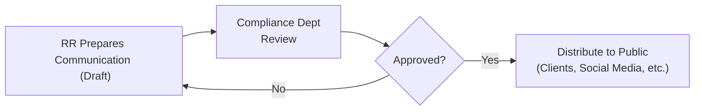

## 4.2 Communication with the Public

Sitting down at a local café not so long ago, I remember having a coffee with a friend who was curious about investing. Naturally, the conversation turned to the countless ads she’d seen on social media about hot new stocks and sure-fire investment opportunities. She admitted she was a bit overwhelmed and unsure who to trust. As a Registered Representative (RR), you’ve probably faced similar casual chats with friends, family, or prospective clients, where you’re expected to provide clarity, a sense of security, and, of course, compliance. That’s the reality of public communication in the securities world.

In this section, we’ll explore what it means to communicate with the public in a way that meets regulatory requirements, offers transparency, and helps clients feel confident about the advice or information you provide. We’ll look at best practices, highlight potential pitfalls, and delve into the nuts and bolts of compliance oversight in communications—everything from social media posts and client emails to advertising campaigns.

Remember, the principles discussed here build upon previous sections, such as 4.1 on Registration Requirements, and tie closely into the broader Canadian regulatory framework introduced in Chapter 3. The goal is to empower you to speak confidently and accurately to the public while upholding the high standards required by CIRO, provincial securities regulations, and your own firm’s compliance department.

---

### Effective Communication: The Core Principles

Communication with the public can take many forms: emails, brochures, digital ads, newsletters, social media posts, presentations, and more. Regardless of format, the fundamental guiding principles remain consistent:

• Accuracy: Any statement must be factually correct. Watch out for hyperbole, questionable claims, or language that might create unrealistic expectations.  
• Clarity: Keep it simple, with minimal jargon. Aim for an explanation that even your 80-year-old grandmother or a brand-new intern could grasp.  
• Fairness: Present information in a balanced manner. Don’t just showcase the good—provide a realistic view of risk, costs, and potential downsides.  
• Not Misleading: Avoid ambiguous phrasing or half-truths. If there’s a risk associated with an investment, it needs to be disclosed clearly in your public communication.  

At the heart of these principles is one key responsibility: to protect investors from harm by ensuring they have truthful, balanced, and transparent information.

---

### Differentiating Fact from Opinion

People inherently trust Registered Representatives because of their education, credentials, and industry oversight. That’s why it’s so critical to distinguish between what is objectively factual and what is your opinion. Clients can be easily confused if they can’t tell where the facts end and your personal projections begin.

• Factual Statements: “ABC Company reported a 5% increase in earnings last quarter.”  
• Opinions or Forecasts: “I think ABC Company’s new product launch might drive significant gains in the next year—though it’s not guaranteed.”

Making this distinction is not just about being polite; it’s literally required under CIRO and provincial regulatory guidelines. It also helps preserve trust: your audience knows exactly how to interpret your message, making them more comfortable asking follow-up questions and relying on your guidance.

---

### Disclosing Risks and Limitations

You might have heard the old saying, “No risk, no reward,” right? But in the securities industry, you must ensure that whenever you highlight potential rewards, you also disclose potential risks and any limitations. This doesn’t mean you have to pepper every sentence with doomsday language—just ensure the reality of risk is presented fairly and in proportion to any claims of potential benefits. In other words, if you talk about a fund’s great performance, also mention whether that fund invests in volatile assets and could experience losses.

• Potential Risk Factors: Market fluctuations, interest rate changes, economic downturns, issuer credit risk, currency risk (if investing in foreign securities), and more.  
• Limitations: Maybe it’s a lack of liquidity, or an investment that doesn’t offer daily redemption, or a small- to mid-cap strategy that can be more volatile than large-cap.  

When you talk about these limitations, it illustrates that you’re not only informed about the product but also care about the client’s long-term financial well-being.

---

### The Need for Prior Approval

From that first draft of a brochure to a catchy Instagram reel, every piece of sales literature or public communication typically needs an internal check by your firm’s compliance department before it ever sees the light of day. That might sound like a hassle at times—especially when you’re excited to share content quickly—but it’s central to ensuring that communications align with:

• CIRO rules  
• Provincial securities regulation  
• Internal firm policies  

Your compliance department is there to help (yes, I promise, they’re not just gatekeepers). Think of them as your safety net. They’ll spot trouble before it happens, flagging language that could be misleading or that’s missing certain disclosures. It’s far better to address these issues internally than to face potential regulatory action months later.

---

### Cautious Use of Social Media

Who hasn’t posted on social media about an upcoming webinar or a hot topic in the markets? It’s fast, convenient, and can reach a huge audience. However, the same rules apply to your tweets, LinkedIn articles, and Facebook posts as they do to more traditional media:

• Balance: Yes, a short post on Twitter can mention the pros, but be sure to link to or mention the cons.  
• Accuracy: Double-check numbers, references, and disclaimers.  
• Compliance: Follow your firm’s social media policy, get pre-approvals if necessary, and maintain a record of what you post (including edits or deletions).  

Consider a scenario: Let’s say you have a personal social media page, where you post memes and cat photos. Then you start mixing the personal and professional by referencing investment tips or product insights. This is tricky territory, because your personal brand can merge with your professional identity. RRs must be extra careful—any statements they make about investments, even casually, can be interpreted as official advice. Always keep an eye on firm policy when using social media.

---

### The Recordkeeping Requirement

Every single communication you have with a client—from an email about a trade idea to the typed meeting summaries or call notes—must be recorded and stored in accordance with CIRO recordkeeping requirements (and your firm’s policies). Here’s why:

1. Regulatory Oversight: Regulators expect to be able to retrace who said what, to whom, and when.  
2. Dispute Resolution: If there’s ever a client complaint mentioned in Chapter 8.5 (Client Complaints and Account Transfer Requests), records of conversations can help clarify any misunderstandings.  
3. Legal Accountability: If your firm faces any legal action, good documentation goes a long way in ensuring fairness.  

Some RRs like to keep a personal log (in addition to official systems) to help them remember key details. That’s great, but keep in mind that any personal notes may also be subject to regulatory review, so always maintain consistency and accuracy.

---

### A Visual Overview of the Communication Process

Below is a simplistic Mermaid diagram to illustrate the flow of creating and distributing communications to the public. Note how compliance review is essential before final distribution.

• Node A: You craft the initial message or material.  
• Node B: The firm’s compliance department reviews, ensuring all disclaimers, risk disclosures, and fair presentation requirements are met.  
• Node C: The compliance department either approves or rejects it. If they reject, you revise the communication and go back to them.  
• Node D: You share it with the public, following your firm’s policies for distribution and record retention.

This cycle fosters an environment where each public message is carefully vetted. Even though it can feel a bit bureaucratic, it safeguards both you and your clients.

---

### Practical Examples of Compliant vs. Non-Compliant Communication

Sometimes it’s easier to learn by seeing real-world examples. Let’s look at two hypothetical short advertisements or social media posts aimed at potential clients.

• Compliant Example:  
  “Are you seeking growth opportunities this year? Check out our Canadian Equity Growth Fund—historically, it’s seen moderate gains, though past performance isn’t a guarantee of future results. This fund invests primarily in mid-cap Canadian companies, which can be more volatile than other market segments. For details on fees, risks, and performance, visit our website.”  

  Why This Works: The ad discloses that past performance is not guaranteed, mentions the higher volatility risk, and directs investors to more detailed information.

• Non-Compliant Example:  
  “Hey, invest in our Canadian Equity Growth Fund and watch your money double in record time! We’ve achieved unstoppable returns so far—sign up now, no disclaimers needed!”  

  Why This Fails: It’s a blatant performance promise (money doubling quickly), lacks risk disclosure, and includes a misleading phrase—“unstoppable returns.” It’s also missing references to fees, disclaimers, or any suggestion that volatile markets can affect outcomes.

---

### Balancing Marketing Creativity with Compliance Requirements

Marketing teams love creative angles and eye-catching headlines—just think of all those finance commercials featuring serene retirees strolling on beaches. While creativity is useful for getting potential clients’ attention, it mustn’t come at the expense of clarity, fairness, or honesty. If a particular ad is too “flashy” or implies guaranteed outcomes, it’s wise to tone it down and run it by compliance. It’s possible to write compelling copy without over-promising.

---

### Case Study: An Overenthusiastic Sales Pitch

Imagine a scenario where you, as an RR, are asked to host a public webinar on “High-Yield Investment Products.” You prepare slides that highlight attractive yields, but you gloss over the credit risk or potential for default. During the webinar, a prospective client asks about the possibility of losing principal. You respond, “Well, these are pretty safe overall—I wouldn’t worry too much,” because you feel the conversation needs positivity.

A week later, your compliance officer reviews a recording of that webinar (which, by the way, is something you’re required to keep a record of) and flags your lack of risk disclosure. Telling a client not to worry without providing facts can be deemed misleading. This seemingly harmless comment could constitute non-compliant communication. It underscores the importance of carefully balancing optimism with the factual realities of investment risk.

---

### Electronic Communications and Social Media Pitfalls

One subtle challenge is ephemeral messaging. Platforms like WhatsApp, WeChat, or other direct messaging apps often have features where messages disappear after a certain timeframe. While they’re convenient for daily life, they can create compliance nightmares if you use them for client communication without a proper recordkeeping mechanism. If your firm policy states that all communications must be archived, ephemeral messaging is generally off-limits for business discussions.

Additionally, be mindful of “liking” or “sharing” content. Even a simple click can be interpreted as endorsing a product or viewpoint, opening you to scrutiny if that content violates any regulations, or if it includes unbalanced or misleading claims.

---

### How Communication Relates to Client Discovery and Suitability

Communication sets the tone for the entire client relationship. As you’ll read in Chapter 5 (Client Discovery and Account Opening), building solid client objectives, risk profiles, and investment strategies depends heavily on accurate, transparent conversation. Ensuring you communicate responsibly with the public helps you attract the right clientele—those who truly understand your approach and share your philosophy on risk and reward.

A strong public communication approach also ties into Chapter 6 (Product Due Diligence, Recommendations, and Advice). If you’ve done your homework on an investment product and present it in a balanced fashion, clients can see the connection between your due diligence and the advice offered to them.

---

### Encouraging Continuous Learning and Dialogue

Clients—and prospective clients—will keep asking questions: “What’s a bond yield?” “Why is this fund right for me?” “How does margin work?” (as we saw in Chapter 8.2 on Margin Accounts). Your role is to meet those queries with clarity, honesty, and compliance. The learning doesn’t stop once you craft a single ad or host a single webinar. Market conditions change, regulatory guidelines evolve, and your clients’ financial needs shift over time.

The best RRs I know create a culture of open dialogue. They encourage clients to ask questions and happily correct misconceptions. Effective communication fosters trust; trust leads to better outcomes for everyone involved, and that’s really the end goal of the entire securities industry.

---

### Potential Pitfalls and How to Avoid Them

• Overpromising Results: Even if you’re excited about an investment’s potential, avoid phrasing that borders on guarantees.  
• Neglecting Approval: Failing to submit your content to compliance can lead to disciplinary action if you skip the required steps.  
• Insufficient Risk Disclosure: If you reference returns or other performance stats, always balance it with a clear mention of risk.  
• Using Personal Devices for Business: If your firm prohibits certain social media or messaging apps for official communication, follow their rules. It’s not worth the hassle.  
• Improper Recordkeeping: Even if it’s just a quick note or ephemeral message, you must follow your firm’s record retention policies.  

---

### Best Practices for Future-Proof Communications

• Stay Updated: CIRO guidelines can evolve, so regularly visit [CIRO’s Communication Guidelines](https://www.ciro.ca) to keep your knowledge current.  
• Use Templates: Many firms have approved templates for emails, ads, and social media posts—leverage these resources to minimize errors.  
• Ask for Help: If in doubt, consult your compliance department. They’re there for exactly that reason.  
• Think Client-Centric: Ask yourself, “Would a client understand this, trust it, and feel fairly informed?” If the answer is no, revise.  
• Continuous Education: Attend webinars, read articles, or check out recommended resources like “Social Media Compliance for Financial Professionals” by Stuart Fross and Richard Marshall.  

---

### Bringing It All Together

Communication with the public isn’t just about marketing your services or your firm’s products—it’s about building relationships built on trust, clarity, and accuracy. Whether you’re sending out a social media post or responding to a client email, each word matters. Clients are counting on you for informed, honest guidance, and regulators are counting on you to protect the integrity of the market.

So next time someone asks, “Hey, can you help me make sense of this investment ad?” you’ll have the knowledge (and regulatory framework) to give them a confident, balanced answer. Do the necessary due diligence, keep compliance in the loop, and disclose the important stuff.

In short, be accurate, be fair, and be transparent. You’ll be well on your way to establishing a stellar reputation as a capable, trustworthy Registered Representative.

---

## Mastering Public Communication in Canadian Securities: Quiz



### Which of the following best defines a core principle of public communication for RRs?

- [x] Ensuring all statements are accurate, clear, and balanced
- [ ] Minimizing regulatory reviews to expedite the marketing cycle
- [ ] Recommending only products that carry no risk
- [ ] Using frequent social media posts without approvals

> **Explanation:** Accuracy, clarity, fairness, and avoiding misleading content are essential regulatory requirements for any communication from an RR.

### Why is it critical to distinguish between factual statements and opinions when communicating with the public?

- [x] It helps clients understand what is verifiable information versus personal or market-based predictions
- [ ] It allows RRs to avoid compliance oversight
- [x] It clarifies that opinions are not guaranteed outcomes
- [ ] It arbitrarily lengthens client disclosures

> **Explanation:** Making this distinction ensures transparency and trust, helping clients differentiate between verifiable data and speculation, while also remaining compliant with CIRO standards.

### Which of the following would be considered a main risk disclosure requirement for RRs?

- [x] Outlining the potential for market volatility or loss whenever discussing performance
- [ ] Guaranteeing returns so clients feel secure
- [ ] Referring clients to external blogs without oversight
- [ ] Claiming zero risk due to government backing

> **Explanation:** RRs must always highlight relevant risks, including market volatility, to present a balanced view and comply with regulations.

### A social media post that claims “Invest in our growth fund and double your money in no time!” is likely:

- [x] Non-compliant because it guarantees results and leaves out risk disclosure
- [ ] Compliant because it uses creative marketing
- [ ] Compliant if posted on a personal social media account
- [ ] Non-compliant only if the post is more than 280 characters

> **Explanation:** Promising returns and omitting risks is misleading, violating the fairness and balance principle for public communications.

### What should RRs do before distributing an investment brochure to the public?

- [x] Submit it to the firm’s compliance department for review and approval
- [x] Confirm the brochure’s claims are balanced and risk disclosures are included
- [ ] Share it freely on social media to gauge public reaction
- [ ] Skip disclaimers to keep the document short

> **Explanation:** Approval by compliance and including risk disclosures are both crucial steps to ensure compliance with regulatory standards.

### Why is recordkeeping of client communications considered vital?

- [x] It allows regulators and the firm to review what was said to clients
- [ ] It’s primarily used for marketing analytics
- [ ] It’s only necessary when a complaint is lodged
- [ ] It’s strictly optional to maintain client privacy

> **Explanation:** Proper recordkeeping is required by CIRO to ensure all communications can be audited in the event of disputes or regulatory scrutiny.

### What is a recommended approach for an RR who wants to post about investments on social media?

- [x] Follow the firm’s social media policy and compliance guidelines, and maintain records of posts
- [ ] Rely on personal judgment for disclaimers
- [x] Obtain pre-approvals for content when required
- [ ] Mix personal and professional accounts for a friendly approach

> **Explanation:** Compliance oversight of all communication platforms is crucial, and many firms require advance review of social media posts regarding investment information.

### Which scenario best reflects balanced and compliant communication?

- [x] Statement that includes data on historical returns, relevant risk disclosures, and disclaimers about potential losses
- [ ] Advertisement that focuses only on positive returns in previous years
- [ ] Postscript in an email mentioning 10% guaranteed profit
- [ ] Personal blog promising “zero downside” with certain strategies

> **Explanation:** Balanced communication provides both performance details (if relevant) and explicit disclosures of possible risks or losses.

### When preparing a webinar on High-Yield Bonds, why should an RR discuss credit risk?

- [x] Because it’s a key potential risk for high-yield (junk) bonds
- [ ] To discourage clients from working with other RRs
- [ ] To abide by CIPF regulations unrelated to bond investing
- [ ] To keep the webinar interesting

> **Explanation:** High-yield bonds carry a greater chance of default, so discussing credit risk is central to providing a fair and balanced presentation.

### True or False: Ephemeral messaging apps are generally off-limits for official client communications unless they meet archival requirements.

- [x] True
- [ ] False

> **Explanation:** Most firms prohibit ephemeral or disappearing messages for any business-related discussions because they cannot be preserved as required by CIRO regulations.


