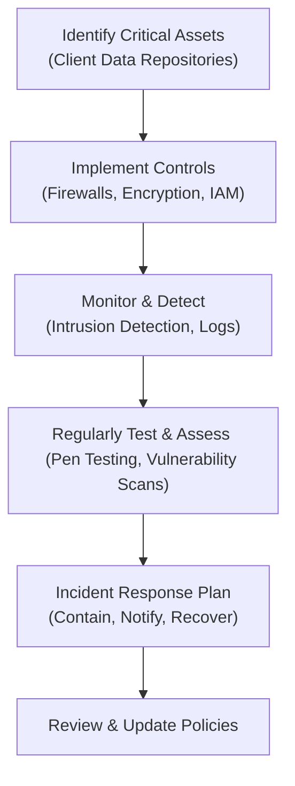
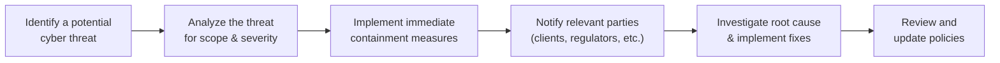

## 4.5 Privacy and Cybersecurity

Protecting client information is crucial to ensuring trust in the securities industry. If you’re an RR (Registered Representative) in Canada, you’ve probably heard all about the Personal Information Protection and Electronic Documents Act (PIPEDA) and various provincial privacy laws. But let’s be honest: sometimes these laws can feel a bit like legalese overload. So let’s break this down in a simpler, slightly friendlier way, and also remember that the stakes are really high. If someone’s personal information gets compromised, it’s not just a legal or regulatory nightmare—it’s personal and can be emotionally devastating.

In this section, we explore the ins and outs of privacy legislation and cybersecurity best practices, focusing on the responsibilities of RRs in particular. But hey, let’s not keep it super formal. Think of this as a chat about how we safeguard client data, why it matters, and how it all fits into providing high-quality service in line with Canadian securities regulations.

---

### The Importance of Privacy: A Personal Reflection

I still remember my first year in the industry. I was an eager newbie, and I spent a whole day catching up on PIPEDA. To be honest, I initially found it, um, a bit dry. Then I had a call from a client who wanted to confirm some personal details over the phone—details that were super sensitive. Suddenly, the importance of privacy legislation became glaringly real. In short, privacy rules aren’t about mindless compliance; they’re about respecting the trust our clients place in us.

Our profession demands we handle loads of personal data—financial statements, account numbers, investment objectives, you name it. We must protect these details from prying eyes. When we talk about “privacy,” we’re referring to a client’s right to control the collection, use, and disclosure of their personal information. And that right is backed by some serious pieces of legislation, like PIPEDA, which sets out the ground rules for handling personal data in the private sector.  

---

### Understanding PIPEDA and Provincial Requirements

PIPEDA is federal legislation overseeing the collection, use, and disclosure of personal information. Additionally, some provinces (like Quebec, Alberta, and British Columbia) have their own privacy statutes that are considered substantially similar to PIPEDA. The overarching intent is the same: to ensure organizations, including securities firms, handle personal information lawfully and responsibly.

#### Key PIPEDA Principles

• Accountability: Firms are responsible for personal information under their control and must appoint someone—often a Privacy Officer—to ensure compliance.  
• Identifying Purposes: Personal information can only be collected for specific, lawful purposes (e.g., to open and service an investment account).  
• Consent: RRs need informed consent from clients before collecting or using personal information.  
• Limiting Collection: Only collect information that is directly necessary.  
• Limiting Use, Disclosure, and Retention: You shouldn’t use or keep clients’ data for something unrelated to its initial purpose—no snooping for curiosity’s sake.  
• Accuracy: Keep personal data as accurate, complete, and up to date as possible.  
• Safeguards: Put adequate protective measures in place, whether technical (e.g., encryption) or organizational (e.g., policies, training).  
• Openness: Be transparent about your policies.  
• Individual Access: Provide individuals with access to their personal data on request.  
• Challenging Compliance: Establish procedures for handling privacy complaints.

Failing to uphold these principles could invite regulatory penalties and even lawsuits. Let’s not forget the moral dimension: it’s simply the right thing to do.

---

### The Growing Cybersecurity Threat

So you might say: “Ok, I get it—privacy is important. But what’s with cybersecurity?” Well, cybersecurity is basically privacy’s best friend. Even if you physically protect client data in filing cabinets under lock and key, in 2025, client data also lives in databases and is often transmitted electronically. That opens up new potential vulnerabilities, from hack attempts to phishing scams.

Uh, it might sound a bit paranoid, but you’d be surprised how often bad actors try to intercept sensitive data in the financial industry. Ransomware can freeze entire systems, scam emails can trick employees into disclosing client info, and those unscrupulous few can parlay stolen information into identity theft or large-scale fraud. So yes, we (RRs, firms, everyone) have to stay on our toes.

#### Types of Cyber Threats

• Phishing: Fraudsters posing as reputable entities to get personal info or login details.  
• Malware and Ransomware: Malicious software that can hijack or encrypt corporate networks until a ransom is paid.  
• Social Engineering: Deceptions to manipulate individuals into revealing confidential info.  
• Insider Threats: Employees or contractors (intentionally or accidentally) exposing sensitive data.  
• Denial of Service Attacks (DoS): Overloading systems so they become unreachable.

---

### Security Policies and Firm-Level Safeguards

Organizations must have robust cybersecurity policies in place to guard client data. This typically involves:

1. Identifying Key Assets: Inventory what data you keep—account numbers, addresses, IDs, transaction history.  
2. Implementing Technical Safeguards: Firewalls, encryption, and secure servers. For instance, whenever you email sensitive client data, it should be encrypted.  
3. Conducting Regular Training: Staff should learn how to spot phishing attempts, set complex passwords, and stick to best security practices.  
4. Monitoring and Testing: Frequent vulnerability assessments, penetration testing, and system audits.  
5. Having an Incident Response Plan: We’ll talk more about that soon, but it’s basically your blueprint for what to do if a cyber incident occurs.

Let’s visualize a typical cybersecurity framework used in many securities firms:

• **A** represents the first step: identifying exactly what you’re protecting.  
• **B** covers your immediate gatekeepers—firewalls, encryption, IAM (Identity and Access Management).  
• **C** deals with real-time detection.  
• **D** ensures you test your defenses.  
• **E** addresses how you respond to incidents.  
• **F** is an ongoing cycle of improvement.

---

### The Role of RRs in Safeguarding Privacy

RRs are on the front lines. You’re the ones collecting personal data, storing it, and communicating with clients. Hence, you need to maintain secure protocols carefully. When a client sends you an email with sensitive documents, are you using secure channels? If you sense something off with a suspicious request (like a client suddenly asking for large sums to be sent to an unfamiliar overseas account), do you follow up with phone verification?

In Canada, CIRO (the Canadian Investment Regulatory Organization) expects RRs to follow firm policies that align with federal legislation. Even though your organization likely sets up the high-level controls (like cybersecurity or encryption solutions), individual RRs must put them into daily practice. That means no emailing unencrypted documents, no storing passwords on sticky notes (yeah, that’s still a thing!), and definitely no discussing client information in public settings where eavesdroppers might overhear.

#### Best Practices for RRs

• Use strong, unique passwords, and change them regularly.  
• Enable multi-factor authentication (MFA) wherever possible.  
• Confirm client identities through multiple channels before making major changes or releasing sensitive info.  
• Never leave your workstation unlocked if you step away.  
• Double-check attachments and message authenticity before clicking.  
• Avoid public Wi-Fi networks for confidential client conversations.

---

### Incident Response: What Happens If Things Go Wrong

Nobody likes to imagine a data breach or a major cyberattack, but it’s always possible. An Incident Response Plan (IRP) outlines the steps you, your fellow employees, and your management should take if you spot or suspect a breach. Typically, an IRP covers:

1. **Identification:** Someone notices unusual activity—for instance, a suspicious login at 3 a.m.  
2. **Containment:** IT quickly shuts down compromised accounts or servers to prevent more data exfiltration.  
3. **Notification:** Within a specified time, you must inform relevant parties—clients, regulators, the Privacy Commissioner—depending on the severity of the breach.  
4. **Eradication and Recovery:** Patch vulnerabilities, remove malware, and restore systems from clean backups.  
5. **Assessment and Follow-up:** Investigate what happened, why it happened, and how to ensure it won’t happen again.

That means it’s your duty, if you see something fishy, to report it. Don’t try to handle it all yourself. An IRP is a team effort, typically involving the IT department, privacy officers, senior management, and sometimes legal counsel. Most provinces have notification requirements if the breach is deemed a “real risk of significant harm” to affected individuals. In short, if you think a security fiasco occurred, step one: let your manager or compliance department know.

---

### Communicating Securely with Clients

Have you ever had a client text you personal data? I know I have, and it was awkward because I had to explain that texting might not be secure for sensitive details. The best practice is to use firm-approved, encrypted channels—maybe a secure portal or a specialized secure email system.

Encryption basically scrambles information so that if a third party grabs it in transit, it’s useless unless they have the decryption key. Some RRs mistakenly believe that adding “Confidential” in the subject line solves everything. That’s merely a label; the data still needs an actual encryption process to protect it while traveling through cyberspace.

#### Practical Tips

• Ask clients to send personal documents via secure upload portals.  
• If you can’t avoid email, ensure you or your firm are using an encrypted service.  
• Never use personal email accounts for business communications—this can breach both privacy laws and your firm’s compliance rules.  
• Verify instructions: If a client’s email requests a big funds transfer, give them a call to confirm. Hackers love intercepting such messages and forging them.

---

### Educating Clients on Cybersecurity

Your clients might not be as tech-savvy or aware of scams as you are. Taking a few minutes to coach them on good security habits can foster trust and protect them (and you) from headaches down the line. Encourage them to set strong passwords and watch out for suspicious emails claiming to be from your firm—sometimes criminals copy official logos to impersonate RRs. Let them know you’ll never ask for sensitive info through unsecure channels.

Here’s a snippet of how you might convey these tips to a client:

“Hi Alex, thanks for reaching out. We always want you to stay safe online. Remember, we never ask for your entire account number or password via email. If you get any weird requests, call me directly. Also, it’s helpful to set up multi-factor authentication for your online accounts. Let me know if you need any guidance there.”

It’s that simple. By being proactive, you create a protective barrier around your clients, which in turn reduces the risk to the firm.

---

### Real-World Example: The Suspicious Transfer Request

Let’s say one day you receive an email from a client, “Jessica,” instructing you to wire $50,000 to a new bank account in another country. The email says it’s urgent. But something feels off about the tone—maybe Jessica usually addresses you more casually, and here she’s using more formal language. Also, attachments in the email look fishy.  

In a scenario like this:

1. **Stay calm, don’t just proceed**—or you could inadvertently enable fraud.  
2. **Verify** by calling Jessica’s known phone number.  
3. **Check with IT** if you suspect your internal system might be compromised.  
4. **Document everything** and follow your firm’s policy on suspicious requests.  

If it turns out the email was fraudulent, you just saved your client from potential theft, and you saved the firm from a major fiasco. That’s how a bit of caution and training can pay off big time.

---

### Examples of Penalties and Consequences

Organizations that fail to protect client data can face severe penalties from the federal and provincial authorities, not to mention lawsuits or intense reputational damage. Under PIPEDA, the Office of the Privacy Commissioner of Canada can investigate and make recommendations. While the Commissioner can’t directly impose large fines under PIPEDA, repeated or egregious offenses can be referred to the Federal Court, which then can levy fines or award damages. In some provinces, especially where there’s specific legislation, privacy commissioners might have broader enforcement powers.

Besides the monetary penalties, you risk losing clients’ trust. One data breach can overshadow all the good work you’ve done for years. It’s no fun to be the firm on the six o’clock news having to admit thousands of records got leaked. So robust security isn’t just a regulatory must—we’re talking about your firm’s reputation and the sustainability of your practice, too.

---

### Ongoing Cybersecurity Audits and Assessments

Best practices in cybersecurity are always evolving. Hackers adapt their tactics every day, so your firm’s defenses should be nimble. Firms must conduct regular security assessments—either internally or via third-party auditors—to check for technical vulnerabilities. Beyond that, staff training can’t be a one-and-done event. People need periodic refreshers, new guidelines on emerging threats, and scenario-based training.

From an RR perspective, these audits might feel like an inconvenience. You might get random “phishing” tests from your IT department to see if you’ll click on suspicious links. But guess what? Those annoying tests are your best friend. If you pass them, you know your radar's on point. If you fail, well, better to learn in a controlled environment than in a real attack.

---

### Tools and Technology

No single tool solves all security problems, but a combination can boost protection significantly:

1. **Encryption Software**: Protect data at rest and data in transit.  
2. **Anti-Malware and Antivirus**: Basic but critical.  
3. **Intrusion Detection Systems (IDS)**: Alerts you to suspicious network activity.  
4. **Multi-Factor Authentication (MFA)**: Layers of security for logins.  
5. **Secure Portals**: For sending sensitive documents to clients.  
6. **VPN (Virtual Private Network)**: If you’re accessing firm systems remotely.  

Keep in mind that implementing these tools doesn’t instantly guarantee security. Their effectiveness depends on correct configuration, regular updates, and usage.

---

### Common Pitfalls in Privacy and Cybersecurity

• **Complacency**: Believing “It can’t happen to us.”  
• **Weak Passwords**: Using “password123” or reusing the same password across systems.  
• **Unencrypted Data**: Sending personal info through standard email with no encryption.  
• **Failure to Update Software**: Using outdated systems that are easily exploitable.  
• **Ignoring Red Flags**: Not verifying suspicious requests or attachments.  
• **Lack of Client Awareness**: If your clients don’t realize the dangers, they can inadvertently compromise their own data.  

---

### Crafting a Dynamic Incident Response Plan

We’ve covered the necessity of an IRP. Let’s visualize the general flow:

• **A**: The earliest detection is crucial. Sometimes staff notice anomalies—password changes, unauthorized transactions, etc.  
• **B**: The security team or IT department gauges how severe the threat is.  
• **C**: Immediate steps to prevent further damage—maybe isolating infected machines.  
• **D**: If there’s a breach, RRs and compliance teams must figure out who needs to be told and how quickly.  
• **E**: Detailed analysis to see how hackers got in and how to prevent it from happening again.  
• **F**: Update protocols so you don’t repeat the same mistakes.  

It might seem intense, but going through these steps systematically will mitigate the damage and maintain regulatory compliance.

---

### Next Steps and Continuous Learning

Privacy and cybersecurity are dynamic fields—threat landscapes shift, laws evolve, and clients’ expectations grow. One day, you might have to help an elderly client figure out how to freeze their credit after a data breach. Another day, you might be coordinating with your firm’s IT team to roll out a cutting-edge secure messaging platform.

The point is, keep learning. Sign up for refreshers on encryption best practices. Follow the Office of the Privacy Commissioner of Canada (https://www.priv.gc.ca) for updates on legislative or policy changes. Explore recommended readings like “Cybersecurity for Financial Professionals” by Erdal Ozkaya and Milad Aslaner for deeper insights.

---

### Concluding Thoughts

At the end of the day, this is about taking care of clients in a digital age. Protecting private data is as integral as handling a buy/sell order or drafting a sound financial plan. It’s part of your fiduciary journey—one that fosters trust, loyalty, and peace of mind for those who entrust you with their hard-earned money.

Remember:  
• Be vigilant in collecting, storing, and transmitting personal data.  
• Keep yourself and your clients educated about cybersecurity threats.  
• Follow firm policies, legislative requirements, and always be prepared with a robust incident response plan.  

If you do these things, you’ll be miles ahead in fulfilling your role responsibly and ethically. And yes, you’ll breathe much easier knowing your clients’ data is safe from prying eyes.

---

## Test Your Knowledge: Privacy and Cybersecurity Essentials Quiz



### What is the primary aim of PIPEDA in the Canadian securities industry?

- [x] To establish rules for the handling of personal information in the private sector.
- [ ] To consolidate all financial regulations under one umbrella.
- [ ] To eliminate the role of RRs in managing client data.
- [ ] To set interest rates for investor loans.

> **Explanation:** PIPEDA (Personal Information Protection and Electronic Documents Act) is designed to govern the collection, use, and disclosure of personal information by private-sector organizations, ensuring clients’ data is handled responsibly.

---

### Which of the following is an example of a cybersecurity threat?

- [x] Phishing emails trying to trick RRs into revealing login details.
- [ ] File archiving for record-keeping purposes.
- [ ] Backup power generators for offices.
- [ ] Clients noticing improved portfolio returns.

> **Explanation:** Phishing emails are a classic type of cyber threat, targeting individuals to divulge sensitive information.

---

### According to PIPEDA, which principle requires organizations to only collect information warranted to fulfill specified purposes?

- [ ] Accountability
- [ ] Consent
- [x] Limiting Collection
- [ ] Individual Access

> **Explanation:** The “Limiting Collection” principle ensures that the organization only gathers data truly needed for the stated purpose, preventing the unnecessary or excessive collection of sensitive information.

---

### Which action is considered best practice when sending sensitive client data electronically?

- [x] Using secure, encrypted email or a portal.
- [ ] Saving it on your personal device for quick access.
- [ ] Sending it through a standard, unencrypted personal email account.
- [ ] Including “Confidential” in the subject line without encryption.

> **Explanation:** Encryption is essential to protect data transmitted over the internet. Simply labeling an email “confidential” does not encrypt the contents against unauthorized access.

---

### Select the measures that typically form part of a firm’s cybersecurity policy.

- [x] Multi-factor authentication
- [ ] Open Wi-Fi networks at all offices
- [x] Intrusion detection systems
- [ ] Irregular password updates every five years

> **Explanation:** A robust cybersecurity policy includes tools and processes such as multi-factor authentication and intrusion detection systems. Open Wi-Fi networks and extremely delayed password updates are vulnerabilities, not protections.

---

### Which step typically comes first in an Incident Response Plan (IRP)?

- [x] Identifying a potential cyber threat or breach.
- [ ] Notifying clients about the breach.
- [ ] Controlling media communications.
- [ ] Restoring data from backups.

> **Explanation:** The first step in responding to a security incident is identifying or detecting the incident. Only afterward can containment, notification, and recovery steps occur.

---

### Why is ongoing training important for RRs regarding cybersecurity?

- [x] Threats evolve, and staff must stay updated on new attack methods.
- [ ] It replaces the need for IT support.
- [x] It fosters vigilance and reduces human error.
- [ ] It allows staff to bypass compliance policies.

> **Explanation:** Cyber threats continually change. Regular training ensures RRs recognize emerging scams and practice stronger defense measures, thus reducing human error.

---

### Which of the following could be a red flag for a phishing email?

- [x] A request for sensitive data that seems unusual or urgent.
- [ ] An email from your compliance officer with daily instructions.
- [ ] An email confirming a routine client appointment.
- [ ] A friendly reminder from a colleague to attend a meeting.

> **Explanation:** Cybercriminals often create a sense of urgency or break normal contact patterns to trick targets into divulging personal information or credentials.

---

### Which of the following might a firm be required to do if a data breach poses significant harm to individuals?

- [x] Notify affected clients and regulatory authorities.
- [ ] Keep the breach secret to avoid reputational damage.
- [ ] Immediately shred all personal information related to the breach.
- [ ] Change staff job descriptions.

> **Explanation:** PIPEDA and provincial laws often require that if there is a breach creating a “real risk of significant harm,” organizations must notify the affected clients and relevant regulatory bodies.

---

### True or False: Using only the word "Confidential" in the subject line provides complete encryption for an email.

- [x] False
- [ ] True

> **Explanation:** Merely labeling the email subject line “Confidential” does not encrypt the content. Encryption requires technology-based solutions that scramble data so it cannot be read by unauthorized parties.



---

**References and Further Reading**  
• [Office of the Privacy Commissioner of Canada](https://www.priv.gc.ca) – For up-to-date guidance on PIPEDA.  
• “Cybersecurity for Financial Professionals,” by Erdal Ozkaya and Milad Aslaner – A practical resource for understanding cyber risks and safeguarding financial operations.  

By mastering privacy and cybersecurity, RRs can deepen client trust, uphold legal and ethical obligations, and stay resilient in an ever-changing digital environment.
