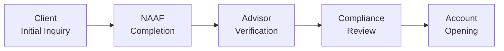

## 5.2 The New Account Application Form (NAAF)

Establishing a strong, mutually beneficial relationship with your clients often hinges on one deceptively simple document: the New Account Application Form (NAAF). It might seem like just another piece of paperwork, but trust me, the NAAF is really where the “rubber meets the road.” A properly completed and regularly updated NAAF is not only a regulatory requirement under the Canadian Investment Regulatory Organization (CIRO)—Canada’s national self-regulatory body—but also a practical tool that helps ensure you’re always acting in the best interests of your clients.

If you think back to our discussion in section 5.1 (Opening Accounts), you'll recall that this stage is a critical moment for building trust. Well, the NAAF is the cornerstone of that process. It captures personal identification details, sketches out risk tolerance, clarifies investment objectives, and, overall, sets the tone for the entire client-advisor relationship. Without it, you’re like a pilot without a flight plan: you might get off the ground, but you’ll risk missing your destination—or landing somewhere you never intended.

Below, we’ll explore best practices, common pitfalls, and everything else you need to know about the NAAF. We’ll also look at how the NAAF ties back to other aspects of your daily business—like suitability assessments, ongoing compliance with CIRO regulations, and the essential process of “knowing your client” (KYC).

---

### Why the NAAF Is So Important

Have you ever tried to help a friend buy a new car and realized you really needed all sorts of details—like their budget, the kind of driving they do, and any specific features they want—to make a truly good recommendation? The NAAF is basically that scenario, but for investing.

The NAAF:

• Collects key client information to comply with CIRO’s KYC rules.  
• Serves as the official starting point for any account-related activities.  
• Documents your client’s financial situation, risk tolerance, and investment objectives.  
• Establishes clear terms and conditions for account operations such as fees, trading authorizations, and privacy disclosures.  
• Acts as a protective measure for both you and your client during dispute resolution, or if an audit or regulatory review takes place.

By thoroughly populating and regularly updating the NAAF, you ensure that your recommendations remain in line with your client’s evolving financial picture. So yes—while it may feel like extra paperwork sometimes, it’s really your best friend for staying on solid ground.

---

### Core Elements of the NAAF

Though the form may vary from one firm to another, the NAAF typically covers a few universal pieces of information. These elements not only help with client discovery (which we discussed in section 5.1) but also guide your suitability obligations when recommending specific products or strategies.

#### Personal Identification Details

Let’s start with the basics: the client’s name, date of birth, address, contact information, and any government-issued identification. You might think, “Well, obviously,” but it’s surprising how often incomplete or inaccurate data shows up in the identification box (maybe the client just moved, or changed their name).

Accurate identification is also key to meeting anti-money laundering (AML) and anti-terrorist financing requirements (see Chapter 3.5 for more on how the Canadian regulatory framework addresses money laundering). It’s not just about regulatory checkboxes—knowing exactly who you’re dealing with fosters trust and credibility.

#### Financial Circumstances

If you’re like me, you’ve probably had situations in the past where a buddy says, “I’ve got money to invest,” but they’re not entirely sure how much they’re comfortable locking up or risking. The NAAF helps avoid that confusion with a structured approach to capturing financial data: annual income, net worth (liquid and fixed), liabilities, and existing investments elsewhere.

This section might also detail the source of the client’s funds to ensure they comply with AML requirements. Most importantly, it gives you a snapshot of the client’s current finances. Because, honestly, how can you provide meaningful investment advice without understanding the client’s capacity to handle market fluctuations or short-term liquidity constraints?

#### Investment Objectives

“Do you want growth, income, or are you looking to preserve capital?” That’s a question we all need to ask. The NAAF typically includes checkboxes or short-answer fields listing common investment objectives, such as:

• Capital preservation  
• Income generation  
• Long-term growth  
• Speculative growth  

At first, I actually found it a bit weird to see how some clients might practically check all the boxes because they think they want everything all at once. But clarifying a primary objective helps you zero in on suitable products. If preserving capital is their main priority, for instance, putting them into a highly speculative penny stock is going to raise eyebrows—both yours and the regulator’s.  

#### Risk Tolerance

I remember once speaking with a client, and he confidently stated, “I’m fine with risk.” But it turned out his definition of “fine” was “I’m not losing a single penny of my principal!” So it’s vital to be crystal clear about what “risk” truly means to each client.

Risk tolerance is a combination of the client’s willingness and ability to take on risk. The NAAF’s risk tolerance section might offer categories such as “low,” “medium,” “high,” or more nuanced descriptors like “low-to-moderate” or “moderate-to-high.” This classification is a key piece of the puzzle when deciding on asset mixes and specific securities (refer to 6.1, Suitability of Investments and Investment Strategies, for further guidance).

#### Investment Knowledge and Experience

Someone who’s brand new to investing might need extra guidance. Someone with 30 years of professional trading under their belt might need a different kind of assistance—like advanced product due diligence or a deeper analysis of options strategies.

The NAAF offers a place to capture the client’s level of knowledge: “none,” “limited,” “good,” or “extensive.” It’s not just an empty classification—it shapes how you communicate recommendations and the type of disclosures or disclaimers the client might need.

#### Terms, Conditions, and Client Consent

The NAAF includes language asking clients to acknowledge:

• Fee structures and commissions (for example, trading commissions, ongoing advisory fees, and so on).  
• Privacy policies, especially how their data might be used or shared.  
• Permissions for third-party trading authorizations.  
• Client statements and trade confirmation delivery preferences.  

Ensuring clients read and sign these provisions helps set clear expectations. And from a compliance standpoint, it’s evidence of consent. If a dispute ever arises—like a client claiming ignorance about fees—this section in the NAAF can come to your rescue.

---

### The NAAF in a Suitability Context

In Chapter 6, we delve deeper into product due diligence and making suitable recommendations. But the root of any suitability assessment is the data you gather in the NAAF. After all, it’s designed to capture key variables like net worth, objectives, and risk tolerance that collectively determine if an investment strategy is appropriate.

Under CIRO rules—historically enforced by predecessor organizations IIROC and the MFDA—firms are required to maintain an up-to-date record of this client information. In other words, the NAAF is not a one-and-done document. It’s not something you drop off in a file cabinet, never to see again. Bringing the NAAF front and center every time you review or adjust investment strategies helps you comply with the “Know Your Client” (KYC) and “suitability” obligations.

---

### How to Complete the NAAF Efficiently and Accurately

You might be thinking, “All right, I understand the importance, but how do I make sure I do this right?” Let’s walk through the process step by step.

#### Step 1: Clarify the Purpose with the Client

Sometimes, clients see the form and immediately worry about identity theft or wonder why you need so much detail. Take a moment up front to reassure them: “This is for your benefit, so I can serve you better.” Emphasize that collecting thorough information is not just a regulatory requirement but also a way to tailor recommendations to their personal goals.

#### Step 2: Gather the Core Documents

Refer back to Chapter 4.4 (Dealing with Clients) for best practices on collecting info. Typically, you’ll want:

• Government-issued ID (passport, driver’s license)  
• Proof of address (utilities bill, official letter)  
• Banking information or statement for verifying financial resources  

Make sure you comply with your firm’s internal policies, which might be even stricter than the minimum regulatory guidelines.

#### Step 3: Conduct a Preliminary Interview

Before the client fills anything out, consider a quick chat—whether in person or on a secure video call—to talk through any big concerns or questions about their financial situation. If you skip this step, you might end up with an incorrectly completed form and an uneasy client who doesn’t fully get what’s going on.

#### Step 4: Provide the NAAF and Offer Guidance

Now it’s time for the client to actually fill it out. If the client struggles with any items, walk them through it. Just yesterday, I had a client who wasn’t quite sure about his net worth because he had an inheritance, a mortgage, and some small business assets. We took a moment to parse out the details, ensuring we’d captured them correctly.

#### Step 5: Verify and Review

Clients sometimes guess or approximate, especially when it comes to their monthly expenses or net worth. If their stated net worth seems suspiciously high or low, ask polite follow-ups. This is also an ideal moment to reaffirm the importance of honesty—reminding them that inaccurate data can lead to unsuitable advice.

#### Step 6: Secure the Necessary Signatures

Typically, both the client and the advisor sign the NAAF, acknowledging that everything is true to the best of their knowledge. In some situations—like corporate accounts—you may need signatures from multiple authorized individuals. Once it’s signed, you officially have a baseline for your advisor-client relationship.

#### Step 7: Store It Safely and Update as Needed

Store the completed form per your firm’s policy, ensuring you meet privacy and cybersecurity standards covered in Chapter 4.5. As life changes, remind the client to get in touch. Maybe they’ve changed jobs or inherited a large sum from a family member. That’s your cue for an NAAF update.

---

### Visualizing the Workflow

Here’s a simplified diagram to illustrate the typical progression of a NAAF from initial client inquiry to final account opening:

• A: The client meets you, expressing an interest in opening an account.  
• B: Together, you fill out the NAAF, focusing on personal details, objectives, and risk considerations.  
• C: You verify the validity of the information.  
• D: Sometimes a compliance or branch manager reviews the form to ensure it meets regulatory standards.  
• E: The account is officially opened once everything checks out.

---

### Ensuring Accuracy and Compliance

Under CIRO rules, any false statement or omission in the NAAF can come back to haunt you (and potentially destroy that hard-earned trust with your client). So the name of the game is double-checking and creating a transparent environment.

Here’s where referencing other chapters can help:  
• Chapter 2.2 (The Relationships Between Values, Ethics, and the Law) reminds us that ethical responsibility and legal compliance often go hand in hand.  
• Chapter 1.3 (Rules of Thumb to Guide the Conduct of Registered Representatives) underscores the importance of honesty and thoroughness.  

When in doubt, ask and verify. As the old saying goes, “Trust, but verify.”

---

### Common Pitfalls and How to Avoid Them

Pitfall: Skipping the Client’s Real Objective  
• Some clients might mark “long-term growth” but consistently demand short-term trades. Be agile, clarify their true objectives, and update the form if necessary.  

Pitfall: Overlooking Inconsistent Data  
• If the client claims a high net worth but only modest income, politely inquire about current assets, inheritances, or family wealth.  

Pitfall: Forgetting to Update the Form  
• People’s lives change. Neglecting to update the NAAF could result in outdated references when you’re making recommendations.  

Pitfall: Not Explaining Risk Tolerance Properly  
• One of the most common compliance issues arises from a mismatch between a client’s actual risk appetite and the risk classification on paper.  

Pitfall: Signing on Behalf of the Client  
• Don’t do it. Enough said.  

By being proactive, you can steer clear of these speed bumps. And if something doesn’t feel right, consult your branch manager or compliance officer. Everyone benefits from a well-documented, transparent process.

---

### Real-World Insights: A Cautionary Tale

I once encountered a scenario where an advisor was so excited to finalize a client’s account opening that she breezed through the NAAF. She assumed the client’s salary was consistent with the previous year and neglected to verify the new job details. Six months later, when the client lost money on moderate-risk investments, they claimed the advisor pushed them into riskier recommendations than they could handle financially. During the ensuing review, the out-of-date NAAF became a critical issue. Having inaccurate data on file cost the advisor a lot of time and reputational risk.  

The moral? Take that extra time to confirm every line. If something’s even a little off, double-check. You’re doing your future self—and your client—a huge favor.

---

### Updating the NAAF: An Ongoing Obligation

Remember: your role doesn’t end once the account is opened. As we highlighted in section 5.1 (Opening Accounts) and will revisit in section 5.3 (Completing the New Account Application Form) and 5.5 (Client Records), the NAAF is a living document. Major life events like marriage, divorce, birth of a child, retirement, or sudden windfalls can all trigger the need to revisit the form.  

CIRO guidelines and the Canadian Securities Administrators (CSA) client-focused reforms also emphasize this approach. Whether it’s an annual or semiannual review, or triggered by a major change, keep your NAAF fresh to maintain accurate suitability assessments.

---

### Privacy and Confidentiality

Clients may wonder who sees their NAAF. As detailed in Chapter 4.5 (Privacy and Cybersecurity), the firm must handle this data with the utmost care. Access is generally restricted to those who need it—like compliance officers, your manager, or certain regulators if an audit arises.

Make sure your clients understand why they’re handing over so many personal details, how you’re protecting that data, and under what circumstances it might be shared. You’d be amazed at how much peace of mind that provides.  

---

### Glossary Highlights

• **NAAF (New Account Application Form)**: A mandatory document used by investment dealers to collect essential client information and lay the groundwork for the advisor-client relationship.  
• **Suitability Assessment**: A regulatory requirement to ensure that investment recommendations align with the client’s financial situation, objectives, and risk tolerance.  
• **Risk Tolerance**: The level of market fluctuation (and potential for loss) an investor can handle financially and psychologically.  

---

### Additional Resources

• [CIRO Guidance on NAAF Completion](https://www.ciro.ca/guidance)  
• [Canadian Securities Administrators (CSA) – Client Focused Reforms](https://www.securities-administrators.ca/client-focused-reforms/)  
• Online Course: “Know Your Client (KYC) and Suitability Obligations,” Canadian Securities Institute (CSI)  

---

### Final Thoughts

The NAAF is not just another form—it’s the gateway to a transparent, effective, and legally sound relationship with your client. Yes, it takes time and effort, but the clarity and protection it provides can save you from countless headaches down the road. If you approach the NAAF thoughtfully, verifying details and explaining each section to your client, you’re setting the stage for a partnership rooted in integrity, trust, and mutual benefit.

Sure, sometimes it can feel like an administrative chore. But with the right mindset, it becomes the compass guiding your client’s financial journey. Keep it up to date, treat it with respect, and you’ll find it opens doors to deeper client relationships and a more fulfilling practice overall.

---

## Boost Your Knowledge of the New Account Application Form (NAAF)



### Which of the following is the primary purpose of the New Account Application Form (NAAF)?

- [ ] To comply only with anti-money laundering regulations.
- [x] To gather essential client information, establish account terms, and maintain suitability.
- [ ] To allow the client to trade anonymously.
- [ ] To fulfill third-party account opening requests without client approval.

> **Explanation:** The NAAF is primarily designed to collect critical personal and financial details and set the parameters for the advisor-client relationship, supporting both compliance and suitability efforts.

### Which of the following client details is typically NOT found in a standard NAAF?

- [ ] Date of birth  
- [x] Detailed budget for daily household expenses  
- [ ] Risk tolerance  
- [ ] Employment information  

> **Explanation:** While the NAAF often captures high-level or approximate financial information, it usually doesn’t request granular household budget data. Other listed details—like DOB, risk tolerance, and employment—are commonly required.

### Why is it crucial to keep the NAAF up to date?

- [x] Because changes in the client’s personal or financial circumstances can affect suitability.  
- [ ] So that the advisor can track the client’s grocery shopping habits.  
- [ ] Because it’s only a one-time task required by CIRO.  
- [ ] To periodically measure the client’s handwriting consistency.  

> **Explanation:** Regulatory obligations require an updated NAAF to accurately reflect a client’s current situation, ensuring the advisor’s recommendations remain suitable over time.

### What role does risk tolerance play in the NAAF?

- [ ] It is only used to determine if a client qualifies for margin trading.  
- [ ] It’s merely a guess at how markets might perform.  
- [ ] It has no impact on compliance with CIRO regulations.  
- [x] It helps determine the type of investments suitable for the client’s comfort level and financial capacity.  

> **Explanation:** Risk tolerance is a key factor in tailoring investment strategies that align with each client’s preferences and constraints, an essential part of suitability.

### A client with high net worth but minimal income wants to declare themselves as “low risk.” How should you proceed?

- [x] Discuss the mismatch between net worth and risk preference, clarify their tolerance, and update the NAAF accordingly.  
- [ ] Force them into a high-risk category, given their net worth.  
- [x] Document your discussion and ensure the client’s official risk category matches their actual willingness and ability to bear risk.  
- [ ] Ignore the discrepancy and finalize the NAAF anyway.  

> **Explanation:** It’s vital to reconcile any inconsistencies between net worth, risk capacity, and stated risk tolerance, making sure everything is properly documented.

### Which of the following summarizes an advisor’s next step if a client’s data on the NAAF appears incomplete or contradictory?

- [x] Politely ask for clarification and additional documentation.  
- [ ] Falsify the details to match typical client info.  
- [ ] Sign the form on behalf of the client to “save time.”  
- [ ] Submit the form as-is and wait for compliance to question it.  

> **Explanation:** Advising in good faith and meeting regulatory requirements means verifying unusual or incomplete details to maintain the integrity of the NAAF.

### Which statement best describes the relationship between the NAAF and ongoing suitability?

- [x] The NAAF establishes the baseline client profile, crucial for every future review.  
- [ ] The NAAF is not utilized after the account is initially opened.  
- [x] Material changes to a client’s situation can prompt an NAAF update.  
- [ ] Suitability evaluations happen completely independently of the NAAF.  

> **Explanation:** Suitability is a continuous process. The NAAF serves as a living, foundational document that informs each subsequent recommendation.

### In terms of compliance, why is a completed NAAF essential during audit or disciplinary reviews?

- [x] It shows how the advisor formed initial and ongoing recommendations.  
- [ ] It’s only required so the firm can produce more paperwork.  
- [ ] Audits never refer to NAAF data at all.  
- [ ] The NAAF is irrelevant once the account is opened.  

> **Explanation:** Regulators and auditors review the NAAF to ensure the advisor had a proper, documented foundation for their advice and that they maintained up-to-date client information.

### What is a common pitfall in filling out the NAAF?

- [x] Omitting relevant client details or failing to clarify inconsistent info.  
- [ ] Collecting all the necessary identification.  
- [ ] Asking questions about a client’s investment knowledge.  
- [ ] Explaining fee structures in detail.  

> **Explanation:** Advisors often run into trouble when they fail to dive deeper into inconsistencies or omit essential data—leading to incomplete or inaccurate client profiles.

### True or False: The NAAF can be used to verify a client’s identity for anti-money laundering purposes.

- [x] True
- [ ] False

> **Explanation:** Client identification and verification are part of the broader AML requirements. The NAAF includes sections for capturing relevant ID data, which assists in meeting regulatory obligations.


