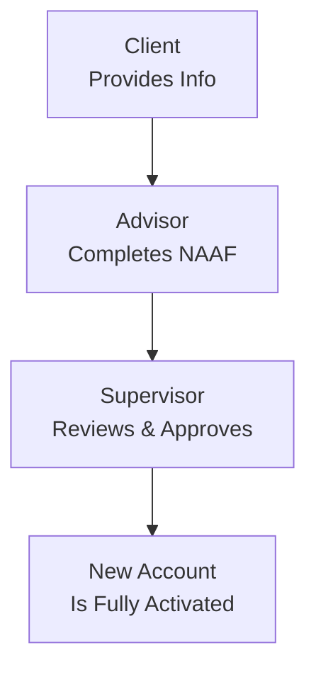

## 5.3 Completing the New Account Application Form

Preparing a well-documented and accurate New Account Application Form (NAAF) is one of the most essential steps when working with new clients. If you have ever felt that slight wave of anxiety when you’re handed a thick form asking for personal data, financial objectives, and risk assessments, trust me—everyone’s been there. Filling out the NAAF might seem like a mountain climb at first, but it’s truly the cornerstone of good relationship management, not to mention an absolute regulatory requirement. In this section, we explore how to complete the NAAF accurately and effectively, with a special focus on verifying identity, clarifying investment objectives, determining risk tolerance, and documenting important details. We also look at the supervisory review process to ensure compliance with Canada’s current self-regulatory framework under the Canadian Investment Regulatory Organization (CIRO).

Bringing my own experiences into this, I recall meeting one of my first clients who walked into our branch with nothing but a smartphone for identification. The conversation quickly turned into a friendly chat about government-issued IDs, financial documents, and, yes, the beloved NAAF. For her, it was a bit of a hassle. But for me, it was the first realization that the NAAF is more than just a form—it’s a guidebook to understanding who a client is, what they want to achieve, and how I, as an advisor, can responsibly help them get there.

Filling out this form involves multiple parties: the client, the advisor, and the supervisory staff who verify and approve its accuracy. Because each section of the document carries significant regulatory implications, it’s super important to be precise, consistent, and thorough. So, let’s break down the key elements you’ll need to address.

Understanding the Role of the NAAF in Client Discovery  
The New Account Application Form is designed to capture all the critical personal and financial details of a new client. It helps:

• Paint a complete picture of who the client is, including background information and financial circumstances.  
• Document clear investment objectives and risk tolerance.  
• Establish anti-money laundering (AML) and anti-terrorist financing (ATF) compliance, which satisfies both CIRO and FINTRAC requirements.  
• Lay the groundwork for an ongoing advisory relationship, ensuring all parties understand the client’s goals and constraints.

In short, it’s the handshake that seals your introduction to a new client. Let’s shine a light on how to complete this form in a way that helps both the client and the advisor stay on track.

Effective Client Identity Verification  
One of the first steps in the NAAF is verifying the client’s identity. This is not only a best practice but also a regulatory must-have. Under current regulations, including those set by FINTRAC (the Financial Transactions and Reports Analysis Centre of Canada), advisors must confirm a client’s identity using valid government-issued documentation. Examples can include a passport, driver’s license, or citizenship card, depending on the situation.

Why does this matter so much? Primarily because of the Canadian government’s AML and ATF regulations, which require securities firms to know who they’re dealing with. If you’re unsure about the finer points, FINTRAC has published extensive guidance materials, which you can find at https://www.fintrac-canafe.gc.ca/guidance-directives/client-eng. These cover everything from acceptable ID documents to record-keeping best practices.

During the identity verification process, the advisor should:  
• Collect the original ID (where feasible) or an acceptable digital version.  
• Note the details (ID type, number, expiry date, issuing authority) on the form.  
• Keep a clear record confirming the ID was verified according to firm procedures.

It’s often helpful to keep a short, documented checklist. You can store it electronically or keep a paper copy. The goal is simple: watch for any potential red flags and record everything consistently. Never rely on memory or scribbled notes on the side of your desk. Regulators require easy-to-follow documentation that can be audited later if necessary.

Gathering Key Personal and Financial Information  
Next, the NAAF dives into personal and financial details:

• Full Legal Name, Contact Details, and Permanent Address  
• Social Insurance Number (SIN) for income reporting and tax purposes  
• Employment Status, Nature of Business, and Source of Funds  
• Estimated Annual Income, Net Worth, and Liquid Assets

These details provide a snapshot of the client’s financial situation, which is hugely important when making recommendations. For example, if you discover in conversation that your client has large ongoing medical expenses or significant family obligations, document that. It might affect their investment horizon, liquidity needs, or appetite for risk.

Be thorough and honest. You know, it can feel a bit like you’re prying into someone’s life, but that thoroughness is precisely what shapes suitable guidance. If the client is hesitant to provide details, gently explain that it’s not about being nosey. Rather, it’s about ensuring compliance with regulations and building a robust, well-informed account profile. Failing to gather this info can lead to inaccurate or unsuitable investment advice, which can come back to haunt you and the firm.

Explaining and Establishing Investment Objectives  
If I had to pick the section that clients find most confusing, it would be this one. Investment objectives sound straightforward, but they can involve multiple layers—growth, income, capital preservation, speculation, and a mix of these. The NAAF usually divides objectives into categories that clients select based on their primary financial goals.

Common categories include:  
• Short-Term Income or Liquidity Needs  
• Moderate Growth  
• Conservative or Defensive Growth  
• Aggressive Growth and Speculation

Talk the client through each category. Use real-world examples, like, “If you’re saving for a down payment on a house in the next two years, you might lean towards safer, liquid investments.” Or, “If you’ve got a 20-year horizon and a high risk tolerance, maybe growth and a bit of speculation might make sense.” Encourage them to be realistic about potential returns and the risks. Document what they say, note any reservations or nuances, and make sure the final decision in this section genuinely reflects their intentions.

Determining Risk Tolerance  
Right alongside investment objectives is the question of risk tolerance. This basically asks: How much volatility can the client handle without panicking, losing sleep, or making rash decisions? Is the client comfortable with the potential of a drop in portfolio value, or do they want to safeguard capital as much as possible?

Some client questions you can ask to assess risk tolerance:  
• How do you react if your investment drops by 10% in a month?  
• Is your primary goal steady income, or are you aiming for high returns?  
• Could you tolerate fluctuations of 20% or more if it potentially means higher gains?

The NAAF typically includes a section that translates these answers into categories like “low,” “medium,” or “high” risk tolerance. This classification must be accurate because regulators expect you to recommend financial products aligned with the client’s stated risk profile. If there’s a mismatch—like the client picks “conservative,” yet later invests in high-volatility emerging market options—it raises red flags. So remember to confirm, confirm, and confirm once again. You might even ask them: “Is that your final answer?” in a casual, friendly manner, just to be sure they truly understand the implications.

Documenting Special Instructions  
Clients sometimes have unique circumstances or personal preferences that don’t neatly fit pre-printed boxes on the form. Maybe they’re ethically opposed to investing in certain industries, or maybe they have specific instructions about estate planning. These details can be crucial for designing a portfolio that respects their values and meets their objectives. The best practice: always log it.

If a client provides special instructions verbally—perhaps in a phone call or quick hallway chat—try to confirm it in writing via email or a note in the client file. Then record these instructions in the dedicated “Notes” or “Special Instructions” section of the NAAF. This approach not only ensures clarity but also helps you address future misunderstandings. If your firm has a digital submission portal, scan or upload the relevant documentation for a clear, central record.

Supervisory Review and Compliance Checks  
Once the NAAF is completed, it isn’t quite time to pop the champagne yet. Each new account typically goes through a supervisory review by designated compliance or managerial personnel. This step ensures the following:

• All essential personal, financial, and identity verification info is accurate and consistent.  
• The stated investment objectives and risk tolerance align (e.g., it’s unlikely you have an 80-year-old retiree with “speculative” risk tolerance, though not impossible).  
• The form meets all CIRO standards and that anti-money laundering measures have been followed according to FINTRAC guidelines.

If your firm handles multiple lines of business—like mutual funds, equities, options, or futures—each type of account might require a separate review to confirm that the documentation supports the products or strategies you’ll be using. The supervisory personnel will either approve the document or send it back with instructions for clarification. The objective is to minimize errors and ensure the client is suitably profiled for the services provided.

Mermaid Diagram: NAAF Submission Flow  
Below is a simple flowchart illustrating the journey of an NAAF from completion to final approval.

Explanation:  
• The process starts with the client giving the advisor necessary details and official identification.  
• The advisor uses that info to complete the NAAF.  
• A designated supervisor or compliance team reviews, verifying that everything is accurate and aligns with regulatory standards.  
• Once approved, the account can be activated for trading or investing.

Case Study: The Importance of Accuracy  
Imagine you’re advising a client named Neil who’s a 45-year-old software engineer with a pretty high annual income. Over coffee, Neil explains that he’s got a large mortgage, plans to head into partial retirement within 10 years, and is particularly concerned about the rapid changes in the tech sector. Despite these concerns, Neil says he’d like to “swing for the fences” with speculative, high-volatility investments.

If you glance at Neil’s situation, you notice that while he has a high income, he also faces substantial cash-flow commitments. A big portion of his net worth is tied up in real estate, and he might need to balance saving for retirement with paying down that mortgage. How do you reflect that in the NAAF? By labeling his risk tolerance as “high” because he said so, or “moderate to high” because you see some conflicting factors? The key is to have a real conversation with Neil and document the final conclusion carefully. If you conclude that “high risk” is appropriate, note in the remarks that you discussed how a big downturn could affect his mortgage situation, and that Neil fully understands the potential volatility. Then sign off, ensuring it’s crystal clear to any reviewer reading the file.

Common Pitfalls to Avoid  
• Incomplete Identity Verification: Missing a step or forgetting to log the outcome is a big no-no. Inspectors want to see specific references to dates, ID types, etc.  
• Vague Risk Tolerance Assessment: Writing something like “client is okay with some risk” is too general. Use structured categories. Provide context or examples when needed.  
• Incorrect or Outdated Client Information: If the client’s circumstances change, such as a new job, marriage, or unexpected windfall, update the NAAF or relevant KYC forms in a timely manner.  
• Lack of Documentation for Exceptions: If the firm made a special exception or if the client refused to disclose certain financial details, highlight that clearly and note any disclaimers.  
• Failure to Cross-Check with Other Forms: The data on the NAAF should align with, for instance, margin applications, options agreements, or other disclosures.

Referencing Investor Protection  
One point that often comes up during these discussions is investor protection. Clients ask, “How am I protected if something happens to the firm?” In Canada, the Canadian Investor Protection Fund (CIPF) offers coverage if a CIRO member firm (i.e., an investment dealer) becomes insolvent. Starting January 1, 2023, CIPF became Canada’s sole investor protection fund after merging with the former MFDA IPC. While this coverage doesn’t protect against losses from market fluctuations, it does protect client assets if the dealer fails. If the client is unfamiliar with CIPF, you can guide them to https://www.cipf.ca for more information or mention that CIPF remains independent from CIRO.

Continuous Updates and Relationship Building  
A completed, approved NAAF isn’t set in stone forever. Attitudes, life circumstances, and market conditions evolve over time. We all know life can throw surprises: job changes, inheritances, new children, health obstacles, or even global events that shift someone’s economic outlook. It’s essential to revisit the form periodically—often triggered by a significant change in the client’s personal or financial status—and update it. Having a well-documented trail of updates can save you headaches if a client later questions why certain investments were made.

Think of the NAAF as a living, breathing document. By revisiting it, you maintain a strong relationship with the client, ensure ongoing suitability, and reinforce shared trust. This cyclical process of surveying the client’s goals, verifying identity as needed, and aligning investment strategies is fundamental to the Canadian securities industry’s best practices.

Closing Thoughts  
Ultimately, when you help a client complete the NAAF thoroughly, you’re laying a foundation of trust, clarity, and regulatory compliance. Thoroughness in identity verification, along with accurate disclosure of financial details, investment objectives, and risk tolerance, arms you with the ethical, transparent approach that’s central to professional practices. In fact, your careful attention to detail here is what transforms a routine form into a personalized roadmap for achieving the client’s financial goals. So, do the job right the first time, save yourself from future hassles, and keep the lines of communication open—a lesson I learned the hard way with that first smartphone-carrying client who taught me just how important it is to dot every “i” and cross every “t.”

Because no matter how advanced our digital systems become, the personal touch still matters. Plus, regulators have a knack for discovering incomplete or inconsistent information. So, keep your notes clear, keep your client in the loop, and build a relationship that stands the test of time.

Additional Resources  
• FINTRAC Client Identification Requirements: https://www.fintrac-canafe.gc.ca/guidance-directives/client-eng  
• Compliance and Regulation in the Canadian Securities Industry, by Canadian Securities Institute (CSI)  
• Canadian Investment Regulatory Organization (CIRO): https://www.ciro.ca  
• Canadian Investor Protection Fund (CIPF): https://www.cipf.ca  

  
## Test Your Knowledge: New Account Application Form Quiz



### Which regulatory body requires rigorous identity verification and record-keeping to combat money laundering and terrorist financing?

- [ ] CIPF  
- [ ] CIPF's predecessor, MFDA IPC  
- [x] FINTRAC  
- [ ] CIPF & CIRO jointly  

> **Explanation:** FINTRAC enforces Canada’s AML and ATF requirements, which mandate thorough identity verification and ongoing record-keeping.

### What is one major purpose of completing a thorough New Account Application Form?

- [ ] To offer margin and options trading to every client immediately  
- [x] To collect vital personal and financial information that ensures suitable recommendations  
- [ ] Merely to satisfy a one-time bureaucratic requirement  
- [ ] To bypass thorough identity checks  

> **Explanation:** The NAAF is crucial for documenting accurate personal and financial data so that advisors make suitable recommendations for each client.

### Which section of the form usually deals with understanding how much volatility a client can handle?

- [x] Risk tolerance  
- [ ] Special instructions  
- [ ] Identity verification  
- [ ] Client net worth  

> **Explanation:** Risk tolerance identifies how comfortable a client is with ups and downs in their portfolio and sets the tone for suitable investment choices.

### After completing the NAAF, who typically reviews it for accuracy and compliance?

- [ ] Another random client  
- [ ] The client’s family members  
- [x] Designated supervisory or compliance personnel  
- [ ] A third-party auditing firm  

> **Explanation:** A supervisor or compliance team reviews new account documentation to ensure it adheres to internal policies and regulatory standards.

### Which of the following could be flagged during the supervisory review of a NAAF?

- [x] Inaccurate income details  
- [ ] Perfectly aligned risk tolerance and objectives  
- [x] Missing identity verification documents  
- [ ] Client instructions that are clearly documented  

> **Explanation:** Supervisors look for inconsistencies, missing data, or unusual conflicts that need to be addressed or clarified.

### What best describes the Canadian Investor Protection Fund (CIPF)?

- [x] An investor protection fund that covers a client’s assets if a CIRO member firm goes insolvent  
- [ ] Insurance covering losses from market volatility  
- [ ] A regulatory authority overseeing advisors  
- [ ] A short-term lending program for unsuccessful trades  

> **Explanation:** CIPF protects client assets in case of a dealer’s insolvency, but does not cover market losses.

### What might happen if a client selects “High Risk” on the NAAF but has already stated they have extremely low tolerance for market volatility?

- [x] The advisor must carefully clarify the discrepancy and document changes or reasons  
- [ ] No action needed if the client checked the box  
- [x] The supervisory review might question the accuracy of the risk tolerance classification  
- [ ] The client’s selection overrides any further consideration  

> **Explanation:** Advisors must resolve inconsistencies. A “High Risk” label should accurately reflect the client’s true market behavior and comfort level.

### Why is it important to document special instructions or client conversations in writing?

- [x] To create a clear audit trail and avoid future misunderstandings  
- [ ] Because it’s required only if the client invests more than $1 million  
- [ ] To avoid updating the client’s contact details  
- [ ] It’s not necessary if instructions are given verbally  

> **Explanation:** Recording all instructions in writing ensures clarity, reduces conflicts, and meets regulatory expectations.

### Which of the following best reflects “continuous updates” of the NAAF?

- [x] Updating the form whenever major life or financial changes occur  
- [ ] Filling out a brand-new form every week  
- [ ] Automatically raising the client’s risk tolerance each year  
- [ ] Keeping the old version of the NAAF after new changes  

> **Explanation:** As clients’ circumstances change, the form should be updated to remain accurate and to ensure ongoing suitability.

### True or False: The NAAF remains an unchanging document throughout the client-advisor relationship.

- [x] True  
- [ ] False  

> **Explanation:** Although some advisors refer to the NAAF as static, it actually needs to be revisited and updated as circumstances evolve. (Note: Some might argue “False,” given we do update it. But within many firms, the original NAAF remains archived and any changes are documented in updates layered on top of the original. The concept is that the official form itself often remains a reference point in compliance reviews, but the essence is that it should be “updated” or re-documented.)


