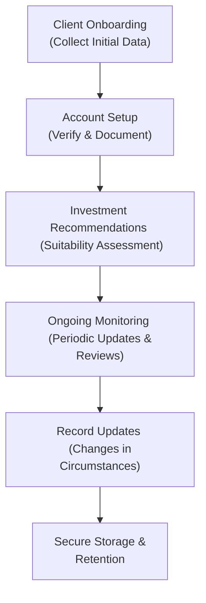
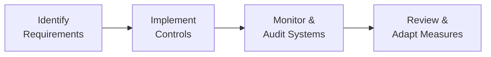

## 5.5 Client Records

Maintaining accurate, complete, and secure client records might sound like a tedious administrative task, right? But let me tell you, it’s actually at the heart of solid client relationships and regulatory compliance. Not only do strong record-keeping practices ensure you meet the requirements of the Canadian Investment Regulatory Organization (CIRO) and provincial securities laws, but they also help you provide better, more personalized service to your clients.

I still remember the first time I had to sort through a mountain of client documents when a fellow advisor asked me for help. Honestly, I felt a bit overwhelmed, but that experience taught me just how important well-organized records can be. Let’s explore what effective record-keeping looks like, from the items you need to retain, to how you store them securely, to why it all matters for your professional reputation and your clients’ well-being. 

### The Importance of Client Records

So, why are client records important in the first place? Think of them as the backbone of your practice. They provide a paper (or digital) trail of every significant interaction and transaction with your clients. This includes:

• Initial account documentation (like the New Account Application Form, discussed in Chapter 5.2).  
• Ongoing communications via email, letters, phone call notes, or in-person meeting summaries.  
• Transaction histories demonstrating what trades or changes occurred in each client’s account.  
• Suitability assessments detailing how each investment recommendation aligns with the client’s risk tolerance and objectives.  
• Mandatory disclosures, confirmations, and statements required by regulation.  

When your records are in tip-top shape, you can quickly respond to client inquiries, regulatory audits, or internal compliance checks. And if a compliance question crops up—maybe a client complains about a trade—having impeccable records could be the difference between a quick resolution and a messy, drawn-out investigation.

### Essential Components of Client Records

If you want a quick mental checklist, here’s a straightforward approach:

1. Personal and Demographic Information – Basic information like legal name, address, contact details, Social Insurance Number (SIN), and employment details.  
2. Financial Background – Summaries of net worth, income, and other financial details that feed into the Know-Your-Client (KYC) process.  
3. Risk Tolerance and Investment Objectives – A record of each client’s goals, timeline, and risk preference. This normally ties back to the discussion in [Chapter 6: Product Due Diligence, Recommendations, and Advice] when making suitability assessments.  
4. Transaction and Account History – Records of all trades, deposits, withdrawals, transfers, and corporate actions.  
5. Communication Logs – Every time you chat, email, or message with a client about essential account details, put it on record.  

It might seem like a big list, but each item is crucial to demonstrate that you’re acting in the client’s best interests and are meeting your regulatory obligations.  

### Regulatory Requirements and CIRO Rule 3800

Under CIRO Rule 3800, you are responsible for ensuring that all required client information is collected, up to date, and maintained securely. If you recall from our discussion on regulatory frameworks in [Chapter 3], the new self-regulatory organization, CIRO, took the place of the defunct MFDA and IIROC. Although the name has changed, the need for stringent record-keeping remains a core regulatory focus.

Key points from CIRO Rule 3800:  
• You must keep detailed records of each transaction, including time, price, and any relevant notes on how the recommendation aligns with client objectives.  
• Records must be current and reflect changes in investment objectives, risk tolerance, personal circumstances, or regulatory status.  
• Records should be accessible in a timely manner, particularly if requested by a regulator or in the event of an internal or external audit.  

### Maintaining Accuracy and Completeness

What happens if you accidentally miss updating a client’s risk profile after they get a big promotion or inheritance? Or if you forget to document certain phone calls because you assume the details are “not that important?” Let’s be honest: it’s easy to get overwhelmed by busy schedules and the demands of day-to-day client interactions. 

But incomplete records can compromise your regulatory compliance, create confusion or misinformation, and ultimately erode client trust. My advice is to build good habits—like updating records immediately after each interaction—so you never let these tasks slip through the cracks.

Below is a simple workflow diagram showing how a client record might evolve over time.

In this flow:  
• “Client Onboarding” is where you gather all initial personal information.  
• “Account Setup” covers verifying the data and setting up the account in your firm’s systems.  
• “Investment Recommendations” revolve around capturing your process in line with the client’s needs, referencing their KYC info.  
• “Ongoing Monitoring” is about periodically reviewing conversations and suitability.  
• “Record Updates” ensures you catch changes like a new job, marital status, or personal goals.  
• “Secure Storage & Retention” is the final step to ensure you store data in compliance with privacy and cybersecurity guidelines.  

### Updating Client Records for Suitability

We can’t talk about client records without reiterating how they tie into suitability. Suitability is discussed at length in [Chapter 6.1], but in short, any investment recommendation must align with the client’s financial situation, objectives, and risk tolerance. Whenever relevant client data changes, it’s vital to:

• Update risk tolerance and goals in your system.  
• Revisit investment strategy to ensure it still aligns with the updated client profile.  
• Document these updates in a detailed manner, clearly stating why you believe the revised recommendation is in the client’s best interest.  

### Storage and Security: Protecting Client Records

Let’s face it: cybersecurity is no joke. Whether you store documents in a filing cabinet or in the cloud, your systems must be secure against unauthorized access, hacks, and data loss. In [Chapter 4.5 Privacy and Cybersecurity], we explored the privacy side of things, emphasizing best practices like encryption, firewalls, and robust internal controls. You might want to revisit that section if you’re unsure how to implement security measures.

#### Quick Tips for Secure Record Storage:

• Lock and Key for Paper Records – Keep physical documents in locked cabinets with restricted access.  
• Data Encryption – Encrypt both data “in transit” (e.g., when emailing documents) and “at rest” (e.g., stored on a hard drive or cloud server).  
• Anonymization – In some cases (like internal analytics), remove personally identifying data.  
• Multi-Factor Authentication – Don’t just rely on a single password.  
• Regular Backups – Keep periodic backups of both paper and digital records, so that in the event of a system crash, fire, or other disaster, you have a copy available.  

I once heard a story from a colleague whose office server got hit by ransomware. They could recover promptly only because they had daily secure backups offline. Imagine losing client records for 1,000 people—that’s a serious regulatory and reputational risk.

In the diagram, the cyclical process ensures that you’re always improving the security of your record-keeping:

• Identify Requirements: Understand CIRO and provincial laws on privacy and data protection.  
• Implement Controls: Put in place encryption, access controls, secure disposal methods (e.g., shredding).  
• Monitor & Audit Systems: Regularly check your security architecture to identify vulnerabilities or compliance gaps.  
• Review & Adapt: Update your approach based on new threats, technologies, and regulatory guidance.  

### Data Retention and Destruction

Now, how long should you keep client records? The typical rule—though you should check your provincial securities legislation, your firm’s internal policies, and CIRO guidelines—often suggests keeping records for at least seven years from the date the relationship with the client ends or from the date of the last transaction, whichever is later.

When it comes time to dispose of records, do it securely. For paper files, shredding is the usual route. For digital files, ensure you use secure wiping methods that permanently remove data from hard drives or servers. That last thing you want is sensitive client data lingering on a decommissioned laptop that ends up in the recycling bin.

### Common Pitfalls and Challenges

1. Procrastination – You might not update records immediately because you’re busy, but that could leave gaps.  
2. Overlooking Minor Changes – Seemingly small personal changes, like a client’s new address or updated phone number, are also relevant for compliance.  
3. Poor Backup Strategies – Storing everything locally without a secure backup can be catastrophic in the event of a breach or hardware failure.  
4. Access Controls – Some advisors get lax about letting unapproved staff see sensitive data or about not logging out of accounts when stepping away from the desk.  
5. Underestimating Cyber Threats – Don’t assume, “It won’t happen to me.” Evaluate your firm’s risk profile and maintain robust cyber defenses.  

### Best Practices in Action

• Document Everything – Develop a habit of writing client meeting summaries or phone conversation notes promptly.  
• Periodic Audits – Perform internal spot checks on a random set of client files to verify completeness.  
• Training & Awareness – Conduct regular training sessions for staff to stay current with record-keeping obligations.  
• Embrace Technology – Use CRMs or specialized record-keeping software to automate reminders and store data securely.  

### Real-World Scenario

Let’s consider a fictional scenario involving Nadia, a new advisor who manages about 150 households. Nadia believes that as long as she emails the client some notes, that’s enough documentation. Then a global market event changes equity valuations. Several of her clients panic and call in wanting to sell. Nadia verbally advises them that it may not be in their long-term interest, but she never updates the client records or even documents these conversations.

Just a month later, one of these stressed clients complains that Nadia failed to explain the implications of selling in a downturn. With no written record of the phone call, Nadia struggles to prove the recommendation she made. The client’s trust in Nadia also erodes because the conversation was not documented. Not exactly a happy outcome.

Had Nadia systematically typed up her conversation notes or used a CRM right after the calls, she’d have clear evidence that she gave them balanced advice to wait. This short fictional story shows you how insufficient record-keeping can have real consequences.  

### Connecting it All to the Big Picture

Remember that your ability to serve clients effectively ties into many elements we’ve covered throughout this course:

• [Chapter 1 – Ethics]: Good record-keeping is an ethical obligation that fosters trust and transparency.  
• [Chapter 2 – Ethical Decision Making]: Having complete records helps you consistently align decisions with a client’s long-term best interests.  
• [Chapter 3 – Canadian Regulatory Framework]: CIRO, provincial securities commissions, and the CIPF exist to protect investors, and they rely on accurate documentation to ensure compliance.  
• [Chapter 4 – Working with Clients]: Proper records reflect how you communicate and address client concerns, from the initial meeting to ongoing relationship management.  
• [Chapter 6 – Product Due Diligence, Recommendations, and Advice]: Suitability is documented through robust record-keeping, demonstrating how each recommendation aligns with a carefully maintained client profile.  

### Glossary

• **Record-Keeping** – The systematic documentation, storage, and management of client information and account activities.  
• **Cybersecurity** – Measures and practices designed to protect electronic data and systems from unauthorized access or cyber threats.  

### Additional Resources

• [CIRO Rule 3800 – Record-Keeping Requirements](https://www.ciro.ca/rules-and-regulations)  
• [Office of the Privacy Commissioner of Canada – Privacy Guidelines](https://www.priv.gc.ca/en/privacy-topics/privacy-laws-in-canada/)  
• Book: “Cybersecurity for Financial Professionals,” by Canadian Securities Institute (CSI)  

If you want to take a deeper dive, especially into the complexities of cybersecurity threats in financial services, these resources can help. They’ll keep you up to date on evolving best practices and regulations.

---

## Quiz: Secure and Effective Client Record-Keeping



### Which of the following is NOT typically a component of a complete client record?

- [ ] Transaction histories
- [ ] Suitability assessments
- [ ] Communications and disclosures
- [x] Personal vacation records

> **Explanation:** While you must keep comprehensive information about a client's financial background and communications, personal vacation records are not necessary.

### According to CIRO Rule 3800, advisors must ensure client records are:

- [x] Complete, accurate, and promptly updated
- [ ] Retained for a maximum of one year
- [ ] Accessible to all employees
- [ ] Kept only in physical filing cabinets

> **Explanation:** CIRO Rule 3800 requires that advisors maintain thorough, accurate, and updated records, accessible only by authorized personnel, and retained for the appropriate legal period.

### What is the primary reason for documenting all client-advisor communications?

- [x] To create a reliable paper (or digital) trail for compliance and client service
- [ ] To boost marketing efforts
- [x] To verify instructions and suitability at a later date
- [ ] To speed up the onboarding process

> **Explanation:** Keeping records of communications ensures you have evidence of the advice you gave and can demonstrate compliance with suitability and other regulations.

### When might it be most crucial to update a client's risk tolerance in their record?

- [x] After a significant change in their financial situation
- [ ] Right before an annual holiday party
- [ ] Immediately following a minor market downturn
- [ ] Only when requested by a regulator

> **Explanation:** If the client experiences a major life event or financial shift, a review of their risk tolerance ensures ongoing suitability of recommended products.

### Which of the following steps helps protect client records from cyber threats?

- [x] Using data encryption
- [ ] Leaving files on your desktop at all times
- [x] Employing multi-factor authentication
- [ ] Avoiding software updates

> **Explanation:** Data encryption and multi-factor authentication are proven methods to reduce cyber risk. Regular software updates also help patch known vulnerabilities.

### In an audit or regulatory review, which of the following practices is likely to demonstrate good record-keeping?

- [x] Having well-organized files that clearly detail each transaction
- [ ] Relying on verbal recollection of client conversations
- [ ] Only keeping the final transaction details without client notes
- [ ] Storing records in multiple personal email accounts

> **Explanation:** A well-documented audit trail is essential. Verbal recollections or incomplete data are insufficient to meet regulatory standards.

### Which is a best practice for securing physical client records?

- [x] Keeping them under lock and key with limited access
- [ ] Sharing them among all staff for convenience
- [x] Regularly scanning and encrypting them for back-up
- [ ] Disposing of them in regular trash bins

> **Explanation:** Locking and limiting access, along with securely scanning and encrypting files, helps maintain compliant record-keeping. Proper disposal is also crucial.

### An advisor fails to note a client’s change of address in the records. Which of the following could be the biggest consequence?

- [x] Regulatory compliance issues and potential client complaints
- [ ] A small inconvenience with holiday cards
- [ ] It improves organizational efficiency
- [ ] There's no real consequence to skipping this detail

> **Explanation:** Even minor updates like a change of address are required for compliance and can matter in delivering correct disclosures or statements.

### What is a key advantage of periodic internal audits of client records?

- [x] They identify gaps in documentation or security before external audits.
- [ ] They increase marketing conversions.
- [ ] They reduce compliance costs to zero.
- [ ] They prevent the need for professional training.

> **Explanation:** Regular internal audits help spot deficiencies early, allowing you to remedy issues before they become bigger problems under regulatory scrutiny.

### Advisors should generally retain client records for at least seven years. True or False?

- [x] True
- [ ] False

> **Explanation:** Although retention periods vary, a seven-year minimum is a common benchmark. Consult provincial laws and firm policies to confirm exact requirements.


