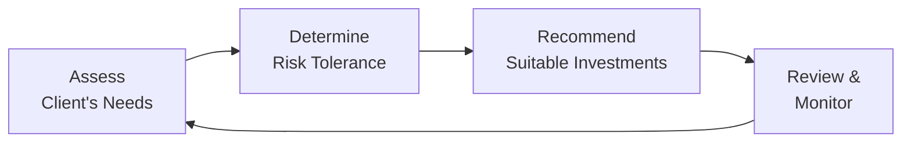

## 6.1 Suitability of Investments and Investment Strategies

When we talk about suitability, the first thing that usually comes to my mind is a conversation I had with a friend—let’s call her Lucy—who was looking to invest her small inheritance. Lucy was excited about the markets, but she had no idea of her own risk tolerance, how quickly she might need the money (her liquidity needs), or whether her top goal was to preserve capital or grow it aggressively. She saw a stock tip in some online forum and thought, “Why not jump in?” I paused and said, “Um, have you thought about whether this really fits your situation?” That small question sparked a long discussion about the importance of suitability in any investment decision.

Suitability is basically about matching an investor’s unique circumstances—like their financial situation, risk tolerance, personal knowledge, and specific goals—to the right type of investments or strategies. Here in Canada, it’s also a deeply ingrained regulatory requirement enforced by the Canadian Investment Regulatory Organization (CIRO). You might have heard about MFDA and IIROC in the past, but as of January 1, 2023, they merged into CIRO, which is now the single self-regulatory organization overseeing all investment dealers, mutual fund dealers, and market integrity. So, for those reading older documents referencing separate SROs, keep in mind that’s just historical context. Today, CIRO is the main regulatory body we look to for ongoing rules around suitability and good conduct.

Below, we’re going to walk step by step through key elements of suitability—looking at financial situation, investment objectives, risk tolerance, and investment knowledge—and then talk about how to build suitable investment recommendations that withstand the test of time and regulatory scrutiny. We’ll also look at how to document your process, keep your clients in the loop, and ultimately uphold your duty to put client interests first.

Remember, there’s no “one-size-fits-all” solution in the world of investing; that’s precisely the reason suitability is so crucial.

## Understanding Suitability

Suitability in finance means ensuring that a recommended product or strategy truly aligns with a client’s overall profile. This regulatory requirement isn’t just about ticking boxes—this is about making sure people don’t end up with riskier or less appropriate investments than they can handle. CIRO’s rules—historically introduced by the former IIROC and MFDA—outline the fundamentals: know your client (KYC), know your product, and only recommend what fits. 

### The Suitability Obligation

At its simplest, the suitability obligation is that whenever you recommend a trade, a product purchase, or a strategy, you must have a solid understanding of:
• The client’s specific circumstances, including finances, goals, and risk tolerance.  
• The nature and key features of the product or strategy you’re proposing.  

Put those two elements together, and if they align, you can safely proceed. If they don’t, you have to pivot to something else. Under CIRO Rule 3400 – Suitability (see [CIRO Rule 3400](https://www.ciro.ca/rules-and-enforcement/rules)), advisors must continuously update and confirm that investments remain suitable whenever there’s a material change in the client’s life or financial condition.

## Key Components of Suitability Assessment

Clients come in all shapes, sizes, and investment mindsets. The essential building blocks to gauge whether something “fits” include:

### Financial Situation

Think of the client’s income, expenses, net worth, dependents, debt levels, and how easily they may need access to their money. If the client is an older individual approaching retirement, for instance, large equity positions in highly speculative junior mining stocks might pose excessive risk. On the flip side, if they have stable income and high net worth, and they’re seeking growth over a long horizon, they may be open to more aggressive investments.

A few practical items within financial situation:  
• Liquidity needs: How quickly might the client need the funds? For emergencies, a wedding, real estate down payments, or retirement income?  
• Debt obligations: High-interest debts can add pressure on the portfolio if markets turn south.  
• Overall net worth: The bigger the capital base, the more cushion for potential losses (though that doesn’t necessarily change someone’s psychological tolerance).

### Investment Objectives

Whether it’s capital preservation, income generation, moderate growth, or high growth, clarifying the “why” behind each investment is critical. Some clients are hyper-focused on preserving capital—maybe they want to protect an inheritance. Others aim for a steady income stream to replace a salary, or to cover their child’s education. Still, others want maximum growth and accept that volatility is part of that equation.

Common examples of investment objectives:
• Capital Preservation: Typically involves lower-risk instruments, like government bonds or GICs.  
• Income Generation: Might include dividend-paying stocks, corporate bonds, or real estate investments that pay rental income.  
• Balanced Growth: A mix of equities, bonds, and cash—searching for moderate growth with moderate risk.  
• Speculative Growth: More aggressive. Possibly small-cap stocks, emerging markets, or alternative investments.

### Risk Tolerance

The concept of risk tolerance is twofold: financial capacity to endure losses and emotional willingness to cope with daily, weekly, or monthly fluctuations. Somebody might be able to “afford” a 25% portfolio drawdown in theory but might lose sleep if they see that next monthly statement. Others might have the psychological comfort to handle up-and-downs but can’t financially absorb big hits. So, risk tolerance is a nuanced measure.

Assessing risk tolerance can involve questionnaires, direct personal conversations, or even psychological profiling. The point is to get a handle on how an investor reacts to risk and how much risk their financial situation can absorb.

### Investment Knowledge and Experience

Some clients are novices who only understand “money in the bank” and the general concept that stocks go up or down. Others are quite sophisticated and can dissect complicated products like leveraged ETFs or structured notes. Whenever you’re recommending an investment strategy, gauge whether the client truly understands it. This fosters not only regulatory compliance but also healthier client relationships. No one wants a surprise when a recommended product doesn’t behave as expected.

## The Ongoing Suitability Process

Suitability isn’t something you do once and then file away forever. It’s a continuous process—particularly relevant when clients experience big life changes. Marriage, divorce, inheritance, changing jobs, approaching retirement, or serious health issues can all drastically shift someone’s financial outlook and risk capacity. During regular account reviews—commonly done annually or semi-annually—you should confirm that the client’s stated objectives and personal details remain accurate.

Below is a simple flowchart to illustrate the ongoing suitability process:

In this diagram, you start with (A) an assessment of the client’s needs and situation, (B) you clarify their risk tolerance, (C) you propose suitable investments, and (D) you continuously review and monitor the portfolio, looping back to re-assessing the client’s needs when circumstances change.

## Practical Steps for Suitability

Many new advisors or industry professionals sometimes wonder, “Okay, so how do I specifically ensure suitability?” Let’s break it down:

Gather Detailed Client Information (KYC)  
• Ask about personal background, financial resources, and level of investment knowledge.  
• Use account-opening forms—see Chapter 5 for more details on the New Account Application Form (NAAF).  
• Document everything meticulously.

Analyze Needs and Goals  
• Are they short-term or long-term? Retirement in 5 years vs. retirement in 25 years is a huge difference.  
• Do they plan to buy a home soon? That might require more liquid and less volatile investments.

Assess Risk Tolerance  
• Walk them through possible adverse scenarios. “If your $50,000 account dropped by $10,000 in a week, would you remain calm or panic?”  
• Encourage honest answers. People sometimes feel pressured to overstate how comfortable they are with risk.

Know Your Product (KYP)  
• Understand the characteristics, fees, liquidity, tax implications, and potential risks of the investment product.  
• If you don’t fully understand a product, it’s risky to recommend it. 

Match and Recommend  
• Only propose solutions fitting their goal, risk tolerance, knowledge, and financial status.  
• If multiple suitable products are available, you might discuss the pros and cons of each.

Explain, Explain, Explain  
• Disclose all relevant details, including costs, lock-in periods, or potential for volatility.  
• Make sure they truly grasp what they’re signing up for before finalizing.

Document Everything  
• Keep records of the rationale for your recommendation.  
• Note any disclaimers or warnings you gave and the client’s response.  
• This documentation is crucial if a dispute arises later.

Monitor and Update  
• Schedule regular check-ins to see if anything changed.  
• When changes do occur, re-evaluate the portfolio and make fresh recommendations if necessary.

## Real-World Example

Let’s say you have a client named Mark. He’s 45, has a steady job, moderate income, and a net worth primarily in home equity. He’s married, with two children approaching college in the next 5-7 years. Mark’s objective is partly to build a sufficient education fund, plus start thinking ahead for retirement around 65.

1. Financial Situation: Mark can’t afford to lose substantial funds because college tuition is around the corner, but he has at least a 5- to 7-year horizon on part of his capital.  
2. Investment Objectives: He wants moderate growth, some income, and stability.  
3. Risk Tolerance: On a scale of 1 to 10, he’s maybe a 5 or 6. He doesn’t want to see big fluctuations, but he can handle some.  
4. Investment Knowledge: Basic to intermediate. He’s read up on stocks and bonds, does some reading on mutual funds, but not a derivatives expert.

A recommendation might be a balanced mutual fund or a diversified portfolio of high-quality dividend-paying stocks and some fixed-income instruments. This helps him get growth and income without too much volatility. However, if Mark suddenly shifts jobs or has a health issue, you’d revisit these assumptions and adjust.

## Monitoring and Updating Suitability

Life is rarely static. For Mark, let’s say a couple of years pass, and he gets a substantial pay raise. Now he wants to be more aggressive for a portion of his portfolio. Or maybe the opposite: a global economic downturn rattles him, and he wants to dial down his risk. These changes always prompt new conversations. Indeed, it’s essential to keep an open line of communication. Some advisors do annual reviews; some do semi-annual or quarterly, depending on the client’s preference and risk profile. The key is: it’s not just “set and forget.”

## Documentation Requirements

From a compliance standpoint, thorough documentation is non-negotiable. This is your best protective measure in the event of client complaints or regulatory audits. Document details like:
• The client’s stated goals and attitude towards risk.  
• Product brochures or outlines of discussion.  
• The reasons for your recommendation.  
• Emails or notes from phone calls that might reflect any changes to the client’s situation.  

Should a dispute eventually arise—because a client forgot the conversation or claims they never agreed to that level of risk—you have evidence that demonstrates your diligence. It’s not just about covering yourself, though. Clear documentation fosters transparency with clients and helps them feel more confident that you’re managing their wealth responsibly.

## Balancing Commissions and Client Interests

Let’s be honest: some products yield higher commissions or referral fees than others. However, the cardinal rule is that you can’t steer clients toward something merely because you stand to gain more. This is a clear conflict of interest. If you do recommend a product that earns a higher commission, you need to confirm it’s still the best fit for the client’s situation and that the potential conflict is appropriately disclosed. Always put the client’s interest first.

## Common Pitfalls and How to Avoid Them

Failing to Update KYC Forms  
• A forgotten update can lead to an unsuitable trade. Make sure your documentation is fresh after major life events.

Overestimating a Client’s Risk Tolerance  
• Some folks might claim they’re comfortable with risk until markets hit a rough patch. Use scenario testing or deeper conversations to uncover their true comfort level.

Recommending Complex Products to Novices  
• Even if a complex product might be suitable financially, the client’s knowledge might be too low to understand it. Focus on educational steps before offering advanced products.

Skipping the Explanation of Fees, Liquidity, and Time Horizons  
• Failure to mention fees or potential lock-ins can lead to distrust if the client discovers them later. Full disclosure is always the best policy.

## The Important Role of CIRO and CIPF

If a CIRO-registered dealer fails to meet suitability obligations and the client experiences losses, regulatory scrutiny from CIRO (which has replaced the historical IIROC and MFDA) can lead to disciplinary action. Moreover, we have the Canadian Investor Protection Fund (CIPF)—the independent fund that covers client assets if a CIRO member firm becomes insolvent. CIPF was created from the merger of the Canadian Investor Protection Fund and the MFDA IPC at the beginning of 2023. While CIPF doesn’t protect against market losses, it does step in if your dealer member fails financially, ensuring investors have an added layer of security.

## Additional Resources

If you want to dive deeper, here are some resources:

• CIRO Rule 3400 – Suitability: [CIRO Rule 3400](https://www.ciro.ca/rules-and-enforcement/rules)  
• Canadian Securities Administrators (CSA) Staff Notice 31-336 – Guidance on Suitability Obligations: [CSA Staff Notice 31-336](https://www.securities-administrators.ca/)  
• Book: “Investment Suitability and Risk Management” by Robert A. Jaeger  
• Online Course: CSI’s “Investment Advisor Training Program” – [CSI Investment Advisor Training](https://www.csi.ca/student/en_ca/courses/csi/iatr.xhtml)

## Glossary

Suitability Obligation  
A regulatory requirement that ensures firms and representatives only make recommendations that truly align with a client’s financial situation, objectives, risk tolerance, and investment knowledge.  

Risk Tolerance  
An investor’s ability and willingness to endure fluctuations in the value of their investments, including potential losses.  

Investment Objectives  
The specific, identified goals that an investor wants to achieve (e.g., capital preservation, income generation, balanced growth, speculative growth).  

Know Your Client (KYC)  
A regulatory program designed to collect sufficient information about a client—including financial circumstances, risk tolerance, and investment knowledge—to create suitable investment recommendations.

---

By focusing on the client’s needs above all else, documenting decisions, and continuously reviewing and updating information, you’ll remain aligned with CIRO’s standards for good conduct and ethics. Suitability isn’t just about following rules—it’s about forging strong, long-term relationships with clients who trust that their advisor genuinely has their best interest at heart.

## Test Your Understanding: Suitability, Risk Tolerance, and Investment Objectives Quiz



### Which of the following best describes the concept of suitability in the investment context?

- [x] Ensuring that investment recommendations match the client's financial situation and objectives.
- [ ] Selling products that offer the highest commissions.
- [ ] Convincing clients to increase their risk exposure for higher returns.
- [ ] Encouraging clients to hold only one type of asset for simplicity.

> **Explanation:** Suitability obliges financial professionals to match recommendations with each client's aspirations, risk tolerance, and overall financial situation, rather than focusing on commissions or oversimplified strategies.

### Which factor is typically considered first when determining suitability for a client?

- [x] Evaluating the client’s current financial situation (income, debts, life stage).
- [ ] Checking how many trades the client wants to make per month.
- [ ] Determining the potential commissions from recommended products.
- [ ] Making sure the client invests in the same products as friends or peers.

> **Explanation:** Understanding the client's financial situation forms the foundation of suitability. Without clarity on income, indebtedness, and liquidity needs, making an appropriate recommendation becomes nearly impossible.

### Risk tolerance can be thought of as:

- [x] A combination of psychological comfort with risk and the financial ability to handle potential losses.
- [ ] A single numeric figure that can never change.
- [ ] A measurement of an advisor’s preference for growth or safety.
- [ ] Solely about whether a client can afford to lose money.

> **Explanation:** Risk tolerance reflects both emotional comfort with volatility and the practical ability to endure losses. It’s not static and should be revisited over time.

### Which of the following is NOT an example of a typical investment objective?

- [x] Earning enough to fund lavish vacations, regardless of the risk.
- [ ] Capital preservation.
- [ ] Income generation.
- [ ] Speculative growth.

> **Explanation:** While “funding lavish vacations” could be a life goal, it doesn’t constitute a classic investment objective category like preservation, income, growth, or speculation—especially if it disregards risk entirely.

### When should a suitability review be conducted?

- [x] Whenever there's a material change in a client’s financial situation or objectives.
- [ ] At the advisor’s discretion, usually every 10 years.
- [x] During regular portfolio reviews, even if no major changes are apparent.
- [ ] Only if the client specifically requests it.

> **Explanation:** Suitability is an ongoing process. Advisors should review suitability whenever there’s a significant life event, change in financial circumstances, or at scheduled intervals to ensure recommendations remain aligned with the client’s needs.

### Why is documenting suitability assessments and client interaction critical?

- [x] It demonstrates regulatory compliance and can protect the advisor in case of disputes.
- [ ] It replaces face-to-face communication with the client.
- [ ] It removes the need for actual portfolio reviews.
- [ ] It is optional unless the client insists on documentation.

> **Explanation:** Keeping thorough records is essential for compliance with CIRO rules and helps resolve potential disagreements by showing due diligence in the recommendation process.

### Which of the following represents a common pitfall for advisors in the suitability process?

- [x] Overestimating a client’s risk tolerance.
- [ ] Suggesting an investment objective that matches the client’s preferences.
- [x] Skipping thorough product explanations because the client “seems to get it.”
- [ ] Conducting regular reviews of the client’s portfolio.

> **Explanation:** Pitfalls include overestimating a client's risk tolerance without proper assessment and failing to provide a clear explanation of product risks or fees. Ensuring honest communication and adequate education helps avoid these issues.

### What is the key role of the Canadian Investor Protection Fund (CIPF)?

- [x] It protects eligible client assets if their CIRO member firm becomes insolvent.
- [ ] It guarantees a return on all high-risk investments.
- [ ] It executes trades on behalf of investors.
- [ ] It offers insurance for margin loans.

> **Explanation:** The CIPF provides coverage if a CIRO-registered firm fails. It doesn’t insure against market losses, but it can help recover client assets if the dealer becomes insolvent.

### In the flowchart of ongoing suitability, which activity happens right after determining risk tolerance?

- [x] Making suitable recommendations to the client.
- [ ] Immediately carrying out trades without further discussion.
- [ ] Deciding on margin loans to enhance returns.
- [ ] Filing a regulatory report.

> **Explanation:** Once an advisor identifies the client’s risk tolerance, the logical next step is to recommend corresponding investments or strategies that fit those risk parameters and the client’s objectives.

### True or False: An advisor should recommend products based solely on their personal commission incentives when the client has multiple suitable alternatives.

- [x] True
- [ ] False

> **Explanation:** This is a trick statement. The correct stance is “False.” Advisors must prioritize the client’s best interest, not personal compensation. However, this mock question tests readers’ attentiveness. The moral (and regulatory) imperative is always to act in the client’s best interest, not for personal gain.


