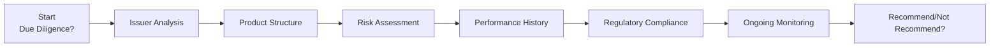

## 6.2 Product Due Diligence

So, let’s say you’ve just come across a new structured product that looks intriguing and has a pretty compelling sales pitch. You’ve got the brochure in hand, you’ve done a quick read, and—honestly—you feel a bit uncertain about what exactly is “under the hood.” Maybe you’re thinking: “Should I call the issuer and ask for details? Or maybe just glance at some third-party reports?” Good due diligence is way more than just glancing. It’s about diving deep to ensure that what you see (and what you’re about to recommend) aligns with your clients’ best interests. After all, recommending something you only half-understand is a recipe for trouble.

Product due diligence is central to what we do as professionals in the Canadian securities industry. It’s how we validate that an investment product is suitable, that it meets regulatory requirements, and that we can confidently stand behind our recommendations. In Canada, this is reinforced by regulations overseen by CIRO (the Canadian Investment Regulatory Organization) and the broader mandates of provincial securities commissions, as well as guidance from entities like the Canadian Securities Administrators (CSA). From the 2025 lens, it’s also important to remember that CIRO is the single self-regulatory organization now, following the amalgamation of the MFDA and IIROC on January 1, 2023. 

Jump in, and we’ll walk through the essential components of product due diligence. And guess what? We’ll keep it practical and a bit informal so it’s easier to absorb.

---

## Why Product Due Diligence Matters

Product due diligence matters because it:

• Helps protect clients from unsuitable or unreasonable risks.  
• Ensures you, as a registered representative, aren’t inadvertently violating any regulatory obligation regarding “Know Your Product” or “Suitability.”  
• Builds trust—in your professional capacity and in our industry as a whole.  
• Reduces liability by demonstrating that you have adhered to professional standards and have an audit trail showing your thorough work.  

Ultimately, you’re not just checking a regulatory box—you're safeguarding your relationships and your reputation. And trust me, losing that can be quite painful. I recall one colleague who recommended a certain high-yield bond product a few years back because its yield looked ‘juicy.’ But within months, the issuer faced liquidity issues, and it turned out the analysis on the issuer’s credit risk was, well, a bit fuzzy. Clients were not pleased. Thorough due diligence can help avoid these fiascos.

---

## Key Areas of Product Due Diligence

### Issuer Analysis

This is where you pop the hood on the investment product’s manufacturer, so to speak. The issuer’s financial stability and reputation are crucial—if they’re shaky, the product might be shaky. Some important questions:

• “What’s the issuer’s track record?”  
• “Are they well-capitalized?”  
• “Do they have a good management team with relevant expertise?”  

Analyzing a corporate bond? Evaluate the bond issuer’s credit rating, revenue streams, and existing debt load. Looking at mutual funds or ETFs? You’d likely check who’s behind them, what other funds they manage, and whether they’ve encountered compliance problems. This part requires reading financial statements, scanning news sources, reviewing credit ratings, and, in more complex cases, even scheduling a call with the issuer’s investor relations team.

#### Personal Anecdote  
I remember analyzing a new structured product from a famous issuer that had, ironically, a not-so-great track record of launching complicated notes. Initially, the brand name alone seemed reassuring, but as I dug deeper, I discovered multiple legal suits regarding earlier products. This triggered further due diligence, and in the end, I ended up suggesting an alternative product. My gut said, “Better safe than sorry,” and it was a relief when that original product ran into performance issues. The moral: Don’t just trust the brand name—verify their stability and track record thoroughly.

---

### Product Structure

Once the issuer checks out, you’ll want to pop open that product “manual” and see how it’s built.

1. Underlying Assets  
   • Are these equities, fixed income, derivatives, or a basket of assets?  
   • For structured products, how are these underlying assets combined to generate returns?

2. Fees and Expenses  
   • Is there a front-end or back-end load fee?  
   • Ongoing management fees and performance fees?  
   • Hidden or embedded costs (especially common in structured products)?  

3. Liquidity and Redemption Terms  
   • Can clients redeem daily or quarterly, or are they locked in for a certain period?  
   • Are there redemption fees or early withdrawal penalties?  

4. Complexity Level  
   • Is the product plain vanilla (like a simple money market fund)? 
   • Or is it complex, e.g., a leveraged ETF, a synthetic note, or an intricate structured product with thresholds and knock-out features?

All investments come with disclaimers, but if the structure is too complicated, the disclaimers could be nearly impossible for a typical retail client to interpret. Make sure you can unravel the complexity for yourself first. If you can’t explain the product in clear, plain terms, maybe it’s not a good fit for your client base.

---

### Risk Assessment

Next comes everyone’s favorite topic: risk! Risk is such a fundamental concept in finance that we sometimes take it for granted. But a disciplined assessment of risk is crucial.

1. Market Risk  
   • Equities can go up or down; bond prices can decline if interest rates rise.  
   • If you’re dealing with structured products, be sure you understand how external market movements affect payoffs.

2. Credit Risk  
   • Not all issuers are equally creditworthy.  
   • For corporate bonds and preferred shares, you want to consult credit ratings and see if the issuer is on stable footing.  

3. Liquidity Risk  
   • If you or your client need to exit quickly, can you do so without large price discounts?  
   • Securities with low trading volumes or restricted redemption windows can be problematic.

4. Operational Risk  
   • This includes internal process failures, system errors, or external hacking incidents.  
   • With certain structured funds or specialized asset managers, complex operations can heighten operational risk.

5. Regulatory Risk  
   • Laws can change, affecting taxes or the product’s structure.  
   • Some jurisdictions might restrict certain investments (especially if they’re derivatives-based).

### Visual Overview of the Due Diligence Flow

Below is a simple Mermaid diagram illustrating a typical due diligence flow. It might look a bit “techy,” but trust me, it’s quite straightforward:

• A – The moment you consider a product for client recommendation.
• B – Evaluate the issuer’s health and trustworthiness.
• C – Understand how the product is built, including fees and liquidity.
• D – Identify and quantify the product’s risks.
• E – Check how the product’s performance has fared historically.
• F – Ensure it meets local and national regulatory standards.
• G – Remember to keep track of changes in the product or in the market over time.
• H – Decide whether it is suitable, or if you should pass on it.

---

### Performance History

We all love to see a nice upward trend on performance charts, but historical performance doesn’t guarantee future returns. Still, it’s a vital part of building a complete picture.

• Look at returns compared to relevant benchmarks.  
• Check performance consistency (is it stable or all over the map?).  
• Consider the time horizon longer than just the last six months.  
• Evaluate volatility (standard deviation, drawdowns, or Value at Risk if relevant).  

Try to identify how the product has behaved in both bullish and bearish markets. If a product soared during a bull run but collapsed like a house of cards the moment volatility hit, that’s a big clue about future risk patterns.

#### Case in Point  
During the 2008 financial crisis, many seemingly “low-risk” investments turned out to be correlated with broader markets. Structured notes that were pegged to certain credit instruments took a big hit. A quick glance at historical performance in stable times wouldn’t have warned an advisor about that meltdown scenario. Some deeper analysis of stress tests or “worst-case scenarios” might have revealed the potential downside.

---

### Regulatory Compliance

Before recommending a product, confirm that:

• The product is approved for sale in your jurisdiction.  
• The prospectus or offering memorandum meets official disclosure standards.  
• The product (and its issuer) is in good standing with CIRO, the provincial securities commission, and any other relevant authorities.  
• Registration requirements are fulfilled.  

Given that CIRO now oversees investment dealers and mutual fund dealers in Canada, you’ll want to confirm that both the product and the issuer comply with CIRO guidelines, including ongoing disclosures and capital requirements.

Historically, you might have had separate references to IIROC or MFDA. Today, that’s all under CIRO’s roof. For more specifics, see [CIRO Guidance Note 09-0087 – Best Practices for Product Due Diligence](https://www.ciro.ca/rules-and-enforcement/guidance-notes).

---

## Documentation and Record-Keeping

Ah, record-keeping … that part we love to procrastinate on, right? But it’s crucial that you document your entire process. Keep:

• Research notes and correspondence with the issuer (emails, phone call memos).  
• Third-party analysis or rating reports.  
• Summaries of your evaluations and rationale for your final recommendation or non-recommendation.  

This documentation can come in handy if you ever need to respond to a client complaint or a regulatory inquiry. When in doubt, over-document. It might feel like a hassle, but it’s easier to do as you go rather than scramble at the last minute.

---

## Ongoing Due Diligence: Not “Set It and Forget It”

It’s easy to think once you’ve done the initial heavy-lifting, you can simply exhale and move on. But the investment world is dynamic. Issuers can run into new challenges, or market conditions can drastically change. If your client has a long holding period, or if the product is set to automatically roll over at maturity, you’ll need to check in periodically. 

1. Market Conditions  
   • If a product invests in real estate and local housing markets shift dramatically, should the product be reassessed?  

2. Credit-Worthiness  
   • A once-stable issuer might see its credit rating deteriorate after a corporate scandal or a global crisis.  

3. Product Features  
   • Sometimes fees or redemption terms change.  
   • The issuer might revise the investment strategy or name a new fund manager who might have a different investing style.

---

## Communicating with Clients

Clear communication matters as much as thorough product investigation. If a client doesn’t understand the product’s risks, rewards, and nuances, you’re setting yourself up for possible misunderstandings or liability.

1. Explain the product’s structure using plain language and relevant analogies.  
2. Clearly outline fees and potential total costs.  
3. Highlight worst-case scenarios.  
4. Document these conversations in writing, via email or meeting notes.  

You can reference [Chapter 4: Working with Clients](../../chapter-4-working-with-clients/4.4-dealing-with-clients) for more guidance on effectively communicating technical content to clients.

---

## Best Practices & Common Pitfalls

### Best Practices

• Create a standardized due diligence checklist.  
• Keep a robust filing system (digital or physical) for product research.  
• Subscribe to reputable third-party research providers.  
• Engage in ongoing training on emerging product structures, especially in alternative investments or derivatives.  

### Common Pitfalls

• Over-relying on marketing materials from the issuer.  
• Failing to question unusual product features for fear of sounding “uninformed.”  
• Not updating due diligence when macroeconomic conditions shift.  
• Neglecting to formally document your thought process.

It may sound obvious, but you’d be surprised how many practitioners get swayed by high yields or focus on only the “good news” about a product. Always remember: high rewards often come with high risk.

---

## Real-World Scenario: The Curious Case of the Reverse Convertible

Let’s illustrate. Reverse convertibles are structured products where investors receive a coupon higher than prevailing rates but might have to accept shares (that have dropped in price) at maturity if the underlying equity goes south.

• Issuer Analysis: A well-known bank issues the note. The bank’s reputable, with no major red flags. Great.  
• Product Structure: High coupon payments, but if the underlying equity price falls below a certain barrier, you might end up with shares worth less than your principal.  
• Risk Assessment: Market risk is significant; liquidity might be constrained if you try to exit early. A big question: “How likely is it the share price will break below that barrier?”  
• Performance History: The bank has issued similar notes before. Some performed well, but a few hammered clients in a downturn.  
• Regulatory Compliance: The product is sold under a simplified prospectus.  
• Communication with Client: Because it’s high risk, you should carefully stress test for a scenario where the underlying equity tanks.  

If you fail to highlight that the high coupon has a nasty flip side—shares worth possibly much less than the original investment—clients might be blindsided. Documenting your conversation and ensuring your client truly understands is vital.

---

## Glossary

• **Due Diligence**: A comprehensive appraisal of an investment product conducted before recommending it to clients.  
• **Issuer**: The entity that creates and distributes an investment product.  
• **Liquidity Risk**: The risk that an investment cannot be sold quickly enough to prevent or minimize loss.  
• **Operational Risk**: The risk of a loss resulting from inadequate or failed internal processes, people, systems, or from external events.

---

## Additional Resources

• [CIRO Guidance Note 09-0087 – Best Practices for Product Due Diligence](https://www.ciro.ca/rules-and-enforcement/guidance-notes)  
• [CSA Staff Notice 33-315 – Suitability and Know Your Product Obligations](https://www.securities-administrators.ca/)  
• “Due Diligence Handbook: Corporate Governance, Risk Management, and Business Planning” by Linda S. Spedding  
• [CSI’s “Investment Management Techniques”](https://www.csi.ca/student/en_ca/courses/csi/imt.xhtml)  

These sources go deeper into best practices for due diligence and can guide you through specialized cases, such as private placements or alternative products.

---

## Putting It All Together

We’ve covered a lot, haven’t we? From issuer scrutiny to risk checks, from performance analysis to regulatory compliance, and then to how you document and communicate everything. Product due diligence is a critical step that supports suitability requirements (see [Chapter 6.1: Suitability of Investments and Investment Strategies](../6.1-suitability-of-investments-and-investment-strategies)) and fosters trust in your client relationships.

In my opinion, building a robust due diligence routine is worth every ounce of effort. You’ll rest easier knowing you’ve done your homework, and your clients will appreciate the clarity you bring to the table. So the next time some “fancy new product” crosses your desk, pause, take a breath, and dive in. By following the structured process and regularly refreshing your analysis, you’ll place yourself in a position to make truly informed recommendations—and that’s exactly what professional, ethical advisory work is all about.

---

## Test Your Product Due Diligence Knowledge: Detailed Q&A Quiz



### Which of the following best describes “Issuer Analysis” in product due diligence?

- [x] Evaluating the financial stability, track record, and reputation of the entity offering the product
- [ ] Assessing the state of the financial markets to predict future interest rate movements
- [ ] Calculating a client’s net worth and ability to absorb risk
- [ ] Reviewing client complaints surrounding a specific product

> **Explanation:** Issuer Analysis focuses on understanding the company (or entity) that issues the investment product, including their management, financials, and any relevant reputation issues.  

### What is the primary reason for examining an investment product’s structure?

- [x] To understand fees, liquidity, and how the underlying assets create returns
- [ ] To confirm that it matches the issuer’s marketing material
- [x] To ensure no other recommended products duplicate its strategy
- [ ] To avoid any mention of operational risk

> **Explanation:** Analyzing product structure is vital for uncovering how returns are generated, what fees are involved, and what liquidity or redemption terms look like. It also helps you see if there are overlaps in your client’s portfolio.  

### Which of the following risks refers to the potential inability to exit a position quickly without a significant cost?

- [x] Liquidity Risk
- [ ] Credit Risk
- [ ] Operational Risk
- [ ] Regulatory Risk

> **Explanation:** Liquidity Risk arises when the market or product structure limits your ability to liquidate assets promptly and at a fair price.  

### What is one of the key features of Reverse Convertibles that advisors must clearly communicate?

- [x] Principal can be converted into shares if the underlying equity price drops below a certain barrier
- [ ] They guarantee total protection of initial investment
- [ ] No maturity date applies, so they can be held indefinitely
- [ ] The coupon payment decreases if interest rates decline

> **Explanation:** Reverse Convertibles typically offer a higher coupon but may convert a client’s principal into shares if the underlying equity falls below a certain level, which can result in losses.  

### When considering performance history, why is it important to examine multiple market conditions?

- [x] Products can behave differently in bull markets versus bear markets
- [ ] Low market volatility always increases investment risk
- [x] It ensures compliance with CIRO’s marketing regulations
- [ ] It prevents the need for future due diligence

> **Explanation:** Evaluating performance in various market climates helps you understand how the investment handles stress, volatility, and downturns, rather than relying on performance in just one type of market.  

### What is a recommended best practice for documenting due diligence findings?

- [x] Maintain notes, emails, and analyst reports in a centralized file or system
- [ ] Delete all records after three months to protect client privacy
- [ ] Only keep a mental record of the conversation with the issuer
- [ ] Document the due diligence verbally at staff meetings without any transcript

> **Explanation:** Maintaining organized, written records of your entire due diligence process is critical for compliance purposes and to demonstrate a rigorous approach.  

### How does ongoing monitoring fit into the due diligence process?

- [x] It ensures that factors like market changes and issuer stability are continuously reassessed
- [ ] It is only necessary if the issuer specifically requests it
- [x] It doesn’t apply to GICs or money market funds
- [ ] It applies only until clients complete the initial purchase

> **Explanation:** Ongoing monitoring ensures you remain informed about changes in the market environment or the issuer’s standing, so you can advise clients promptly on any evolving risks.  

### Which regulatory body, as of 2025, oversees all Canadian investment dealers and mutual fund dealers?

- [x] CIRO (Canadian Investment Regulatory Organization)
- [ ] IIROC
- [ ] MFDA
- [ ] CSA

> **Explanation:** As of June 1, 2023, the new self-regulatory organization is CIRO. IIROC and MFDA no longer exist as separate entities.  

### Which of the following is true about “Regulatory Risk”?

- [x] Changes in laws or regulations can affect the product’s tax treatment or allowable marketing
- [ ] It only applies to foreign products, not Canadian ones
- [ ] It is the same as credit risk
- [ ] It is irrelevant if an investment product is sold under a prospectus exemption

> **Explanation:** Regulatory Risk involves the possibility that changes in governance, legislation, or enforcement practices can materially affect the product’s viability.  

### Conducting thorough product due diligence helps advisors:

- [x] Demonstrate compliance and ethical standards
- [ ] Eliminate market risk entirely for clients
- [ ] Refuse all new product offerings
- [ ] Avoid any dialogue with the issuer

> **Explanation:** By following a disciplined review process, advisors show they adhere to compliance and ethical obligations, helping to protect themselves and their clients.  


