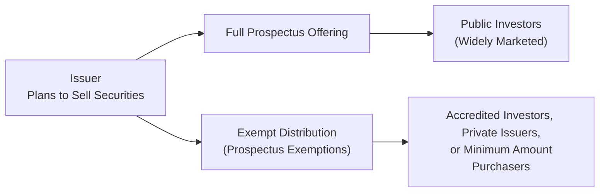
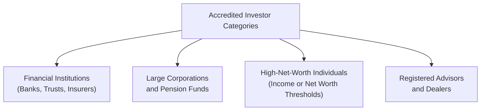

## 6.3 New Issues and Prospectus Exemptions

When companies launch new securities in the market—be it shares, bonds, or hybrid instruments—they’re navigating one of the most intricate realms of finance. There are rules and standards that, at times, might seem a bit overwhelming. But don’t worry, it’s actually more manageable once you grasp the essential building blocks. In this section, we’ll explore how new issues come to market, who’s responsible for ensuring adequate disclosure, and the ins and outs of available prospectus exemptions in Canada.

You might find yourself remembering the first time you saw a lengthy prospectus. A friend of mine once joked that reading a prospectus was like studying a foreign language—full of disclaimers, complex narratives, and risk factors. But, well, those disclaimers actually serve a critical purpose: they empower investors to make informed decisions by revealing just about every potential pitfall.

Before we dive into the details, recall that in Chapter 6.1 on Suitability of Investments and Investment Strategies, we touched on the importance of matching products to client needs, objectives, risk tolerance, and knowledge level. Whenever a new security is introduced or recommended, it’s essential to assess whether it’s right for your client’s circumstances. This synergy of product due diligence and investor suitability is exactly what fosters trust in financial markets.

### Understanding New Issues

A “new issue” refers to the first time a security (for instance, common share or preferred share) is offered for sale to the public. It’s typically done through an offering facilitated by one or more investment dealers. The fundamental principle behind new issues is to ensure that the public has enough information (often in the form of a comprehensive prospectus) to make an informed investment decision.

Besides the standard route of going public with a full-blown prospectus, there are alternative ways to distribute new securities—primarily through prospectus exemptions. These alternative methods allow certain qualified or specialized investors to invest in new securities without the full array of regulatory disclosures. It’s like forming a private club for those who meet specific criteria, while also mitigating some compliance burdens for issuers.

### The Prospectus Requirement

In Canada, a prospectus is a legal document that discloses everything a potential investor might reasonably need to know about a proposed offering, including details about the issuer, the investment’s structure and terms, financial statements, the intended use of proceeds, and a thorough discussion of risks. The prospectus requirement exists to enhance market integrity, bolster investor confidence, and reduce the risk of fraud by ensuring full, true, and plain disclosure of all material facts.

Think of it like inviting someone to a potluck. You want them to know what dishes will be there, who’s cooking it, any dietary hazards, how much everything costs, and so on. More details generally mean fewer misunderstandings or unwelcome surprises.

From a regulatory standpoint, securities legislation in each province and territory requires that securities be distributed under a prospectus unless an exemption applies. The current overarching national framework for prospectus exemptions is found in National Instrument 45-106 – Prospectus Exemptions (“NI 45-106”). CIRO, as the current self-regulatory body, emphasizes compliance with these rules to maintain a fair and transparent marketplace. Historically, separate self-regulatory organizations existed (IIROC and MFDA), but those have been amalgamated into CIRO effective June 1, 2023.

### Why Prospectuses Matter

If you’ve never flipped through a final prospectus for a large Initial Public Offering (IPO), it can be a riveting read—or sometimes a bit intimidating. Investors might find 200+ pages of data, footnotes, disclaimers, and risk sections. The point is: knowledge is power. The more you know about an offering, the better your decision-making. 

Moreover, in Chapter 2 on Ethical Decision Making, we looked at how transparency and honesty are cornerstones of ethical conduct. The prospectus requirement aligns directly with that principle. By making relevant information publicly available, issuers and registrants help investors avoid unscrupulous or uninformed choices.

### Prospectus Exemptions at a Glance

That said, not every security distribution goes through the standard “public offering with a full prospectus” route. Some companies may choose to raise capital privately, quickly, or in a more specialized manner. In these cases, they’ll lean on prospectus exemptions. When an issuer or a registered representative relies on a prospectus exemption, they’re essentially saying: “We’re distributing securities without the usual public disclosure, but in compliance with regulatory rules that allow us to do so.”

These exemptions exist for various reasons: it might be that the investor is financially sophisticated, or that the new issue in question is a private placement with limited participants, or that the subscription amount is above a certain threshold. But no matter the exemption, compliance obligations still exist, which include verifying investor qualifications, providing mandatory risk disclosure, and fulfilling any necessary filings with regulators.

Let’s walk through the major exemptions you might encounter:

#### Accredited Investor Exemption

The Accredited Investor (AI) Exemption is perhaps the most commonly referenced. It permits issuers to distribute securities without a prospectus to individuals or entities that satisfy certain financial thresholds or professional designations. For instance, high-net-worth individuals, large corporations, banks, insurance companies, or certain professionals (lawyers, accountants, etc., meeting specific criteria) may fall under this bracket.

The rationale is that these accredited investors presumably have enough knowledge, sophistication, and financial clout to understand the risks of an investment without the need for more protective disclosures. However, in practice, you should carefully verify that a client truly meets the accredited investor criteria. After all, compliance involves real accountability. The last thing you want is a scenario where someone invests via the AI exemption but doesn’t actually qualify. That can open up big regulatory problems and potential legal liability.

#### Minimum Amount Investment Exemption

Sometimes referred to as the “$150,000 exemption” (though thresholds can vary over time, so always check the current rules), the Minimum Amount Investment Exemption was designed to allow an investor to buy securities if they purchase above a specified dollar threshold in a single transaction. 

The notion behind this is similar to the AI exemption: an investor who invests a significant lump sum presumably has the sophistication or at least the capacity to withstand a potential loss. Still, you should be mindful that simply plunking down a large sum doesn’t necessarily guarantee full investor sophistication. A robust know-your-client (KYC) process remains fundamental to ensure the investor is suitable for such a substantial commitment.

#### Private Issuer Exemption

A private issuer can distribute securities to a restricted group of investors—often no more than 50 non-employee security holders—without providing a prospectus. A “private issuer” typically can’t be reporting or listed on an exchange, and the distribution must be confined to certain close contacts, family members, employees, and other permitted individuals. This helps smaller or closely held companies raise capital from those who already have tight connections to the business, presumably reducing the risk of misinformation or unscrupulous promotions.

This exemption can be quite beneficial for early-stage companies looking to raise seed funding. But one cautionary tale: crossing the threshold of allowable non-employee shareholders or engaging with an unqualified investor can inadvertently strip a company of its private issuer status. That, in turn, can complicate future financing or impose heavier regulatory burdens.

#### Offering Memorandum Exemption

The Offering Memorandum (OM) Exemption is a sort of middle ground. It allows issuers to distribute securities based on a simplified disclosure document known as an offering memorandum. An OM is nowhere near as voluminous as a prospectus, but it still gives investors important information—like details about the business, risks, and use of proceeds. Certain provinces also impose investment limits and require risk acknowledgments. This exemption broadens market access for both issuers and investors while still enforcing some level of disclosure.

So if you have a client interested in an OM-based offering, your job is to ensure they receive the memorandum early, sign any required risk acknowledgement forms, and fully appreciate the potential limitations on resale, liquidity, and ongoing disclosures. Some folks jump into these deals only to discover months later that there’s no easy exit for their capital.

### Diagram: Overview of the Issuance Pathways

Below is a simplified flowchart illustrating two paths: going the “full prospectus route” vs. “exempt distribution” using different prospectus exemptions.

Explanation: The issuer can pursue a publicly distributed offering subject to full prospectus disclosure (B → D) or, if conditions permit, rely on a prospectus exemption (C → E). Either route aims to provide investor protection and market efficiency, but the requirements and audience differ significantly.

### Compliance Obligations and Best Practices

Relying on an exemption doesn’t mean operating in a Wild West scenario. Each exemption has specific rules that must be followed. Registered representatives play a vital role in ensuring compliance and protecting investors. Here are some best practices:

• Verify investor qualifications: Check net worth, income, or other relevant criteria for the Accredited Investor Exemption. Confirm the total purchase amount for the Minimum Amount Investment Exemption. Document everything.  
• Provide the required disclosure (e.g., offering memorandum, risk acknowledgments). Ensure your clients truly understand the risk factors and potential lack of liquidity associated with these offerings.  
• Maintain robust recordkeeping. This is integral to controlling risk and demonstrating compliance. (See also Chapter 5.5 on Client Records.)  
• Double-check any resale restrictions. Often, exempt securities can’t be traded freely on the open market without further steps like a four-month hold period or indefinite resale restrictions.  
• Keep an eye on CIRO guidance, as well as any updates from provincial regulators. Regulatory frameworks—and the interpretive notices around them—evolve over time.

### Potential Pitfalls and Strategies to Overcome Them

Pitfalls? Indeed, there are a few to keep in mind:

• Misclassification of an Investor: Overlooking or incorrectly assessing an investor’s accreditation status is one of the most common mistakes. The fix? A thorough KYC process.  
• Failing to Provide Adequate Disclosure: Even if a full prospectus isn’t required, an offering memorandum or risk disclosure might be. Missing documents or incomplete forms can void the exemption and put you in regulatory hot water. Adopt a thorough checklist approach.  
• Over-Reliance on Exemptions: Exempt distributions often have limited liquidity and minimal ongoing reporting. If a client’s portfolio is heavily weighted toward private placements, be sure they understand the additional risk and lack of transparency compared to publicly listed securities.  
• Inadequate Recordkeeping: If regulators come knocking, you’ll want impeccable documentation of your compliance with each aspect of the exemption. Consistent housekeeping is your best friend.

### A Quick Anecdote

I remember working with a small tech start-up that was desperate to raise funds but only wanted friends and family to invest. They planned to rely on the Private Issuer Exemption. Two days before closing the financing, the CFO realized a potential investor was actually an acquaintance, not exactly a close personal friend as defined by the rules. That small detail triggered a reclassification of the entire deal, forcing them to pivot to an alternate exemption at the last second. It caused a lot of anxiety and last-minute paperwork. The moral of the story? Always check whether your private issuer truly qualifies for its intended exemption (and that each investor is indeed a permitted person) before proceeding.

### Additional Diagram: Who Qualifies as an Accredited Investor?

Below is a quick visual summary of some (not exhaustive) categories under the Accredited Investor Exemption.

Explanation: This high-level snapshot captures a few broad categories of investors that typically qualify for the AI Exemption. Each category has precise definitions and conditions in NI 45-106.

### Communicating Exemption-Related Risks to Clients

Communication is critical. Let’s say your client meets the accredited investor criteria. Even so (and perhaps especially so), it’s your responsibility to highlight the distinctive risks of exempt offerings:

• Limited Disclosure: These offerings won’t have the same public documents as a company that’s listed on the TSX.  
• Liquidity Risk: Private placements can be notoriously difficult to liquidate.  
• Business Risk: Many private or exempt offerings are early-stage ventures, so there’s a higher chance of failure.  
• Regulatory Filings and Ongoing Information: Investors may not receive any financial statements or management discussion & analysis, so it’s harder to track performance.

Painting a realistic picture is a cornerstone of ethical practice. After all, ethics (as discussed in Chapters 1 and 2) revolve around respect, transparency, and client-centered decision-making.

### Connecting to Broader Principles

Ultimately, new issues and prospectus exemptions connect back to fundamental themes in this Conduct and Practices Handbook Course:

• Disclosure and Transparency: The reason all these rules exist is to ensure that misinformation or hidden risks don’t creep in.  
• Client Discovery and Suitability: Chapter 5 underscores how thorough knowledge of your client shapes recommendations.  
• Ethics in Practice: The spirit of the law emphasizes investor protection and fair dealings—exemptions are a privilege, not a loophole to bypass accountability.

### Conclusion

New issues are the lifeblood of capital markets, allowing businesses to grow and investors to participate in the upside (and risks) of new ventures. Still, you always want to be laser-focused on the rules that govern these distributions. While full prospectus offerings provide maximum transparency, prospectus exemptions open the door to more flexible investing. But with that flexibility comes responsibility—both in verifying investor eligibility and ensuring they understand the nature of what they’re buying.

Whether you’re assisting a start-up with raising seed capital via private placements or advising a high-net-worth individual looking for unique investment opportunities, always remember that compliance with securities law is non-negotiable. Reflect back on the professional and ethical standards from earlier chapters, and integrate them into every transaction. It’s a great recipe for building long-term trust in our financial ecosystem.

If any of this feels complex, yes, it can be. But you’re not alone. Reach out to your firm’s compliance team, consult the provincial regulators’ bulletins, and stay tuned to CIRO for updates. The more you practice applying these exemptions properly, the smoother your advisor journey becomes.

### Additional Resources

• National Instrument 45-106 – Prospectus Exemptions (https://www.securities-administrators.ca/)  
• CIRO Notice 21-0190 – Guidance on Prospectus Exemptions (https://www.ciro.ca/rules-and-enforcement/notices)  
• “Canadian Securities Regulation” by David Johnston, Kathleen Doyle Rockwell, and Cristie Ford  
• CSI’s “Exempt Market Proficiency Course” – (https://www.csi.ca/student/en_ca/courses/csi/empc.xhtml)

-----

## Essential New Issues and Prospectus Exemptions Quiz



### Under Canadian securities regulations, what is the primary purpose of a prospectus?

- [ ] To market the securities aggressively to all retail investors.
- [ ] To limit access to foreign investors.
- [x] To provide full, true, and plain disclosure of all material facts.
- [ ] To automatically guarantee a higher investment return.

> **Explanation:** A prospectus is designed to disclose all material information necessary for an investor to make an informed decision. This aims to protect investors and promote transparency.

### Which statement best describes the rationale behind the Accredited Investor Exemption?

- [x] Certain investors have enough net worth, income, or professional background to understand investment risks without full disclosure.
- [ ] It gives any Canadian citizen the right to buy exempt securities without proper disclosure.
- [ ] It bypasses the need for risk disclosures and documentation.
- [ ] It applies only to government bonds issued by provinces.

> **Explanation:** The Accredited Investor Exemption is available to those meeting specific financial or professional criteria. Since these investors are deemed more sophisticated or able to bear the risk, less disclosure is mandated.

### Under the Minimum Amount Investment Exemption, which factor is usually the determining criterion for allowing a prospectus-free investment?

- [ ] The investor's professional credentials (e.g., lawyer, accountant).
- [x] The investor purchases a specified minimum threshold in a single transaction.
- [ ] The investor has a private company with fewer than 50 shareholders.
- [ ] The investor’s past experience in capital markets.

> **Explanation:** The Minimum Amount Investment Exemption generally hinges on the investor making a single large purchase (often at or above $150,000, though thresholds can vary with regulatory changes).

### In an Offering Memorandum Exemption, what primary disclosure document replaces the traditional prospectus?

- [ ] A single-page risk summary.
- [ ] No disclosure document is required.
- [x] An offering memorandum that provides simplified but essential information about the issuer and investment.
- [ ] A form of unverified internet advertisement.

> **Explanation:** The Offering Memorandum (OM) serves as a simpler disclosure document than a full prospectus. It includes essential information on the issuer, risk factors, and how the proceeds are used.

### Which of the following steps is vital when relying on prospectus exemptions?

- [x] Carefully verifying that the investor meets the exemption criteria and documenting it.
- [ ] Relying solely on the investor’s word without further review.
- [x] Providing any mandated disclosure documents, such as a risk acknowledgment form.
- [ ] Allowing free trading of the exempt securities immediately.

> **Explanation:** When using exemptions, it's crucial to confirm eligibility (e.g., accredited status, minimum investment amount) and meet all disclosure obligations. Exempt securities often carry resale restrictions, so immediate free trading is not typically allowed.

### Why might issuers choose to utilize prospectus exemptions?

- [ ] They prefer to conceal their financial statements from scrutiny.
- [x] The issuer wants to raise capital without incurring the significant costs and time associated with filing a full prospectus.
- [ ] It’s required by CIRO for all securities offerings.
- [ ] They plan to list on an international stock exchange immediately.

> **Explanation:** Prospectus exemptions can reduce the cost and time of fundraising. However, using them comes with restrictions and is not mandatory for all offerings.

### Which of the following is a core risk commonly associated with exempt market products?

- [x] Minimal liquidity and limited secondary market.
- [ ] A guaranteed dividend yield locked in for five years.
- [x] Less public disclosure compared to fully public securities.
- [ ] Automatic protection from capital loss.

> **Explanation:** Exempt market securities often lack liquidity (making them hard to sell) and don’t offer the same level of public disclosure as those with full prospectuses. Additionally, there’s no guarantee of returns in these investments.

### What is one key reason for verifying each investor’s specific needs and constraints before recommending an exempt market product?

- [ ] To prevent them from ever buying public securities in the future.
- [ ] To ensure the client invests the maximum possible amount.
- [x] To confirm that the product matches the client’s risk tolerance, objectives, and financial situation.
- [ ] To void the need for compliance paperwork.

> **Explanation:** Suitability is paramount. Even if a client meets the exemption criteria, the investment must still align with their financial circumstances and risk profile.

### Which entity oversees investment dealers and mutual fund dealers in Canada following the historical merger of IIROC and MFDA?

- [ ] The Canadian Stock Exchange (CSE).
- [x] The Canadian Investment Regulatory Organization (CIRO).
- [ ] The Bank of Canada.
- [ ] The historical bodies remain separate and active.

> **Explanation:** On June 1, 2023, the two predecessor self-regulatory organizations (IIROC and MFDA) amalgamated into CIRO. CIRO now oversees investment dealers and mutual fund dealers, along with marketplace integrity.

### True or False: When distributing securities under the Private Issuer Exemption, a company can freely issue shares to any investor worldwide with no limitations on the number of non-employee shareholders.

- [x] True
- [ ] False

> **Explanation:** This statement is actually false; there are strict limitations on the number of allowed non-employee shareholders (often no more than 50). Also, the distribution must meet all the private issuer definition criteria and can’t be offered to the general public.


