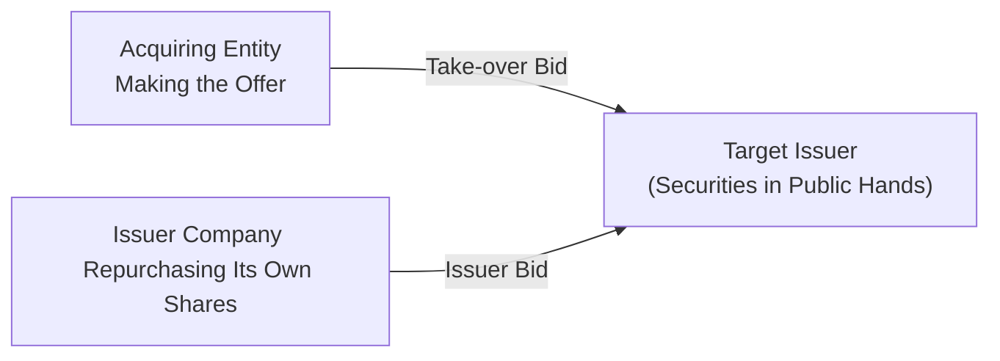
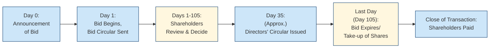

## 6.4 Take-over Bids and Issuer Bids

Take a moment and think about how you feel when you see headlines like “Company A Offers $1 Billion to Acquire Company B.” If you’re anything like me, maybe you feel a spark of excitement (and possibly a bit of confusion). These announcements often point to “take-over bids” in action. Meanwhile, “issuer bids” unfold when a company targets its own shares, offering to repurchase them from existing shareholders. In this section, we’ll look at how take-over bids and issuer bids play out in Canada’s regulatory environment. We’ll discuss processes, disclosures, minority shareholder protections, and everything else you need to feel confident discussing these transactions with your clients (or just at your next finance get-together).

Before diving in, it’s important to remember that as of January 1, 2023, the defunct predecessor SROs—the Mutual Fund Dealers Association of Canada (MFDA) and the Investment Industry Regulatory Organization of Canada (IIROC)—amalgamated to form the Canadian Investment Regulatory Organization (CIRO). CIRO is now Canada’s main self-regulatory body overseeing investment dealers, mutual fund dealers, and related marketplace activities. Any references to the MFDA or IIROC should be understood as historical. If you need the most current rules and guidelines, you can find them at (https://www.ciro.ca).

Below, we’ll discuss how these bids work, the rules that govern them, and the implications you should be mindful of when guiding clients.

---

### Understanding the Concepts

#### What is a Take-over Bid?
A “take-over bid” is an offer by an entity (often referred to as the acquiring entity, bidder, or offeror) to purchase the voting securities of a target issuer. Generally, the bidder seeks to gain control or a substantial degree of influence over the target. In Canada, under securities law, if an offer is made to acquire voting or equity securities that would result in the bidder owning 20% or more of the outstanding securities in a class, it’s usually considered a take-over bid (though exact thresholds can vary by jurisdiction).

Occasionally, you’ll see friendly take-over bids in which the target’s board supports the offer, or hostile bids when the board opposes it. For either scenario, the regulatory framework around take-over bids helps ensure transparency and protection for investors—particularly minority shareholders.

#### What is an Issuer Bid?
An “issuer bid” is a situation where the company itself offers to buy back its own shares from existing investors. Folks sometimes call this a share repurchase, buyback, or self-tender offer. Issuer bids aren’t done randomly—companies might want to consolidate control, improve certain ratios, or support their share price if they think it’s undervalued. Obviously, this can influence the market, so issuer bids in Canada also come with comprehensive disclosure and procedural requirements, largely similar in spirit to take-over bids.

Both take-over bids and issuer bids fall under the domain of National Instrument 62-104 – Take-over Bids and Issuer Bids. This regulation outlines disclosure demands, timing stipulations, minority shareholder protections, and other key points to ensure the playing field is fair and transparent. 

---

### Regulatory Framework in Canada

Canada’s take-over and issuer bid framework is primarily governed by provincial securities commissions (like the Ontario Securities Commission) and harmonized instruments such as National Instrument 62-104 (“NI 62-104”). These guidelines operate alongside other relevant provincial rules. CIRO members—investment dealers and mutual fund dealers—must ensure their practices comply with these regulations when assisting clients with any aspect of a take-over bid or issuer bid.

To keep it easy to visualize, check out this diagram:

In the above flowchart:
• A represents the bidder/offeror in a take-over bid.  
• B is the target issuer in which securities are widely held.  
• C represents the issuer itself seeking to repurchase its own securities.

---

### Key Requirements for Take-over Bids

The legislature has set strict rules to safeguard investors and maintain orderly markets:

1. Disclosure Obligations:  
   The bidder must send a “bid circular” (also called an offer document) to all shareholders of the target. The bid circular discloses the terms of the offer, the identity of the bidder, the intention behind the offer, and details of any financing used to fund it. Think of the bid circular like a job posting—the offer is “advertised” and all relevant “roles and responsibilities” (in this case, benefits and obligations) are spelled out.

2. Minimum Tender Conditions:  
   Canadian rules typically require that a majority of securities not held by the bidder or its affiliates must be tendered before the bidder can take up any shares. This is designed to protect minority shareholders from being squeezed out by a large shareholder alone.

3. Timing Provisions:  
   Generally, a take-over bid must be open for a minimum period (often 105 days, though this can vary if the target’s board consents to a shorter timeframe). This open window gives shareholders enough time to consider the offer, consult advisors, and compare alternative proposals.

4. Withdrawal Rights:  
   Shareholders can usually withdraw their tendered securities at any time before they’re taken up by the bidder. If the bidder changes the terms of the offer (say, sweetening it if the initial response was lukewarm), an extended withdrawal right must be provided so that shareholders can reconsider in light of new conditions.

5. Directors’ Circular:  
   Once a take-over bid is made, the target’s board of directors must send shareholders a “directors’ circular.” This document explains the board’s position: do they recommend acceptance, rejection, or do they choose not to make a recommendation? The circular typically includes reasons for the board’s stance and relevant valuation reports (if any).

6. Valuation Reports:  
   In certain circumstances, especially for insiders or going-private transactions, an independent valuation may be required. These valuations protect shareholders by providing an external, expert perspective on what the shares are really worth.

---

### Key Requirements for Issuer Bids

Issuer bids share many similarities with take-over bids in terms of procedural and disclosure standards. However, the central difference is that in an issuer bid, the issuer itself is buying back shares from current shareholders.

1. Bid Circular:  
   An issuer must deliver an issuer bid circular outlining the key terms of the buyback: the number of shares it intends to purchase, the price per share, how it will fund the purchase, and why it’s doing the buyback (e.g., to reduce the number of shares outstanding).

2. Equal Treatment of Shareholders:  
   Generally, all shareholders must be offered the same purchase price and conditions. This helps maintain fairness and stops preferential treatment of certain holders.

3. Timing and Withdrawal:  
   The issuer bid must remain open for a specified minimum period. During this time, shareholders can tender their shares, and they must also be permitted to withdraw them before acceptance if they change their minds.

4. Directors’ Circular (If Needed):  
   If an issuer has an independent committee or the situation requires board input, the board or committee might also produce a circular explaining why they believe the transaction is fair—particularly if the issuer is privately held or if insider conflicts could be present.

5. Optional or Mandatory Valuation:  
   If insiders, control persons, or related parties are part of the transactions, a formal valuation may be triggered to protect minority shareholders.  

---

### Importance of Minority Shareholder Protections

For both take-over and issuer bids, minority shareholders can be especially vulnerable—big players may otherwise maneuver in ways that benefit themselves at the expense of smaller investors. That’s why Canadian securities regulators require features like:

• Minimum tender conditions (so the majority of minority shareholders must support the transaction).  
• Disclosure of relevant financing or insider agreements (transparency, so smaller shareholders know how the deal is being funded or influenced).  
• Fair dealing provisions (all shareholders get the same price and conditions, preventing preferential treat­ment for favored insiders).  

These measures, alongside statutory rights of withdrawal, encourage fair play in Canada’s capital markets.

---

### Communicating Bid-Related Information to Clients

As a Registered Representative registered with CIRO, you might find yourself advising clients about a prospective take-over or issuer bid. Maybe they hold shares of a target company, and they ask you, “Does it make sense for me to tender my shares?” Or you might have clients on the other side who wonder if they should be excited about a potential takeover ramping up the share price.

Here are some best practices for client communication:

• Present the Facts in Plain Language:  
  Try to use everyday vocabulary. While the phrase “compulsory acquisition” might be nice and official, break it down: “If enough shareholders support the bid, the buyer may have the right to buy the remaining shares from anyone who didn’t accept the offer.”

• Highlight the Pros and Cons:  
  Let’s say the proposed purchase price is a nice premium over the current trading price—that’s a potential pro. But, if your client wants to keep a long-term position in the company, they might regret tendering if the stock’s intrinsic value is higher.

• Encourage Clients to Read the Circular:  
  The bid circular or directors’ circular is not just boilerplate. It contains essential details regarding timing, tactics, risk factors, and even disclaimers about uncertain future plans. 

• Discuss Tax and Legal Consequences:  
  A successful take-over or issuer bid may trigger capital gains or losses for your clients. While you may not be a tax professional, you can remind them to check with a tax advisor if the transaction has potential implications for them.

• Document Everything:  
  Ensure you document your client conversations. Make sure your records reflect that you provided balanced, accurate information and recommended they review official disclosures.

---

### Potential Conflict of Interest Considerations

One tricky scenario arises when you or your firm has a vested interest in the transaction—for instance, if your firm is representing the bidder. If so, you must comply with CIRO’s conflict-of-interest requirements. You may need to:

• Disclose the nature of the conflict to your client right away.  
• Provide guidance on how to get independent advice if the conflict is significant.  
• Ensure that any recommendations you make result from objective, well-documented research.

If your responsibilities become too conflicted or you’re too closely connected to the deal, you may need to step back from advising that client. These are exactly the kinds of ethical concerns we explored back in Chapter 1 on Standards of Conduct and Ethics.

---

### Real-World Scenario

Picture this: A few years ago, I (informally) chatted with a friend who was excited about a big takeover rumor for a Canadian mining company. He had a nice stake in the company, and the rumored purchase price was well above the current market price. He was all set to tender his shares. But, after some reflection, he realized the target’s board of directors considered the bidder’s price too low. The board pointed to an independent valuation that forecast potential new mineral discoveries. So, the board recommended shareholders not tender, hinting the company might be worth more in the long run.  

That’s what’s cool about these official processes. The combination of bid circulars, directors’ circulars, and independent valuations helped my friend weigh the short-term premium on the table with the possibility of future growth. He ended up not tendering. Actually, the bidder eventually sweetened the offer. Before final acceptance, my friend withdrew (which was his right). Then, after the improved terms were announced, he accepted the newly revised offer. It turned out well for him—and it’s a great example of what can happen when all the relevant rules are followed and minority shareholders have a voice.

---

### Detailed Look: Timeline of a Typical Take-over Bid

Let’s walk through a simplified timeline. Note that exact days and steps can vary based on regulations and the target’s board response.

Explanation of steps:
• Day 0: The bidder announces the intention to acquire shares. This might be done via a press release or other public disclosure.  
• Day 1: The official bid opens; shareholders receive the bid circular detailing the terms of the offer.  
• Day 35 (approximately): The board issues its directors’ circular, sharing advice or recommendations.  
• Day 1–105: Shareholders weigh pros and cons, possibly tendering or withdrawing their shares. If the bid is modified, the withdrawal period extends.  
• Day 105: Unless extended, the offer period ends. If enough shares are tendered under the minimum tender condition, the bidder takes up those shares and pays for them.  
• Closing: If thresholds are met, the bidder may follow statutory procedures to acquire any remaining shares, effectively closing the transaction.

---

### Best Practices and Common Pitfalls

• Thorough Due Diligence:  
  Whether it’s you as a Registered Representative or a client navigating a potential takeover scenario, always gather comprehensive information. Incomplete diligence is probably the biggest pitfall.

• Clear Communication:  
  If you sense your client is perplexed by legalistic jargon or the mechanical steps of the bid, clarify it in human-speak. 

• Be Cautious of Rumors:  
  Market rumors can overshadow the realities. Clients might be swayed by the hype (“Everybody’s saying the stock will triple!”). Encourage them to rely on official documents and possibly second opinions.  

• Handling Conflicts Professionally:  
  Don’t let personal or firm-level conflicts compromise your client’s best interests. If a conflict can’t be mitigated to the regulator’s satisfaction, it’s best to withdraw from advising.

• Timing Is Critical:  
  Missing deadlines (like forgetting to withdraw shares in time if new information arises) can cost your clients money or strategic flexibility.

---

### Accessing More Information

We’ve been diving deep here, but if you want even more, try checking out:

• National Instrument 62-104 – Take-over Bids and Issuer Bids:  
  (https://www.securities-administrators.ca/)  
  The founding document for all the rules we’ve discussed.

• “Mergers, Acquisitions, and Other Restructuring Activities” by Donald DePamphilis.  
  This book explores case studies and advanced mechanics behind M&A, take-over bids, reverse takeovers, and more.

• CSI’s “Mergers and Acquisitions” (online course):  
  (https://www.csi.ca/student/en_ca/courses/csi/ma.xhtml)  
  This provides a handy primer on the fundamentals of M&A in Canada’s regulatory framework.

---

### Putting It All Together

Whether you’re guiding an individual client, a small institutional investor, or simply refining your knowledge, understanding take-over bids and issuer bids is essential. These transactions can reshape companies, shift control, and generate significant returns (or losses) for shareholders. Canadian regulations aim to preserve fairness, transparency, and adequate protection for everyone involved—especially the minority.

Take-Over Bid Summary:  
• Typically involves an outside entity seeking to acquire 20%+ of voting shares.  
• Must provide a minimum, non-waivable majority tender condition.  
• Requires thorough disclosures (bid circular, valuation if needed) and a directors’ circular from the target.  

Issuer Bid Summary:  
• The issuer itself repurchases outstanding shares.  
• Follows similar disclosure rules (issuer bid circular).  
• Requires equal treatment and possible valuation protections.  

Both reflect the fundamental principle: the market is best served by transparency, investor autonomy, and fairness. As a Registered Representative, your job is to facilitate understanding and help your clients make decisions that align with their investing goals and risk appetite.

---

#### Glossary

• Take-over Bid: An offer by an acquirer to purchase voting or equity securities of a target issuer, aiming to get control or substantial influence.  
• Issuer Bid: An offer by an issuer to buy back its own securities from existing shareholders.  
• Bid Circular: A disclosure document that outlines the essential terms, conditions, and rationale for either a take-over bid or issuer bid.

---

## Test Your Knowledge of Take-over Bids and Issuer Bids



### Which of the following statements best describes a take-over bid in Canada?

- [ ] A scenario where a company seeks to buy assets rather than shares of another company.  
- [x] An offer made by a bidder to acquire enough voting securities of a target to gain control or significant influence.  
- [ ] An issuer’s offer to repurchase its own shares.  
- [ ] A compulsory transaction mandated by a provincial regulator.  

> **Explanation:** A take-over bid occurs when an acquirer (a “bidder”) makes an offer to purchase voting securities of a target issuer in order to obtain control or substantial influence, typically at or above 20% ownership.

### Which document must the bidder typically provide to shareholders in a Canadian take-over bid?

- [ ] A standard newly filed prospectus.  
- [ ] A proxy solicitation information form.  
- [x] A bid circular outlining key terms and disclosure.  
- [ ] A loan agreement with their bank.  

> **Explanation:** Under Canadian securities laws, the bidder must create a bid circular to disclose the offer’s details (price, conditions, financing) to target shareholders.

### What is the purpose of the “directors’ circular” during a take-over bid?

- [ ] To disclose only the bidder’s cost structure.  
- [ ] To suppress minority shareholders’ concerns.  
- [ ] To replace the bid circular.  
- [x] To inform shareholders of the target board’s recommendation and reasoning.  

> **Explanation:** The directors’ circular provides the target company’s board position on the bid—whether they recommend acceptance, advise rejection, or are neutral—and the reasons behind their stance.

### Under Canadian regulations, which of the following is generally required in a take-over bid to protect minority shareholders?

- [x] A minimum tender condition.  
- [ ] Sole reliance on board approval.  
- [ ] A guaranteed premium above current share price.  
- [ ] Automatic extension to one year.  

> **Explanation:** A common requirement is that a majority of the shares not owned by the bidder or its affiliates must be tendered before the bidder can take them up. This ensures minority shareholders collaboratively decide whether the bid succeeds.

### In an issuer bid, who is making the offer to purchase the shares?

- [ ] A private equity firm.  
- [x] The issuing company itself.  
- [ ] A broker-dealer working for CIRO.  
- [x] A competitor seeking control over the issuer.  

> **Explanation:** An issuer bid is an offer by the issuing company to buy back its own outstanding shares from existing shareholders. (Note that a competitor seeking control would be a take-over bid, not an issuer bid.)

### Which of the following is a core difference between a take-over bid and an issuer bid?

- [x] The identity of the bidder.  
- [ ] The obligation to produce disclosure documents.  
- [ ] The existence of minority shareholder protections.  
- [ ] The requirement for a valuation report.  

> **Explanation:** Both transactions have similar disclosure and fairness requirements, but the central difference is that a take-over bid is made by an outside bidder, whereas an issuer bid is made by the company itself.

### Generally, how long must a take-over bid remain open?

- [ ] Three business days.  
- [ ] Only until the board rejects the offer.  
- [x] Typically 105 days, unless shortened by the target board’s consent.  
- [ ] Exactly 365 days, with no exceptions.  

> **Explanation:** Under Canadian securities law, a take-over bid usually stays open for 105 days to give shareholders enough time to consider the offer. There are provisions that allow for a shorter period if the target agrees.

### Which of the following statements regarding withdrawal rights is accurate?

- [x] Shareholders can withdraw tendered securities anytime before they’re taken up.  
- [ ] Withdrawal rights are prohibited once the board issues a favorable recommendation.  
- [ ] Withdrawal rights apply only to institutional investors.  
- [ ] Withdrawal rights only exist if the offer is below the market price.  

> **Explanation:** Shareholders maintain the right to pull back (withdraw) their tendered securities at any time before the bidder actually “takes them up,” which ensures shareholders’ flexibility if new information surfaces.

### Which best describes a reason an issuer might undertake an issuer bid?

- [ ] To seek control of a competitor’s assets.  
- [ ] To avoid paying taxes on distributions.  
- [ ] To limit minority shareholder rights.  
- [x] To reduce the number of outstanding shares, potentially increasing share value.  

> **Explanation:** Issuer bids can be used by a company to reduce the number of shares in the market, which may support or drive up the share price, modify capital structure, and improve certain financial ratios.

### Is an independent valuation ever required in the context of Canadian take-over or issuer bids?

- [x] True  
- [ ] False  

> **Explanation:** In certain circumstances—like insider bids or going-private deals—regulations mandate an independent valuation to ensure minority shareholders receive expert guidance on fair pricing.


