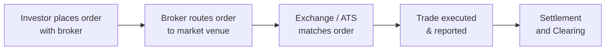

## 7.1 How Securities Are Traded

Securities trading is often described as the beating heart of modern financial markets. It’s where you see, in real time, all the hopes, fears, and strategies of investors converging into one dynamic marketplace—where stocks, bonds, derivatives, and a range of other instruments swap hands daily. In this section, we'll dig into the basics of securities trading in Canada, from the main players involved to the venues where trades happen. We’ll also look at how oversight from the Canadian Investment Regulatory Organization (CIRO) and other regulators helps promote fairness, transparency, and efficiency in the market. To keep things slightly informal, I’ll share a few personal narratives about my own learning curve when I first dipped my toes into trading. Let’s jump in!

### Background and Overview

When I first started trading in my 20s, I remember feeling completely overwhelmed by the sea of blinking lights and streaming numbers on my computer screen. I was glued to the markets, noticing how orders (those instructions to buy or sell) somehow magically got filled at prices that changed by the second. In time, I learned that behind this apparent “magic” were well-organized systems connecting buyers and sellers—those are the markets. 

In Canada, securities trading happens primarily on regulated exchanges and through other venues like alternative trading systems (ATS) and over-the-counter (OTC) markets. Each has its unique rules, technology, and advantages. Traders—both retail and institutional—connect to these venues through brokerage firms. These firms are required to be registered with CIRO and abide by rules that ensure fair trading and market integrity.

#### Key Concepts
• Order Execution: The process by which a buyer or seller places an order, which is then matched with a corresponding order in the market.  
• Market Liquidity: The availability of buyers and sellers willing to trade at any given time.  
• Pricing & Volatility: How prices move can depend on news, market momentum, trading volume, and overall investor sentiment. Volatility is simply the extent of price movements up or down.  

### Trading Venues in Canada

Securities can be traded through various platforms, each of which offers different features:

• Traditional Exchanges: The Toronto Stock Exchange (TSX) is the flagship Canadian exchange for large and mid-cap companies. There’s also the TSX Venture Exchange (TSXV) for smaller, emerging companies.  
• Alternative Trading Systems (ATS): These venues match orders electronically and often operate with slightly different execution speeds or pricing models. They aim to provide enhanced liquidity or lower transaction fees for certain participants.  
• Over-the-Counter (OTC) Markets: Here, trades occur directly between parties (e.g., a buyer and a seller) without being listed on a formal exchange. OTC markets can sometimes involve less liquid securities, such as certain fixed-income products and certain derivatives.  

Below is a simplified table comparing these venues:

| Venue Type                  | Typical Characteristics             | Examples                     |
|-----------------------------|-------------------------------------|------------------------------|
| Traditional Exchange        | Centralized order book, transparent quotes, listing rules, high liquidity | TSX, TSXV                   |
| Alternative Trading System (ATS) | Electronic matching, potentially lower fees, specialized order types, may offer anonymity | Multiple private platforms  |
| Over-the-Counter (OTC)      | Decentralized, direct negotiation between parties, can be less transparent, often used for less liquid instruments | Dealer networks, inter-dealer markets |

### Market Participants

Securities trading is a dance, and the main dancers are:

• Retail Investors: Individuals like you and me, placing trades often through online brokerage platforms.  
• Institutional Investors: Large entities, such as pension funds, mutual funds, and insurance companies, dealing in much larger volumes.  
• Market Makers: Firms (or sometimes individuals) that provide liquidity by continuously quoting buy and sell prices, ensuring there’s always some liquidity.  
• Brokers and Dealers (Brokerage Firms): Registered with CIRO, they act as intermediaries for client orders. They ensure that trades are routed, executed, and settled properly according to regulations.

I remember meeting a market maker at a networking event—she described her job as “basically speed dating orders,” because she was always on her toes, matching countless orders throughout the day. It was such a fascinating analogy for the constant hustle of market-making!

### Trading Sessions

While many people think of the market as operating strictly during “9:30 a.m. to 4 p.m. Eastern Time,” there’s actually a broader picture. The trading day in Canada includes:

• Pre-market: Where some orders are queued up before the opening bell. Liquidity can be lower, but important corporate news can still move prices.  
• Regular Market Hours: Typically 9:30 a.m. to 4 p.m. ET in Canada. This is where most trading volume and price discovery occur.  
• After-hours/Extended Hours Trading: A session that occurs after the market officially closes. While liquidity tends to be lower, some major earnings announcements happen right after the close, causing noticeable price swings.  

### How Trades Are Executed

To illustrate how securities are traded, check out the simplified flowchart below. This might feel like a big swirl of data, but breaking it down helps us see each step more clearly:

1. Investor places order with broker: The investor (retail or institutional) decides to buy or sell a security and submits the order.  
2. Broker routes the order to the appropriate venue (exchange or ATS): The broker chooses the best execution route, considering speed, liquidity, and price.  
3. Exchange or ATS matches order: Once the order hits the venue, it’s matched with an opposing order—buy meets sell.  
4. Trade is executed and publicly reported: Market data feeds show the price, volume, and time of execution.  
5. Settlement and Clearing: Ownership of the security is transferred from seller to buyer, and the payment is transferred from buyer to seller. In Canada, settlement often follows a T+2 model (trade date plus two business days).

### The Principles of Fairness, Efficiency, and Transparency

Canada’s securities regulators emphasize fairness, efficiency, and transparency in how securities are traded. “Fairness” means ensuring no group of participants is unfairly advantaged over others. “Efficiency” means orders can quickly find matches at the best available price. “Transparency” means price and volume information is readily available, fostering confidence in the market.

• Pre-trade transparency: Investors have access to the current buy (bid) and sell (ask) prices.  
• Post-trade transparency: Information about executed trades—price, volume, and time—is made public as quickly as possible.

### Regulatory Oversight: The Role of CIRO

If you recall from earlier chapters (like 3.3, Self-Regulatory Organization (CIRO)), the Canadian Investment Regulatory Organization is Canada’s national self-regulatory organization. It came into being after the Mutual Fund Dealers Association of Canada (MFDA) and the Investment Industry Regulatory Organization of Canada (IIROC) amalgamated on January 1, 2023. By June 1, 2023, CIRO assumed the role of overseeing both mutual fund and investment dealers as well as market integrity for equity and debt marketplaces. In other words, CIRO establishes and enforces the trading rules that brokers and dealers must follow across Canada—everything from real-time monitoring of trading activity to investigating suspicious trades and potential market manipulation.

Historically, MFDA and IIROC handled these responsibilities separately. However, they’re now defunct as individual entities. When you come across older materials that reference MFDA or IIROC, just keep in mind that these references are historical. As of 2025, CIRO is the organization ensuring that the markets remain transparent and fair. If you’d like to dive deeper, you can find additional resources and rules at https://www.ciro.ca/.

### Common Order Types

You might have heard of limit orders or market orders. These are the bread and butter of how securities get traded:

• Market Order: Executed immediately at the current market price. You— as the investor—are prioritizing speed of execution over price.  
• Limit Order: You specify a particular price, and the order will only execute if the market can meet or better that price.  
• Stop Order (Stop-Loss): This order becomes active only after a certain trigger price is breached. It’s frequently used to protect profits or limit losses.  

Order types matter because they offer a way to manage risk and tailor execution to your strategy. For a thorough discussion, see "7.2 Types of Orders," where you’ll find further examples and strategies for using each major type of order.

### Manual vs. Electronic Execution

Nowadays, the vast majority of trades happen electronically. Computerized matches of buy and sell orders on exchanges and ATS platforms enable trades to occur in milliseconds. Indeed, high-frequency trading (HFT) firms have made technology a decisive factor in capturing micro-opportunities in the market.

However, some trades still occur manually, especially large block trades or specialized trades in the OTC market where a broker-dealer might negotiate directly with a counterparty. In these cases, personal relationships and negotiated pricing come into play more heavily.

### A Real-World Example

Let’s say you want to buy 200 shares of a tech company listed on the TSX. You log into your online brokerage account—maybe it’s with a major financial institution or a smaller fintech broker. You place a limit order to buy at $50.25. Your broker’s system then checks the market for the best execution venue. If the TSX or an ATS has a matching sell order at $50.25 or below, your order gets executed in full or partially. The moment a match is made, you become the proud owner of those shares, minus any commissions or fees your broker charges. Within a few seconds, you’ll see a trade confirmation message. Settlement will occur two business days after the trade date, transferring ownership from the seller to you.  

### After-Hours Surprises

I once placed an order right after the market closed, thinking, “Eh, let’s see what happens.” The next morning, before the official market open, some big corporate development boosted the stock’s price, and my order filled at a price far different than I initially anticipated. The moral of the story? Pre-market and after-hours sessions can have dramatic price moves with lower liquidity, so keep that in mind when entering orders at unusual times.

### Best Practices and Potential Pitfalls

• Always Keep an Eye on Liquidity: Low liquidity can cause large price jumps. If your order is big relative to the market, consider using limit orders.  
• Understand Market Volatility: A volatile security might require more careful planning, especially if you use market orders.  
• Watch Out for “Market Impact”: Large institutional players sometimes break large orders into smaller ones to avoid huge price swings.  
• Beware of Overtrading: Transaction fees can eat into returns. If you’re just starting out, sometimes less is more.  
• Keep Abreast of Regulatory Updates: CIRO frequently refines its rules, so staying current ensures you remain compliant.

### Common Mistakes in Trading

• Using the wrong order type (e.g., setting a market order in a thinly traded security can lead to a worse-than-expected fill).  
• Failing to account for trading sessions (or placing an order during an after-hours session and forgetting the liquidity environment is different).  
• Neglecting the broader market environment (like corporate earnings, macroeconomic data releases, or unexpected geopolitical news).  
• Overconfidence in your own trading abilities (the famous phenomenon of “trader’s overconfidence”).  

### Regulatory Compliance

For anyone working in the brokerage industry or considering a career as a Registered Representative, compliance with CIRO and provincial regulations is non-negotiable. This includes:

• Conducting thorough “Know Your Client” (KYC) checks (see Chapter 5: Client Discovery and Account Opening).  
• Reviewing each client’s suitability for a proposed trade (see Chapter 6: Product Due Diligence, Recommendations, and Advice).  
• Keeping accurate books and records (see Chapter 8: Maintaining Client Accounts and Relationships).  
• Maintaining security and confidentiality of client data (see Chapter 4.5, Privacy and Cybersecurity).  

These regulatory expectations exist to uphold the integrity and safety of the financial system. If brokers and dealers failed to ensure fair execution, the level of trust in the market would plummet quickly.  

### Resources for Further Exploration

Learning never actually stops in the world of finance. If you’re curious and want to go deeper:

• [Toronto Stock Exchange (TSX)](https://www.tsx.com/) – Official information on listings, trading rules, and more.  
• [CIRO Trading Rules and Regulations](https://www.ciro.ca/) – The hub for current rules and enforcement guidance.  
• “Trading and Exchanges: Market Microstructure for Practitioners” by Larry Harris – A classic text about how trading really works behind the scenes.  
• [Financial Markets by Yale University (Coursera)](https://www.coursera.org/learn/financial-markets-global) – An online course that ties together theory and real-world applications, taught by a well-known finance professor.

### Quick Glossary Recap

Brokerage Firm – A financial institution that facilitates buying or selling securities.  
Market Maker – A firm providing liquidity by continuously quoting bid and ask prices.  
Alternative Trading System (ATS) – A platform (outside traditional exchanges) that matches buy/sell orders electronically.  
Over-the-Counter (OTC) Market – A decentralized market where buyers and sellers negotiate directly.  
Liquidity – The ease of buying or selling a security without big price swings.  
Volatility – How much the price of a security changes over a given period.

### Final Thoughts

So, that’s the overview of how securities are traded in Canada. It can be quite the whirlwind—from pre-market signals to after-hours surprises—but at the end of the day, all of this is orchestrated by well-defined rules and sophisticated technologies that connect buyers and sellers. If you’re diving into a career in finance or simply want to participate in the markets, understanding these fundamentals is crucial for making informed decisions. Happy trading (and learning)!

---

## Test Your Knowledge: Securities Trading in Canada Quiz



### Which organization is responsible for overseeing investment dealers and mutual fund dealers in Canada as of 2025?

- [ ] The Mutual Fund Dealers Association of Canada (MFDA)
- [ ] The Investment Industry Regulatory Organization of Canada (IIROC)
- [x] The Canadian Investment Regulatory Organization (CIRO)
- [ ] The Office of the Superintendent of Financial Institutions (OSFI)

> **Explanation:** As of 2023, the MFDA and IIROC have amalgamated into the new CIRO, which now oversees both investment dealers and mutual fund dealers.

### Which of the following best describes an Alternative Trading System (ATS)?

- [ ] A traditional stock exchange that only lists large companies
- [x] An electronic market platform that matches buyers and sellers outside traditional exchanges
- [ ] A privately run forum where no price information is made public
- [ ] A government entity purely for enforcing market rules

> **Explanation:** ATSs are electronic platforms that facilitate trades outside of conventional exchanges, often offering innovative order types or fee structures.

### In what way do market makers contribute to the trading process?

- [ ] They set interest rates for retail loans
- [x] They provide liquidity by quoting continuous buy and sell prices
- [ ] They are responsible for auditing company financial statements
- [ ] They only participate in after-hours trading

> **Explanation:** Market makers maintain an orderly market by always being willing to buy or sell certain securities at publicly quoted prices. 

### Which statement is true about using market orders?

- [ ] They guarantee a maximum purchase price
- [ ] They execute at a specified price or better
- [x] They generally execute right away at the best current price
- [ ] They cannot be used during after-hours sessions

> **Explanation:** A market order prioritizes speed, and it fills at the current available market price, which can sometimes be a disadvantage if the market is volatile.

### Which best practice can help mitigate the influence of low liquidity when placing a large order?

- [x] Using a limit order
- [ ] Using a market order
- [x] Splitting the trade into smaller orders over time
- [ ] Executing the trade right at market open

> **Explanation:** Using limit orders and/or splitting trades are common strategies to minimize market impact and get better average prices.

### What happens during settlement in a typical T+2 cycle?

- [x] Ownership of the shares moves from the seller to the buyer, and cash moves from the buyer to the seller
- [ ] The investor’s broker holds the shares for a mandatory 30-day period
- [ ] The exchange conducts a thorough audit of the trade’s legality
- [ ] No actual changes in shares or cash occur during settlement

> **Explanation:** Under T+2 (trade date plus two business days), the buyer receives the shares, and the seller receives cash on the settlement date.

### Why might an investor choose a stop (stop-loss) order?

- [x] To trigger a sale if the price falls below a certain level
- [ ] To ensure a guaranteed purchase price, no matter market movements
- [x] To protect gains if the price has reached a desired target but might fall
- [ ] To lock in a short-sell position prior to market open

> **Explanation:** A stop-loss becomes active at the specified trigger price, and it is typically used to limit or protect gains from downward price movement.

### Which session typically has the highest trading volume and price discovery?

- [ ] Pre-market
- [ ] After-hours trading
- [ ] Overnight trading
- [x] Regular market hours (9:30 a.m. to 4:00 p.m. ET)

> **Explanation:** During standard market hours, the majority of trading activity takes place, making it the peak period for volume and price discovery.

### How are trades usually executed on modern exchanges?

- [x] Electronically via order-matching systems
- [ ] Through a central telephone switchboard at the exchange
- [ ] By in-person negotiation on the exchange floor only
- [ ] Only through manual broker-dealer negotiations

> **Explanation:** Technology has replaced many manual functions, resulting in orders being matched electronically within milliseconds.

### A large pension fund that wants to avoid “market impact” on a high-volume trade might do which of the following?

- [x] Use an algorithmic trading strategy to break up the large order into multiple small orders
- [ ] Issue one massive market order right before the market closes
- [ ] Post the order publicly on social media
- [ ] Wait for after-hours trading, when all trades are manual

> **Explanation:** Splitting up a large order through algorithmic trading can reduce the market impact and avoid major price swings.


