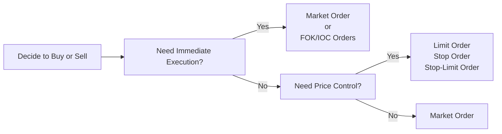

## 7.2 Types of Orders

If you’ve ever found yourself staring at a trading screen, wondering which type of order to place, trust me—you’re not alone. I remember one of my first trades, where I aimed to purchase a fast-rising stock, but the price got away from me because I used the wrong order type. The experience was kind of stressful, and I realized that choosing the correct order type can make a huge difference in both price and timing. 

So, in this section, we’re going to talk about the various types of orders used in the Canadian securities industry (and widely recognized abroad, too!). Understanding them thoroughly empowers you to navigate the market with more precision and confidence.

Before digging in, recall from Section 7.1 (How Securities Are Traded) that executing a trade on the exchange or marketplace involves matching buy and sell orders. The manner in which you place or structure these orders can significantly affect the outcome of your investments. Sound good? Let’s jump right into it.

--------------------------------------------------------------------------------
  
### Why Order Types Matter

Think of order types as specialized instructions that you give to the marketplace. Each type of instruction aligns with a specific trading objective, such as:

• Minimizing potential losses.  
• Securing favorable pricing.  
• Ensuring that a transaction occurs quickly.  
• Managing partial fills and controlling fill quantity.

When you choose an order type, you’re basically saying, “Hey, this is how I want my trade to be handled.” Markets can move quickly, and if you’re not precise, you could end up with outcomes you didn’t anticipate—like buying at a higher price than expected or missing out on a trade altogether.

--------------------------------------------------------------------------------

### Overview of Major Order Types

Below is a high-level list of some of the most commonly used order types in the Canadian securities industry. We’ll cover each in detail, but here’s a preview:

• Market Order  
• Limit Order  
• Stop Order (Stop-Loss Order)  
• Stop-Limit Order  
• Day Order  
• Good-Till-Cancelled (GTC) Order  
• Fill-or-Kill (FOK) Order  
• Immediate-or-Cancel (IOC) Order  

Let’s begin with the simplest.

--------------------------------------------------------------------------------

### Market Orders

A market order instructs your brokerage firm to buy or sell a security immediately at the best available price. People often choose a market order when they want execution speed over price control. 

• “Buy me 100 shares right now” is effectively what you’re telling the marketplace.  
• You could end up with a price slightly different from what you see on the screen because market prices can change in milliseconds.  

#### Benefits
• Fast Execution: The trade typically goes through very quickly.  
• Simplicity: Market orders are simple to place.

#### Drawbacks
• Price Uncertainty: In a rapidly fluctuating market, the execution price may be significantly different from your last quoted price.

For example, suppose you’re monitoring a stock that’s trading around $50.00. You place a market order, but in the few seconds it takes to execute, the price jumps to $50.10. You end up paying $0.10 more per share than you intended. Sometimes that’s okay—especially if you really want the stock quickly—but it can also be a source of frustration if the price leaps even more.

--------------------------------------------------------------------------------

### Limit Orders

Limit orders let you specify the price at which you want to buy or sell. They offer more control than market orders, but there’s a trade-off: your order may not get filled if the market never reaches your limit price.

• Example: Let’s say you want to buy a stock that’s currently trading at $50, but only if it falls to $49.50 or lower. You set a buy limit order at $49.50. If the stock doesn’t drop to that price, your order won’t fill.

#### Benefits
• Price Certainty: Your order only executes at your limit price or better.  
• Potential Cost Savings: If you’re buying, you might grab the shares at a more favorable price, and if you’re selling, you lock in a minimum sell price.

#### Drawbacks
• No Guarantee of Execution: You might miss out on a trade altogether if the market doesn’t hit your specified price.

--------------------------------------------------------------------------------

### Stop Orders (Stop-Loss Orders)

A stop order—often called a stop-loss order—is triggered when a security reaches a specific price (the “stop” price). Once triggered, it converts into a market order. Investors often use stop orders to limit downside risk or protect capital gains.

• For instance, suppose you purchased a stock at $40, and it’s currently at $50. You want to preserve at least $45 of potential profit if the market slides. You could set a stop order at $45. If the price drops to $45, the order triggers and becomes a market order to sell.

#### Benefits
• Loss Mitigation: It can help lock in gains or limit losses if the stock price falls rapidly.  
• Automation: You don’t have to watch the stock constantly to exit a position.

#### Drawbacks
• Market Order Execution: Once triggered, you lose control over the fill price. If the stock gaps below your stop price (say from $46 down to $42 overnight), you could sell at $42 instead of $45.

--------------------------------------------------------------------------------

### Stop-Limit Orders

Stop-limit orders combine the features of stop orders and limit orders. When the security hits your stop price, the order turns into a limit order instead of a market order.

• Suppose you set a stop price at $45, and a limit price at $44.50. If the stock hits $45, the stop is triggered, and your broker places a sell limit order at $44.50. The order will execute only if the market price is $44.50 or better.

#### Benefits
• With a stop-limit order, you maintain control over the lowest acceptable price (or the highest acceptable price if you’re buying).  

#### Drawbacks
• You risk non-execution if the market price moves past your limit price quickly.  

--------------------------------------------------------------------------------

### Day Orders

Day orders remain active only for the current trading day. If they’re not filled by the time the market closes, they expire.

• Example: If you place a day order to buy 500 shares at $49.50, and the stock never drops to that level by 4:00 p.m. ET (the close of a normal trading session), your order is automatically cancelled.  

These are straightforward, but you need to remember that they don’t remain in effect across multiple days.

--------------------------------------------------------------------------------

### Good-Till-Cancelled (GTC) Orders

GTC orders remain in force until they’re either executed or explicitly cancelled. They can span weeks or months—though many brokerages put a maximum time limit (such as 90 days) for administrative reasons.

• This is handy if you have a target entry or exit price but don’t want to keep re-submitting orders every day.  

• However, watch out for major changes in market conditions—sometimes you might forget your GTC order is out there, and it can fill at unexpected times.

--------------------------------------------------------------------------------

### Fill-or-Kill (FOK) Orders

A fill-or-kill order demands immediate, full execution or total cancellation. If it can’t be fully matched in the market at once, it’s canceled entirely, often within seconds.

• This is typically used by large investors (like institutions) who don’t want partial fills.  

• For example, if you want to buy 50,000 shares at $49.50 but you only see 20,000 shares offered at that price, the entire order will be canceled if all 50,000 shares can’t be purchased immediately at or below $49.50.

--------------------------------------------------------------------------------

### Immediate-or-Cancel (IOC) Orders

An immediate-or-cancel order works similarly to fill-or-kill, except that partial fills are allowed. Any portion of the order that isn’t filled right away is automatically canceled.  

• If you’ve got 50,000 shares to buy and the market can only immediately sell you 20,000 of them at your stated price (or better), you’ll get 20,000 shares, and the rest of the order is canceled.

• This can be a useful balance between fill-or-kill (which mandates all-or-nothing) and limit orders (which can remain active indefinitely until fully filled or canceled).

--------------------------------------------------------------------------------

### Diagram: Order Types Decision Flow

Below is a simplified Mermaid diagram illustrating a typical decision flow when choosing an order type.

• If your top priority is speed, you might use Market, FOK, or IOC.  
• If price certainty is paramount, you focus on Limit, Stop, or Stop-Limit.  

--------------------------------------------------------------------------------

### Table: Summary of Common Order Types

| Order Type       | Key Feature                  | Execution Price Control | Execution Speed   | Risk of Non-Execution |
|------------------|------------------------------|-------------------------|-------------------|-----------------------|
| Market Order     | Immediate execution at best available price        | Low              | High                | Low                   |
| Limit Order      | Executed at limit price or better                | High             | Medium             | Medium (if never reaches limit)  |
| Stop Order (Stop-Loss) | Converts to a market order when stop price is reached | Low              | Medium             | Medium (trigger depends on market movement) |
| Stop-Limit Order | Converts to a limit order when stop is reached   | High             | Medium             | High (may not fill if price moves quickly) |
| Day Order        | Expires at market close if not filled            | Varies           | Varies             | Medium                |
| GTC Order        | Remains active until canceled or executed        | Varies           | Varies             | Dependent on market price changes |
| Fill-or-Kill (FOK) | Must fill entire order immediately or cancel   | Medium           | Very High          | High (must fill fully and instantly) |
| Immediate-or-Cancel (IOC) | Must fill immediately, partial fills allowed, remainder canceled | Medium           | Very High          | Medium (partial fills only)      |

--------------------------------------------------------------------------------

### Practical Considerations and Pitfalls

1. Slippage: For market orders, be ready for potential price slippage. Markets can shift quickly, especially in thinly traded securities or volatile periods.

2. Liquidity: If you’re trading large volumes or illiquid stocks, limit orders or IOC/FOK might be beneficial to avoid partial fills at disadvantageous prices. But do remember, with FOK orders, you might end up with no shares at all if there’s insufficient liquidity at your chosen price.

3. Changing Market Conditions: If a GTC order sits in the market for days or weeks, you might forget it’s there. The stock’s fundamentals could change, or an earnings announcement could impact prices, causing an unexpected fill.

4. Volatility and Gaps: Stop or stop-limit orders can be “jumped over” by rapid price changes or overnight moves. You may not get out exactly at your “stop” price if the market suddenly gaps down. 

5. Regulatory Oversight: Since January 1, 2023, the Canadian Investment Regulatory Organization (CIRO) serves as Canada’s national self-regulatory body. CIRO ensures that brokers follow standardized rules around order handling, market transparency, and best execution. Historically, IIROC and MFDA oversaw different market segments, but they no longer exist as separate entities. For any official guidelines on order types, best execution, or fill requirements, refer to the CIRO website at [https://www.ciro.ca](https://www.ciro.ca).  

--------------------------------------------------------------------------------

### Cross-Referencing Other Sections
• For deeper insights into how trades flow through the marketplace, see Section 7.1 (How Securities Are Traded).  
• For rules on proper conduct in placing trades, see Section 7.3 (Sales and Trading Conduct).  
• If issues arise with a trade or you wish to move your business to another firm, check Section 8.5 (Client Complaints and Account Transfer Requests).

--------------------------------------------------------------------------------

### A Quick Real-World Example

Let’s say you plan to buy shares of a fictional tech company called Maple Innovations Inc. (MII). The stock is trading around $100, and you’re concerned about volatility because the company is releasing earnings tomorrow.

• You could place a limit order at $99 if you believe the price might dip.  
• Or you might place a stop-limit order at $105 to buy if the stock breaks out above recent highs, but only up to $106 (your limit). This ensures you won’t pay more than $106.  
• However, keep in mind that if the stock jumps straight to $108, your order may not fill at all.  

Every approach has pros and cons, so the “best” choice depends on your market outlook, risk tolerance, and personal preferences.

--------------------------------------------------------------------------------

### Best Practices for Using Order Types

1. Define Your Strategy: Before picking an order type, be sure of your trading strategy. Are you aiming to capture short-term gains? Are you protecting a long-term holding?  
2. Monitor the Market: Even if you set GTC or stop orders, keep an eye on market developments. News and events can shift prices dramatically.  
3. Use Alerts: Many brokerage platforms allow you to set price alerts. Use these to stay informed when your specified price levels approach.  
4. Practice First: If you’re new, try a demo account (often offered by brokerages) to experiment with different order types without risking real money.  
5. Stay Educated: Keep learning about order flow, market microstructure, and advanced trading tools. The more you know, the more precisely you can execute your strategies.

--------------------------------------------------------------------------------

### Glossary Review

• **Market Order**: Buys or sells immediately at the best available price.  
• **Limit Order**: Buys or sells at a specified price or better.  
• **Stop Order (Stop-Loss)**: Becomes a market order once the specified stop price is reached.  
• **Stop-Limit Order**: Turns into a limit order (not a market order) once the stop price is reached.  
• **Good-Till-Cancelled (GTC) Order**: Stays open until explicitly executed or canceled.  
• **Fill-or-Kill (FOK)**: Requires immediate and complete execution or cancellation.  
• **Immediate-or-Cancel (IOC)**: Executes all or part immediately; any unfilled portion is canceled.

--------------------------------------------------------------------------------

### Additional Resources

• [CIRO Order Types and Trading Practices](https://www.ciro.ca/)  
• “The Art of Execution” by Lee Freeman-Shor  
• Online Course: [Trading Basics by Investopedia Academy](https://academy.investopedia.com/products/trading-for-beginners)  

Whether you’re brand new or you’ve been placing orders for years, understanding these order types is such a key part of trading. Feel free to revisit these definitions anytime you sense confusion—like, “Wait, what’s a fill-or-kill again?”—and don’t hesitate to reference your brokerage’s educational materials. 

Trading isn’t about perfection, but knowledge can help you place orders that are far more aligned with your actual intentions.

--------------------------------------------------------------------------------

## Master Your Knowledge of Securities Order Types



### 1. Which of the following statements best describes a market order?

- [x] It instructs the broker to buy or sell at the best available price immediately.
- [ ] It instructs the broker to buy or sell only above or below a specific price.
- [ ] It remains active until it is explicitly canceled.
- [ ] It can only be partial-filled before canceling the rest.

> **Explanation:** A market order is all about executing as quickly as possible at the best available price, without guaranteeing a specific execution price.

### 2. Which order type guarantees that you will buy or sell shares only at your specified price or better, but may not be executed at all?

- [x] Limit Order
- [ ] Market Order
- [ ] Day Order
- [ ] Fill-or-Kill Order

> **Explanation:** A limit order is only executed at your chosen limit price or better. It may remain unfilled if the market never reaches that limit.

### 3. What happens to a stop order when the stop price is reached?

- [x] It converts into a market order and is executed at the prevailing market price.
- [ ] It converts into a limit order at the same price.
- [ ] It remains unfilled until the client confirms execution.
- [ ] It cancels automatically and never gets filled.

> **Explanation:** A stop order becomes a market order once the stop price is reached, losing price control upon activation.

### 4. When does a day order typically expire?

- [x] At the end of the current trading day.
- [ ] After exactly 24 hours, regardless of trading schedules.
- [ ] When the market moves against the specified price.
- [ ] Only when canceled by the investor.

> **Explanation:** Day orders automatically expire at the close of the trading session if unfilled.

### 5. Which of the following is TRUE regarding a stop-limit order?

- [x] It becomes a limit order only after the stop price is reached.
- [ ] It automatically guarantees a trade at the stop price.
- [x] It offers more price control than a standard stop order.
- [ ] It is always executed at the best market price available.

> **Explanation:** A stop-limit order first triggers when the stop price is hit, then places a limit order. This can provide more control but isn’t guaranteed to execute.

### 6. How do fill-or-kill (FOK) orders differ from immediate-or-cancel (IOC) orders?

- [x] FOK orders must be entirely filled immediately or canceled, while IOC orders allow partial fills.
- [ ] FOK orders can be partially filled over multiple days, whereas IOC can’t.
- [ ] IOC orders are exclusively for institutional investors, while FOK is for retail.
- [ ] FOK orders remain valid until the investor cancels it, but IOC expires at market close.

> **Explanation:** FOK is an all-or-nothing immediate execution order, whereas IOC can fill partially right away, then cancels the unfilled remainder.

### 7. What is the main advantage of a Good-Till-Cancelled (GTC) order?

- [x] It stays active until filled or canceled, spanning multiple days.
- [ ] It must execute immediately at the best available price.
- [x] It can help an investor avoid placing the same order each day.
- [ ] It transforms into a market order after the close of the first trading day.

> **Explanation:** GTC orders remain open beyond the current trading session, avoiding the need to re-enter the same instructions daily.

### 8. A major risk of relying on stop orders during volatile markets is:

- [x] The price could gap past the stop, resulting in execution at a worse price.
- [ ] The order will never execute if the market is too volatile.
- [ ] The trade is guaranteed to execute exactly at the stop price.
- [ ] Stop orders become effective one hour before the market opens.

> **Explanation:** If a stock gaps below the stop price (e.g., after earnings), the final execution could occur at a significantly lower price than intended.

### 9. Which statement about limit orders is most accurate?

- [x] They may remain unfilled forever if the limit price is not met.
- [ ] They always execute immediately at the best available price.
- [ ] They require full execution or they are automatically canceled.
- [ ] They convert into market orders if not filled by the end of the day.

> **Explanation:** A limit order only executes if the market price reaches or betters the limit, meaning it can remain unfilled if that never happens.

### 10. A stop-loss order becomes a market order upon hitting the specified stop price, which may sometimes result in a worse-than-expected execution price.

- [x] True
- [ ] False

> **Explanation:** Once triggered, a stop-loss order (becoming a market order) could be filled at a price much lower or higher than the investor expected in a fast-moving market.


