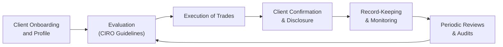

## 7.3 Sales and Trading Conduct

If you’ve ever watched business news and seen stock tickers racing across the bottom of your screen, it can look a little intimidating—maybe even thrilling! That continuous flow of numbers represents thousands of deals and decisions that keep the securities markets alive. Sales and trading are at the heart of this activity, with registered representatives acting as the link between investors and the market. However, that sense of excitement must be tempered by a strong framework of rules and ethical principles to protect clients and maintain market integrity. 

In Canada, CIRO (the Canadian Investment Regulatory Organization) sets the standard for sales and trading conduct for investment dealers and other registered firms. CIRO’s primary focus is safeguarding investor interests, ensuring fair, efficient, and transparent markets. Let’s dig into what “Sales and Trading Conduct” truly means and explore how you, as a registered representative or aspiring finance professional, can follow best practices and avoid pitfalls.

### Why Conduct Matters

Perhaps you’ve seen friends or family get excited—maybe even overly excited—about a “hot tip” for a fast-moving stock. In those moments, it can be tempting to rush in without pausing to question the appropriateness of the trade. The role of a registered representative, however, demands responsible action. Conduct may sound like a formal, almost buzzword-y concept, but it’s the bedrock of trust in financial markets.

If clients believe their representative is acting ethically and in good faith, they’re more likely to participate in the market confidently. And confident, informed investors are crucial for ensuring that our public marketplaces remain vibrant, stable, and accessible to everyone. Good conduct also protects you, the representative, from regulatory penalties and reputational harm. So, it’s a win-win landscape: positive conduct leads to flourishing relationships and a well-functioning market.

### Key Principles of Sales and Trading Conduct

Acting honestly, fairly, and in good faith is not just a nicety—it’s a regulatory requirement. Many of these principles are spelled out explicitly in CIRO rules and guidance. Don’t be fooled by the formality: these guidelines have real-world implications and can make or break your professional reputation.

#### Acting in the Client’s Best Interests

One fundamental principle is that you should always place the client’s interests ahead of your own. This stance is sometimes discussed as a fiduciary-like responsibility, though your exact duty depends on your firm’s policies and the applicable regulations. Regardless, when you’re recommending or executing trades, consider the client’s best interest first. Is the trade suitable based on what you know about their goals, risk tolerance, and financial situation? Have you clearly disclosed fees, potential risks, or conflicts?

Little personal anecdote: I remember once working with a very enthusiastic client who wanted to pour their entire retirement fund into a single tech stock. The client was adamant this was “the next big thing.” But after reviewing their objectives—steady retirement income and moderate risk—it became clear that was just too speculative. Recommending a more balanced approach took more effort and more conversations, but ultimately, it was the right move for them. Sure, they were disappointed at first. But later, they saw the tech stock fall in value due to a rough quarter. They thanked me repeatedly for sticking to my guns and steering them toward something more suitable.

#### Maintaining Honesty and Transparency

Clients have a right to understand what’s happening with their money. Misrepresentation, manipulation, or deception of any kind is expressly prohibited. This includes presenting selective or misleading information about an investment product or strategy. Even an omission—failing to disclose a material risk—can be a serious breach. 

What exactly is material information? It’s any piece of information that could reasonably affect an investor’s decision to buy, hold, or sell securities. If you know it, make sure the client knows it too. For instance, if you’re recommending a corporate bond from a company that recently cut its dividend or replaced key executives amid financial strains, the client would probably want to know. So, don’t hide it. The best practice is to provide all relevant details so the client understands the bigger picture.

#### Proper Disclosure of Fees and Conflicts of Interest

We all know that fees are part of the game. Nobody likes surprises on their bill, though. For that reason, regulatory standards require upfront and clear disclosure of fees, commissions, compensation structures, and conflicts of interest that may arise. A conflict of interest is any situation where your personal or firm-related interests might interfere with delivering unbiased recommendations. If, for example, your firm stands to gain from the sale of a particular product or if you, personally, own shares in a company you’re recommending, that’s a conflict—so it should be properly disclosed.

Many new representatives sometimes worry, “Won’t disclosing conflicts scare my client away?” Actually, being transparent helps build trust. Clients appreciate honesty, even if it means explaining a potential conflict. It shows them you’re committed to being forthright.

#### Suitability of Trades

Suitability is a cornerstone of good conduct. If you’re recommending or executing trades on a client’s behalf, ensure that each trade aligns with that specific client’s profile—objectives, time horizon, risk tolerance, liquidity needs, and knowledge level. CIRO rules emphasize that a generic “one size fits all” approach is unacceptable. 

This means you can’t just toss a hot stock or sector fund into every portfolio or recommend complex derivatives to a novice investor. Instead, each recommendation should be backed by a thorough understanding of the client. Keep in mind that suitability isn’t a one-time process. It’s an ongoing evaluation. Clients’ personal and financial circumstances change over time, so you must conduct regular reviews and adjust recommendations accordingly.

#### Accurate and Timely Record-Keeping

Regulators count on accurate records to verify compliance and investigate possible misconduct. From the very first client interaction to the final trade confirmation, everything must be documented. This can include phone call transcripts, emails, recorded lines (if your firm uses them), order tickets, trade confirmations, and more. The idea is to create a clear paper (or digital) trail of events that ensures accountability.

If someone asks you, “How do I remember all these procedures? They’re so detailed,” you might respond that well-organized processes—and good technology—are your friends. Most firms have integrated systems that record trades automatically and track communications. Let those systems do the heavy lifting so you can focus on client needs and professional judgment.

#### Avoiding Deceptive or Manipulative Practices

“Pump and dump” schemes, front-running, quote stuffing—these are just some of the manipulative behaviors that can occur if individuals try to tilt the market to their advantage. They might look enticing—some shortcuts do—but the risk is enormous, both legally and ethically. CIRO monitors way more than you might think. They use advanced technology to track unusual trading spikes, suspicious patterns, or anomalies.

And yes, you might slip up at times. But if it’s an honest mistake, that’s different from an intentional attempt to deceive the market or your client. The main takeaway: do your best to keep everything above-board, and if you’re unsure about a course of action, consult your firm’s compliance department.

#### Monitoring and Audits by CIRO

CIRO monitors trading activities using real-time surveillance tools, after-the-fact analysis of large trades, and routine spot checks. They also conduct periodic audits, focusing on whether registrants adhere to the required standards. If a breach is discovered, expect swift and potentially severe consequences, like fines, suspensions, or even permanent bans. 

Don’t let that scare you. Think of it this way: these audits are there to weed out bad apples and preserve trust in the industry. If you follow best practices and keep thorough records, you can view audits as straightforward processes rather than cause for panic.

### Visualizing the Compliance Cycle

Below is a Mermaid diagram illustrating the general flow of compliance considerations in a sales and trading environment. It’s a simplified snapshot, but it helps to show how these processes connect:

- A["Client Onboarding   and Profile"]: Where you gather essential Know Your Client (KYC) information.
- B["Evaluation   (CIRO Guidelines)"]: Applying CIRO’s conduct and suitability requirements.
- C["Execution of Trades"]: Placing trades that align with the client’s objectives.
- D["Client Confirmation   & Disclosure"]: Providing trade confirmations, fee disclosures, and any conflict information.
- E["Record-Keeping   & Monitoring"]: Maintaining accurate and up-to-date records for regulatory checks.
- F["Periodic Reviews   & Audits"]: Ongoing scrutiny of accounts and internal processes to ensure compliance.

### Real-World Scenarios and Examples

It’s one thing to talk about these concepts in the abstract—let’s look at a few relatable examples to show how good (or poor) conduct can surface in daily workflows.

#### Example 1: High-Risk Trades for a Conservative Client

Imagine you have a client, Lisa, whose risk tolerance is quite low. She’s saving for her kids’ education and can’t afford substantial losses. You read a glowing market report about cutting-edge biotech stocks that could skyrocket. But these stocks are also incredibly volatile. The question arises: do you recommend them to Lisa? Probably not. Attempting to wedge her into that trade without fully explaining the risks and assessing whether it fits her profile would be a breach of suitability requirements.

#### Example 2: Conflicts of Interest

Suppose your firm underwrites corporate bonds for a listed company, and you personally own shares in that company. If you recommend the client buy more of that same company’s shares, you must disclose that your firm stands to benefit—or that your personal holdings might create a bias. Clients get uncomfortable quickly when they learn of these conflicts after the fact. An upfront heads-up preserves trust.

#### Example 3: Omission of Material Information

Picture a scenario where you learn that a recommended mutual fund is undergoing a management change. The new manager has a track record of investing far more aggressively than the previous manager. Material information? Definitely. Failing to tell your client about this shift before executing a buy order could lead them to feel misled if the fund’s strategy no longer aligns with their comfortable risk level.

#### Example 4: Timely Disclosure and Record-Keeping

Let’s say you place a trade for your client, John, but forget to document the telephone instruction where John actually changed his mind about the number of shares. You then confirm the wrong amount in the system, causing a mismatch. Problems like these can be avoided with accurate notes and confirmations after each major conversation. Even if it seems minor at the time, thorough records can be a lifesaver.

### Common Pitfalls

• Inadequate Disclosure: Incomplete explanations of fees and conflicts, or skipping the mention of material risks.  
• Over-Concentration: Placing too large a portion of a client’s portfolio in one sector or asset type without proper rationale.  
• Lack of Follow-Up: Failing to review client portfolios periodically to update their suitability assessments.  
• Poor Communication: Not confirming trade details in writing or verifying clients' instructions, which can lead to errors and disputes.  
• Neglecting to Update Client Profiles: When a client’s circumstances change—maybe a new job, or nearing retirement—but the account recommendations stay the same.

### Best Practices to Uphold CIRO’s Standards

• Always Compare Products and Strategies: Before recommending anything, check if there’s a better or more cost-effective alternative for the client’s needs.  
• Keep Comprehensive Records: Document the rationale for each trade, along with any client instructions.  
• Review Client Profiles Regularly: People’s lives evolve, so make sure their portfolios keep pace.  
• Embrace Technology: Use customer relationship management (CRM) tools or compliance software to track your notes, reminders, and disclosures.  
• Don’t Hesitate to Seek Advice: If you’re uncertain about regulatory obligations, talk to your firm’s compliance team. They’re there to help you avoid mistakes.  

### Strategies for Overcoming Challenges

• Addressing Conflict of Interest: If you sense a strong conflict, the simplest strategy is full disclosure accompanied by a thorough explanation of how it might influence you. If the conflict is severe, recusal or refusing to transact may be warranted.  
• Dealing with Complex Products: If a product is complicated (like structured notes, options, or exotic ETFs), ensure you understand it thoroughly before discussing it with clients. Provide plain-language explanations and confirm the client truly grasps the risks.  
• Handling Emotional Clients: Some clients might be so emotionally invested in the market that they become irrational. Stay professional and walk them through the logical reasoning behind your recommendations. Invite them to share concerns openly, so you can address them systematically.  
• Trading in Volatile Markets: When markets get choppy, the potential for mistakes or hasty decisions skyrockets. Work with your client to set trading rules or processes in advance so that emotions don’t disrupt long-term goals.

### References for Further Exploration

• [CIRO Conduct and Trading Regulations](https://www.ciro.ca/)  
• “Investment Ethics” by Sarah Peck  
• Online Course: [Ethics in Finance by CFA Institute](https://www.cfainstitute.org/en/ethics-standards)  

These resources go deeper into the ethical and regulatory framework that underpins sales and trading conduct. If you’re looking to develop a robust understanding of your responsibilities and expand your ethical decision-making toolkit, these references are invaluable.

### Glossary

• **Suitability:** Ensuring investment recommendations align with client objectives, risk tolerance, and financial situation.  
• **Conflict of Interest:** A situation where personal interests may compromise professional judgment or client interests.  
• **Material Information:** Information that could reasonably influence an investor’s decision to buy or sell securities.  

### Encouraging a Culture of Integrity

Remember, CIRO’s main goal isn’t to frighten representatives into compliance; it’s to foster a culture of integrity that benefits everyone involved. Ethical mistakes can happen, just as in any profession. But being proactive, seeking guidance, and taking your obligations seriously are the best ways to keep your clients happy, your firm in good standing, and your conscience clear.  

Sales and trading can be exciting—and sometimes nerve-racking. But with the right mix of diligence, empathy, and a “client first” mentality, you can navigate the complexities and create long-lasting relationships built on trust.  

Now that you’ve got a thorough overview of what sales and trading conduct entails under CIRO’s rules, you can step forward with confidence—and maybe a little less trepidation—knowing you have the tools and mindset to serve your clients well and maintain the integrity of Canada’s capital markets.

---

## Test Your Knowledge: Sales and Trading Conduct Essentials Quiz



### Which of the following statements best describes why sales and trading conduct is essential?

- [ ] It saves representatives from having to file paperwork regularly.
- [ ] It fosters competition among firms by encouraging high pressure sales.
- [x] It preserves market integrity and safeguards investor trust.
- [ ] It allows clients to avoid capital gains taxes on securities transactions.

> **Explanation:** Sales and trading conduct ensures the markets operate with fairness and transparency, protecting both investors and the system as a whole.

### What is the primary purpose of a suitability assessment?

- [x] To ensure investment recommendations align with the client’s risk tolerance and objectives.
- [ ] To discover interesting stocks that offer the highest commissions for the representative.
- [x] To make sure the client understands any trades before they are executed.
- [ ] To give the advisor a chance to discuss personal interests with the client.

> **Explanation:** Suitability assessments make sure the recommended investments are appropriate based on a client's unique profile, including risk tolerance, financial situation, and goals. Additionally, representatives must ensure clients understand these trades before executing them.

### Which of the following is an example of a conflict of interest?

- [x] A representative’s firm underwriting shares from the same company that the rep recommends to clients.
- [ ] A client displaying a preference for dividend-paying stocks in a low-yield environment.
- [ ] A representative checking the client’s risk profile annually.
- [ ] A client requesting trades that align with their stated objectives.

> **Explanation:** A conflict of interest arises when a firm or representative stands to benefit personally from a recommendation, which may compromise the objective judgment needed to serve the client’s best interests.

### If a representative has personal investments in a security they are recommending, what is the best practice?

- [x] Disclose the personal holdings to the client and explain how this potential conflict is managed.
- [ ] Sell those personal holdings quietly right after making the recommendation.
- [ ] Encourage the client to buy the security so the representative can profit more.
- [ ] Do nothing, as it is not relevant to the client.

> **Explanation:** Representatives must disclose any conflicts of interest, including personal holdings, so clients can make an informed decision about whether that conflict influences the recommendation.

### Why is record-keeping such a critical aspect of sales and trading conduct?

- [x] It provides a reliable audit trail to demonstrate compliance and resolve potential disputes.
- [ ] It helps the advisor remember which investments are trending on social media.
- [x] It ensures that regulators like CIRO can verify trade validity and investigate anomalies.
- [ ] It delays the settlement process until all records are complete.

> **Explanation:** Accurate records are essential for accountability, regulatory reviews, and dispute resolution. They also let regulators verify that you are meeting all required conduct standards.

### What constitutes material information that must be disclosed to clients?

- [x] Any detail that a reasonable investor would consider important in making an investment decision.
- [ ] Only historical earnings growth that has already been publicly reported.
- [ ] Personal vacations or events that might affect the representative’s availability.
- [ ] Stock quotes from the previous trading day.

> **Explanation:** Material information includes all facts—quantitative or qualitative—that could significantly impact an investor’s choice to buy, hold, or sell securities.

### Which scenario illustrates improper conduct?

- [x] A representative recommending leveraged ETFs to a client with a conservative risk tolerance.
- [ ] A representative fully disclosing fees and commissions before finalizing the trade.
- [x] A representative neglecting to update a client’s file after they inherit a substantial sum.
- [ ] A representative documenting trade instructions thoroughly via emails and notes.

> **Explanation:** Recommending a product that clearly doesn’t match a conservative profile and failing to update critical client profile changes are both examples of improper conduct.

### Which action best demonstrates good faith in dealing with clients?

- [x] Providing clear, accurate explanations of the risks involved in a recommended investment.
- [ ] Basing recommendations solely on a hunch that a stock will rise unexpectedly.
- [ ] Encouraging clients to follow a manager known for extremely aggressive approaches with no mention of potential downsides.
- [ ] Omitting mention of additional fees if you think they’re too small to matter.

> **Explanation:** Acting in good faith involves honesty and transparency, especially about fees and risks. It requires putting the client’s interests first, even when it might be inconvenient.

### How can a representative help ensure trades align with a client’s changing life circumstances?

- [x] Conduct periodic reviews and update their Know Your Client (KYC) information regularly.
- [ ] Suggest the same fund to all clients, regardless of their profiles.
- [ ] Disallow client changes to trades once an initial plan is established.
- [ ] Only adjust trades when the client complains.

> **Explanation:** People’s goals and situations evolve over time, so regularly revisiting and updating KYC data ensures continuing suitability of recommendations. 

### CIRO’s primary goal in monitoring sales and trading conduct is:

- [x] True
- [ ] False

> **Explanation:** CIRO’s core mission is to protect investors and maintain market integrity through consistent monitoring and enforcement of standards.


