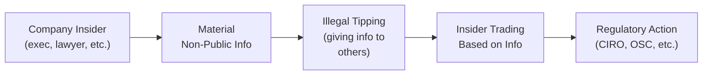
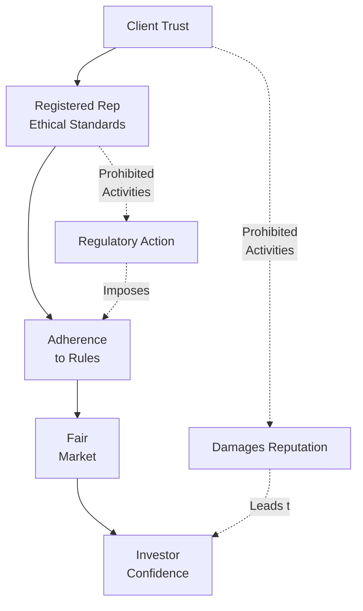

## 7.4 Prohibited Activities

Maintaining a fair and transparent trading environment stands at the very heart of the Canadian securities industry. Trust me, I’ve seen what happens when that environment is compromised—clients lose confidence, regulatory bodies crack down, and the entire market can briefly look like a house of cards. More than ever, upholding strict standards of conduct is essential. To help guide you, this section details the core prohibited activities as outlined under the Canadian Investment Regulatory Organization (CIRO) rules, along with some practical advice to avoid the pitfalls. You’ll also find real-world examples, tips on how to spot red flags, and suggestions for staying on the right side of compliance.

---

### Why Prohibited Activities Matter

Well, I once heard a story about an eager new trader who believed skirting the rules might give him a shortcut to success. Initially, everything seemed fine, but eventually the regulatory authorities stepped in. That newcomer not only lost his license but also faced financial penalties that took years to pay off. It was a classic cautionary tale: short-lived gains from prohibited conduct almost always lead to severe consequences. 

When we talk about “Prohibited Activities,” we’re referring to behaviors that violate securities laws, ethical standards, or CIRO rules. They often undermine the trust investors place in the markets, limit fairness, and can drastically harm both clients and the broader financial community. Let’s break down these key activities.

---

### Insider Trading

Insider Trading is arguably the most well-known form of securities violation. It occurs when someone trades a security (or encourages someone else to trade) based on material, non-public information. This “material” information can be anything—upcoming mergers, major lawsuits, changes in senior management—that could affect a company’s share price if it became public.

• Example: Suppose you’re an executive at a tech firm that’s about to announce a revolutionary product. If you buy shares (or tip off your cousin) before the product news goes public, that’s insider trading.

• Consequences: Severe. Under Canadian law, insiders caught trading on non-public information can face fines, imprisonment—or both. Penalties have become harsher over the years to deter potential offenders. 

• Red Flags: Receiving an urgent call to trade a stock right after overhearing a private corporate conversation, or noticing unusual price movements just before major corporate news is released. 

Below is a simple diagram illustrating the flow of inside information that can lead to prohibited insider trades:

#### Best Practices to Avoid Insider Trading:
• If you receive non-public, material information, do not trade on it until it’s publicly disclosed.  
• Avoid discussing confidential information with friends or family—even a hint can land you in legal jeopardy.  
• Immediately report any suspicious conversations or transactions to your firm’s compliance department.  

---

### Market Manipulation

Market manipulation involves a range of practices that artificially move security prices up or down to deceive investors. You might have heard about “pump-and-dump,” where fraudsters hype up a stock, drive up the price, then sell off, leaving unwitting investors with overpriced shares. 

Other forms include “spoofing,” where large orders are placed and canceled quickly to create a false sense of demand or supply, and “wash trading,” in which an individual or firm essentially trades with itself to simulate market activity. All these manipulative trades undermine the principle of free and fair price discovery.

• Example (Pump-and-Dump): A fictitious scenario might involve a small biotech company with low market liquidity. Fraudsters accumulate a large position, publish overly positive research or rumors on social media, watch retail investors pile in, and then unload their shares at artificially inflated prices.

• Example (Spoofing): A trader places a massive sell order to drive the market price down, causing other participants to panic and sell. Then, the manipulator cancels the large sell order at the last second and snaps up cheaper shares.

#### Consequences:
Market manipulation is taken very seriously by regulators, including the Ontario Securities Commission (OSC) and CIRO. Offenders can face fines, trading suspensions, or permanent bans. In criminal cases, custodial sentences can be imposed.

#### Spotting Market Manipulation:
• Abrupt and unexplained price swings.  
• Large block orders appearing and disappearing (“spoofing”).  
• Public messages inciting people to buy or sell based on hype rather than fundamentals.

---

### Front Running

Front running occurs when a Registered Representative or anyone with inside knowledge of a large pending order places a personal or proprietary trade ahead of the client’s trade. This can happen if, for instance, you learn that a significant institutional order is about to hit the market, which you know will move the stock price quickly in one direction. Trading for your own benefit first is strictly forbidden.

• Case in Point: Imagine you work at a brokerage and see a sizeable client order to buy shares of Company X at market open. Knowing this will likely raise the share price, you slip in your own buy order right before. Though maybe tempting if you’re unscrupulous, it’s absolutely against the rules.

• Regulatory Stance: In line with both securities laws and CIRO rules, front running is a breach of fiduciary duty and a conflict of interest. Severe fines, prohibitions, and potential criminal charges can follow if discovered.

---

### Churning

Churning typically refers to excessive trading in a client’s portfolio to generate commissions, without a corresponding benefit to the client. It’s often driven by unscrupulous advisors seeking higher commissions from frequent buying and selling. 

• Indicators of Churning:
  - Unusually high trading volume in a relatively small account.  
  - Discrepancy between commissions earned and the client’s portfolio value.  
  - Frequent turnover rates that are disproportionate to the client’s goals.  

• Client Impact: Churning can lead to inflated fees, reduced net returns, and, quite frankly, a major erosion of trust in the advisor-client relationship.

---

### Unauthorized Trading

Unauthorized trading is executing trades without explicit client approval or beyond the scope of the client’s instructions. This one can be surprisingly tricky—sometimes, well-meaning advisors might assume a client is fine rebalancing or adding a position without a final “green light.” But if you do it without that client’s explicit go-ahead, it’s a violation.

• Example: A Registered Representative sees a short-term opportunity in an energy stock and decides to buy it in a client’s account, rationalizing that “the client would be fine with it.” But if the client didn’t grant discretionary authority or specifically authorize this trade, it’s prohibited.  

• Consequences: Violations may result in fines, suspensions, and even termination by the employing firm. In severe cases, fraud charges may be pursued if it’s found the representative deliberately acted against client instructions for personal gain.

---

### Reporting Suspicious and Prohibited Activities

Anytime you notice potentially prohibited conduct—like suspicious trading practices, questionable instructions, or red flags pointing to possible insider trading—remember that you have an obligation to report these to both your firm’s compliance department and, if warranted, the relevant regulatory authorities. Doing so not only helps protect you from regulatory scrutiny if the misconduct comes to light later, but it also supports the integrity of the entire marketplace.  

• Key Steps:
  1. Document everything: times, dates, who said what, and the nature of the suspicious behavior.  
  2. Immediately notify your branch manager or compliance officer.  
  3. Follow up to ensure that the matter is properly escalated if necessary.  

---

### Glossary

• **Insider Trading:** Trading securities based on non-public, material information.  
• **Market Manipulation:** Activities intended to deceive investors by artificially affecting market prices (e.g., pump-and-dump, spoofing).  
• **Front Running:** Trading ahead of client orders for personal gain.  
• **Churning:** Excessive trading to produce higher commissions without prioritizing client benefit.

---

### Supporting Visual: How Prohibited Activities Undermine Market Integrity

In this flow, the direct path from client trust (A) to investor confidence (E) relies on the ethical standards (B) and adherence to rules (C). Prohibited activities, shown as dashed lines, can derail this process, undermining market fairness and forcing regulatory actions that can ultimately damage the entire market ecosystem.

---

### Practical Tips for Avoiding Ethical Traps

• Know the Rules: Keep a copy of relevant CIRO regulations and your firm’s compliance manual handy.  
• Stay Transparent: If you’re unsure about a potential conflict of interest or trade, talk it through with your compliance department.  
• Think Long-Term: Ethical lapses may seem profitable in the short term, but they can rapidly derail your entire career.  
• Keep a Paper Trail: Document your decisions and communications with clients. That “paper trail” can protect you if something is questioned later.  

---

### Real-World Example: A Cautionary Tale of Market Manipulation

A few years ago (strictly for illustration), there was a story about an online chat group that hyped a small mining stock. Many buyers rushed in, pushing the price up. What they didn’t notice was that some group organizers were shrewdly offloading their own considerable position. When all was said and done, the small investors were left holding inflated shares, while the manipulators moved on with their profits. The regulators eventually traced the trades back to the originators, and they faced stiff penalties, including fines and trading bans. That short-lived hype was anything but worth it.

---

### How This Ties Into Other CPH® Topics

Within Chapter 7, we’ve already explored “How Securities Are Traded” (7.1) and “Types of Orders” (7.2). Prohibitions on insider trading, manipulation, and other unethical behaviors apply to all corners of trading—whether it’s market orders, limit orders, or anything else. You’ll also find relevant guidelines in other chapters:

• Chapter 4, “Working with Clients,” covers the significant client-relationship aspects that help you communicate fairly and avoid unauthorized trading.  
• Chapter 5, “Client Discovery and Account Opening,” helps you understand your client’s objectives and the proper way to gather instructions. Doing this thoroughly is one of the best defenses against churning or unauthorized trades.  
• Chapter 6, “Product Due Diligence, Recommendations, and Advice,” addresses suitability, ensuring that every investment you recommend aligns with the client’s risk profile and objectives—another shield against accusations of churning or shady practices.

---

### References for Further Exploration

1. [CIRO Enforcement Actions and Guidelines](https://www.ciro.ca/) — Official source for SRO enforcement procedures, hearing decisions, and compliance best practices.  
2. Market Manipulation and Insider Trading by Janet Austin — Comprehensive academic book detailing various forms of manipulation, legal frameworks, and high-profile cases.  
3. Online Course: [Compliance and Regulatory Environment by CSI](https://www.csi.ca/student/en_ca/courses/csi/compliance.xhtml) — An excellent resource for diving deeper into Canadian securities regulations.  

---

### Final Thoughts

At the risk of sounding dramatic, there’s really no bigger “career killer” in finance than indulging in unethical or illegal activities. Don’t let haste, greed, or misguided advice lead you down a path that can unravel everything you’ve worked so hard to achieve. Prohibited activities like insider trading, market manipulation, front running, churning, and unauthorized trading exist in a zone that can turn your life upside down in a heartbeat.  

If you ever find yourself in doubt, remember: ask questions. Consult your compliance department. No one expects you to have every single regulation memorized, but you are expected to act in good faith. By staying vigilant and putting your clients’ best interests first, you can build trust, foster positive client relationships, and maintain a long, successful career in the Canadian securities industry.

---

## Test Your Knowledge: Prohibited Activities and Regulatory Compliance Quiz



### Which of the following best describes insider trading?

- [x] Using material, non-public information to trade a security.
- [ ] Avoiding trades that violate fiduciary duties.
- [ ] Engaging in large block trades through normal market channels.
- [ ] All trading activity intended to generate commissions.

> **Explanation:** Insider trading specifically involves using material, non-public information. This is fundamentally unfair to other investors and is strictly prohibited.

### What is a classic hallmark of churning in a client’s account?

- [x] Excessive trading primarily designed to increase commissions.
- [ ] Trading a balanced portfolio to achieve the client’s investment goals.
- [x] Unjustifiably high turnover rate leading to inflated fees.
- [ ] Placing limit orders to reduce risk.

> **Explanation:** Churning is identified by excessive trading to generate commissions. Unjustifiably high turnover rates are a key indicator.

### Which of the following is an example of market manipulation?

- [x] “Pump-and-dump” schemes that drive up a stock price before selling.
- [ ] Regular rebalancing of a portfolio for proper asset allocation.
- [ ] Selling shares with the client’s authorization during normal volatility.
- [ ] Holding a long-term position in a blue-chip stock.

> **Explanation:** Pump-and-dump is a classic market-manipulation scheme that misleads investors regarding the true value of a security.

### Which action best describes front running?

- [x] Executing trades for one’s personal account ahead of a large client order.
- [ ] Selling short to protect against downward price movement.
- [ ] Verifying stock symbols with operational staff prior to trades.
- [ ] Providing timely reports to the compliance department.

> **Explanation:** Front running occurs when you trade for your own account based on advance knowledge of a pending client order that could move the market.

### Which of the following is a red flag for market manipulation?

- [x] Large buy or sell orders quickly placed and canceled (spoofing).
- [ ] Receiving official documentary proof that a corporate acquisition was publicly announced.
- [x] A sudden and unexplained spike in share price followed by a rapid decline.
- [ ] A gradual, stable price increase over several years linked to company fundamentals.

> **Explanation:** Spoofing and abrupt, suspicious price spikes or declines without any material news often signal attempts at manipulation.

### Unauthorized trading refers to:

- [x] Executing trades lacking client approval or instructions.
- [ ] Cancelling trades that breach regulations.
- [ ] Using a discretionary power authorized by the client.
- [ ] Making suitable recommendations for which the client has provided prior consent.

> **Explanation:** Unauthorized trading is any trade executed without explicit client permission or beyond the scope of their instructions.

### Which of the following scenarios describes front running and not insider trading?

- [x] A Registered Rep sees a large client order, then trades on their personal account just before placing the client order.
- [ ] A corporate director buys shares based on confidential merger news.
- [x] A firm’s proprietary desk buys shares ahead of a client order to make a profit.
- [ ] A senior employee uses knowledge of undisclosed financial statements to sell shares.

> **Explanation:** Although both are unethical, front running specifically involves trading ahead of a known client transaction. Insider trading involves exploiting undisclosed material info.

### Churning can hurt clients by:

- [x] Generating excessive commission costs.
- [ ] Ensuring better diversification in their portfolio.
- [ ] Reducing risk exposure to market volatility.
- [ ] Encouraging long-term investing strategies.

> **Explanation:** Churning primarily exists to increase commissions, often leading to suboptimal, expensive transactions that undermine client returns.

### What is a common consequence of insider trading if discovered by regulators?

- [x] Fines, imprisonment, and permanent trading bans.
- [ ] Praise for astute trading decisions.
- [ ] Minimal penalties and a warning letter.
- [ ] Mandatory continuing education but no fines.

> **Explanation:** Insider trading is a severe offense, typically subject to major financial and criminal penalties.

### CIRO requires that suspicious or unethical trading activities be reported to:

- [x] The firm’s compliance department and relevant authorities.
- [ ] Only the affected client’s partner or spouse.
- [ ] No one, as it is up to the employee’s discretion.
- [ ] Social media forums specializing in stock picking.

> **Explanation:** Part of a Registered Representative’s duty is to promptly inform compliance personnel, and, if needed, regulators, about any suspicious activities.


