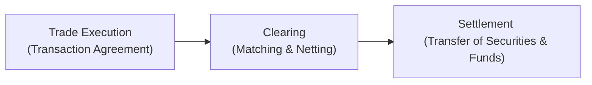
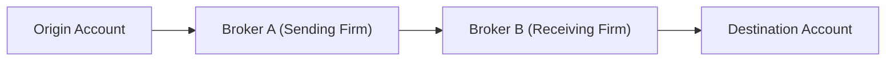
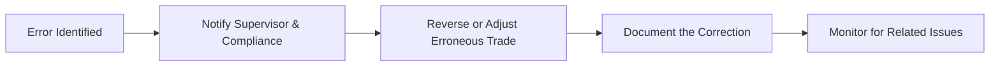

## 7.5 Settlements, Transfers, and Corrections

Settlements, Transfers, and Corrections might sound a bit dry, but—believe me—they’re absolutely crucial to running a smooth operation in the securities industry. Once I mixed up the settlement date for a client’s equity purchase, and let’s just say it was a lesson learned on how a single slip can lead to stressful phone calls, delayed transactions, and potential financial loss. So let’s walk through the key concepts, address nuances around T+2 settlement (trade date plus two business days), and figure out why these processes matter to anyone involved in the Canadian capital markets, from new advisors to well-seasoned professionals.

Remember that if you need more foundation on how securities are traded, you can check out section 7.1, “How Securities Are Traded,” in this chapter. And if you’re unsure about any compliance or rule-based references, CIRO (the Canadian Investment Regulatory Organization) is the current national self-regulatory organization overseeing these activities.

  
### Understanding Settlement

Settlement is all about finalizing a trade—that is, delivering securities from the seller to the buyer and transferring funds from the buyer to the seller. This is like the final handshake in a deal. You can think of the settlement process as the moment when all the “I’ll do this” and “you’ll do that” talk becomes real-world action.  

In Canada, the standard settlement cycle for most equity and debt trades is T+2. The clock starts ticking on the trade date itself (the “T”) and runs through the next two business days. By the settlement date, the buyer must have the money in their account, and the seller must make the securities available.  

  
### Settlement Cycle in Canada (T+2)

The T+2 concept is simple in theory, but it requires close coordination among clients, investment dealers, custodians, and the Canadian Depository for Securities (CDS), which handles clearing and settlement. Let’s break it down:

• T (Trade Date): The investor places an order. Once the trade is executed, the clock begins.  
• T+1: Clearing occurs, meaning trade details are matched and verified by a clearing agency (often through CDS services). This is like double-checking the “label” on the package before shipping.  
• T+2 (Settlement Date): Securities and funds are exchanged.  

If one party fails to deliver securities or cash on time, we call that a settlement “fail.” Sometimes, fails can lead to penalty fees, interest charges, or regulatory scrutiny. CIRO expects registrants to keep a tight watch on potential fails to maintain market integrity.

  
### The Settlement Process

Below is a simplified diagram showing the typical settlement flow from trade execution to final settlement:

1. Trade Execution: The buyer and seller negotiate and confirm the terms (price, quantity, etc.).  
2. Clearing: The clearing system verifies trade details, nets buyer and seller obligations, and ensures everyone knows what they owe or must deliver.  
3. Settlement: The actual exchange of securities and funds happens, typically on T+2.  

Investment dealers need to confirm trades with clients promptly and ensure the correct settlement instructions go to the clearing agencies. Knowledge of settlement procedures is vital, so if you’re new in a back-office or middle-office role at a broker-dealer, this is where you’ll be spending a lot of your time (and possible late nights each quarter-end).

  
### The Role of Clearing Agencies

Clearing agencies—namely the Canadian Depository for Securities (CDS) in Canada—act like the behind-the-scenes matchmaker. They ensure each trade is properly matched, netted, and confirmed, so by T+2, everything is lined up for a smooth settlement. If you’re curious for more detail, the [CDS website](https://www.cds.ca/) is a great place to check out official policies and guidelines.

  
### Potential Settlement Risks

As diligent as you try to be, certain risks can pop up:

• Counterparty Risk: One party might default by failing to deliver securities or funds.  
• Operational Risk: An innocent data entry error could lead to incorrect instructions.  
• Regulatory Risk: Delays or repeated settlement issues can invite scrutiny from CIRO or provincial securities commissions.  

To mitigate these, ensure robust internal checks, client confirmations, and timely documentation.

  
### Transfers: Movement of Securities

Transfers are a whole different flavor of post-trade operations. A “transfer” occurs when investors move securities between accounts—maybe switching from one brokerage to another or consolidating multiple accounts.

I once had a client who wanted to move all her holdings from an old brokerage to her new discount brokerage account, but she had never done it before. Walking her through the transfer forms and the statements required was simple enough, but it took a few days and clear communication to ensure each of her holdings arrived exactly as expected.  

Below is a simplified look at how a transfer might flow within or between brokerage firms:

The essential steps for a successful account transfer often include:  
• Completing a transfer instruction form.  
• Providing account details, such as the account number at the receiving institution.  
• Notification and verification between both the sending and receiving institutions.  

Note: If you’re dealing with a registered account (like an RRSP, TFSA, or RRIF in Canada), you’ll likely have to follow extra rules regarding tax implications or special account designations.

  
### Types of Transfers

• In-house Transfer: Moving holdings within the same brokerage firm from one client account to another.  
• ACATS Transfer: A more automated procedure (often in the U.S.) using the Automated Customer Account Transfer Service.  
• Manual Transfer: For certain small brokerages or complex holdings, manual processes might still apply.  

CIRO (and historically IIROC and MFDA) expects that you handle transfers efficiently, confirm instructions carefully, and keep all necessary documentation easily traceable in case of an audit or client inquiry.

  
### Transfer Documentation

Proper documentation is crucial—especially in Canada’s current environment, where privacy laws and data handling requirements are quite stringent. Securely store any sensitive docs. This helps keep your brokerage on the right side of regulatory compliance and fosters solid client relationships.  

  
### Corrections

Mistakes happen: maybe the wrong date, maybe the wrong quantity, or maybe a stray transposition error in a ticker symbol. It can cause real headaches if not addressed promptly. That’s where corrections come in.  

A correction could involve:  
• Fixing a trade allocation error (e.g., the trade went to the wrong client account).  
• Adjusting a settlement instruction (wrong settlement currency? wrong settlement date?).  
• Correcting an erroneous ledger entry that might have your system out of balance.  

Regardless of how small the error, the process usually involves immediate identification or discovery, quick reporting to your compliance team and supervisor, and a methodical approach to reversing or adjusting the error.  

**Why does speed matter?** Well, corrections can snowball if left unchecked. When trades settle incorrectly, the resulting chain reaction can lead to margin calls, unhappy clients, or compliance concerns.  

  
### Handling Trade Errors

Within your firm, you might have a “trade error account” or a similar mechanism for quarantining erroneous trades. CIRO guidelines say that any losses or profits from these errors must be carefully documented, so they don’t get hidden or misapplied in a client account.  

Here’s a simplified look at the typical correction workflow:

  
### Real-World Examples

• A missing letter in a stock ticker: This might lead to buying the wrong security. The settlement instruction would also be wrong, so a correction is required to reverse the trade and rebook under the correct ticker.  
• Wrong settlement currency: If a trade was marked to settle in USD but it should have been CAD, the mismatch can create a fiasco in your ledger, especially if the date passes, leading to foreign exchange friction.  
• Late trade reporting: Clients not informed about the correct settlement date sometimes fail to deposit adequate funds, leading to a settlement fail.  

  
### Best Practices

• Double-check client instructions before trade execution.  
• Promptly confirm the transaction details with the client and the clearing agency.  
• Monitor daily reports for anomalies or unmatched trades.  
• Stay current with all CIRO rules.  
• Document every step if a correction is needed—lack of internal documentation is a huge pitfall.  

As a registered representative or a branch manager, maintaining an organized process for settlement, transfers, and corrections keeps you off the radar for compliance issues and ensures satisfied clients.

  
### Conclusion

Settlements, Transfers, and Corrections might not be the most glamorous sides of trading, but they truly form the backbone of a well-functioning securities market. Canada’s T+2 settlement cycle keeps trades moving efficiently, yet it also demands that advisors and back-office teams pay close attention to detail. The same holds true for transfers—proper forms and transparent communication can keep your clients’ transitions from one account (or one firm) to another as smooth as possible.  

Finally, we all make errors, but it’s how quickly and carefully we fix them that sets a professional tone for the industry. So take these best practices to heart, and you’ll handle the post-trade world like a pro.

  
### Glossary

• **Settlement:** The completion of a securities transaction through the transfer of securities and funds.  
• **T+2:** Standard settlement cycle indicating trade date plus two business days in Canada.  
• **Transfer:** Movement of securities between accounts or institutions.  

  
### Resources for Further Exploration

• [Canadian Depository for Securities (CDS)](https://www.cds.ca/)  
• “Securities Operations: A Guide to Trade and Position Management” by Michael Simmons  
• [Securities Settlement and Clearing by CSI](https://www.csi.ca/student/en_ca/courses/csi/settlement.xhtml)  

  
## Settlements, Transfers, and Corrections Quiz: Boost Your Expertise



### Which of the following best defines the T+2 settlement cycle in Canada?

- [x] Trades settle two business days after the trade date.  
- [ ] Settlements happen two hours after the trade date.  
- [ ] Every second trade is settled immediately.  
- [ ] Trades require only one business day to settle.  

> **Explanation:** T+2 stands for “trade date plus two business days,” meaning the transaction is finalized on the second business day after the day the trade is executed.

### What is a primary role of the Canadian Depository for Securities (CDS) in the settlement process?

- [ ] To provide tax guidance for investors.  
- [x] To match and clear trades, facilitating the transfer of securities and funds.  
- [ ] To set interest rates for brokerage margin accounts.  
- [ ] To oversee direct investor complaint resolution.  

> **Explanation:** CDS handles the logistical and operational aspects of matching and clearing trades, ensuring that when settlement day arrives, everything’s lined up for a smooth handover of securities and funds.

### What is the key difference between clearing and settlement?

- [ ] Clearing involves matching trades, while settlement is only about personal client identification.  
- [x] Clearing is the process of matching and netting trades; settlement is the actual exchange of securities and funds.  
- [ ] Clearing is optional, whereas settlement is mandatory.  
- [ ] Clearing and settlement are two names for the same process.  

> **Explanation:** Clearing handles the administrative tasks (verifying, matching, netting trades), and settlement is the final step where securities and funds physically (or electronically) change hands.

### What might happen if a trade fails to settle due to lack of funds or delivery of securities?

- [ ] It is automatically canceled without consequence.  
- [ ] The client’s bank account is permanently closed.  
- [ ] CIRO does not allow trades to fail under any circumstances.  
- [x] Penalties, interest charges, or regulatory scrutiny can occur.  

> **Explanation:** Failing to meet settlement obligations can lead to financial penalties and raise red flags with regulators who keep a close eye on settlement efficiency.

### Which of the following is a recommended best practice for handling transfers of securities between client accounts?

- [x] Obtain a completed transfer instruction form and confirm account details.  
- [ ] Use handwritten notes without official forms to save time.  
- [x] Notify both the sending and receiving institution.  
- [ ] Transfer securities without informing clients.  

> **Explanation:** Proper forms and notifying each institution ensures the transfer is accurately processed. Client agreements and documentation help prevent errors, delays, and compliance issues.

### What is the main purpose of a trade error account?

- [x] To track and correct erroneous trades without involving client accounts.  
- [ ] To store short-term investments for the firm’s treasury.  
- [ ] To hide major losses from regulatory bodies.  
- [ ] To automatically reconcile all trade records daily.  

> **Explanation:** Trade error accounts isolate misbooked or erroneous trades so that the adjustments remain transparent and separate from legitimate client holdings.

### A client’s securities are being moved from Broker A to Broker B. If the client provided incorrect account information for the receiving broker, what is MOST likely to happen?

- [x] The transfer may be delayed until corrected information is provided.  
- [ ] The securities will settle early.  
- [x] The transfer is blocked by Broker B until correct details are submitted.  
- [ ] The transfer is canceled and prohibited from being initiated again.  

> **Explanation:** Inaccurate info can create a roadblock. The old firm can’t safely move the holdings until the new broker confirms correct credentials, resulting in a standstill until all details align.

### Which scenario would require a correction procedure?

- [x] A transposition error in a ticker symbol resulting in the wrong security purchased.  
- [ ] A client depositing correct funds in the correct account.  
- [ ] A trade completed on the correct date with perfect settlement.  
- [ ] A client closing an account with zero mistakes.  

> **Explanation:** A ticker symbol error can lead to buying the wrong security, so reversing and rebooking the trades is necessary to fix the mismatch.

### When a correction is needed due to misallocated trades, which step is crucial?

- [x] Documenting the error and correction thoroughly.  
- [ ] Keeping the correction secret from the compliance department.  
- [ ] Relying on a verbal agreement to fix the issue next month.  
- [ ] Ignoring it because the client will never know.  

> **Explanation:** Proper documentation allows for a transparent audit trail, ensuring the firm remains compliant with CIRO and other regulatory guidelines.

### Corrections should be initiated:

- [x] As soon as the error is discovered.  
- [ ] Solely at month-end or quarter-end.  
- [ ] After the market closes for the year.  
- [ ] Only when a client complains.  

> **Explanation:** Quick action prevents further complications, additional cost, and regulatory concerns. Prompt corrections maintain client trust and uphold market integrity.


