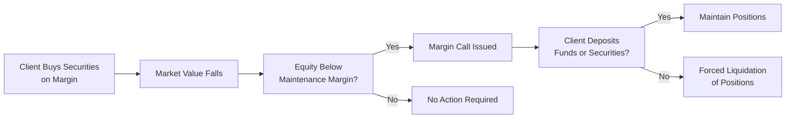
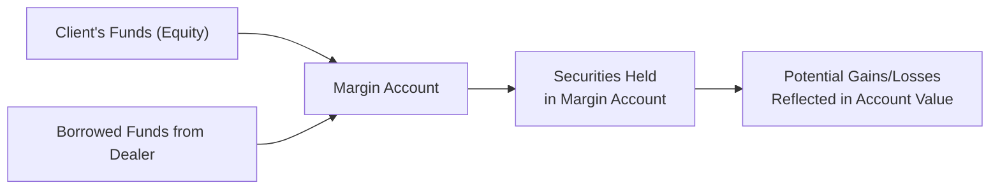

## 8.2 Margin Accounts

Margin accounts can feel like a game changer for clients who want to amplify their investment power. By borrowing funds from an investment dealer—using purchased securities as collateral—a client potentially boosts returns. But as you may suspect, it’s not always rainbows and roses. The flip side is that margin accounts increase exposure to losses, and that can lead to margin calls or even forced liquidation. In this section, we’ll explore the mechanics, risks, regulations, and best practices surrounding margin accounts so you can support your clients safely and confidently.

### Core Concept of Margin Accounts

A margin account is essentially a brokerage account where your client puts up a certain amount of their own cash or securities (referred to as “equity”), and the dealer loans them the rest. I remember once, a friend of mine was convinced she found the next big technology stock. She had the funds to buy 500 shares outright, but with margin, she could finance up to 1,000 shares. Her upside potential was doubled—so was her exposure to downside risk.

To fund this transaction, the investment dealer extends credit. The securities in the account act as collateral for that loan. Thus, the relationship here is a bit like a mortgage: The lender (dealer) gives money in exchange for an interest charge, and the asset (securities) is pledged. But since stocks are more volatile than houses, margin accounts come with strict rules.

### Margin Account Risks

When you buy securities on margin, the greatest allure is magnified returns. But the market doesn’t always cooperate. If it goes in the wrong direction, the losses will also be magnified. In extreme conditions, it’s possible to lose more than the money your client originally invested. That’s why margin account holders must be intimately aware of:

• Potential Negative Equity: If the value of the securities plummets, clients may owe the dealer more than they invested.  
• Triggered Margin Calls: If the account’s equity dips below the required maintenance margin, the client will be asked to deposit more funds or securities.  
• Forced Liquidation: If the client fails to meet margin call requirements, the dealer can liquidate positions—often rapidly—to protect both parties. Unfortunately, it can happen right when the market is at its worst.

### Regulatory Framework Under CIRO

Since January 1, 2023, CIRO (the Canadian Investment Regulatory Organization) became the single self-regulatory organization overseeing Canada’s investment dealers and mutual fund dealers. Under CIRO's guidelines (which replaced all historical MFDA and IIROC references), margin lending and leverage practices are closely monitored to:

• Protect clients from excessive risk-taking.  
• Mitigate systemic risk in the financial markets.  
• Ensure uniform standards for margin requirements.

These regulations don’t stand alone. Provincial securities commissions also have leverage limits and margin requirements. If you get curious and want more details, the official [CIRO Margin Requirements and Guidelines](https://www.ciro.ca) page is an excellent reference point.

### Margin Requirements

Dealer members must follow CIRO (and applicable provincial) requirements regarding:

• Initial Margin: The minimum equity required to open a margin position. Suppose a security has a 50% initial margin requirement. For a $10,000 purchase, the client must have at least $5,000 of their own funds.  
• Maintenance Margin: The ongoing equity level needed to keep the account open. For certain stocks, CIRO might set a maintenance margin requirement of 30%. If the client’s equity dips below 30% of the portfolio’s total value, the dealer issues a margin call.

To visualize how this works, consider the following formula for equity in the account:


\text{Equity} = \text{Market Value of Securities} - \text{Borrowed Amount}


At any point, your client’s equity must stay above the maintenance margin threshold. If markets are committing a “sudden dive,” the equity might tumble and prompt a margin call.

### The Margin Call Procedure

Put bluntly, a margin call is a blinking red alert telling your client that their account is under-collateralized. The sequence goes like this:

1. The securities’ value drops (or the borrowed amount increases due to additional margin usage).  
2. The client’s equity falls below the maintenance margin threshold.  
3. The dealer issues a margin call, requesting the client to deposit more cash or securities immediately.  
4. If the client doesn’t meet the requirement within the stated timeframe, the dealer can liquidate positions—no ifs, ands, or buts.

Here is a small flowchart to portray the life cycle of a margin call:

The key teaching point here is the sense of urgency customers should have when they receive a margin call. Surprising them with “Oh, your positions are closed—sorry about that” is the situation you want to avoid. Frequent communication is crucial.

### Monitoring and Ongoing Compliance

To safeguard firm and client, a vigilant oversight system is essential. Dealers need to:

• Monitor margin accounts daily, or even intraday under volatile conditions.  
• Promptly inform clients if their accounts fall below required margin levels.  
• Document each margin call notification, including how the request was conveyed.  
• Offer a time window (as established by CIRO) for the client to meet the margin call.

Failure to meet these obligations could expose the dealer to compliance issues, reputational harm, and potential claims from clients. Proactive risk management is your best friend here.

### Terms, Conditions, and Documentation

You can’t just open a margin account for a client without explaining the fine print. And let’s face it: read-the-fine-print can feel boring. But it is essential for your client’s protection—and for the dealer. Margin account documentation should include:

• Terms and Conditions: Clarify interest rates, allowable securities, margin requirements, and fees.  
• Client Obli­gations: Include clear language explaining that the client owes the debt, even if the securities lose value.  
• Dealer Rights: Spell out the right to issue a margin call and the ability to liquidate without prior client approval if needed.  
• Risk Disclosures: Provide a thorough list of “what could go wrong.”  
• Signature Acknowledgments: Both the client’s and the dealer’s rep need to sign off on the account agreement to confirm they’ve each reviewed and understand the terms.

### Interest Rates and Costs

Clients may forget that margin accounts come with ongoing costs. The borrowed funds accrue interest, which is typically charged monthly. If a client hopes to hold positions long term on margin, that interest expense can stack up quickly. It’s good practice to walk clients through a realistic “cost of funds” scenario. For example:

• If the margin loan rate is 8% annually and the client borrowed $10,000, the carrying cost is $800 per year.  
• If the underlying security doesn’t perform well enough to offset that $800, the margin strategy might end up in the red, even if the stock is up slightly.

### Potential Pitfalls

Even the most seasoned pros know margin accounts can be tricky. A few pitfalls to keep in mind:

• Over-Leverage: Tempted to borrow the maximum? That can be a recipe for disaster.  
• Market Volatility: Dramatic daily swings can whipsaw a client’s margin account and quickly trigger calls.  
• Not Understanding the Terms: Clients sometimes don’t realize dealers can liquidate positions without consultation if margin calls aren’t met punctually.  
• Accumulating Debt: Clients can keep topping up margin calls, effectively stacking up more debt on losing trades—like catching a falling knife.

### Best Practices for Margin Account Management

Dealers aim to foster a healthy, trusting relationship with clients. Some helpful pointers:

• Suitability Analysis: Align the margin account with the client’s risk tolerance, financial capacity, and investment objectives (covered in detail in Chapter 6).  
• Clear Communication: Provide plain language disclosures and highlight real-world examples of margin calls or forced liquidations.  
• Continuous Monitoring: Implement robust daily reviews—automated systems can track equity levels in real time.  
• Stress Testing: Forecast worst-case scenarios. If the client is concentrated in a single high-volatility asset, run a quick stress test to see how margin would hold up if the asset lost 20% in one day.  
• Prompt Action on Margin Calls: Have a methodical approach—automated notifications, phone calls, or email reminders.  
• Regulatory Awareness: Keep up to date with changes in CIRO margin rules and provincial securities commission guidelines.

### Real-World Scenario: The Case of Unrealized Losses

Imagine you have a client who invests $50,000 of their own money and borrows $50,000 on margin to make a total $100,000 investment in a portfolio of volatile technology stocks. Two months in, the market stumbles, and the portfolio is now worth $70,000. The client’s equity stands at $20,000 ($70,000 minus the $50,000 loan). Their maintenance margin requirement is 30% (which is $70,000 × 30% = $21,000). Suddenly, the client’s equity is below the maintenance margin threshold by $1,000. Cue the margin call. The broker issues a call for $1,000. If the client doesn’t deposit it, the broker can begin liquidating positions.

### Diagram: Margin Account Structure

To illustrate the overall structure of margin account financing, we can visualize it like this:

The synergy of the client’s equity plus borrowed funding is compelling, but each arrow underscores that the dealer can liquidate those securities if margin requirements aren’t met.

### Margin Accounts vs. Cash Accounts

In the next section (8.3 Cash Accounts), we’ll dive into the simpler scenario where clients pay in full for their purchases. Margin accounts add complexity and risk but can serve as a valuable tool for financially sound clients who understand the potential downside and can tolerate additional leverage. In practice, many sophisticated investors and active traders use margin for short-term flexibility or to capitalize on timely opportunities. By contrast, conservative clients may shy away from margin altogether.

### Glossary

• Margin Account: A brokerage account allowing investors to borrow part of the purchase price of securities from the dealer.  
• Margin Call: A demand from the dealer for the client to deposit additional funds or securities to meet minimum margin requirements.  
• Initial Margin: The minimum amount of equity required from a client when a margin position is initiated.  
• Maintenance Margin: The ongoing minimum equity that must be maintained in a margin account to remain compliant.

### References and Resources

• [CIRO Margin Requirements and Guidelines](https://www.ciro.ca) – Official CIRO resource offering detailed margin policies and procedures.  
• Book: "Margin Trading from A to Z: A Complete Guide to Borrowing, Investing, and Regulation" by Michael T. Curley – In-depth exploration of margin account mechanics, strategies, and risks.  
• Online Article: ["Understanding Margin Accounts" by Investopedia](https://www.investopedia.com/terms/m/marginaccount.asp) – A concise beginner-friendly overview.

Margin accounts can pose tremendous opportunities, along with equally tremendous pitfalls. The key is education—help your clients know exactly what they’re getting into and keep an eye on their positions. With thoughtful use and vigilant supervision, margin can be a valuable tool. Nail down the fundamentals, follow CIRO regulations, and you’ll help steer clients toward well-managed, responsible leverage.

## Margin Accounts Mastery: A Comprehensive Quiz



### What is the primary purpose of a margin account in the securities industry?

- [x] To allow clients to borrow funds from an investment dealer to purchase securities.
- [ ] To insure clients against market downturns.
- [ ] To require full payment upfront before purchasing securities.
- [ ] To eliminate all risks associated with buying stocks on credit.

> **Explanation:** A margin account helps investors borrow money from the dealer to buy securities, using those securities as collateral. This magnifies both potential gains and losses.

### Which of the following outcomes describes the main disadvantage of using margin?

- [ ] Securities are ineligible for sale.
- [ ] The client avoids forced liquidation.
- [x] Losses can exceed the initial invest­ment.
- [ ] Margins can never earn dividends.

> **Explanation:** While margin amplifies gains, it also multiplies losses. In extreme market moves, investors could lose more than their original cash contribution.

### Which option below can initiate a margin call?

- [x] The equity in the account drops below the maintenance margin requirement.
- [ ] The broker decides the client made too many trades in a day.
- [x] A sharp decline in the market price of the securities held on margin.
- [ ] The client sells additional securities, increasing account equity.

> **Explanation:** A margin call typically arises if the client’s equity falls beneath the required threshold, often caused by a drop in market prices. Both the equity level and market volatility can trigger margin calls.

### If a margin call is not met by the client in a timely manner, what action can the dealer take?

- [x] Liquidate the client’s positions to bring the account back into compliance.
- [ ] Eliminate the margin loan entirely at no cost to the client.
- [ ] Decrease interest charges on the margin loan.
- [ ] Allow the balance to remain overdue indefinitely.

> **Explanation:** Dealers have the contractual right to sell off client holdings to ensure the margin requirement is met. They will do this without necessarily consulting the client first if the margin call is not satisfied.

### What type of margin requirement must be satisfied before a margin position can be established?

- [x] Initial margin.
- [ ] Maintenance margin only.
- [x] Establishment margin.
- [ ] Settlement margin.

> **Explanation:** The initial margin requirement determines the minimum amount of equity the client must provide to open the position. The ongoing requirement is the maintenance margin.

### Which statement about a maintenance margin is correct?

- [x] It is the ongoing equity level needed to keep the account margin-compliant.
- [ ] It is the only payment the client makes to open the account.
- [ ] It can only be satisfied in cash, never with additional securities.
- [ ] It remains unaffected by changing market conditions.

> **Explanation:** The maintenance margin requires a constant watch. If the client’s equity drops below this threshold, a margin call is triggered.

### According to CIRO guidelines, how should investment dealers respond to a client's margin deficiency?

- [x] Promptly notify the client and request additional funds or securities.
- [ ] Do nothing until the client complains.
- [x] Charge a fixed penalty regardless of how quickly the shortfall is resolved.
- [ ] Convert the margin loan to a regular bank loan.

> **Explanation:** CIRO mandates that dealers quickly notify clients about the margin call and provide instructions for rectification.

### Which of the following describes an advantage of margin trading for clients?

- [x] Potential to magnify investment returns if the underlying securities appreciate.
- [ ] Guaranteed profits, even when the market falls.
- [ ] Exemption from interest charges on borrowed funds.
- [ ] Elimination of all settlement risk.

> **Explanation:** Margin trading can amplify gains when prices move favorably, but it does not guarantee returns or eliminate typical investor risks.

### Which cost factor often gets overlooked by clients who use margin accounts?

- [x] Accrued interest on the borrowed funds.
- [ ] Management fees for an external portfolio manager.
- [ ] The currency exchange rate on foreign positions.
- [ ] The provided texts do not mention cost.

> **Explanation:** Borrowing on margin is not free. Clients must pay interest on the loaned amount, which can be substantial over time.

### True or False: A client who uses margin can lose more than their initial investment if the position declines significantly.

- [x] True
- [ ] False

> **Explanation:** One of the major risks of margin is that losses are magnified, potentially exceeding the amount of personal funds initially deposited by the client.


