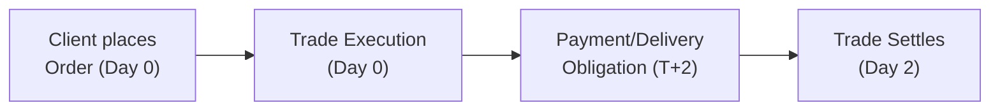
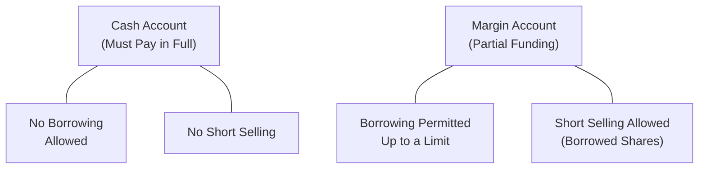

## 8.3 Cash Accounts

Cash accounts are perhaps the most straightforward type of brokerage setup you can have. If you want to buy a security, you simply pay the full purchase price without borrowing from your investment dealer. However, behind that seemingly simple concept lies an array of rules and procedures designed to protect both you and the firm. In this section, we’ll explore the ins and outs of cash accounts, the T+2 settlement cycle, the reasons short selling is generally off-limits, and the regulatory framework provided by the Canadian Investment Regulatory Organization (CIRO).

---

### Understanding the Basics of Cash Accounts

A cash account is basically your standard brokerage account where every purchase of securities must be fully funded. This might sound almost too obvious—of course you need the money to buy something, right? But in the world of finance, there’s a contrasting account type called a margin account where you can borrow funds to purchase securities. In a cash account, no borrowing is allowed. 

In my early days as a Registered Representative, I remember chatting with a friend who wanted to purchase a couple of stocks “just to try it out.” He was under the impression that the broker would front him the money until payday. I had to clarify that, with a cash account, the expected arrangement is “you pay the money, you get the stocks.” End of story. 

### Key Features of Cash Accounts

• Full Payment at Purchase: Whenever you buy securities, you are expected to pay for the amount in full by the settlement date (T+2 in most cases).  
• No Short Selling: In a cash account, short selling—where you sell securities you don’t own in the hope of buying them back later at a lower price—is typically not allowed.  
• Limited or No Overdraft: With very few exceptions, investment dealers cannot extend credit or create an overdraft in a cash account. If you don’t have enough cash, you won’t be able to complete the transaction, or the dealer will require immediate deposit of the deficiency.  
• T+2 Settlement Cycle: Most securities in Canada (and many other markets) settle on a T+2 schedule, meaning trades must be settled within two business days after the trade date. With a cash account, that means you typically have two days to deliver the funds (or receive your money if you’ve sold something).

---

### The T+2 Settlement Cycle

Canada, along with several other major markets, follows a T+2 settlement cycle. The “T” stands for “Trade,” and the “2” indicates two business days:

• When you place an order on a Monday (assuming no holidays), your trade date is Monday (T=Monday), and the settlement date is typically Wednesday (T+2).  
• You must have sufficient funds to pay for your purchase by Wednesday, or else the transaction may be subject to cancellation or forced reversal (sometimes with additional fees).  
• For sales, you generally receive the proceeds in your account on T+2, though many dealers display available cash instantly for trading purposes, with the actual movement of funds finalizing on settlement day.

On the surface, T+2 might seem like a formality. But it serves a critical purpose: it allows time for all parties to confirm the details of the transaction—number of shares, price, broker instructions, and, of course, the actual payment.

Below is a simple diagram outlining the T+2 settlement timeline at a high level:

• Day 0: Client places an order to buy or sell.  
• Day 0: Trade is executed.  
• Day 2: Payment for the purchase must be completed, and ownership of the security is fully transferred. If you sold securities, you deliver them by this date and receive proceeds.

---

### Monitoring the Funds in a Cash Account

So, you might be wondering, “How does the investment dealer make sure I have enough money to settle my trades?” Under CIRO guidelines, dealers are required to ensure sufficient funds are available in client accounts. They typically do this in several ways:

• Pre-Trade Checks: The dealer will often confirm that your account has enough settled cash or is about to receive proceeds from a pending sale. Some dealers automatically put a hold on your bank link or require a bank draft.  
• Post-Trade Monitoring: If you’ve placed an order without having the full funds, the dealer’s back-office systems might flag the account for insufficient funds. You may receive a prompt to deposit additional cash within the T+2 window.  
• Swift Action on Deficiencies: Dealers are obligated by CIRO rules to address any payment deficiencies swiftly. If you still don’t deposit the cash in time, the dealer may cancel the trade or sell other securities in your account to cover the shortfall (depending on the terms of your client agreement).

If you’ve ever purchased something online and realized, “Uh oh, there isn’t enough in my checking account,” you know that sinking feeling. In securities trading, the stakes can be higher—imagine your trade being canceled, your account restricted, or incurring added fees.

---

### Restrictions on Short Selling

Short selling in a cash account is typically off the table. Deal with that fact. You can’t sell what you don’t own if your account operates on a strictly cash basis. Why is that?

• Regulatory Prohibition: CIRO clearly delineates that short selling generally must happen in a margin account, where you can borrow securities to facilitate the short position. By definition, a cash account cannot extend credit, so you can’t short.  
• Payment in Full Requirement: In a short sale, you’re selling first and buying back later. This is inherently a transaction that involves credit or margin because you’re effectively borrowing the shares.  
• Risk Management: Short selling carries an unlimited risk of loss if the security’s price rises. Regulators aim to ensure investors fully understand these risks and have the financial capacity to cover potential losses. With a cash account, the regulator’s stance is basically: no margin, no short.  

---

### Compliance with CIRO Regulations

Under Canadian securities law, CIRO serves as the national self-regulatory body that oversees investment dealers, mutual fund dealers, and market integrity across equity and debt markets. Since the amalgamation of IIROC and the MFDA in 2023, CIRO now governs the rules and regulations that keep everyone in check. Here are some key points:

• Overdrafts and Unauthorized Credit: An investment dealer can’t simply allow you to have a negative balance in your cash account as a long-term solution. That would be lending you money, effectively transforming your cash account into a margin account without the proper documentation or approval.  
• Recordkeeping: CIRO requires stringent recordkeeping of all deposits, withdrawals, purchased securities, sold securities, dividends, interest payments, and any other cash movement. These records should be accurate, timely, and readily accessible to both you and any regulatory audit.  
• Settlement Enforcement: If a client consistently fails to deliver payment for trades by T+2, CIRO expects the investment dealer to take corrective action, which could include imposing trading restrictions or shutting down the account.  

Bear in mind that everything is subject to higher-level provincial securities legislation and the policies of the Canadian Securities Administrators (CSA). But from a practical standpoint, CIRO sets the day-to-day rules that dealers adhere to.

---

### Maintaining Accurate Records

Maintaining accurate records is crucial for both dealers and clients. Let’s say you decide to buy 100 shares of a mining company, just as you receive some dividends from your existing energy stocks. Eventually, you sell a different holding, but part of the proceeds is used to purchase more shares of a new company. This swirl of transactions must be recorded carefully:

• Buy and Sell Records: Each transaction (buys, sells, transfers, etc.) must be date-stamped and allocated to the correct settlement date.  
• Dividend and Interest Tracking: Any cash distributions or interest credits should be posted to your account immediately to reflect your actual cash balance.  
• Deposits and Withdrawals: If you send a deposit by electronic transfer or check, that deposit must be reflected quickly. If you withdraw funds to your bank account, the books must show the withdrawal and your new cash balance.  
• Reconciliation: Most dealers perform daily reconciliations to verify that all trades, cash movements, and security positions match.  

Pro tip: Keep a personal log of your trades, too. It can be something as simple as a spreadsheet. This helps you cross-check your statements, especially if you’re actively trading.

---

### Practical Example: The Missed Payment Scenario

Let’s put this in a real-world scenario. Suppose you have a cash account with $10,000. You log in on Monday (Day 0) and buy $10,000 worth of ABC Corp shares. The settlement date is Wednesday (T+2). Now, if your checking account only has $8,500, you might be in trouble come Wednesday. 

To make good on your commitment, you’d better deposit the extra $1,500 by the settlement date. If you don’t, the dealer will alert you that there’s a deficiency. You might receive a call Tuesday morning, “Hey, we need the extra funds right away.” If by Wednesday you still haven’t deposited the required $1,500, the dealer may cancel your trade or force-sell these new shares (or other securities in your account) to cover the shortfall.

This is an awkward spot no one likes to be in—certainly not me, not you, and definitely not the dealer’s compliance department. It can also hurt your relationship with the dealer, and repeated infractions could result in the firm refusing to do business with you.

---

### Common Challenges and Strategies

Cash accounts are simple on paper, but let’s be honest, anyone can slip up if they’re not careful. Common challenges include:

• Insufficient Funds at Settlement: We’ve all been there—maybe a payroll deposit is delayed, or you thought you had more money in your account than you actually did. The best strategy? Track your bank balances meticulously and never assume you’ll have immediate funds without verifying.  
• Forgotten Settlement Timelines: Some newer investors might come from markets or situations where the settlement process is same-day. The T+2 cycle can surprise them. If you lose track of time, you might miss the settlement. Keep a calendar or diary, or use alerts offered by your brokerage to remind you.  
• Dividend Reinvestment Confusion: If you have a Dividend Reinvestment Plan (DRIP) going on in your cash account, make sure you know when the dividends actually post. Some investors get confused thinking the dividend is available on ex-dividend date, forgetting that payment date is usually much later.

A piece of advice: set up real-time notifications or alerts through your online account. Almost every brokerage these days has email or text alerts telling you about trade executions, settlement reminders, and insufficient funds. It can reduce a ton of headaches.

---

### Case Study: Paul’s Oversight

Think of this scenario: Paul has a small consulting business, so his income isn’t deposited like clockwork every two weeks. He places a $5,000 buy order on Monday for a stock, expecting a check from a client to clear that same day. Unfortunately, his client’s bank withholds the funds for an extra day. By the time Wednesday (settlement day) rolls around, Paul’s cash account is still short. The dealer calls him, but he plans to sort it out “tomorrow.” By Thursday, the trade has already been reversed for non-payment. Paul is frustrated, the dealer is exasperated, and the stock price has gone up—meaning Paul missed out on a profit. Ouch.

The takeaway: Always ensure the cash is physically in your account by the settlement date. Don’t rely on “they said the money is coming any minute” unless it’s truly there.

---

### Diagram: Cash Account vs. Margin Account

While this section doesn’t deal directly with margin accounts, it’s helpful to see how a cash account differs. Here’s a simple comparison diagram:

• In a cash account (top nodes), you pay in full and don’t short sell.  
• In a margin account (bottom nodes), you can borrow funds and short sell.  

For a detailed breakdown of the differences, consider reading “Cash Account vs. Margin Account” on Investopedia, which provides an accessible overview of how these account types square off against each other in real trading.

---

### Overdrafts and Unauthorized Credit Extensions

One of the biggest compliance issues for a cash account is the accidental extension of credit. Dealers cannot leave a negative balance unaddressed. Allowing an account to remain negative effectively creates a margin situation without margin documentation. So, if your cash account ends up negative for any reason—maybe you sold a security but forgot it was still on a settlement hold—expect the dealer to contact you immediately.

In short, no extension of credit or overdraft privileges is permitted in a cash account, unless it’s for a brief operational reason (like an intraday coverage) that resolves immediately. If an account stays negative, expect the dealer’s compliance team to rectify that in line with CIRO rules.

---

### Best Practices for Dealers and Representatives

Dealers and Registered Representatives have a responsibility to keep clients on track. Some best practices include:

• Clear Communication: Ensure clients fully understand how T+2 settlement works—when money flows in and out, and what their obligations are.  
• Prompt Deficiency Notifications: If a client is short on funds, contact them immediately. The earlier they know there’s a shortfall, the easier it is to fix.  
• Automated Alerts: Use software that flags accounts at risk of insufficient balances. Proactive monitoring can save everyone time and stress.  
• Education Initiatives: Provide short guides or mini-tutorials. A quick “Here’s what T+2 means for your cash account” cheat sheet can do wonders for preventing mistakes.

---

### Additional Resources

• [CIRO Cash Account Regulations](https://www.ciro.ca) – Official guidance and updates on regulations pertaining to cash accounts.  
• Securities Operations: A Guide to Trade and Position Management by Michael Simmons – A deep dive into the mechanics of settlement, reconciliations, and more.  
• Online Article: “[Cash Account vs. Margin Account](https://www.investopedia.com/articles/investing/110614/cash-account-vs-margin-account.asp)” by Investopedia – A user-friendly overview comparing cash and margin account nuances.  

If you ever feel uncertain, remember that your investment dealer’s compliance department is there to help you stay aligned with regulations. Feel free to ask the “obvious” questions; they’re often the ones that keep you out of trouble.

---

### Glossary

• **Cash Account:** A brokerage account where the client pays the full amount for securities at the time of purchase.  
• **Settlement Cycle (T+2):** The time frame used for settling securities trades, requiring final payment and transfer of securities within two business days after the trade date.  
• **Short Selling:** Selling securities that you do not own, typically requiring a margin account as it involves borrowing securities.  

---

## Master Your Knowledge of Cash Accounts – Comprehensive Quiz



### In a cash account, how must securities purchases be paid for?

- [x] In full with the client's own funds by the settlement date  
- [ ] Partially paid with borrowed funds  
- [ ] Using credit from the investment dealer  
- [ ] Using a line of credit from a bank  

> **Explanation:** A cash account requires that securities be paid in full, without borrowing. Dealers cannot extend credit for cash account purchases, so the client is responsible for having the necessary funds before the T+2 settlement date.

### Which of the following is typically prohibited in a cash account?

- [x] Short selling  
- [ ] Buying dividend-paying stocks  
- [ ] Selling securities previously owned  
- [ ] Holding cash reserves  

> **Explanation:** Short selling involves borrowing securities you do not own, which is not allowed in a cash account. You need a margin account to facilitate short sales.

### Which entity oversees Canadian dealers to ensure compliance with cash account regulations?

- [ ] Mutual Fund Dealers Association (MFDA)  
- [ ] Investment Industry Regulatory Organization of Canada (IIROC)  
- [x] Canadian Investment Regulatory Organization (CIRO)  
- [ ] Canadian Investor Protection Fund (CIPF)  

> **Explanation:** As of 2023, IIROC and MFDA have amalgamated into CIRO, which now oversees national securities dealer regulation, including rules governing cash accounts.

### How long do you generally have to pay for securities purchased in a cash account under the T+2 settlement cycle?

- [ ] Same day  
- [x] Two business days  
- [ ] Five business days  
- [ ] Indefinitely  

> **Explanation:** T+2 means trades settle in two business days, so payment must be made within that timeframe.

### Which statement accurately describes the dealer’s obligations if a cash account is short on funds at settlement?

- [x] The dealer must contact the client immediately to resolve the deficiency and may cancel the trade if the shortfall is not corrected.  
- [ ] The dealer may provide an indefinite overdraft with no penalty.  
- [x] The dealer may sell other securities in the account to cover the shortfall if not resolved promptly.  
- [ ] The dealer will ignore the shortfall if it’s less than $1,000.  

> **Explanation:** Under CIRO rules, dealers must act quickly to resolve payment shortfalls. They can cancel the trade or liquidate other holdings in the client’s account to cover the deficit, but indefinite overdrafts are not allowed.

### Which of the following best describes the role of the Canadian Investor Protection Fund (CIPF) in relation to a cash account?

- [x] CIPF protects client assets if a member firm becomes insolvent.  
- [ ] CIPF reimburses clients for trading losses.  
- [ ] CIPF sets settlement rules for cash accounts.  
- [ ] CIPF is a direct regulator for transactions.  

> **Explanation:** CIPF provides coverage up to prescribed limits if the dealer fails financially. It does not regulate trades or reimburse ordinary market losses.

### If a client attempts to short sell a security in a cash account, what is the appropriate action by the dealer?

- [x] The dealer disallows the transaction because it’s prohibited.  
- [ ] The dealer automatically converts the account to margin.  
- [x] The dealer advises the client that short selling requires a margin account.  
- [ ] The dealer delays settlement until the shares are located.  

> **Explanation:** Short selling is not permissible in cash accounts. The client would need a margin account to execute a short sale.

### Why is T+2 settlement applied to cash accounts?

- [x] It allows time to confirm trade details and ensure payment/funds availability.  
- [ ] It is designed solely to limit day trading.  
- [ ] It gives the dealer time to charge interest on borrowed funds.  
- [ ] It only applies to large institutional accounts.  

> **Explanation:** The T+2 cycle provides a practical window for payment processing, trade confirmation, and transfer of securities, applying to most market participants.

### What happens if a client repeatedly fails to deposit sufficient funds by the T+2 deadline?

- [x] The dealer may impose trading restrictions or close the account.  
- [ ] The dealer extends the settlement period indefinitely.  
- [ ] The client automatically becomes CIPF ineligible.  
- [ ] Nothing; repeated shortfalls are always tolerated.  

> **Explanation:** Repeated settlement failures indicate heightened risk. Dealers may limit or close the account because they are obliged to ensure clients meet payment obligations.

### T+2 settlement means you must settle your trade:

- [x] By two business days after the trade date  
- [ ] Exactly two calendar days after the trade date  
- [ ] Within two weeks of the trade date  
- [ ] Immediately upon order confirmation  

> **Explanation:** The “T+2” standard refers to two business days after the trade date, not calendar days or any other timeframe.


