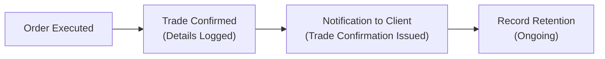

## 8.4 Communicating Trading Information to Customers

Imagine this: you have a friend—let’s call him Louis—who just started investing. The other day, Louis received a trade confirmation for some blue-chip stocks he bought. He was excited, but also kind of puzzled: “What am I supposed to do with all these details about settlement dates, commissions, or disclaimers?” If you or your clients have ever felt a bit overwhelmed by trading documents, well, you’re not alone. Communicating trading information can turn into a confusing maze of dates, codes, and disclaimers, and our job as financial professionals is to ensure clarity, accuracy, and timeliness. 

It’s easy to overlook how crucial well-structured communication is—especially given that these documents impact clients’ financial decisions, help them track performance, and sometimes influence whether they file a complaint. So, in this section, we’ll discuss why effective communication matters, what regulatory authorities expect, and the best practices for providing information that isn’t just dumped on clients but delivered in a way they can genuinely understand and use.

---
 
### Why Clear Communication Matters

We’ve all heard that “communication is key,” right? In the financial industry, effective communication goes beyond social niceties. It’s a regulatory requirement aimed at protecting investors. Here in Canada, the Canadian Investment Regulatory Organization (CIRO) oversees investment dealers and sets the standards for how financial professionals must communicate with clients about their trades, fees, and account activity. 

Prior to 2023, there were two self-regulatory organizations (SROs)—the Investment Industry Regulatory Organization of Canada (IIROC) and the Mutual Fund Dealers Association of Canada (MFDA). They amalgamated on January 1, 2023, to form CIRO, which is now the single self-regulatory body. So any references you come across to IIROC or MFDA are purely historical.

By providing information in a timely manner—and ensuring every piece of relevant data (like commissions, conflicts of interest, and settlement dates) is clearly disclosed—dealers fulfill both their legal obligation and their commitment to client trust. Investors who receive comprehensive information are more likely to engage in healthy, long-term relationships with their advisors and make informed decisions about their portfolios.

---

### Key Documents in Client Communication

Communication with clients often happens through a variety of documents. It’s not just emails or phone calls—though those are important, too—but the “official” sets of information that clients receive:

• Trade confirmations  
• Account statements  
• Transaction summaries  

Each of these disclosures has unique timing, content, and regulatory requirements, as mandated by CIRO.

#### Trade Confirmations

A trade confirmation is usually sent out shortly after a transaction takes place—think of it like a receipt for your grocery purchase, except it lists a lot more details: the exact number of shares purchased, the price per share, the settlement date, transaction fees, commissions, and the total amount paid (or received, in the case of a sale). Trade confirmations must also disclose any relevant conflicts of interest.

#### Account Statements

Account statements are periodic snapshots of everything that has happened within a client’s account over a certain time frame. They typically include:

• Cash balances  
• Securities holdings  
• Market values  
• Summary of deposits, withdrawals, and trades  
• Any accrued dividends or interest  

In Canada, it’s quite common to see monthly or quarterly statements, but the frequency can vary based on the types of assets held and levels of client account activity.

#### Transaction Summaries

While the trade confirmation focuses on a single transaction, a transaction summary might show an overview of multiple trades executed over a certain period—sometimes part of an ongoing investment strategy. This summary can help clients see patterns, track performance, and understand how each trade fits into the bigger picture.

---

### Regulatory Environment and CIRO Guidelines

CIRO has specific requirements for the timing, content, and delivery methods of client communications. From the moment a trade is executed to the generation of an official confirmation, dealers have a limited window to produce these documents and get them in front of the client.

Below is a simple illustration of how a transaction should flow from the moment of execution to final documentation. The diagram may look a bit basic, but it gives you a clear sense of the process:



- A["Order Executed"]: The moment an order is filled on the marketplace.  
- B["Trade Confirmed <br/>(Details Logged)"]: The transaction details are automatically logged by the system for compliance and oversight.  
- C["Notification to Client <br/>(Trade Confirmation Issued)"]: A trade confirmation is sent to the client, typically within one business day (or another timeframe specified by CIRO).  
- D["Record Retention <br/>(Ongoing)"]: All communications and trade details are archived for potential audits, regulatory reviews, or dispute resolution.  

**Why This Matters:**  
• Timely Communication: If a client wants to cancel or modify an order, the first step is being aware something happened in their account.  
• Accuracy and Transparency: By requiring specific details (like commissions, conflicts of interest, total purchase cost), CIRO ensures the client fully grasps any costs or biases in the trade.  
• Regulatory Compliance: Retaining these documents is not just a “nice to have” but mandatory for compliance with both CIRO guidelines and provincial or territorial securities laws.

---

### Essential Details in Trade Confirmations

A trade confirmation—sometimes called the “contract note”—should contain the following core information:

• Client Name and Account Number: Ensures the trade is attributed to the correct client and account.  
• Dealer Information: Identifies the firm handling the transaction.  
• Date of Transaction (Trade Date) and Time (If Applicable): Precisely when the trade executed on the market.  
• Settlement Date: The date by which the buyer must pay and the seller must deliver the assets.  
• Security Description: Commonly includes the name of the issuer, ticker symbol, and type (e.g., common share, bond).  
• Quantity: How many shares, units, or bonds were traded.  
• Price or Yield: The agreed-upon price if it’s an equity security or yield if it’s a fixed-income instrument.  
• Commissions and Fees: The cost to the client for performing the transaction. The amount and structure (flat rate, percentage, etc.) should be clearly shown.  
• Total Transaction Amount: The final figure the client pays (for purchases) or receives (for sales).  
• Conflict of Interest Disclosure: If the dealer or advisor has some vested interest in the security or issuer.  

This level of detail aims to prevent misunderstandings. For instance, if you notice that the commission charged looks higher than expected, you have immediate grounds to question or dispute it. 

**Real-World Scenario**  
Let’s say David is buying 300 shares of XYZ Inc. at $10.00 per share. Here’s an example break-down you might see on an actual trade confirmation:

- Trade Date: May 1, 2025  
- Settlement Date: May 3, 2025  
- Security: XYZ Inc. (Ticker: XYZ)  
- Quantity: 300 shares  
- Price: $10.00 per share  
- Commission: $25 flat fee  
- Additional Fees: $5 transaction fee  
- Total: $3,005  

David, upon reviewing the trade confirmation, sees exactly how the $3,005 is computed and can verify that this matches his understanding with the advisor.

---

### Disclosing Fees, Commissions, and Conflicts of Interest

It’s one thing to list the fees in fine print, but it’s another to present them in a way that’s easy to see. The clarity and breadth of fee disclosure can make or break client trust. Clients deserve to know exactly how they’re being charged and why. Fees may include:

• Commission Fees: Broker commissions or spreads on trades.  
• Advisory Fees: Ongoing management or advisory fees.  
• Administrative Fees: Account setup or maintenance.  
• Third-Party Costs: Exchange fees, regulatory levies, or external clearing costs.  

Likewise, if a dealer stands to benefit from a specific product sale—maybe they have a marketing arrangement with the issuer, or they receive an extra trailer fee for mutual funds—those potential conflicts of interest must be disclosed in plain language. 

Here’s a snippet of how a commission or fee breakdown could appear in a statement:

``` 
COMMISSION BREAKDOWN
---------------------------------
Commission Type: Flat Rate
Amount: $25
Basis: Per Transaction
---------------------------------
```

This format is clearer than weaving the information into two paragraphs of legal jargon.

---

### Timing and Delivery Methods

**Timing**  
While specifics can vary, CIRO generally requires investment dealers to issue trade confirmations as soon as practicable—usually within one business day after the trade execution. Account statements often follow a monthly or quarterly schedule, depending on client preference and account type.

**Delivery Methods**  
Good customer service and compliance depend on choosing the right delivery methods:

• Physical Mail: Traditional, but still popular among clients who prefer printed records.  
• Email or Secure Online Access: Faster, more cost-effective, and easily archived.  
• Mobile Notifications: Some dealers now offer real-time alerts via apps.  

Whichever channel you choose, always confirm the client’s preferred means of communication and ensure it aligns with regulatory standards for verifying receipt. 

**Note on Electronic Communications**  
Electronic communications (emails, chat messages, or text notifications) still need to adhere to the same recordkeeping and disclosure requirements as paper-based communications. They must be securely stored and retrievable, in case a regulator or auditor ever needs to review them.  

---

### Record Retention and Compliance

It’s not just about sending out the documents once: investment dealers have to maintain records of all communications with clients. Typically, dealers retain these records for a minimum of seven years, but requirements may vary by jurisdiction.

**Why is record retention a big deal?**  
• Regulatory Audits: CIRO or provincial commissions may audit.  
• Dispute Resolution: If a client complains that they never received a trade confirmation, having a verifiable log can settle the dispute.  
• Operational Efficiency: Historical records improve accuracy if the client moves to different account types or changes advisors.

And let’s face it: misunderstandings are a part of life. Maybe the client accidentally deleted that important email or forgot they had a direct mail filter. Having a robust record retention system allows you to quickly re-verify.  

---

### Potential Pitfalls in Client Communication

Even with robust systems, things can go sideways. Here are some common pitfalls and how to address them:

• Incomplete or Vague Disclosures: Be sure that every relevant detail—like the potential conflict of interest or a breakdown of fees—is fully spelled out.  
• Overuse of Jargon: Technical financial terms can seem daunting. Provide definitions or offer to explain them in a follow-up call.  
• Delayed Delivery: Sending out a trade confirmation a week late can create compliance issues and erode trust. Strive to be prompt.  
• Improper Record Storage: Relying on personal email or message apps could violate strict recordkeeping rules. Use compliant systems supported by the firm.  
• Not Following Client Preferences: If a client specifically requests electronic delivery, sending paper statements might lead to them never seeing time-sensitive information.

**Anecdote**  
I once had a client who insisted on mailing everything (yes, the old-school way). We promptly sent her monthly statements in thick envelopes—only to find out after six months that her address had changed, and she never told us. All that documentation got lost. The morale of that story? Always verify that the address—or the chosen communication channel—remains up to date, or you end up with a stack of unread statements.

---

### Best Practices for Effective Communication

• Use Plain Language: Say “You purchased 100 shares at $50 each, with a $20 commission” instead of “An equity transaction was executed entailing a principal outlay of $5,020 inclusive of associated charges.”  
• Employ Graphs and Tables: A bar chart that shows changes in the portfolio over the past quarter can be more powerful than a text block.  
• Provide Timely Updates: If a corporate action like a stock split occurs, let the client know right away.  
• Confirm Client Preferences: Some individuals want to know every piece of micro-data, while others just want a broad summary. Respect those preferences while still complying with regulatory minimums.  
• Refresh the Contact Information: Errors creep in over time. Periodically confirm addresses, phone numbers, and emails.  
• Encourage Questions: Remind clients it’s okay (and encouraged) to ask you if something looks off or if they need clarification.

---

### Relation to Other Parts of This Chapter

Communicating trading information to customers here in Section 8.4 ties directly into many other elements found in Chapter 8, “Maintaining Client Accounts and Relationships.” Proper communication supports the day-to-day workings of margin accounts, cash accounts, and the disclosure of relevant details in client transactions. It also preempts disputes or complaints (see 8.5 Client Complaints and Account Transfer Requests) by ensuring that everything is spelled out and transparent beforehand.  

For further detail, you might want to brush up on:  
• 8.1 Accounting for Client Transactions  
• 8.2 Margin Accounts  
• 8.3 Cash Accounts  
• 8.5 Client Complaints and Account Transfer Requests  

---

### Conclusion

In a field that can be, let’s be honest, overwhelming with numbers, regulatory references, and legal disclaimers, communicating trading information has to be done in a manner that is straightforward, actionable, and timely. This is the centerpiece of trust. When clients understand what happened, how much it cost, and whether there’s a conflict of interest, they’re more at ease in building a lasting financial relationship with you. 

Yes, proper documentation and compliance may feel tedious at times, but it’s also the bedrock of a stable business practice in the investment industry. Remember that great communication does more than just satisfy CIRO’s checkboxes—it also helps differentiate your service in an increasingly crowded marketplace. Like my friend Louis, your clients will appreciate that you took the time to make sense of those confirmations, statements, and disclaimers. And that trust is priceless.

---

### Glossary

• **Trade Confirmation**: A written notification provided to clients detailing the specifics of a securities transaction, including price, quantity, fees, and settlement date.  
• **Account Statement**: A periodic summary provided to clients that outlines transactions, holdings, and account balances over a particular timeframe.  

---

### References and Resources

• [CIRO Client Communication Guidelines](https://www.ciro.ca)  
• Finder, Robert L. *Effective Client Communication in Financial Services.*  
• Udemy: [Client Communication Skills for Financial Professionals](https://www.udemy.com/course/client-communication-skills-for-financial-professionals/)  

If you’re curious to dig deeper beyond the scope of this chapter, these resources can help hone your skills and knowledge in effective client communication.  

---

## Test Your Knowledge: Communicating Trading Information Successfully



### Which document provides a detailed summary of a client's recent securities transactions?

- [ ] Margin Agreement
- [ ] Prospectus
- [x] Account Statement
- [ ] Investor Policy Document

> **Explanation:** An account statement is a periodic summary of a client’s holdings, transactions, and account balances over a specific time period.

### What is the primary reason CIRO requires prompt issuance of trade confirmations?

- [ ] To reduce paperwork for the dealer
- [x] To ensure investors receive timely and accurate information about their trades
- [ ] To allow dealers extra time to collect commissions
- [ ] To satisfy provincial investor relations legislation only

> **Explanation:** CIRO’s requirement that trade confirmations be sent promptly ensures clients know as soon as possible about the exact details of each trade, promoting transparency and trust.

### When disclosing conflicts of interest, what is the best practice?

- [x] Provide clear, concise disclosures that explain the nature of the conflict
- [ ] Include general language without specifics
- [ ] Omit if it involves a very small commission
- [ ] Assume the client already knows about them

> **Explanation:** CIRO rules mandate that potential conflicts of interest be explicitly disclosed in full detail, allowing clients to decide how this might impact their investment decisions.

### Account statements should typically include which type of information?

- [ ] The personal tax status of the client
- [ ] Only the commissions for trades
- [ ] Price targets for recommended stocks
- [x] Summaries of all holdings and transactions in the account

> **Explanation:** Account statements are designed to inform clients about all aspects of their account, including holdings, transaction history, and balances.

### What is the recommended approach for explaining fees and commissions to clients?

- [x] Use simple, clear language and provide a detailed breakdown
- [ ] Only outline fees if they exceed a certain threshold
- [x] Itemize each fee or commission in the trade confirmation
- [ ] Hide fees in discreet footnotes

> **Explanation:** Fees and commissions are often sources of complaint or confusion, so best practices are to detail them plainly and, if possible, itemize them on key documents.

### What is NOT a potential pitfall in client communications?

- [x] Retaining records securely for required time periods
- [ ] Incomplete fee disclosures
- [ ] Late or missing statements
- [ ] Over-reliance on financial jargon

> **Explanation:** Retaining records securely is essential and highly recommended; incomplete disclosures, missing statements, or confusing jargon can lead to complaints and regulatory issues.

### Why might an investment dealer choose to send digital statements rather than physical mail?

- [x] Faster delivery and reduced operational costs
- [ ] To avoid regulatory oversight
- [x] Allows easier archival for both parties
- [ ] All clients universally prefer digital formats

> **Explanation:** Electronic delivery can be quicker and easier to archive. However, dealers must respect each client’s preference and follow the required guidelines for secure, compliant record-keeping.

### Which best describes a “trade confirmation”?

- [ ] A marketing brochure
- [x] A written notification confirming the details of a securities transaction
- [ ] A summary of a client’s entire portfolio
- [ ] An annual tax slip

> **Explanation:** Trade confirmations inform clients precisely when and how a trade was executed, including pricing, volume, and fees.

### How do timely, accurate communications help with dispute resolution?

- [x] They establish a verifiable record of transactions and disclosures
- [ ] They eliminate all types of disputes completely
- [ ] They shift blame away from the dealer
- [ ] They discourage clients from asking questions

> **Explanation:** Comprehensive and prompt documentation provides an audit trail to validate claims and clarify misunderstandings, aiding in dispute resolution.

### True or False: Electronic communications need not adhere to the same recordkeeping standards as paper-based communications.

- [x] True
- [ ] False

> **Explanation:** Actually, this statement is false in practice, but it’s included here to test understanding of the rules. Electronic communications do need to meet the same standards. If you thought “True,” be careful—CIRO’s guidelines make it clear that electronic records must be securely stored, retrievable, and compliant with regulatory requirements.


