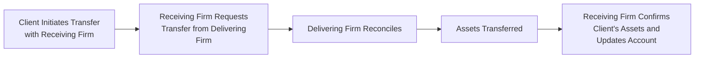

## 8.5 Client Complaints and Account Transfer Requests

Handling client complaints might not be anyone’s favorite part of financial services—believe me, I once saw a friend panic when a client demanded a resolution within 24 hours, threatening to move all their funds elsewhere if it wasn’t sorted out. It can feel tense and complicated. But it’s also one of the most important elements of what we do in the securities industry: supporting clients through thick and thin. Similarly, transferring a client’s account to another firm can be stressful if not handled in a proper, timely manner. This section is all about making these processes smooth, efficient, and in line with Canadian Investment Regulatory Organization (CIRO) requirements.

In this chapter, we’ll explore how investment dealers must respond to client complaints, from the initial investigation all the way to final resolution. We’ll also walk through the process of facilitating account transfer requests in a timely manner while keeping your clients informed. If you keep your ear to the ground (so to speak) and have a robust process in place, you can enhance client loyalty, maintain strong regulatory compliance, and improve both your reputation and profitability over the long term.

Let’s get started by unpacking the complaint management process. Then we’ll pivot to account transfers, discussing best practices, typical pitfalls, and the record-keeping that underpins it all.

---

Understanding the Nature of Client Complaints

When we think of the word “complaint,” we might picture an angry customer venting about a malfunctioning product. Well, in investment dealerships, a client complaint can come in many forms—some minor, some major. It could be something like fees that appear incorrect, misunderstandings about statements, or dissatisfaction with the performance of recommended investments. Alternatively, it might be a more serious issue, such as an allegation of unauthorized trading or conflicts of interest. Regardless, all client complaints must be taken seriously and investigated diligently.

A “client complaint” is basically any expression of dissatisfaction over the conduct of a firm or its representatives. This might be mailed in, typed in an email, or verbally reported by the client—though formal written complaints carry more weight in practice. Regardless of how it arrives, a complaint triggers your regulatory obligations to investigate and respond under CIRO rules.

It’s important to address these issues promptly, not only to preserve trust with your clients but also because CIRO has strict timelines and documentation requirements. You want your clients to feel heard, understood, and respected, even when (or especially when) they’re unhappy. The better you handle a complaint, the more your client can see that your firm is committed to high standards of ethical and professional service.

---

Key Steps in the Complaint Handling Process

Often, the complaint handling process follows a fairly structured pathway—from intake and acknowledgment to investigation, resolution, and final communication with the client. Let’s walk through these key steps and see how it might look in practice. 

1) Intake and Acknowledgment  
   • The moment a complaint shows up—maybe via email, a letter, or a phone call from an upset client—it goes into your official complaint-handling system.  
   • You should immediately acknowledge that you’ve received the complaint. Clients feel more at ease if they know their concern isn’t disappearing into a black hole.  
   • Provide them with a timeline of what happens next, so they know when to expect updates or a final resolution.

2) Investigation and Fact-Finding  
   • This is often the most time-consuming step. You collect all relevant documents: account statements, email exchanges, phone call recordings (if available), and records of any advice given.  
   • You might interview staff members who had contact with the client or provided recommendations.  
   • Keep thorough notes and always remain objective. Even if you suspect the complaint is unfounded, respect the client’s perspective.

3) Resolution or Escalation  
   • After the fact-finding process, you’ll come to some kind of conclusion. That might mean granting compensation, providing an apology or explanation, or clarifying a misunderstanding.  
   • If the matter involves regulatory or legal implications, it might escalate to an internal compliance team, external legal counsel, or even a regulatory body.

4) Communication with the Client  
   • Next, you communicate the final outcome to the client in a clear, jargon-free manner. If your resolution includes an offer (e.g., reimbursement of a fee), lay out all details.  
   • Always keep this communication positive and empathetic. Provide contact info in case the client has follow-up questions.

5) Record-Keeping and Continuous Improvement  
   • Document everything. This isn’t about burying your firm in paperwork, but about ensuring clarity in case regulators, such as CIRO, require a closer look.  
   • Then, do an internal review. Could anything have been done differently? Could processes be updated or improved to avoid future complaints?

Below is a simple flowchart illustrating the complaint handling process:

It may seem straightforward, but each step has nuances that require careful attention and compliance with CIRO’s regulatory standards. Keep in mind that “timely” resolution is key. Many regulators specify maximum periods for acknowledging and resolving client complaints. Even if you’re uncertain about the final resolution, a prompt acknowledgment goes a long way toward maintaining client confidence.

---

CIRO Requirements for Complaint Handling

Now that we’ve talked about the general process, let’s home in on what CIRO (the Canadian Investment Regulatory Organization) specifically expects. Although CIRO only came into existence in its current form on January 1, 2023, it incorporates essential elements of complaint handling that existed under its predecessor SROs (IIROC and MFDA). Make sure you’re referencing CIRO guidelines (because IIROC and MFDA are now defunct) whenever you want the most up-to-date information.

• Documentation Standards: CIRO sets out that all communications—from the initial “I’m unhappy” email to the final resolution letter—should be recorded and easily retrievable. This includes any interview notes and relevant account records.  
• Timeline Requirements: Dealers are generally required to investigate and deliver a substantive response to a client within a specified period—often 90 days, although check with CIRO for the precise timeframe as guidelines can vary.  
• Reporting Obligations: Certain serious complaints—particularly those involving potential wrongdoing, fraud, or large financial losses—may need to be reported to CIRO or other regulatory bodies.  
• Escalation Procedures: If a client isn’t satisfied with your resolution, they might contact an Ombudservice or CIRO for further steps. The Canadian Ombudsman for banking services and investments (OBSI) is a common next rung on the ladder.

Maintaining a friendly, constructive tone during these processes can ease tensions considerably. After all, many client complaints stem—at least partially—from frustration or confusion. By demonstrating respect, empathy, and thorough processes, you can set a positive tone that resonates with both the client and the regulator.

---

Real-World Example: A Personal Anecdote

I once saw a colleague get a frantic call from a client just after markets closed. The client, a retiree, believed an order for a particular stock hadn’t been executed (they insisted it had been placed online before the market closed). They were convinced the firm had failed them and demanded to complain. At first, my colleague panicked—who wouldn’t? But more critical was ensuring the complaint was properly documented and assigned to the right channels for investigation. It turned out the order had merely been queued in the system and was executed first thing the next morning, so the client’s complaint was resolved fairly quickly once we provided an explanation. But if you’ve ever scrambled to find a trade record in the final hours of the trading day, you understand how stressful it can be. Now imagine that scenario repeated for thousands of complaints across the country—and you can see why a well-designed process is vital.

---

Account Transfer Requests

Let’s shift gears to discuss account transfer requests, another area where you really want your processes to be watertight. Picture a scenario: your client decides to move their investment account from your firm to a competitor. Perhaps they found a more attractive fee structure, or they prefer a different advisor. Regardless of the reason, as their current dealer, you have an obligation to facilitate that transfer in a timely and organized way. Doing so graciously keeps the door open for future relationships—believe it or not, I’ve seen plenty of clients return years later once they discover the grass isn’t always greener on the other side.

What is an Account Transfer Request?  
An account transfer request is exactly what it sounds like: the client wants to move their funds or assets from one registered dealer to another. This might involve moving securities—like stocks, bonds, mutual funds, or GICs—along with any cash balances or other holdings. In some cases, partial transfers are requested (only certain securities or amounts of cash are moved), but often it’s a full account transfer.

---

Process for Facilitating an Account Transfer

1) Initiation of the Transfer Form  
   • The client typically fills out a transfer request form with the receiving firm. The receiving firm then sends the request electronically (or sometimes physically) to the delivering firm.  
   • The request must specify if it’s a full or partial transfer, and indicate exactly which assets should be moved.

2) Account Verification and Asset Reconciliation  
   • The delivering firm (the old firm) reviews the request and reconciles it with the client’s existing holdings.  
   • If the client holds any ineligible securities (perhaps unique private placements or proprietary products not carried by the new firm), that might slow the process.

3) Transfers and Settlements  
   • Once everything checks out, the delivering firm sends the securities to the receiving firm. Transfer times vary, but CIRO has guidelines indicating that transfers should be completed “promptly.” The industry standard often sees these done within a week or two if there are no complicating factors.

4) Confirmation  
   • Both the delivering and receiving firms confirm that the transfer is complete.  
   • The receiving firm updates the client’s new account with the transferred assets, ensuring cost base and tax-adjusted details are accurately reflected.

Below is a simplified diagram of the account transfer flow:

It’s all fairly straightforward, but you’d be surprised how many headaches can appear if small details go wrong—like incorrectly entered fund codes, mismatched client names, or incomplete coverage for certain complex securities. That’s why accurate, up-to-date client records (back in Chapter 5, we discussed forms like the New Account Application Form) is so important. 

---

CIRO Guidelines and Industry Standards for Account Transfers

CIRO expects dealers to process transfer requests without unnecessary delays. If a client suspects foot-dragging, they may file a complaint that you’re deliberately slowing the process to keep their assets. That’s a no-no. Additionally, any charges or fees related to the transfer (such as deregistration fees or transfer-out fees) should be transparent and disclosed to the client.

Another consideration is incomplete or rejected transfers. Sometimes, the client requests to move a security that isn’t accepted by the receiving firm. Maybe it’s a proprietary product unique to the old firm. You’ll need to inform the client promptly, giving them the chance to liquidate or otherwise handle that holding. Good communication is key so the client knows exactly what to expect (and doesn’t lodge a complaint for an unexpected mismatch).

Once the transfer process has finished, the delivering firm should keep thorough records confirming the date of the request, the date the assets left the account, and any relevant transaction IDs. The receiving firm does the same on its end, ensuring a consistent paper trail that you can trace if any problems arise later.

---

Maintaining Detailed Records

We’ve been going on about record-keeping, and for good reason. CIRO’s rules, plus broad securities regulations, require robust documentation around complaints and transfers. Think of it as building a safety net. If a question ever crops up—“Did you respond to the client’s complaint on time?” “Did you properly handle that series of GICs during the account transfer?”—you’ll be able to show regulators a clear timeline.

Comprehensive records might include:  
• All incoming complaints, their nature, date received, and contact information for the complainant.  
• Evidence of your investigation, such as relevant statements or advisor notes.  
• Final resolution letters or acknowledgments.  
• Date-stamped records of account transfers, including the initiation request, reconciliation details, and confirmation of transfer completion.  
• Any communications (emails, phone notes, etc.) with the client throughout these processes.

In addition to staying in regulators’ good books, a robust record-keeping system also helps your firm in internal audits and process improvements. For instance, if you find an uptick in a certain type of complaint (like miscommunication about fees), that might prompt new training for advisors or a more user-friendly fee schedule.

---

Case Study: The Johnsons’ Complaint and Transfer

Consider this scenario: The Johnson family had a trust account at your firm for their children’s future education, set up a decade ago. Over time, they began feeling disappointed with the account’s performance. They lodged a complaint, saying they wanted an explanation for seemingly excessive fees and underwhelming returns. After acknowledging their complaint, your internal team discovered that the fee schedule had changed, but the Johnsons hadn’t fully understood the new cost structure because the written notice got lost in the mail. 

Realizing this communication gap, your firm offers an apology with a partial fee rebate. The Johnsons accept. However, they still decide to move the account to another brokerage for personal reasons. A few days later, you get a transfer request from the new firm.  
• You quickly reconcile the Johnsons’ assets—mainly mutual funds and some individual stock positions.  
• All are eligible to be held at the new firm.  
• You electronically transfer everything within the standard timeline.  
• The Johnsons receive an official notice from the receiving firm confirming the assets have arrived.  

Because you handled both the complaint and the transfer with transparency and courtesy, the Johnsons leave with minimal drama. They might or might not return one day, but they’ll likely give more neutral or even positive feedback about your service if asked by a friend.

---

Tools, Best Practices, and Pitfalls

Let’s be honest: it’s easy to drop the ball sometimes—especially if you’re juggling multiple client demands, regulatory changes, or even staff turnover. Here are some best practices (and common pitfalls) to bear in mind.

• Keep lines of communication open.  Clients need to know that you’re on their side, even if they’re upset. Radio silence is one of the worst things you can do.  
• Centralize your complaint tracking system.  Having complaints scattered among email inboxes, phone logs, random sticky notes— that’s a recipe for disaster (and missed deadlines).  
• Train your staff to de-escalate tense client conversations.  A calm, empathetic approach can transform a furious complaint into a constructive dialogue.  
• Summarize the conversation in writing.  If you speak on the phone, email a summary to the client to confirm your understanding. This helps prevent “he said, she said” scenarios.  
• For account transfers, confirm everything in writing.  Don’t rely on verbal instructions. Partial transfers, in particular, can get complicated, so having a signature or documented request is crucial.  
• Don’t delay.  Clients often expect immediate progress. Any perceived attempt to drag out a complaint investigation or a transfer request can draw regulatory attention.  
• Double-check codes and forms.  With partial transfers especially, it’s easy to get a fund code wrong or exclude a position by accident. That can lead to more complaints.  
• Maintain close collaboration with back-office teams.  Often, front-end advisors might promise a swift resolution or transfer, only to be slowed down by operational constraints. So, set realistic expectations.

---

Key Takeaways

1) A well-documented process is the backbone of good complaint handling.  
2) CIRO’s timelines and requirements are not suggestions—they’re mandatory.  
3) Prompt and sincere communication can defuse most tense situations and help maintain client trust.  
4) Account transfers should be handled expediently, and all fees or potential asset eligibility issues should be disclosed clearly.  
5) Thorough record-keeping helps with regulatory audits and your firm’s internal process improvements.

If you integrate these principles into your daily practice, you’ll be well-positioned to handle any concerns your clients might raise, and you’ll do so in a way that meets or exceeds CIRO’s regulatory standards. 

---

Glossary

• Client Complaint: An expression of dissatisfaction by a client regarding the products, services, or conduct of the investment dealer.  
• Account Transfer Request: A request by a client to move their account (and the associated securities and funds) from one dealer to another.  

---

References and Resources

• [CIRO Complaint Handling and Account Transfer Guidelines](https://www.ciro.ca)  
• Tattam, David. “Managing Client Complaints in Financial Services.”  
• Harvard Business Review: “How to Handle Customer Complaints Effectively.” [Link](https://hbr.org/2020/03/how-to-handle-customer-complaints-effectively)  

---

Enhance Your Knowledge with This Comprehensive Client Complaints and Account Transfer Requests Quiz



### When a client first expresses dissatisfaction or concern, which of the following steps should be taken first?

- [ ] Immediately offer compensation.
- [x] Acknowledge receipt of the complaint and provide a timeline for resolution.
- [ ] Ignore it until the client provides more detail.
- [ ] Transfer the client's account to a new firm right away.

> **Explanation:** The first step is acknowledging the complaint and letting the client know you will investigate, along with providing an expected timeline for follow-up. This approach reassures them that you’re taking their concern seriously.

### Which of the following best describes CIRO's timeline expectations for handling client complaints?

- [x] Complaints must be responded to substantively within a specified number of days, often within 90 days.
- [ ] Complaints can remain unresolved indefinitely as long as there is an investigation underway.
- [ ] Complaints only need responses if the client escalates it to a legal claim.
- [ ] There are no official timeline requirements.

> **Explanation:** CIRO (and historically IIROC and MFDA) sets clear timelines requiring responders to provide a substantive response to a client complaint by a specific deadline, often around 90 days.

### Which item is not typically included in a firm’s official complaint-tracking record?

- [x] The client's credit score.
- [ ] The date the complaint was received.
- [ ] Investigation details such as statements reviewed.
- [ ] The final resolution offered to the client.

> **Explanation:** While some personal client information may be relevant, credit scores usually aren’t included in complaint files. Dates, investigation details, and resolution info should all be tracked.

### A partial account transfer generally:

- [ ] Moves the entire account to the receiving firm, including all assets.
- [x] Moves only specified assets or amounts to the receiving firm.
- [ ] Transmits the account but excludes all mutual fund holdings.
- [ ] Requires the delivering firm to liquidate all securities before sending cash.

> **Explanation:** In a partial transfer, the client instructs the firm on which specific assets or portions of the portfolio to move, rather than transferring everything.

### In the account transfer process, the delivering firm is responsible for:

- [x] Reconciling the client’s holdings and sending all eligible assets to the receiving firm.
- [ ] Forwarding the client’s personal complaints to the receiving firm.
- [x] Keeping records of the assets that were transferred and confirming key dates.
- [ ] Permanently restricting access to the client's online statements during the transition.

> **Explanation:** The delivering firm must reconcile the client’s holdings with the transfer request, send the appropriate assets, and document the process. They should not restrict the client’s access to prior statements.

### Which of the following is a best practice for handling complaints?

- [x] Keep lines of communication open and empathize with the client.
- [ ] Require the client to pay a fee to file the complaint.
- [ ] Avoid sending any emails to the client until the final resolution is ready.
- [ ] Produce only verbal explanations without written confirmation.

> **Explanation:** Best practices for handling complaints focus on continuous communication, transparency, and written records of each step or resolution.

### Why is record-keeping so crucial in the complaint and account transfer process?

- [ ] Because it allows the firm to market new products to the complainant.
- [x] Because it documents compliance with CIRO requirements, helps respond to regulatory inquiries, and supports continuous improvement.
- [x] Because it ensures the firm can prove that timelines and processes were followed.
- [ ] Because the client has no right to request supporting documentation.

> **Explanation:** Proper records show how a complaint or transfer was handled and prove compliance with CIRO guidelines. They also identify areas where the firm can improve.

### When responding to a complaint about a trade that the client believes was unauthorized, what should a firm do?

- [x] Conduct a full investigation, review recorded phone calls or electronic logs, and provide a thorough explanation to the client.
- [ ] Immediately close the client’s account without clarification.
- [ ] Dismiss the claim if the client didn’t provide it in writing.
- [ ] Demand an upfront deposit from the client to proceed with the investigation.

> **Explanation:** A thorough investigation that includes reviewing trade documentation and relevant call logs is essential. The client must receive a clear, evidence-based explanation of what transpired.

### If a client requests to transfer a proprietary product not carried by the receiving firm, which of the following is the correct action?

- [x] Inform the client promptly about the ineligibility so they can decide whether to liquidate or keep the asset at the original firm.
- [ ] Send the product anyway and hope it’s accepted.
- [ ] Reject the entire transfer request without notifying the client.
- [ ] Convert the product to cash automatically, regardless of the client’s wishes.

> **Explanation:** When the receiving firm doesn’t support a particular product, the client should be quickly informed of the limitation so they can arrange a solution, such as selling or retaining that holding.

### True or False: CIRO’s complaint handling and account transfer rules aim to ensure transparent communication, efficient resolutions, and a fair marketplace for investors.

- [x] True
- [ ] False

> **Explanation:** CIRO’s overarching goal is to protect investors and maintain fair and orderly markets. Transparent complaint handling and prompt, compliant account transfers contribute to those objectives.


