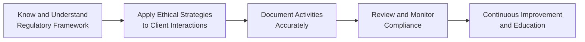

## 9.1 Review of Good Conduct and Practices

Good conduct and best practices aren’t just buzzwords in the Canadian securities industry—they’re the cornerstones of building meaningful, trust-based relationships with clients. If you recall from Chapter 1 (Standards of Conduct and Ethics) and Chapter 2 (Ethical Decision Making), ethics and professional integrity often guide how we interact, how we advise, and how we stand out in a highly scrutinized field. And let’s be honest: in a climate where one regulatory misstep can lead to severe penalties or reputational damage, embracing strong conduct is more than compliance—it's insurance for your professional future.

Below you’ll find an in-depth look at how to integrate ethical standards, regulatory compliance, and professional conduct into your day-to-day activities. We’ll explore the roles of diligence, fairness, transparency, and we’ll put them into context with practical examples, personal anecdotes, and short analogies where appropriate. We’ll also dip into how you can keep current in a changing regulatory environment—especially now that we have a new self-regulatory organization, the Canadian Investment Regulatory Organization (CIRO), guiding both investment dealers and mutual fund dealers and overseeing market integrity.

---

### Why Integrate Ethical Standards and Regulatory Compliance?

Ethical behavior and regulatory compliance protect investors, institutions, and the broader financial landscape. Think of them like the supports beneath a suspension bridge; they ensure stability and keep everything from collapsing under stress. When professionals stray—even a tiny bit—trust erodes, and that can lead to client dissatisfaction, regulatory sanctions, or worse.

Let me share a quick personal story: When I was first starting out, I remember feeling overwhelmed by all the rules and codes of conduct. Everyone seemed to speak in acronyms—IIROC, MFDA (both of which are now part of CIRO, as of 2023)—and throw around “compliance” like it was second nature. But, over time, I realized these regulations weren’t there just to hassle me; they were there to guide me, to give me structure, and to help secure the best outcomes for my clients. Once I fully embraced that, compliance sank in and started to feel like a comfortable routine rather than a chore.

---

### Core Principles of Good Conduct

#### Integrity

Integrity means staying honest, consistent, and, let’s be real, sometimes having the courage to speak up when something feels wrong. When recommending products to clients, do so for the right reasons—what’s suitable for them, not just for you or your firm. Integrity isn’t always the “easiest” path, but it’s the glue that holds trust together.

#### Fairness

Fairness suggests we treat everyone equitably. Prospect or longtime client, big account or small—each deserves the same standard of care. Fairness extends to how you disclose fees, how you address client complaints, and how you execute trades. If you treat one client with extra attention just because they have deeper pockets, other clients will notice and wonder if they’re truly valued.

#### Transparency

We covered transparency in earlier chapters, but let’s emphasize it once more: clear communications, open disclosure of potential conflicts, straightforward explanations of risks and fees—these are crucial. No one wants to feel they’re being kept in the dark about critical information. A transparent approach can decrease misunderstandings and enhance credibility. 

#### Diligence

Diligence emphasizes doing your homework. Whether researching a new investment product (see Chapter 6 on Product Due Diligence) or verifying a client’s financial situation in the New Account Application Form (Chapter 5), thoroughness is a big deal. Sometimes, it’s tempting to skip small details, but that’s how mistakes creep in. And in finance, let’s face it, the smallest details can have the biggest ripple effects.

#### Professionalism

Professionalism goes beyond good manners. It involves competence, reliability, accountability, and respect. A friend of mine who’s a longtime Registered Representative once said, “It’s about being the person your client can count on, no matter the market upswings or downturns.” That sums up professionalism perfectly: unwavering support combined with a consistently high level of technical and ethical operating standards.

---

### The Ongoing Need for Education and Staying Current

The financial industry is anything but static. With new products (like emerging alternative assets, or the latest weed-like crop of crypto-based ETFs) and shifting regulations, your education cannot end when you receive your license. 

• Regularly check CIRO’s bulletins and guidance.  
• Stay updated on any changes from the Canadian Securities Administrators (CSA).  
• Attend compliance training—whether in-house or through third-party providers.  

In other words, never let your own learning stagnate. Market developments can create novel ethical scenarios. For instance, social media–driven stock swings (think “meme stocks”) or advanced high-frequency trading algorithms might force you to revisit standard compliance and data protection guidelines. If you want to be truly prepared, continuous learning is your best bet.

---

### The Role of Communication in Building Trust

Well, let’s just say it: everything hinges on communication. The words you choose and the way you present them can transform trust into loyalty or, conversely, plant seeds of doubt. Whether you’re:

• Explaining complex prospectus exemptions from Chapter 6.3 in simple language,  
• Clarifying the difference between margin and cash accounts from Chapter 8,  
• Or providing updates on a developing trade order from Chapter 7,  

you should aim for clarity, brevity, and consistency. Timelines matter: speed fosters confidence that you’re on top of things. And accuracy is your friend: if new information arises or if you discover an error, proactively correct it. Your clients will appreciate the honesty.

---

### Mitigating Risks: Regulatory Penalties, Reputational Damage, and Financial Losses

When you adhere to good conduct, you help shield yourself and your firm from legal and reputational harm. Picture it this way: each principle—integrity, fairness, transparency, diligence, professionalism—is like a rung on a ladder preventing you from falling into the pit of regulatory scrutiny. 

Regulatory penalties can range from fines and suspensions to termination of registration. Meanwhile, reputational damage can be far more devastating, as it erodes confidence in both you and your organization. Over the years, we’ve seen how even a single slip in compliance or ethics can impact an entire firm—just think about major global financial scandals, which not only led to bankruptcies but also completely tarnished entire brands.

---

### Practical Examples of Best Practices

Let’s ground things in real, day-to-day scenarios.

• Client Interactions: Suppose a client wants to invest in a cutting-edge startup that’s rumored to go public soon. Before jumping in, you’d walk them through relevant prospectus exemptions, remind them of the liquidity risks (especially if it doesn’t go public as planned), and confirm their risk tolerance. Such a thorough approach exemplifies fairness, diligence, and transparency.

• Record-Keeping: Let’s say you’ve just wrapped up a phone call with a client who changed their investment objective from “growth” to “balanced.” Best practice dictates that you document this conversation immediately—who said what, why the change was made, and what was agreed upon going forward. So, you note it in the customer relationship management (CRM) system and confirm in writing to the client. Maintaining that paper (or digital) trail means you can easily produce evidence of your diligence if asked by CIRO or management.

• Trade Execution: You’re placing a client’s order in a high-demand IPO. An hour later, the IPO price changes drastically. Although your client is clamoring for an immediate fill, you notice that it could breach their specified limit. Rather than ignoring the limit or taking a leap of faith, you prioritize the client’s instructions and confirm the new conditions directly before proceeding. That’s not only compliance with best trade practices but also a show of respect for your client’s risk tolerance.

• Conflict Management: Suppose you hold personal shares in a pharmaceutical company you’re recommending to a client. To handle that possible conflict of interest, you disclose your position upfront. If the conflict is deemed too significant, you might refrain from recommending the product altogether, or you discuss potential strategies to mitigate any perceived or real bias on your part.

---

### A Quick Visual on Daily Best Practices

Below is a simple Mermaid diagram illustrating a daily workflow for registered representatives aiming to integrate good conduct into everything they do:

• A → B: Familiarize yourself with laws, regulations, and guidance from CIRO. Then apply those rules in a client-centric manner.  
• B → C: Every interaction or recommendation is carefully recorded for future reference.  
• C → D: Proactively review compliance checklists and firm policies. Adjust practices if you sense any shortfall.  
• D → E: Strengthen your knowledge base with ongoing training, reading relevant bulletins, and attending workshops.

---

### Lean on Your Compliance Team and Resources

Compliance isn’t something done once a year or left solely to the back office. These colleagues function as your partners, providing insights on new regulations, analyzing any changes to the guidelines, and reviewing red flags before they become bigger problems. So it’s good practice to:

• Consult them early if you’re unsure about a new product or trading practice.  
• Keep them looped in on any client complaint or unusual request.  
• Share new or evolving scenarios (like alternative assets or cross-border transactions) so you tackle them as a team.  

As you might recall from Chapter 4 (Working with Clients), your compliance team can also direct you to relevant privacy regulations or cybersecurity protocols to protect client data. It may sometimes feel like compliance reviews slow you down—but that’s precisely how they ensure your practice remains robust and stable.

---

### The Importance of Maintaining Client Records

Accurate and up-to-date client records show not just that you’re thorough but that you’re prepared to answer any regulator’s question promptly. Picture your client files as a tapestry of each person’s needs, preferences, risk appetite, and special instructions. Anytime something changes, you update those threads. Then, if a dispute or regulatory check arises, you can present an accurate picture rather than scrambling to recall what was said. 

In Chapter 5, we saw how the New Account Application Form (NAAF) sets the foundation for understanding client objectives, risk tolerance, and financial background. Keeping this data current is essential—like adjusting a watch every time the battery or time zone changes, you have to keep that watch accurate to remain reliable.

---

### Managing Conflicts of Interest

No matter how pure your intentions, conflicts of interest may arise. From receiving compensation for recommending certain products to “friends and family” share offerings, conflicts can appear in many shapes and forms. Managing them requires you to:

1. Disclose clearly: This might mean telling your client, “Look, my firm has an investment in Company XYZ, so I may indirectly benefit.”  
2. Avoid when possible: If the conflict is too significant or impossible to mitigate, step away from that recommendation or relationship.  
3. Mitigate through ongoing monitoring: Some firms require you to outline how you’re preventing undue influence on your judgment.

When I first got into the business, I remember feeling a bit uneasy about disclosing personal holdings to clients—like it was a private matter. But over time, I realized that failing to disclose might create a far bigger problem, both for me and for my clients. A 30-second conversation about my personal interests in a security can avoid months of potential suspicion or damage later.

---

### Bringing It All Together: A Recap (and Why It Matters)

• In Chapter 1, we looked at overarching standards of conduct and ethics, focusing on foundational principles like honesty and accountability.  
• In Chapter 2, we explored the complexities of ethical decision-making, including how personal values align with laws and regulations.  
• Chapter 3 walked us through the Canadian Regulatory Framework, including how government bodies and CIRO collaborate to maintain market integrity and protect investors.  
• Chapters 4 and 5 provided insights into effectively working with clients—everything from registration requirements to proper documentation and disclosures.  
• Chapter 6 got into the suitability of investments and product due diligence, highlighting the importance of matching recommendations to client objectives.  
• Chapter 7 dealt with trading, settlement, and prohibited activities—crucial knowledge for ensuring that trade orders are executed properly and fairly.  
• Chapter 8 covered how to maintain client accounts over time, including margin rules, complaint handling, and how to effectively communicate trade details.

Now, in Chapter 9, we tie these threads together—emphasizing a holistic approach. All the rules and best practices in the world won’t matter if you don’t integrate them into your daily routine. By reflecting on each principle—integrity, fairness, transparency, diligence, and professionalism—and combining them with robust compliance checks and ongoing education, you create a practice that fosters client trust, satisfies regulatory requirements, and positions you for a sustainably successful career.

---

### Glossary of Key Terms

• **Integrity:** Adherence to moral and ethical principles; honesty and consistency in actions and decisions.  
• **Transparency:** Clear, open, and honest communication and disclosure of information to clients and regulators.  
• **Diligence:** Consistent and careful effort to meet professional responsibilities and obligations.  
• **Compliance:** Adherence to laws, regulations, policies, and ethical standards governing professional conduct.  
• **Conflict of Interest:** A situation in which a professional’s personal interests or obligations conflict with their duty to act in the best interests of their clients.  
• **Professionalism:** Conducting oneself with competence, reliability, accountability, and respect for clients, colleagues, and regulatory standards.

---

### References and Resources

• [Canadian Investment Regulatory Organization (CIRO)](https://www.ciro.ca)  
• [Canadian Securities Administrators (CSA)](https://www.securities-administrators.ca)  
• **Boatright, John R.**  “Ethics and the Conduct of Business.” Pearson Education Canada.  
• **Fox, Thomas.** “The Compliance Handbook: A Guide to Operationalizing Your Compliance Program.”  
• [CSI’s Continuing Education Resources](https://www.csi.ca/student/en_ca/continuing-education.xhtml)

---

So, that’s it—your roadmap to embedding ethical standards, professional conduct, and regulatory compliance into your routine. It might seem a bit overwhelming, but like any habit, it gets easier with practice. If you’re ever uncertain, reach out to compliance teams, consult official regulations, and keep learning. That’s the surest way to ensure both you and your clients thrive in the complex yet rewarding world of financial services.

## Master Your Conduct: Good Practices and Compliance Essentials Quiz



### Which of the following best describes “integrity” in a professional context?

- [x] Consistency in ethical behavior and honesty in actions and decisions
- [ ] Complying with client requests just to be polite
- [ ] Doing research only when forced by regulators
- [ ] Focusing on short-term gains for personal benefit

> **Explanation:** Integrity refers to maintaining honesty and consistency in actions and decisions, even when no one is looking. It’s about adhering to moral principles genuinely, and not just because it’s required.

### Which statement accurately describes why record-keeping is crucial in the Canadian securities industry?

- [ ] It allows you to avoid disclosing conflicts of interest.
- [x] It provides full documentation of client interactions and supports regulatory requirements.
- [ ] It’s only important for clients with very large portfolios.
- [ ] It eliminates the need for communication with compliance teams.

> **Explanation:** Good record-keeping ensures you have a clear audit trail of client communications, risk tolerance updates, and investment decisions. This fosters clarity, complies with CIRO rules, and can protect both you and your clients.

### How does transparency support a client’s experience in a securities environment?

- [x] By giving them clear and honest disclosure of fees, risks, and personal interests
- [ ] By limiting their access to important performance data
- [ ] By focusing only on short-term profits
- [ ] By guaranteeing they will never lose money

> **Explanation:** Transparency fosters trust and ensures clients make informed decisions with full knowledge of potential conflicts, fees, or risks involved.

### Which of the following best describes professionalism?

- [x] Conducting oneself with competence, accountability, and respect
- [ ] Letting your emotions guide your advice
- [ ] Providing advice only to higher-net-worth clients
- [ ]Avoiding communication with compliance officers

> **Explanation:** Professionalism means you approach all tasks with competence, reliability, accountability, and respect, regardless of the client’s net worth or market conditions.

### Which action most clearly demonstrates strong conflict-of-interest management?

- [x] Disclosing any personal ownership of a stock you recommend
- [ ] Conducting trades on behalf of your personal account before placing client trades
- [x] Refusing to recommend a product if you can’t mitigate the conflict effectively
- [ ] Suppressing information about your spouse’s holdings in a client’s preferred sector

> **Explanation:** Conflict-of-interest management consists mainly of disclosure, avoidance (where needed), and mitigation—ensuring your interests don’t adversely affect client outcomes.

### Why is ongoing education so vital in the financial services industry?

- [x] Because regulations and market conditions continually evolve
- [ ] Because regulators require no continuing education
- [ ] Because it allows you to bypass compliance controls
- [ ] Because it eliminates all investment risk

> **Explanation:** Financial professionals must keep pace with regulations, new technologies, market innovations, and emerging best practices. Continuous education helps you better serve clients and mitigate potential issues.

### Which of the following steps should a registered representative take when uncertain about a new product?

- [x] Consult their compliance officer for guidance
- [ ] Recommend it to as many clients as possible
- [x] Review regulatory bulletins and firm policies
- [ ] Launch the product without any due diligence

> **Explanation:** Checking with compliance, reviewing guidelines, and conducting thorough due diligence are all essential to ensure suitable recommendations, especially when exploring unfamiliar or complex products.

### How can you best ensure you maintain comprehensive records for each client?

- [x] Immediately document all communications, changes, and agreements
- [ ] Rely solely on your memory
- [ ] Only record trades that are over a certain dollar value
- [ ] Wait until the end of the quarter to write down everything

> **Explanation:** Prompt documentation of every client interaction and account change is critical for accuracy, auditability, and compliance.

### Which scenario below best demonstrates “fairness” in practice?

- [x] Treating both new and long-standing clients with the same high level of attention and due diligence
- [ ] Giving priority service to a friend who has a large account
- [ ] Only disclosing fees to certain clients
- [ ] Delaying trades for small accounts until after market close

> **Explanation:** Fairness involves providing equal treatment and the same quality of service to each client, no matter the size or longevity of the account relationship.

### True or False: Adhering strictly to good conduct, professional guidelines, and regulatory standards can help mitigate risks like reputational damage and financial losses.

- [x] True
- [ ] False

> **Explanation:** Demonstrating consistent adherence to regulations and ethical standards builds trust and helps avoid penalties that can lead to reputational and financial harm.


