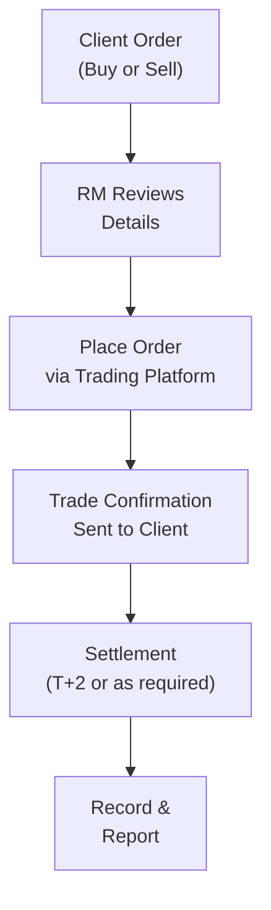

## 9.2 Case Study: The Chengs' Accounts

Picture this: you’re sitting down with the Cheng family—Andrew, Linda, and their two young adult children, Julie and Peter. They walk into your office, looking both excited and a bit uncertain about their financial future. Their situation is fairly typical of Canadian households looking to invest and plan for retirement, along with financing certain milestones (like a child’s education). In this case study, we’ll follow the Chengs’ journey from opening their accounts to periodic reviews, highlighting best practices and concepts outlined throughout this course.

––––––––––––––––––––––––––––

### Introducing the Cheng Family

Andrew Cheng is 55 years old and owns a successful manufacturing business in Ontario. Linda Cheng is 50 and works as a senior marketing manager at a tech firm. Together, they have two children: Julie, who is 20 and studying full-time at university, and Peter, who is 17 and about to start college in a year. The Chengs have an established net worth but little investment experience in individual securities. Historically, their money has largely been in Andrew’s business, some real estate, and a few Guaranteed Investment Certificates (GICs).

They’ve come to you—a Registered Representative under the Canadian Investment Regulatory Organization (CIRO)—to consolidate their finances and ensure their investment plans align with their upcoming life transitions. The Chengs are also keen to learn how to invest smarter, mitigate tax where possible, and transfer wealth efficiently to the next generation. They’ve heard from friends that a good advisor can make a huge difference.

From the get-go, each family member’s personality pops out. Andrew is entrepreneurial and open to a bit more risk, Linda is cautious and detail-oriented, Julie wants to start understanding personal finance, and Peter is mostly excited about forging his own path but also wants some guidance on saving for big-ticket items in the future. It’s a juggling act, but a fascinating challenge all the same.

––––––––––––––––––––––––––––

### The Critical Role of Client Discovery

One of the first things you do is gather information—lots of it. If you recall from Chapter 5 (Client Discovery and Account Opening), we emphasize the significance of thorough client discovery and accurate completion of the New Account Application Form (NAAF). Why does it matter so much?

• It’s legally and ethically required under securities laws and CIRO rules.  
• It lays the foundation for all future recommendations and decisions.  
• It captures financial details, personal background, goals, and risk tolerance.  
• It sets the stage for a long-lasting professional relationship.

Think of it like meeting with a doctor for the first time: they can’t prescribe a treatment plan unless they know your medical history and current health status. Similarly, you can’t propose suitable investment strategies to the Chengs without first “diagnosing” their financial situation.

**How it Applied to the Chengs**  
Andrew provides insight into his business earnings, typical cash flow needs, plus the expected timeline to retirement, which he hopes to begin at around age 65. Linda clarifies her current RRSP and TFSA holdings and raises some concerns about market volatility. She vividly remembers the 2008 financial crisis and wants to ensure they have adequate safety nets. Julie shares that she wants to learn about budgeting and investment basics for her future. Peter, not surprisingly, is more short-term focused, worried about paying for college and possibly a car.

All of these details go neatly into the NAAF. Of course, you also gather identity verification documents, check their addresses, review any relevant trust documents (for possible estate or wealth transfers), and confirm their understanding of the products you plan to offer.  

This stage is crucial. Missing or incomplete information in the NAAF might lead you to make unsuitable recommendations, which can damage trust and (frankly) create compliance breaches.

––––––––––––––––––––––––––––

### Effective Know-Your-Client (KYC) and Suitability Assessments

Now that you have all the data, it’s time to dive deeper into the core pillars of KYC:

• Financial Background and Investment Objectives  
• Risk Tolerance  
• Time Horizon  
• Liquidity Needs  
• Other Personal Circumstances (e.g., estate planning, retirement dates)

Chapter 6 (Product Due Diligence, Recommendations, and Advice) touched on how KYC and suitability intersect. After all, you can’t decide which investments to offer until you understand your client’s parameters in detail.

**Andrew’s Profile**  
Andrew’s risk tolerance is moderate to moderately high. He’s used to the rhythms of running his own business, with the ups and downs that entails. However, he is also approaching retirement in 10–15 years, so extremely speculative ventures might not be appropriate for most of his portfolio. His primary objectives include:  
1. Growing capital for retirement.  
2. Potential income generation to supplement lifestyle if needed.  
3. Limited but meaningful exposure to higher-risk investments, reflecting his entrepreneurial mindset.  

**Linda’s Profile**  
Linda is more conservative. She has seen a variety of economic cycles and wants to ensure capital preservation. Specifically, Linda might be open to balanced but lower-volatility assets within her share of the family portfolio. Her objectives include:  
1. Safeguarding principal.  
2. Steady growth over time, without severe downs.  
3. Maintaining a clear understanding of costs and fees.  

**Julie’s and Peter’s Profiles**  
Though minors and young adults often have smaller accounts or joint accounts with parents, they can still have personal preferences. Julie is excited to learn but remains unsure about her long-term goals. She might be open to a more growth-oriented approach because she has time on her side (retirement is literally decades away). Peter, on the other hand, wants to access funds in the next few years for potential educational or personal expenses, so liquidity is a key factor.

Finding the sweet spot for each Cheng family member means layering their risk tolerance with their liquidity needs and time horizons. From experience, I can say it’s always interesting when families have different investment personalities in the same household—there’s a bit of negotiation and compromise that should be guided by your professional advice.

––––––––––––––––––––––––––––

### Product Due Diligence in Action

A thorough understanding of the Cheng family’s risk–return profile leads us to the next big step: product due diligence. In plain English, this means fully researching and evaluating any security or investment product you plan to recommend. Chapter 6 highlighted how you must look at:

• Risk factors (market risk, credit risk, interest rate risk, currency risk, etc.)  
• Return potential, both historical and projected (though disclaimers will note that past performance is not a guarantee of future performance)  
• Fees and expenses (fund Expense Ratios, advisory fees, possible loads, embedded commissions)  
• Liquidity and lock-up periods  
• Alignment with client objectives

For Andrew, a balanced portfolio might include a mix of equities, high-quality bonds or bond funds, perhaps a portion in alternative investments (like Real Estate Investment Trusts (REITs) or private equity if suitable), and some cash to meet business or personal liquidity needs. For Linda, you’ll likely lean on more stable instruments such as high-quality bonds, dividend-paying blue-chip stocks, maybe a balanced mutual fund or ETF. For Julie, a higher allocation to growth-oriented instruments like equity ETFs or even sector-specific funds could be reasonable. For Peter, you need to ensure that short-term liquidity needs are carefully planned; maybe a short-term bond fund or a money market instrument.  

Due diligence means demonstrating to them each product’s potential plus the risks. If they’re interested in something like an emerging market ETF, you’ll need to explain the currency exposure and higher volatility. If they want an income-oriented fund, you’ll clarify how stable the distribution is and how market changes can affect that income.

––––––––––––––––––––––––––––

### Clear and Transparent Client Communication

One pitfall many advisors face is dropping too much “finance lingo” on clients. Andrew and Linda might smile and nod, but in reality, are they truly grasping everything about derivatives, short selling, or advanced tax strategies? Maybe not. So, it’s vital to keep it real.  

When presenting recommendations, break them down in plain language. Charts, visuals, or even quick stories can help drive a point home. For instance:  
• Explain to Linda how a 60% equities / 40% fixed income portfolio helps manage volatility.  
• Show Andrew how riskier alternative assets can fit into a well-diversified strategy.  
• Illustrate for Julie how investing periodically—like dollar-cost averaging—allows her to take advantage of market fluctuations over time.  
• Emphasize to Peter the importance of liquidity, so he doesn’t lock up funds he needs soon.

**Sample Conversation Starter**:  
“Hey, Andrew, remember when you said you wanted to keep some ‘dry powder’ for your business expansions? Let’s ensure we hold at least 10% in a mix of short-term investments, so if any opportunity pops up, you’re ready to tackle it.”  

Yes, it’s a bit informal, but it resonates. Your priority is ensuring they feel comfortable, well-informed, and that all decisions are documented and traceable.  

––––––––––––––––––––––––––––

### Documentation and Record-Keeping

I once had a frantic moment when a client questioned an old transaction from years ago. If not for proper records, it would have been a nightmare to explain. Thorough documentation is your safety net. It also ensures compliance with CIRO requirements.  

Key points to document:  
• Rationale for each recommendation and how it connects to the KYC info.  
• Discussions around risks.  
• Any special instructions, like “Hold these shares for the long term” or “Sell if the price dips below X.”  
• All disclaimers, risk acknowledgments, and third-party references.  
• Emails, call summaries, and notes from client meetings.

For the Chengs, you might track how, on October 1, 2025, Andrew and Linda decided to allocate 30% of their assets to a balanced mutual fund and 20% to a top-tier bond ETF. Then, you record Linda’s concern about market fluctuations and your response, referencing the risk levels. This level of detail ensures clarity for both parties.

––––––––––––––––––––––––––––

### Identifying and Handling Conflicts of Interest

Conflicts of interest can pop up in subtle ways. Possibly, your firm has a proprietary product, or you get a slightly higher commission from certain funds. Or maybe there’s a referral arrangement in place with a mortgage broker.  

While these arrangements aren’t necessarily unethical, you must disclose them, mitigate the conflict, or avoid them if it’s not in the client’s best interest. The golden rule is transparency—let the Chengs know if you have any financial stake or personal incentive that could color your recommendations. In many cases, a simple disclosure that states, “Our firm may receive a commission from XYZ product,” is enough, as long as you can ensure the product remains suitable.  

––––––––––––––––––––––––––––

### Proper Trade Execution

When the Chengs make decisions (e.g., to purchase shares of a balanced ETF), you move to the trade execution phase, referencing guidelines from Chapter 7. Here’s a quick snapshot of how you might handle that:

1. **Order Placement**: Confirm verbally or in writing which securities the Chengs wish to buy or sell, the number of shares or dollar amount, and the type of order (market, limit, etc.).  
2. **Trade Confirmation**: Provide a trade confirmation that outlines the details—price, fees, date, settlement details.  
3. **Settlement Procedures**: Ensure the trade is settled within the standard T+2 timeframe (or as required) and that the Chengs have adequate funds or margin to complete the transaction.  
4. **Handling Errors or Corrections**: If an error occurs—like entering the wrong ticker or quantity—immediately notify compliance and rectify it. Keep the client informed to maintain trust.

**Visual Representation of the Transaction Flow**:

Here, “RM” means the Registered Representative or an equivalent. The main point is that everything should be documented and promptly shared with the Chengs.

––––––––––––––––––––––––––––

### Ongoing Account Monitoring and Periodic Reviews

So the Chengs have their strategy in place, they know the trade confirmations are in the bag—are we done? Not by a long shot. Life changes. Market conditions evolve. Peter decides to fast-track his college start date, or Julie suddenly needs money for a study-abroad program. Meanwhile, Andrew’s business could thrive or face a downturn.  

Ongoing monitoring involves revisiting the account to ensure it still fits each client’s risk tolerance and objectives. Additionally, you may schedule an in-person review every quarter or annually. Show them performance, re-balance if certain holdings have grown too large, or confirm if new goals have popped up.  

Periodic reviews are a best practice for addressing changes in:  
• Family structure or personal goals (retire earlier, buy property, etc.)  
• Market conditions (e.g., if interest rates spike, bond prices fall)  
• Product performance or risk (e.g., a once-stable fund changes its strategy)  

––––––––––––––––––––––––––––

### Handling Client Complaints and Account Transfers

No one likes to think about complaints—but they happen. Perhaps Andrew feels you didn’t act quickly enough on a sell order, or Linda wants clarity on whether you recommended a product with too high a management fee. Following CIRO guidelines:

1. **Acknowledge the Complaint**: Respond quickly, in writing, letting them know you’re handling it.  
2. **Investigate**: Pull all relevant records—emails, call logs, transaction confirmations.  
3. **Resolve and Communicate**: Explain your findings, offer a solution or apology if necessary, and clarify steps to prevent future issues.  

Account transfers can happen too—maybe one of the kids moves on to a new advisor or Linda decides to consolidate accounts at a different institution. The best approach is to remain professional, ensure the process is smooth (no undue delays), and keep accurate records of the transfer details.

––––––––––––––––––––––––––––

### Putting It All Together: Key Lessons from the Cheng Case

The Cheng family scenario should feel like a microcosm of what real clients face every day. Here’s a summary of important takeaways:

• **Integration of Ethics**: Every recommendation must be honest, respectful of the client’s interests, and aligned with your ethical obligations.  
• **Regulatory Compliance**: From opening an account (Chapter 5) to verifying trade settlements (Chapter 7), you fulfill CIRO requirements at every step.  
• **Suitability**: By thoroughly completing the KYC process, you ensure each investment meets the Chengs’ unique objectives and risk tolerance.  
• **Clear Communication**: Jargon-free explanations, transparency about conflicts, and thorough documentation go a long way in building trust.  
• **Proactive Monitoring**: Staying in touch, making timely rebalancing decisions, and adjusting the plan as needs change is crucial.  
• **Professional Conduct**: When conflicts arise or complaints occur, handle them promptly and professionally.

At the end of the day, the Chengs trust you to safeguard their financial well-being. Your diligence, transparency, and dedication to ethical practices will help support them in meeting their life and financial goals—for generations to come.

––––––––––––––––––––––––––––

### Glossary

• **Know-Your-Client (KYC)**: A regulatory requirement that obliges advisors to gather and document detailed client information, including financial circumstances, investment objectives, risk tolerance, and personal factors.  
• **Suitability Analysis**: The process of matching investment recommendations to a client’s financial goals, risk tolerance, and personal circumstances.  
• **New Account Application Form (NAAF)**: A standardized form investment dealers use for collecting fundamental client information, crucial to opening and maintaining appropriate investment accounts.  
• **Product Due Diligence**: Comprehensive evaluation of investment products to assess their risks, potential returns, fees, liquidity, and overall suitability for specific client objectives.  
• **Trade Execution**: The process of placing, confirming, and completing (settling) securities transactions. It includes order entry, confirmation, and ensuring trades clear and settle properly.  
• **Conflict Disclosure**: Transparency about any potential or actual conflicts of interest that might affect recommendations made to clients.  
• **Account Monitoring**: The ongoing review and reassessment of client accounts to verify continued alignment with the client’s goals, risk tolerance, and evolving life circumstances.

––––––––––––––––––––––––––––

### References and Resources

• Canadian Investment Regulatory Organization (CIRO) Rules and Guidance: [CIRO Rules](https://www.ciro.ca/regulation/rules-guidance)  
• Canadian Securities Administrators (CSA) National Instrument 31-103 Registration Requirements, Exemptions, and Ongoing Registrant Obligations: [CSA NI 31-103](https://www.securities-administrators.ca/industry_resources.aspx?id=47)  
• CSI’s "Conduct and Practices Handbook" textbook, latest edition  
• "Investment Suitability and Risk Management for Financial Advisors" by CFA Institute  
• "Client Relationship Management: Strategies for Financial Advisors" by David J. Mullen Jr.  
• CSI’s interactive case studies and practice scenarios: [CSI LMS](https://www.csi.ca/student/en_ca/learning-management-system.xhtml)

––––––––––––––––––––––––––––

## Test Your Knowledge: CPH Case Study Solutions Quiz



### 1. Which of the following represents the best reason to complete the New Account Application Form (NAAF) thoroughly?

- [ ] To capture only a client’s contact information and ignore their investment goals.
- [x] To gather comprehensive client data required for making suitable recommendations.
- [ ] To publicly share a client's personal details for accountability.
- [ ] To avoid needing any further documentation.

> **Explanation:** The NAAF captures the client’s financial goals, risk tolerance, personal circumstances, and other essential details. This comprehensive information is vital for suitability analysis and compliance with CIRO rules.

### 2. In the Cheng case, why is Andrew’s inclination toward risk significant for suitability assessments?

- [ ] It isn’t relevant as long as Linda is more conservative.
- [x] It affects how you build his portfolio and choose appropriate products.
- [ ] It only matters for short-term investments.
- [ ] It ensures that the advisor can place him in any high-risk product without limitations.

> **Explanation:** Suitability requires that recommendations match each client’s risk tolerance. Andrew’s willingness to accept higher volatility shapes his portfolio, but it must still align with his broader objectives and time horizon.

### 3. Which statement best describes product due diligence?

- [ ] Researching only the past performance of an investment.
- [x] Evaluating an investment’s risks, returns, fees, and liquidity for alignment with client goals.
- [ ] Leaving research up to the client to handle on their own.
- [ ] Focusing exclusively on a fund’s marketing materials.

> **Explanation:** Product due diligence involves a thorough analysis of a product’s characteristics, including fees, liquidity, and alignment with the client’s objectives, not just its performance history.

### 4. How can advisors best maintain clear client communications regarding recommendations?

- [ ] Using complex jargon to appear more knowledgeable.
- [ ] Sending occasional updates as and when the market changes drastically.
- [x] Explaining investments in plain language and ensuring the client understands risks.
- [ ] Omitting any potential downside risk if clients seem uncomfortable.

> **Explanation:** Clear communication in plain language fosters transparency and understanding. Clients appreciate a balanced view that includes possible risks.

### 5. Which step is most crucial when a potential conflict of interest arises in managing the Cheng family’s accounts?

- [x] Disclose the conflict to the client clearly and honestly.
- [ ] Hide it to avoid unnecessary complications.
- [x] Ensure the recommendation remains suitable given the client’s goals.
- [ ] Immediately terminate the relationship.

> **Explanation:** You must disclose any conflict of interest and ensure that your recommendation remains suitable for the client. Concealing conflicts can damage trust and breach compliance.

### 6. In a standard securities transaction (buy or sell), what is the typical settlement time frame in Canada?

- [x] T+2
- [ ] T+0
- [ ] T+7
- [ ] No official settlement deadline

> **Explanation:** In Canada, most equity and bond transactions clear and settle on a T+2 cycle (trade date plus two business days).

### 7. What is one of the key benefits of ongoing account monitoring for a client like Linda?

- [x] It ensures that her portfolio remains aligned with her conservative risk tolerance.
- [ ] It allows the advisor to change her holdings without informing her.
- [x] It identifies if market shifts or personal changes necessitate rebalancing.
- [ ] It is only done once at the beginning of the client–advisor relationship.

> **Explanation:** Ongoing monitoring reviews whether client preferences, market factors, or financial goals have changed, and rebalancing or adjustments can be made accordingly.

### 8. According to CIRO guidelines, how should an advisor respond if Andrew lodges a complaint about his trade not being executed as instructed?

- [x] Investigate and respond quickly, clarifying how the trade was handled.
- [ ] Wait several weeks to see if the complaint still matters to the client.
- [ ] Automatically offer a refund without investigation.
- [ ] Delete all evidence of the trade.

> **Explanation:** CIRO rules require a prompt response, proper investigation, and transparent communication of findings. Sweeping issues under the rug can lead to compliance violations and erode trust.

### 9. Why is documenting every recommendation and client conversation essential?

- [x] It provides an accurate record in case of future disputes or regulatory audits.
- [ ] It is optional, since only large trades need to be documented.
- [ ] It allows the advisor to keep secrets from other family members.
- [ ] It is done simply to impress potential clients with thoroughness.

> **Explanation:** Proper record-keeping is critical for resolving disputes, fulfilling regulatory requirements, and maintaining professional standards of practice.

### 10. True or False: The Cheng family’s case emphasizes that a single, one-time meeting is enough to ensure a successful, compliant client-advisor relationship.

- [x] True
- [ ] False

> **Explanation:** Actually, it’s False. A single instance of KYC information gathering is not enough. Investors’ goals, circumstances, and market conditions can change, so ongoing reviews are essential.


