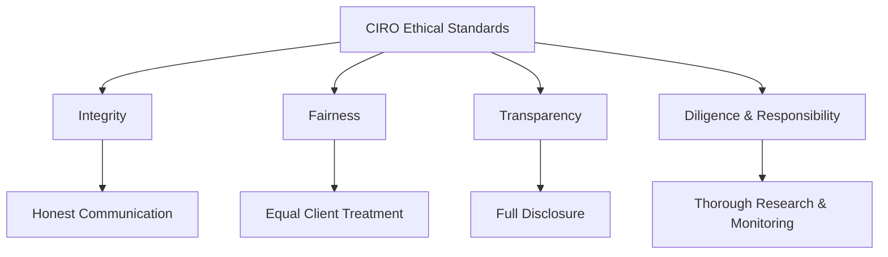
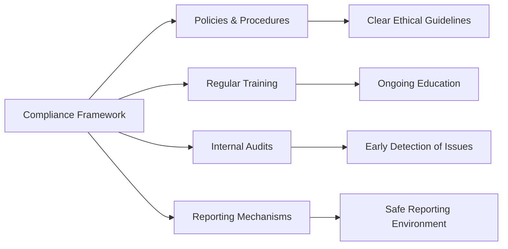

## Standards of Conduct and Ethics

So, let's talk about something really important—standards of conduct and ethics. Now, I know, I know... ethics might sound like one of those dry, textbook topics, right? But trust me, it's actually fascinating (and crucial!) when you realize how much it impacts your daily life as a securities professional. Whether you're just starting out or you've been in the industry for years, understanding and applying ethical standards is absolutely essential.

### Why Ethics Matter in the Securities Industry

Imagine this: you're advising clients on their life savings, retirement funds, and financial dreams. Pretty big responsibility, huh? Clients place enormous trust in you, and maintaining that trust is the cornerstone of the securities industry. Ethical standards ensure you act with integrity, fairness, and transparency, protecting your clients' interests and maintaining public confidence in financial markets.

Without these standards, well, things could get messy pretty quickly. Fraud, insider trading, conflicts of interest—these aren't just buzzwords; they're real risks that can damage reputations, careers, and entire firms. That's why CIRO (the Canadian Investment Regulatory Organization) has established clear guidelines to keep everyone on the straight and narrow.

### Core Ethical Principles for Securities Professionals

Let's break down some of the key ethical principles you need to know:

#### Integrity

Integrity means doing the right thing—even when nobody's watching. It's about honesty, consistency, and sticking to your moral compass. For example, if you accidentally make a mistake on a client's trade, integrity means owning up to it immediately and correcting the error transparently, rather than trying to hide it or shift blame.

#### Fairness

Fairness involves treating all clients equitably, without favoritism or discrimination. It means providing unbiased advice and ensuring that all clients have equal access to investment opportunities. For instance, you can't prioritize trades for certain clients over others just because they're your friends or family members—that's a big no-no.

#### Transparency

Transparency is all about clear, open communication. Clients should fully understand the products they're investing in, including risks, fees, and potential conflicts of interest. If you're recommending a mutual fund that pays your firm a higher commission, transparency means clearly disclosing this fact upfront, so clients can make informed decisions.

#### Diligence and Responsibility

Being diligent means thoroughly researching investments, carefully assessing client needs, and continuously monitoring portfolios. Responsibility involves taking ownership of your actions and decisions. If you recommend an investment, you better have done your homework—no shortcuts allowed!

### CIRO's Role in Upholding Ethical Standards

CIRO is Canada's national self-regulatory organization overseeing investment dealers, mutual fund dealers, and marketplace activities. CIRO sets specific rules and guidelines that registered representatives must follow, including:

- Maintaining confidentiality of client information.
- Avoiding and properly managing conflicts of interest.
- Providing accurate, timely, and complete information to clients.
- Acting in the best interests of clients at all times.

CIRO regularly audits firms and professionals to ensure compliance with these standards. Violations can lead to serious consequences, including fines, suspension, or even permanent revocation of your license. Ouch, right?

Here's a quick visual summary of how CIRO oversees ethical conduct:

### Recognizing and Managing Ethical Dilemmas

Let's face it—ethical dilemmas happen. Sometimes, the right choice isn't immediately clear. Maybe you're pressured by management to sell a high-commission product that doesn't quite fit your client's risk profile. Or perhaps you overhear confidential information about an upcoming merger. What do you do?

First, pause and reflect. Ask yourself:

- Is this action legal and compliant with CIRO rules?
- Does it align with my firm's policies and ethical guidelines?
- Would I feel comfortable if my decision was publicly known?
- Most importantly, does this decision serve my client's best interests?

If you're still unsure, don't hesitate to seek guidance from your firm's compliance department or CIRO directly. Remember, it's always better to ask questions upfront than to face consequences later.

### Building a Robust Compliance System

Firms also play a huge role in promoting ethical behavior. Effective compliance systems include:

- Regular ethics training sessions (yes, even seasoned professionals need refreshers!).
- Clear policies and procedures outlining acceptable behavior.
- Internal audits and monitoring to detect potential issues early.
- Open communication channels for employees to report concerns without fear of retaliation.

Here's how a typical compliance framework might look:

### Consequences of Ethical Violations

Let's be real—violating ethical standards isn't just morally wrong; it's also incredibly risky. Consequences can include:

- Regulatory penalties and hefty fines.
- Suspension or revocation of your professional license.
- Severe reputational damage (and trust me, reputation is everything in this industry).
- Legal liabilities, including lawsuits and criminal charges.

Take insider trading, for example. Trading securities based on non-public, material information isn't just unethical—it's illegal. Remember the infamous Martha Stewart case? She faced serious legal consequences and irreparable damage to her reputation. Definitely not worth it.

### Real-World Example: The Importance of Transparency

Let me share a quick story. A few years ago, a registered representative recommended a complex structured product to several elderly clients without clearly explaining the risks involved. When the market turned, these clients suffered significant losses. CIRO stepped in, investigated, and found the rep had failed to provide transparent disclosures. The result? Massive fines, suspension, and a permanently tarnished reputation. Moral of the story: transparency isn't optional—it's mandatory.

### Resources for Further Exploration

Want to dive deeper into ethics and compliance? Here are some excellent resources:

- **CIRO Rules and Guidelines:** [CIRO Official Website](https://www.ciro.ca)
- **Canadian Securities Administrators (CSA):** [CSA Official Website](https://www.securities-administrators.ca)
- **Investment Industry Association of Canada (IIAC):** [IIAC Official Website](https://iiac.ca)
- **Book:** "Ethics for the Investment Professional" by CFA Institute, available at [CFA Institute](https://www.cfainstitute.org)
- **Online Course:** "Ethical Decision Making for Investment Professionals" by CFA Institute, available at [CFA Institute Ethics Course](https://www.cfainstitute.org/en/ethics-standards/ethics-course)

Ethics isn't just a set of rules—it's a mindset. By consistently applying these standards, you'll build lasting trust with your clients, protect your career, and contribute to a healthier, more transparent financial industry. And honestly, isn't that the kind of professional you want to be?

## Test Your Knowledge: Standards of Conduct and Ethics Quiz



### What does integrity primarily involve in the securities industry?

- [x] Honesty and consistency in actions and decisions.
- [ ] Prioritizing profits over client interests.
- [ ] Avoiding communication with clients.
- [ ] Ignoring regulatory guidelines.

> **Explanation:** Integrity involves consistently acting honestly and ethically, even when no one is watching.

### Which organization sets ethical guidelines for Canadian securities professionals?

- [x] CIRO
- [ ] SEC
- [ ] FINRA
- [ ] CFA Institute

> **Explanation:** CIRO (Canadian Investment Regulatory Organization) sets and enforces ethical standards in Canada.

### Transparency in client communication means:

- [x] Clearly disclosing all relevant information, including risks and fees.
- [ ] Providing selective information to encourage sales.
- [ ] Avoiding discussions about potential conflicts of interest.
- [ ] Using technical jargon to confuse clients.

> **Explanation:** Transparency involves clear, open communication about all relevant details.

### Which of the following is an example of a conflict of interest?

- [x] Recommending a product solely because it pays a higher commission.
- [ ] Providing unbiased advice based on client needs.
- [ ] Clearly disclosing all fees and commissions upfront.
- [ ] Conducting thorough research before recommending investments.

> **Explanation:** Recommending products based on personal gain rather than client suitability is a conflict of interest.

### What is insider trading?

- [x] Trading securities based on material, non-public information.
- [ ] Trading securities openly on the stock exchange.
- [ ] Providing transparent disclosures to clients.
- [ ] Conducting thorough investment research.

> **Explanation:** Insider trading involves trading based on confidential, non-public information, which is illegal.


