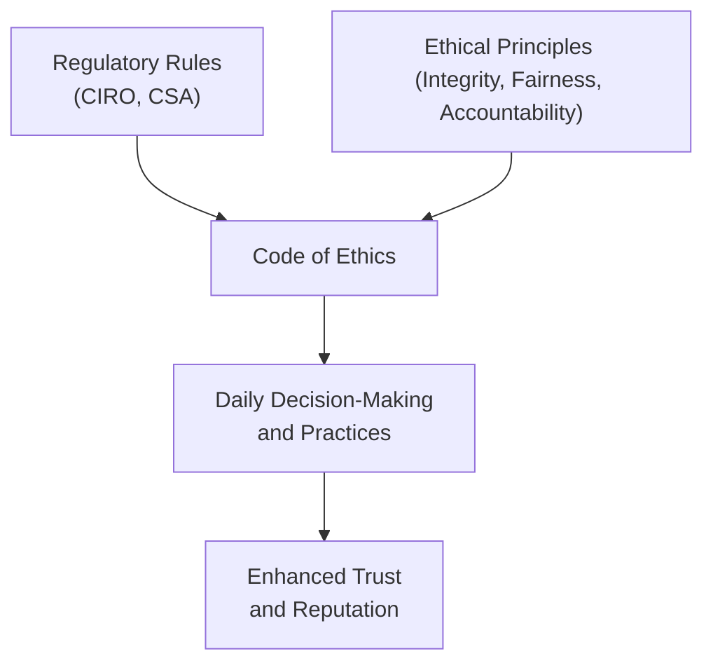
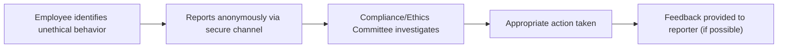

## Integrating Ethics with Industry Rules

So, you've probably heard the phrase "ethics matter," like, a million times, right? But what does it actually mean in the context of the financial industry? And how exactly do we integrate ethics with the rules and regulations we deal with every day? Well, let's dive in and unpack this together.

### Understanding the Relationship Between Ethics and Regulatory Rules

First things first, let's clarify something important: ethics and regulatory rules aren't exactly the same thing. Regulatory rules are explicit—they're clearly defined by regulatory bodies like the Canadian Investment Regulatory Organization (CIRO) and the Canadian Securities Administrators (CSA). They tell you exactly what you can and can't do. Ethics, on the other hand, are broader principles that guide your behavior, especially in situations where the rules might not be crystal clear.

Think of it this way: regulatory rules are like traffic lights—they explicitly tell you when to stop, go, or slow down. Ethics, however, are more like your internal GPS—they guide you when you're navigating unfamiliar territory or when the road signs aren't clear.

### Why Integrating Ethics Matters

Integrating ethics with industry rules isn't just about avoiding trouble with regulators (though that's definitely a bonus!). It's about building trust, maintaining your reputation, and ensuring long-term success. Clients, colleagues, and the public expect financial professionals to act ethically—not just legally. And honestly, doing the right thing feels pretty good too.

Let me share a quick story. A few years ago, a friend of mine, let's call him Alex, was working as a registered representative. He faced a tricky situation where a client wanted to invest heavily in a high-risk product. Technically, the investment was legal and compliant, but ethically, Alex knew it wasn't suitable for the client's financial situation. After some reflection, Alex chose to advise against the investment, even though it meant losing a sizable commission. Fast forward a year, and the product tanked. The client was incredibly grateful for Alex's ethical guidance, and guess what? Alex gained a lifelong client and several referrals. That's ethics in action.

### Developing a Comprehensive Code of Ethics and Conduct

To effectively integrate ethics, firms need a clear, comprehensive Code of Ethics. This isn't just a dusty document that sits on a shelf—it's a living, breathing guide that clearly articulates your organization's values, expectations, and standards of behavior.

A solid Code of Ethics typically includes:

- Core ethical values (integrity, fairness, accountability, transparency)
- Specific examples of acceptable and unacceptable behaviors
- Guidelines for handling conflicts of interest
- Procedures for reporting unethical behavior
- Consequences for violations

And remember, this isn't a "set it and forget it" kind of thing. Regularly reviewing and updating your Code of Ethics ensures it stays relevant with changing regulations, industry practices, and societal expectations.

Here's a quick visual summary of how this integration works:

### Practical Training and Educational Initiatives

Okay, having a Code of Ethics is great, but how do you make sure everyone actually understands and applies it? Training programs and educational initiatives are key. Interactive workshops, case studies, and role-playing exercises can help professionals develop critical thinking and ethical decision-making skills.

For example, imagine a training session where you're presented with a scenario: a colleague is subtly pressuring you to overlook a minor compliance issue to meet quarterly targets. What do you do? Discussing these scenarios openly helps professionals prepare for real-life ethical dilemmas.

### Establishing Clear Reporting Mechanisms

Let's be real—reporting unethical behavior can feel uncomfortable. Nobody wants to be labeled a "snitch" or face retaliation. That's why organizations must establish clear, safe reporting mechanisms. Whistleblower policies and anonymous reporting channels can encourage transparency and accountability.

CIRO emphasizes the importance of whistleblower protections, ensuring that individuals who report unethical or illegal activities are shielded from retaliation. This creates an environment where employees feel empowered to speak up without fear.

Here's a simplified diagram of an effective reporting process:

### Regular Assessments and Audits

Integrating ethics isn't a one-time event—it's an ongoing process. Regular assessments and audits help evaluate the effectiveness of your ethical integration efforts. Feedback from employees, clients, and regulators can highlight areas for improvement and ensure continuous enhancement of ethical practices.

For instance, conducting annual ethics surveys or interviews can provide valuable insights. Questions might include:

- Do employees feel comfortable reporting unethical behavior?
- Are ethical guidelines clear and accessible?
- Have employees encountered ethical dilemmas, and if so, how were they resolved?

### Common Pitfalls and How to Avoid Them

Integrating ethics isn't always smooth sailing. Here are some common pitfalls and strategies to overcome them:

- **Pitfall:** Viewing ethics as mere compliance.
  - **Strategy:** Emphasize ethics as integral to organizational culture, not just regulatory compliance.

- **Pitfall:** Lack of leadership commitment.
  - **Strategy:** Leaders must visibly demonstrate ethical behavior and actively promote ethical standards.

- **Pitfall:** Inadequate training.
  - **Strategy:** Invest in regular, engaging training sessions that address real-world scenarios.

### Resources for Further Exploration

Want to dive deeper? Here are some fantastic resources:

- **CIRO Code of Conduct and Ethics:** [CIRO Official Website](https://www.ciro.ca)
- **Canadian Securities Administrators (CSA) Regulatory Framework:** [CSA Official Website](https://www.securities-administrators.ca)
- **Book:** "Business Ethics: Decision Making for Personal Integrity & Social Responsibility" by Laura P. Hartman, Joseph DesJardins, and Chris MacDonald, available at [McGraw-Hill Education](https://www.mheducation.ca)
- **Online Course:** "Ethics in Finance" by University of Toronto, available at [Coursera](https://www.coursera.org/learn/ethics-in-finance)

### Glossary of Key Terms

- **Code of Ethics:** A formal document outlining an organization's values, ethical principles, and standards of behavior expected from employees.
- **Whistleblower:** An individual who reports unethical or illegal activities within an organization.
- **Regulatory Compliance:** Adherence to laws, regulations, and guidelines established by regulatory authorities.
- **Ethical Integration:** The process of aligning ethical principles with organizational practices, policies, and regulatory requirements.
- **Retaliation:** Negative actions or consequences directed toward individuals who report unethical behavior or violations.

## Test Your Knowledge: Ethics and Regulatory Integration Quiz



### What is the primary difference between regulatory rules and ethical principles?

- [x] Regulatory rules provide explicit guidelines, while ethical principles offer broader guidance.
- [ ] Ethical principles are legally binding, while regulatory rules are not.
- [ ] Regulatory rules are optional, while ethical principles are mandatory.
- [ ] Ethical principles are clearly defined by regulatory authorities.

> **Explanation:** Regulatory rules explicitly outline required actions, whereas ethical principles guide behavior in situations not explicitly covered by regulations.

### Why is it important to regularly update a firm's Code of Ethics?

- [x] To reflect changes in regulations, industry practices, and societal expectations.
- [ ] Because regulatory authorities mandate annual updates.
- [ ] To increase the complexity of the document.
- [ ] To reduce the number of ethical dilemmas employees face.

> **Explanation:** Regular updates ensure the Code of Ethics remains relevant and effective in guiding ethical behavior.

### Which of the following is NOT typically included in a comprehensive Code of Ethics?

- [ ] Core ethical values
- [ ] Guidelines for handling conflicts of interest
- [x] Detailed financial statements of the organization
- [ ] Procedures for reporting unethical behavior

> **Explanation:** Detailed financial statements are not part of a Code of Ethics; they are typically found in financial reports.

### What is the purpose of whistleblower policies?

- [x] To encourage employees to report unethical behavior without fear of retaliation.
- [ ] To discourage employees from reporting minor issues.
- [ ] To publicly disclose all internal issues.
- [ ] To penalize employees who report unethical behavior.

> **Explanation:** Whistleblower policies protect employees who report unethical activities, promoting transparency and accountability.

### Which organization oversees the regulatory compliance of investment dealers in Canada?

- [x] Canadian Investment Regulatory Organization (CIRO)
- [ ] Mutual Fund Dealers Association (MFDA)
- [ ] Investment Industry Regulatory Organization of Canada (IIROC)
- [ ] Financial Industry Regulatory Authority (FINRA)

> **Explanation:** CIRO is Canada's national self-regulatory body overseeing investment dealers and market integrity.


