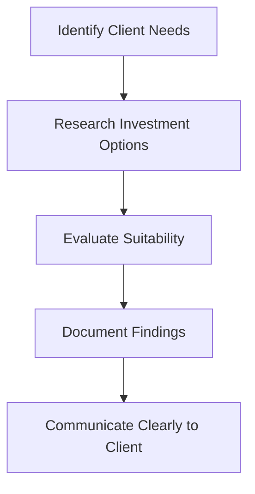
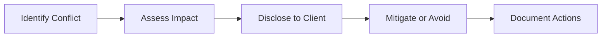

## Rules of Thumb to Guide the Conduct of Registered Representatives

When I first started working as a registered representative, I remember feeling overwhelmed. Sure, I knew the regulations and had passed all the exams, but real-world situations rarely fit neatly into textbook scenarios. Ethical dilemmas popped up more often than I expected. Thankfully, I had a mentor who shared some practical "rules of thumb" that helped me navigate tricky situations. These simple yet powerful guidelines have stuck with me throughout my career, and now I'm going to share them with you.

### Always Prioritize the Client's Best Interests

This might sound obvious, but you'd be surprised how often this principle gets overlooked. When you're faced with a decision, ask yourself: "Is this genuinely in my client's best interest?" If the answer isn't a resounding "yes," pause and reconsider your approach.

For example, imagine your firm is pushing a new investment product because it's highly profitable for the company. But after reviewing your client's risk tolerance and financial goals, you realize it's not a good fit. Even though there's pressure from above, your duty is clear: prioritize your client's needs over organizational incentives or personal gain.

### Transparency and Honesty in Communication

Transparency builds trust, and trust is the cornerstone of any successful client relationship. Always clearly disclose potential risks, fees, conflicts of interest, and other relevant information. Clients deserve to make informed decisions, and it's your responsibility to provide them with the necessary tools.

Here's a quick scenario: You're recommending a mutual fund with a higher-than-average management fee. Don't gloss over this detail—explain why the fee is higher, what benefits justify it, and how it aligns with the client's objectives. Clients appreciate honesty, even if the news isn't always perfect.

### Exercise Due Diligence and Professional Care

Due diligence isn't just a regulatory requirement—it's a fundamental ethical responsibility. Thoroughly research and evaluate investment products and strategies before recommending them. This means understanding the product's features, risks, historical performance, and how it fits into the client's overall financial plan.

I recall an incident early in my career when a colleague recommended a complex structured product without fully understanding it. When the product underperformed, the client was understandably upset. A simple rule of thumb: if you can't confidently explain it to your grandmother, you probably shouldn't recommend it to your client.

Here's a visual representation of the due diligence process:

### Protect Client Confidentiality and Privacy

In our digital age, protecting client confidentiality is more critical than ever. Always safeguard sensitive client information and adhere strictly to privacy laws and regulations, such as Canada's Personal Information Protection and Electronic Documents Act (PIPEDA). Obtain explicit consent before sharing client information with third parties.

A quick story: I once had a client whose adult child called requesting account details. Even though the request seemed innocent, I politely declined until the client provided explicit authorization. It turned out the client appreciated my caution, reinforcing our trust-based relationship.

### Avoid and Manage Conflicts of Interest

Conflicts of interest can arise naturally in financial services, but it's how you handle them that matters. Whenever possible, avoid conflicts altogether. If avoidance isn't feasible, disclose them clearly and take steps to mitigate their impact.

For instance, suppose your firm offers incentives for selling certain products. If you genuinely believe one of these products fits your client's needs, disclose the incentive transparently. Explain why you still believe it's the best option, and let the client make an informed decision.

Here's a simple framework for managing conflicts:

### Continuous Professional Development

The financial industry evolves rapidly. Regulations change, new products emerge, and market dynamics shift. Staying informed isn't just good practice—it's essential. Regularly engage in professional development activities, attend industry seminars, and keep abreast of regulatory updates from CIRO and other authoritative sources.

I personally set aside a few hours each week to read industry publications, attend webinars, or complete online courses. Trust me, clients notice when you're knowledgeable and up-to-date.

### Thorough and Accurate Documentation

Documentation isn't glamorous, but it's incredibly important. Thoroughly document all client interactions, recommendations, and decisions. Proper documentation demonstrates compliance with regulatory requirements and ethical standards, and it can be invaluable if disputes or complaints arise.

A colleague once faced a client complaint alleging unsuitable recommendations. Fortunately, she had meticulously documented every interaction, clearly outlining the client's stated objectives and her rationale for each recommendation. The documentation resolved the issue swiftly and favorably.

Here's a quick checklist for effective documentation:

- Date and time of interaction
- Participants involved
- Key discussion points and decisions
- Client's stated objectives and risk tolerance
- Rationale for recommendations
- Any disclosures made

### Glossary of Key Terms

- **Due Diligence:** The process of thoroughly researching and evaluating investment products, strategies, and opportunities to ensure suitability and appropriateness.
- **Client Confidentiality:** The obligation to protect sensitive client information from unauthorized disclosure or misuse.
- **Suitability:** The requirement to recommend investment products and strategies that align with a client's financial goals, risk tolerance, and investment objectives.
- **Professional Development:** Ongoing activities and training designed to enhance professional knowledge, skills, and competencies.

### Additional Resources for Further Exploration

To deepen your understanding, consider exploring these resources:

- **CIRO Guidance on Suitability and Due Diligence:** Comprehensive guidelines available at [CIRO Official Website](https://www.ciro.ca)
- **Office of the Privacy Commissioner of Canada:** Essential privacy guidelines at [Privacy Commissioner Official Website](https://www.priv.gc.ca)
- **Book Recommendation:** "The Advisor's Guide to Financial Planning" by Harold Evensky, available at [Amazon](https://www.amazon.ca)
- **Online Course:** "Professional Ethics for Financial Advisors" by CSI, available at [CSI Global Education](https://www.csi.ca)

In conclusion, these rules of thumb aren't just theoretical—they're practical tools to guide your daily interactions and decisions. By consistently applying these principles, you'll build strong client relationships, maintain regulatory compliance, and uphold the highest ethical standards. And remember, when in doubt, always ask yourself: "What would I want if I were the client?"

## Test Your Knowledge: Ethical Conduct and Best Practices for Registered Representatives



### What should always be the primary consideration when making recommendations to clients?

- [x] The client's best interests
- [ ] Organizational profitability
- [ ] Personal incentives
- [ ] Ease of implementation

> **Explanation:** Always prioritize the client's best interests above personal or organizational incentives.

### Which of the following best describes the concept of due diligence?

- [x] Thoroughly researching and evaluating investment products for suitability
- [ ] Quickly reviewing product brochures
- [ ] Relying solely on past performance
- [ ] Following popular market trends

> **Explanation:** Due diligence involves comprehensive research and evaluation to ensure suitability and appropriateness.

### When should conflicts of interest be disclosed to clients?

- [x] Immediately upon identification
- [ ] Only if the client asks
- [ ] After the transaction is completed
- [ ] Disclosure is optional

> **Explanation:** Conflicts of interest must be disclosed promptly and transparently to enable informed client decisions.

### Which Canadian legislation governs client privacy and confidentiality?

- [x] Personal Information Protection and Electronic Documents Act (PIPEDA)
- [ ] Investment Canada Act
- [ ] Bank Act
- [ ] Canada Revenue Agency Act

> **Explanation:** PIPEDA (Personal Information Protection and Electronic Documents Act) governs privacy and confidentiality in Canada.

### Effective documentation should include which of the following?

- [x] Date and time of interaction
- [x] Client's stated objectives
- [x] Rationale for recommendations
- [ ] Personal opinions unrelated to the client

> **Explanation:** Effective documentation includes factual details relevant to client interactions and recommendations.

### Professional development activities help registered representatives to:

- [x] Stay informed about regulatory changes
- [ ] Avoid documentation requirements
- [ ] Increase personal income directly
- [ ] Reduce client interactions

> **Explanation:** Ongoing professional development ensures representatives remain informed and competent.

### What should you do if a client's family member requests confidential account information without authorization?

- [x] Politely decline until explicit client authorization is provided
- [ ] Provide the information as a courtesy
- [ ] Ignore the request
- [ ] Refer them to another colleague

> **Explanation:** Always protect client confidentiality by requiring explicit authorization before sharing sensitive information.

### Transparency in communication primarily helps to:

- [x] Build trust with clients
- [ ] Increase sales volume
- [ ] Reduce documentation requirements
- [ ] Avoid regulatory oversight

> **Explanation:** Transparency fosters trust and enables informed client decision-making.

### How often should registered representatives engage in professional development?

- [x] Regularly and continuously
- [ ] Only when required by regulators
- [ ] Once every few years
- [ ] Professional development is optional

> **Explanation:** Continuous professional development ensures representatives remain knowledgeable and effective.

### Proper documentation primarily serves to:

- [x] Provide evidence of compliance and ethical standards
- [ ] Increase personal productivity
- [ ] Reduce paperwork
- [ ] Impress colleagues

> **Explanation:** Documentation ensures accountability, compliance, and effective dispute resolution.


