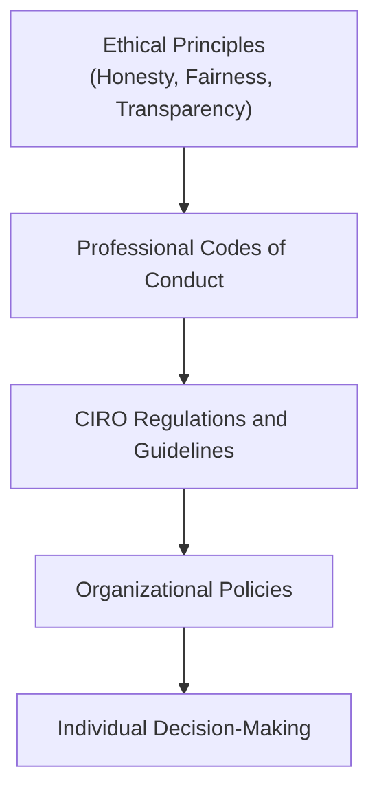
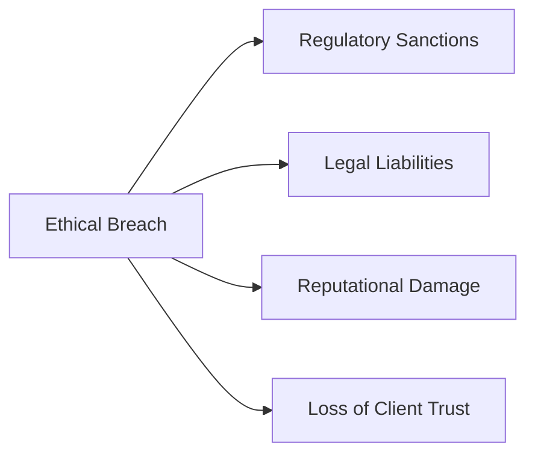

## 2.1 Overview of Ethics

So, let's start with a little story. Imagine you're a financial advisor, and one of your long-time clients, Mrs. Thompson, comes to you with a substantial inheritance. She's excited, but also nervous. She trusts you completely and asks you to invest her money wisely. Now, here's the catch: your firm is pushing a new investment product that offers a hefty commission—but it's not necessarily the best fit for Mrs. Thompson's financial goals. What do you do?

This scenario, my friends, is exactly why ethics matter so much in the financial industry. Ethics isn't just about following rules—it's about doing the right thing, even when nobody's watching, and even when the law doesn't explicitly tell you what to do.

### What Exactly Are Ethics?

Ethics are the principles and standards that guide our behavior and decision-making, especially in situations where laws or regulations might be silent, vague, or ambiguous. Think of ethics as your internal compass, pointing you toward what's fair, honest, and responsible. In finance, ethical behavior is absolutely critical because it directly impacts public trust, investor confidence, and overall market integrity.

### Why Ethics Matter in Finance

Let's face it—finance is built on trust. Investors trust financial professionals to handle their money responsibly, transparently, and honestly. When that trust breaks down, the consequences can be devastating. Remember the 2008 financial crisis? A lot of that chaos stemmed from unethical practices—misleading disclosures, conflicts of interest, and a lack of transparency. The result? Massive financial losses, economic recession, and a severe erosion of public confidence.

On the flip side, ethical behavior builds trust, credibility, and reputation. It ensures that investors feel secure, markets function efficiently, and financial institutions thrive sustainably over the long term.

### Core Principles of Ethical Behavior

So, what exactly does ethical behavior look like in practice? Let's break down some core principles:

- **Honesty:** Being truthful and straightforward in all professional interactions. No misleading statements, no hidden agendas.
- **Fairness:** Treating all clients and stakeholders equitably, without bias or favoritism.
- **Transparency:** Clearly communicating information, decisions, and potential conflicts of interest. No surprises, no hidden fine print.
- **Accountability:** Owning your decisions and actions, accepting responsibility, and proactively addressing any issues or mistakes.
- **Responsibility:** Acting diligently and competently, always prioritizing the best interests of your clients and the integrity of the market.

### Ethical Standards and Codes of Conduct

Now, ethics aren't just abstract ideals—they're often codified into professional codes of conduct, regulatory guidelines, and organizational policies. In Canada, for instance, the Canadian Investment Regulatory Organization (CIRO) provides clear ethical standards and guidelines that financial professionals must follow. These standards help professionals navigate tricky situations, manage conflicts of interest, and consistently prioritize client interests.

Here's a quick visual to illustrate how ethical standards fit into the broader regulatory framework:

### Navigating Ethical Dilemmas

Let's be real—ethical dilemmas are inevitable. Situations will arise where the right choice isn't immediately clear. Maybe you're facing pressure from management, or perhaps a client insists on something that feels ethically questionable. How do you handle these situations?

Here's a simple framework to guide your ethical decision-making:

1. **Identify the dilemma:** Clearly define the ethical issue at hand.
2. **Gather information:** Understand all relevant facts, perspectives, and implications.
3. **Evaluate alternatives:** Consider different courses of action and their ethical consequences.
4. **Make a decision:** Choose the option that aligns most closely with ethical principles and standards.
5. **Take action and reflect:** Implement your decision, monitor outcomes, and reflect on the process.

Let's revisit Mrs. Thompson's scenario. Applying this framework, you'd quickly realize that recommending the high-commission product isn't ethically sound. Instead, you'd choose an investment that aligns with her financial goals, even if it means a smaller commission. In the long run, your ethical choice strengthens your relationship, builds trust, and enhances your professional reputation.

### Consequences of Ethical Breaches

Unfortunately, ethical breaches do happen—and when they do, the consequences can be severe. Regulatory sanctions, legal liabilities, reputational damage, and loss of client trust are just a few examples. Remember Bernie Madoff? His unethical behavior didn't just ruin his own life; it devastated countless investors and severely damaged public trust in financial markets.

Here's a quick visual summary of potential consequences:

### The Importance of Ethics Training

Ethical standards aren't static—they evolve as markets, technologies, and societal expectations change. That's why ongoing ethics training and professional development are essential. Regular training helps financial professionals stay current with evolving ethical standards, regulatory expectations, and best practices.

Organizations like the CFA Institute offer fantastic resources, including their comprehensive "Ethical Decision-Making for Investment Professionals" course. Trust me, investing time in ethics training pays off big-time in your career.

### Glossary of Key Ethical Terms

Let's quickly recap some key terms you'll encounter frequently:

- **Ethics:** Principles and standards guiding behavior and decisions, especially when laws or regulations don't provide clear guidance.
- **Integrity:** Adherence to moral and ethical principles, demonstrating honesty and fairness in professional conduct.
- **Transparency:** Openness and clarity in communication, disclosure, and decision-making processes.
- **Accountability:** Taking responsibility for your actions and decisions, including accepting consequences and proactively addressing issues.
- **Conflict of Interest:** Situations where personal or organizational interests might interfere with professional judgment or responsibilities.

### Wrapping It Up

Ethics is the backbone of the financial industry. It's what keeps markets fair, investors protected, and institutions credible. As financial professionals, our ethical choices shape not only our careers but also the broader financial ecosystem. So, next time you're faced with an ethical dilemma, remember Mrs. Thompson—and choose wisely.

### References and Resources for Further Exploration

Want to dive deeper? Here are some excellent resources:

- **Canadian Investment Regulatory Organization (CIRO) Rules and Regulations:** [CIRO Official Website](https://www.ciro.ca)
- **CFA Institute Code of Ethics and Standards of Professional Conduct:** [CFA Institute Ethics](https://www.cfainstitute.org/en/ethics-standards)
- **Book:** "Ethics in Finance" by John R. Boatright
- **Online Course:** "Ethical Decision-Making for Investment Professionals" by CFA Institute [Course Link](https://www.cfainstitute.org/en/programs/professional-learning/ethics)

---

## Test Your Knowledge: Ethics in Finance Quiz



### What is the primary purpose of ethics in the financial industry?

- [x] To guide behavior in situations where laws may be unclear or ambiguous.
- [ ] To increase profitability at any cost.
- [ ] To avoid regulatory oversight entirely.
- [ ] To prioritize personal interests over client interests.

> **Explanation:** Ethics provide guidance for behavior, especially when laws or regulations are unclear, ensuring decisions are fair, transparent, and responsible.

### Which of the following is NOT a core ethical principle in finance?

- [ ] Honesty
- [ ] Transparency
- [x] Maximizing personal profit
- [ ] Accountability

> **Explanation:** Maximizing personal profit is not an ethical principle; ethical principles focus on honesty, transparency, fairness, and accountability.

### What is transparency in financial ethics?

- [x] Openness and clarity in communication and decision-making.
- [ ] Keeping sensitive information hidden from clients.
- [ ] Prioritizing company profits over client interests.
- [ ] Avoiding responsibility for decisions.

> **Explanation:** Transparency involves clear, open communication and disclosure, ensuring clients understand decisions and processes.

### Which of these is an example of a conflict of interest?

- [x] Recommending a product because it offers a higher commission, despite not being the best fit for the client.
- [ ] Recommending a product solely based on client needs.
- [ ] Clearly disclosing all fees and commissions.
- [ ] Acting in accordance with professional codes.

> **Explanation:** A conflict of interest occurs when personal or organizational interests interfere with professional judgment or responsibilities.

### Why is ethics training important for financial professionals?

- [x] It helps professionals stay current with evolving ethical standards.
- [ ] It guarantees higher commissions.
- [ ] It eliminates the need for regulatory compliance.
- [ ] It ensures professionals can ignore ethical considerations.

> **Explanation:** Ethics training ensures professionals understand evolving standards and expectations, enhancing their ability to make ethical decisions.


