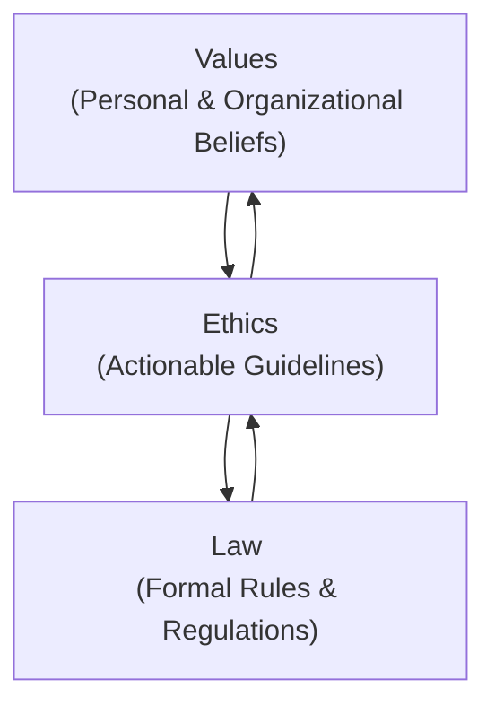

When I first started working in financial services, I remember thinking, "Hey, as long as I follow the rules, I'm good, right?" Well, turns out, it's not quite that simple. Sure, laws are critical—they set the baseline for acceptable behavior. But ethics and values? They go way beyond just ticking boxes on a compliance checklist. Let's dive into how values, ethics, and laws interact, especially in the financial services industry, and why understanding this relationship is crucial for any financial professional.

## Values: The Foundation of Ethical Behavior

So, what exactly are values? Think of them as your internal compass—deeply held beliefs and principles that guide your decisions and actions. Values shape how you perceive right and wrong, fair and unfair, acceptable and unacceptable. They're influenced by your upbringing, culture, education, and personal experiences.

In financial services, common values include honesty, integrity, fairness, accountability, and transparency. For example, imagine you're advising a client who's considering an investment that's technically legal but highly risky and not aligned with their financial goals. Your personal value of integrity might prompt you to advise against it, even if it means losing potential commissions.

Values aren't just personal—they're organizational too. Companies often articulate their core values in mission statements or codes of conduct. For instance, a brokerage firm might emphasize "client-first" values, ensuring that every decision prioritizes the client's best interests.

## Ethics: Translating Values into Action

Now, values alone are great, but they're pretty abstract, right? Ethics are where things get practical. Ethics translate your values into actionable standards and guidelines. They're like the bridge between your internal beliefs and your external behavior.

In professional contexts, ethics provide a framework for making decisions, especially when things aren't black and white. Ethical guidelines help you navigate situations where laws might be silent, ambiguous, or insufficient. For example, let's say you're handling confidential client information. The law might specify certain privacy standards, but ethical guidelines encourage you to go further—ensuring you're proactively protecting client data, even beyond legal requirements.

Ethical standards in financial services typically exceed what's legally required. They encourage professionals to act in ways that promote fairness, transparency, and integrity, even when nobody's watching. For instance, CIRO's (Canadian Investment Regulatory Organization) rules emphasize ethical conduct, requiring members to act honestly, fairly, and in good faith with clients, even in situations where specific laws might not explicitly dictate behavior.

## Law: The Minimum Standard of Conduct

Laws, on the other hand, represent formal rules and regulations established by governmental and regulatory authorities. They're enforceable through legal mechanisms, meaning there are explicit consequences for non-compliance—fines, penalties, or even criminal charges.

In Canada, financial professionals must comply with laws set by regulatory bodies like the Canadian Securities Administrators (CSA) and CIRO. These laws cover areas like securities trading, client communication, disclosure requirements, anti-money laundering, and privacy protection.

For example, consider insider trading. Canadian law explicitly prohibits trading based on material, non-public information. Violating this law isn't just unethical—it's illegal, with severe penalties. Laws like these set clear boundaries, ensuring a baseline of acceptable behavior.

## The Interplay Between Values, Ethics, and Law

Here's where things get interesting. Values, ethics, and laws aren't isolated—they're deeply interconnected, influencing and reinforcing each other. Understanding this interplay helps financial professionals navigate complex situations, manage conflicts, and make informed decisions.

Let's visualize this relationship clearly:

- **Values inform ethics:** Your personal and organizational values shape your ethical perspectives, influencing how you interpret and apply ethical guidelines.
- **Ethics influence laws:** Ethical standards often inspire the creation of new laws or amendments to existing ones. For example, increased ethical awareness around client privacy led to stricter privacy laws in Canada.
- **Laws reinforce ethics:** Laws provide formal backing to ethical standards, ensuring they're enforceable and universally applied.

## Ethical Behavior Beyond Legal Compliance

Here's a critical point: compliance with legal requirements alone doesn't always equate to ethical behavior. Laws set minimum standards, but ethical behavior often demands more.

Imagine this scenario: A client approaches you, eager to invest a significant portion of their retirement savings into a speculative investment. Legally, you might fulfill your obligations by simply providing the required disclosures and warnings. But ethically? You might feel compelled to have a deeper conversation, ensuring the client truly understands the risks and implications, even if it means they reconsider their investment.

Ethical behavior requires professionals to consider not only legal obligations but also the broader implications of their actions on clients, stakeholders, and society. It's about doing what's right, not just what's required.

## Real-World Example: Ethical Judgment in Action

Let's look at a practical example. Suppose you're an investment advisor, and your firm is promoting a new financial product. Legally, the product meets all regulatory requirements—it's registered, disclosures are accurate, and everything checks out. However, you personally believe the product is overly complex and risky for your typical client base.

Here's where ethical judgment comes into play. You might decide to refrain from recommending the product, even though it's perfectly legal to do so. Your decision is guided by your values (protecting your clients' interests), ethical guidelines (acting in good faith), and your professional judgment.

## Common Pitfalls and Best Practices

Navigating the relationships between values, ethics, and law isn't always straightforward. Here are some common pitfalls and best practices to keep in mind:

### Common Pitfalls:
- **Legalistic mindset:** Relying solely on legal compliance without considering ethical implications.
- **Ethical fading:** Gradually losing sight of ethical considerations due to pressures, incentives, or organizational culture.
- **Rationalization:** Justifying unethical behavior by minimizing consequences or shifting responsibility.

### Best Practices:
- **Continuous education:** Regularly update your understanding of ethical standards, laws, and industry best practices.
- **Open dialogue:** Foster a workplace culture where ethical dilemmas can be openly discussed and addressed.
- **Reflective practice:** Regularly reflect on your decisions, considering both legal requirements and ethical implications.

## Resources for Further Exploration

If you're interested in digging deeper into this topic, here are some valuable resources:

- **Canadian Securities Administrators (CSA) Regulatory Framework:** [CSA Official Website](https://www.securities-administrators.ca)
- **Book:** "Business Ethics: Decision Making for Personal Integrity & Social Responsibility" by Laura Hartman, Joseph DesJardins, and Chris MacDonald.
- **Online Course:** "Business Ethics and Corporate Social Responsibility" by Coursera [Course Link](https://www.coursera.org/learn/business-ethics)

In conclusion, understanding the relationships between values, ethics, and law is essential for financial professionals. It's not just about compliance—it's about integrity, trust, and doing what's right for your clients and society. So, next time you're faced with a tricky decision, remember: laws set the floor, ethics raise the ceiling, and your values guide you in between.

## Test Your Knowledge: Values, Ethics, and Law in Financial Services Quiz



### What best describes the role of values in ethical decision-making?

- [x] Values serve as foundational beliefs guiding ethical decisions.
- [ ] Values are formal rules enforced by regulatory bodies.
- [ ] Values are specific actions required by law.
- [ ] Values are optional guidelines for professional behavior.

> **Explanation:** Values are deeply held beliefs and principles that form the foundation for ethical decision-making.

### Ethics primarily function as:

- [x] Actionable guidelines derived from values.
- [ ] Formal rules enforced by government.
- [ ] Personal beliefs without professional relevance.
- [ ] Optional suggestions without consequences.

> **Explanation:** Ethics translate values into actionable guidelines for professional conduct.

### Laws in financial services are best described as:

- [x] Formal rules and regulations set by authorities.
- [ ] Personal beliefs guiding individual decisions.
- [ ] Optional ethical suggestions.
- [ ] Organizational mission statements.

> **Explanation:** Laws are formal rules established by regulatory authorities, enforceable through legal mechanisms.

### Ethical standards typically:

- [x] Exceed legal requirements.
- [ ] Exactly match legal requirements.
- [ ] Are less stringent than laws.
- [ ] Have no relationship to laws.

> **Explanation:** Ethical standards typically exceed legal requirements.

### Which scenario illustrates ethical behavior beyond legal compliance?

- [x] Advising a client against a risky but legal investment.
- [ ] Following minimum disclosure laws only.
- [ ] Ignoring client interests if legally permissible.
- [ ] Engaging in insider trading.

> **Explanation:** Ethical behavior involves protecting client interests beyond mere legal compliance.


