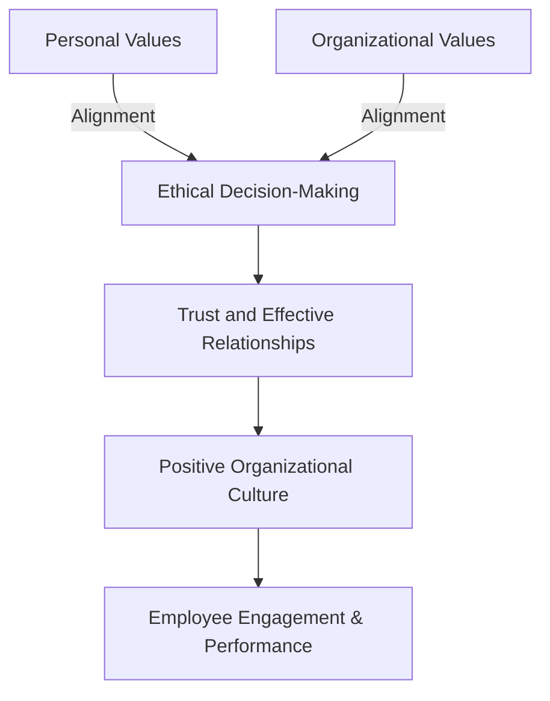
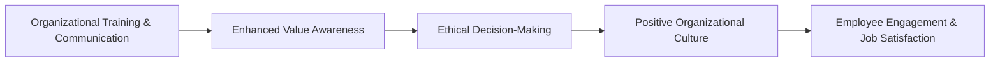

## 2.3 Value Awareness

So, let's talk about something that's honestly pretty important but often overlooked—value awareness. You might be thinking, "Um, values? Really? Isn't that a bit obvious?" But trust me, it's not as straightforward as it seems. Especially in the financial services industry, where ethical decision-making is crucial, understanding your own values—and those of your clients, colleagues, and organization—can make a huge difference.

### What Exactly Is Value Awareness?

Simply put, value awareness is recognizing and understanding your own personal and professional values, as well as those of the people and organizations around you. It's about knowing what matters most to you, how these beliefs shape your decisions, and how they align (or sometimes clash) with others.

Think of it like this: Imagine you're advising a client who wants to invest in a company known for high returns but questionable environmental practices. If environmental responsibility is a core personal value for you, this scenario could create an ethical dilemma. Being aware of your values helps you navigate these tricky situations thoughtfully and ethically.

### Why Is Value Awareness Important?

Well, here's the thing—financial professionals constantly face decisions that aren't just about numbers. They're about trust, integrity, and doing what's right. When you're clear about your values, you're better equipped to handle ethical dilemmas, build trust with clients, and foster positive relationships with colleagues.

Moreover, value awareness isn't just a personal thing. Organizations have their own sets of values, too. When your personal values align with your organization's culture, you're likely to feel more engaged, satisfied, and motivated. On the flip side, when there's a mismatch, it can lead to stress, dissatisfaction, and even ethical conflicts.

Let's visualize this alignment:

As you can see, aligning personal and organizational values creates a positive ripple effect, enhancing ethical behavior, trust, and overall performance.

### Reflecting on Your Values

Reflection is key. And no, I'm not talking about staring into a mirror wondering about life's mysteries (though, hey, if that works for you, go for it!). Reflection in this context means regularly taking time to critically examine your beliefs, values, and actions to enhance your self-awareness and ethical decision-making.

Here's a quick exercise you can try:

- **List your top five personal values.** (Examples: honesty, integrity, family, financial security, environmental responsibility.)
- **Think about recent decisions you've made professionally.** Did your actions align with these values? If not, why?
- **Consider your organization's stated values.** Do they align with yours? How do you feel about any differences?

Doing this regularly can help you stay true to yourself and navigate ethical challenges more confidently.

### Navigating Differences in Values

Let's face it—people are different. And that's a good thing! But differences in values can sometimes lead to misunderstandings or conflicts. Recognizing and respecting these differences is essential for building trust and fostering effective relationships.

For instance, imagine you're working with a colleague who prioritizes rapid growth and profits above all else, while you value sustainable practices and long-term stability. This difference doesn't have to be a source of conflict. Instead, it can be an opportunity for dialogue, compromise, and mutual understanding.

### Addressing Conflicts Between Personal and Organizational Values

Sometimes, though, conflicts between personal and organizational values aren't easily resolved. Maybe your firm is pushing a product you don't believe is suitable for your clients. Or perhaps the organization's sales targets encourage behaviors you feel uncomfortable with.

In these situations, it's important to proactively address the conflict. Here's how you might approach it:

1. **Clarify the Issue:** Clearly identify what values are conflicting and why.
2. **Seek Guidance:** Talk to a mentor, supervisor, or compliance officer. CIRO guidelines encourage financial professionals to seek support when facing ethical dilemmas.
3. **Explore Options:** Consider alternative actions or compromises that align more closely with your values.
4. **Take Action:** If necessary, escalate the issue or make decisions that align with your ethical standards—even if they're difficult.

Remember, ignoring value conflicts rarely makes them disappear. Addressing them proactively is key to maintaining your integrity and professional reputation.

### Promoting Value Awareness in Organizations

Organizations play a huge role in fostering value awareness. They can—and should—actively promote ethical behavior through training, clear communication, and policies that reinforce ethical decision-making.

For example, organizations might:

- Offer regular ethics training and workshops.
- Clearly communicate organizational values and expectations.
- Recognize and reward ethical behavior.
- Provide accessible channels for employees to seek guidance on ethical issues.

When organizations prioritize value awareness, they create a positive culture where employees feel supported, engaged, and empowered to make ethical decisions.

Here's how a strong organizational culture supports ethical decision-making:

### Real-World Example: A Quick Story

Let me share a quick story to illustrate this. A few years ago, a financial advisor named Sarah faced a tough situation. Her firm was heavily promoting a high-risk investment product. Sarah knew her clients well and felt strongly that this product wasn't suitable for most of them. Her personal values—integrity, client care, and responsibility—were at odds with the firm's aggressive sales push.

Instead of quietly going along, Sarah proactively addressed the issue. She discussed her concerns with her supervisor, clearly outlining why she felt the product wasn't appropriate. After some dialogue, the firm agreed to adjust its approach, allowing advisors more discretion in recommending the product.

Sarah's value awareness and proactive approach not only protected her clients but also reinforced a culture of ethical decision-making within her organization.

### Common Pitfalls and How to Avoid Them

Value awareness isn't always easy. Here are some common pitfalls financial professionals face—and tips to avoid them:

- **Ignoring Value Conflicts:** Hoping they'll resolve themselves rarely works. Address conflicts proactively.
- **Assuming Everyone Shares Your Values:** They don't. Be open-minded and respectful of differences.
- **Not Reflecting Regularly:** Without regular reflection, it's easy to drift away from your core values. Schedule regular check-ins with yourself.
- **Failing to Seek Guidance:** Ethical dilemmas can be complex. Don't hesitate to seek advice from mentors or compliance officers.

### Glossary

- **Value Awareness:** Recognition and understanding of one's own values and those of others, influencing ethical behavior and decision-making.
- **Organizational Culture:** Shared values, beliefs, and practices that shape behavior and interactions within an organization.
- **Reflection:** The process of critically examining one's beliefs, values, and actions to enhance self-awareness and ethical decision-making.

### References and Resources

For further exploration, check out these great resources:

- **Book:** ["Giving Voice to Values: How to Speak Your Mind When You Know What's Right"](https://www.amazon.ca/Giving-Voice-Values-Speak-Right/dp/0300181566) by Mary C. Gentile
- **Online Resource:** ["Values-Based Leadership"](https://www.ethicscentre.ca) by the Canadian Centre for Ethics and Corporate Policy

---

## Value Awareness in Financial Services: Test Your Ethical Decision-Making Knowledge



### What is value awareness?

- [x] Recognizing and understanding your own values and those of others.
- [ ] Strictly adhering to organizational policies without personal reflection.
- [ ] Prioritizing profits above ethical considerations.
- [ ] Ignoring differences in values among colleagues.

> **Explanation:** Value awareness involves understanding your own values and those of others to guide ethical behavior and decision-making.

### Why is regular reflection on personal values important?

- [x] It helps align your actions with ethical standards.
- [ ] It ensures you always agree with your organization's decisions.
- [ ] It eliminates conflicts with colleagues.
- [ ] It guarantees financial success.

> **Explanation:** Regular reflection helps you stay true to your ethical standards and navigate ethical dilemmas effectively.

### What should you do if your personal values conflict with organizational expectations?

- [x] Proactively address the conflict and seek guidance.
- [ ] Ignore the conflict and hope it resolves itself.
- [ ] Immediately resign from your position.
- [ ] Compromise your values to align with organizational expectations.

> **Explanation:** Proactively addressing conflicts and seeking guidance is crucial for maintaining integrity and ethical standards.

### How can organizations promote value awareness?

- [x] Through training, clear communication, and ethical policies.
- [ ] By ignoring ethical dilemmas.
- [ ] By prioritizing sales targets above all else.
- [ ] By discouraging employees from voicing concerns.

> **Explanation:** Organizations can foster value awareness through training, communication, and policies that emphasize ethical behavior.

### What should you do if your personal values conflict with your organization's expectations?

- [x] Proactively address the conflict and seek guidance.
- [ ] Ignore the conflict and hope it resolves itself.
- [ ] Immediately change your personal values.
- [ ] Publicly criticize your organization.

> **Explanation:** Addressing conflicts proactively and seeking guidance helps maintain professional integrity.


