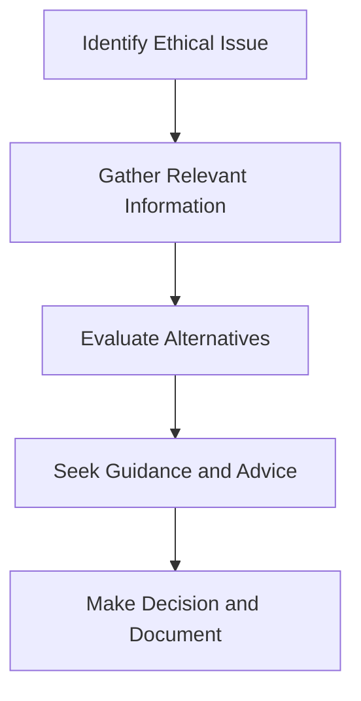

## Ethical Dilemmas in Finance: Navigating Conflicts, Confidentiality, and Compliance

So, you've probably heard the phrase "ethical dilemma" thrown around quite a bit, right? Especially in the financial industry. But what exactly does it mean, and why does it matter so much? Well, let's dive into it.

An **ethical dilemma** happens when you're stuck between two (or more!) conflicting ethical principles, values, or interests. Basically, it's a situation where there's no easy "right" answer—every option you have seems to compromise something important. And trust me, in finance, these situations pop up more often than you'd think.

### Recognizing Ethical Dilemmas

The first step in dealing with ethical dilemmas is recognizing them. Sounds simple, but it's not always obvious. Sometimes, dilemmas sneak up on you disguised as everyday business decisions. Other times, they're glaringly obvious, practically screaming for your attention.

Here are some common signs you're facing an ethical dilemma:

- You feel uneasy or uncomfortable about a decision.
- You're torn between loyalty to your client and loyalty to your firm.
- You're tempted to prioritize personal gain over professional responsibility.
- You realize your actions could harm someone else or damage your reputation.

If any of these feelings pop up, pause and reflect. You're probably dealing with an ethical dilemma.

### Common Ethical Dilemmas in the Financial Industry

Let's explore some of the most common ethical dilemmas financial professionals encounter:

#### Conflicts of Interest

Ah, conflicts of interest—the classic ethical dilemma. This happens when your personal interests (or your firm's interests) clash with your professional responsibilities to your clients. For example, imagine you're recommending an investment product to a client because it earns you a higher commission, even though it's not the best fit for their financial goals. Not cool, right?

#### Confidentiality Breaches

Confidentiality is all about trust. Clients share sensitive financial information with you, expecting it'll stay private. But sometimes, you're tempted (or pressured) to share this info for personal gain, gossip, or even accidentally through carelessness. Breaching confidentiality can destroy trust and lead to serious legal consequences.

#### Insider Trading

Insider trading is trading securities based on material, non-public information. It's illegal, unethical, and can land you in serious trouble. Imagine overhearing confidential information about a company's upcoming merger and deciding to buy stock before the news goes public. Tempting? Maybe. Ethical? Absolutely not.

#### Market Manipulation

Market manipulation involves artificially inflating or deflating the price of securities to deceive investors. For instance, spreading false rumors about a company's financial health to drive down its stock price. It's unethical, illegal, and undermines market integrity.

#### Suitability Concerns

Suitability is about recommending investments that align with your client's financial goals, risk tolerance, and financial situation. Ethical dilemmas arise when you're tempted to recommend unsuitable investments because they benefit you more than your client.

### Navigating Ethical Dilemmas: A Practical Approach

Okay, so we've identified some common dilemmas. But how do you actually handle them? Well, there's no magic formula, but here's a practical approach that can help:

#### Step 1: Identify the Ethical Issue Clearly

Ask yourself: What's the core ethical issue here? Is it a conflict of interest, confidentiality breach, or something else?

#### Step 2: Gather Relevant Information

Don't rush. Gather all the facts, policies, regulations, and professional guidelines relevant to the situation. CIRO guidelines, your firm's policies, and professional codes of conduct are your best friends here.

#### Step 3: Evaluate Alternatives

Consider all possible courses of action. Weigh the pros and cons of each option, considering ethical principles, potential consequences, and impacts on stakeholders.

#### Step 4: Seek Guidance and Advice

Don't hesitate to seek guidance from supervisors, compliance officers, or trusted colleagues. Ethical dilemmas are tough—getting an outside perspective can really help.

#### Step 5: Make a Decision and Document It

Once you've carefully evaluated your options, make a decision. And here's a pro tip: always document your decision-making process and rationale. If anyone ever questions your actions, you'll have clear evidence demonstrating your accountability and transparency.

Here's a visual summary of this practical approach:

### Real-World Example: The Temptation of Insider Trading

Let me share a quick story. A friend of mine, let's call him Mike, was working at a brokerage firm. One day, he overheard senior executives talking about a major merger that hadn't been publicly announced yet. Mike knew that if he bought shares now, he'd make a killing once the news broke.

But Mike paused. He recognized the ethical dilemma immediately. Insider trading was illegal, unethical, and could ruin his career. He gathered information, revisited CIRO's guidelines, and talked to his compliance officer. Ultimately, Mike chose not to act on the information. It wasn't easy—he saw colleagues give in to temptation—but Mike knew he'd made the right choice.

### Creating an Ethical Culture in Your Organization

Organizations play a huge role in helping financial professionals navigate ethical dilemmas. Here's how firms can foster an ethical culture:

- **Clear Policies and Guidelines:** Firms should provide clear, accessible policies outlining expectations for ethical behavior.
- **Training and Education:** Regular ethics training helps employees recognize and address ethical dilemmas effectively.
- **Open Communication Channels:** Employees should feel comfortable reporting ethical concerns without fear of retaliation.
- **Leadership by Example:** Leaders should model ethical behavior, setting the tone for the entire organization.

Here's how an ethical culture looks in practice:

### Documenting Ethical Dilemmas: Why It Matters

Documenting ethical dilemmas and your decision-making process isn't just about covering your back (though that's important too!). It's about accountability, transparency, and continuous learning. By documenting your rationale, you can reflect on your decisions, learn from experiences, and demonstrate your commitment to ethical behavior.

### Glossary of Key Terms

- **Ethical Dilemma:** A situation involving conflicting ethical principles, values, or interests, requiring careful consideration and judgment.
- **Confidentiality:** The obligation to protect sensitive client information from unauthorized disclosure.
- **Insider Trading:** Trading securities based on material, non-public information, prohibited by law and ethical standards.

### References and Resources for Further Exploration

- **CIRO Guidance on Conflicts of Interest:** [CIRO Conflicts of Interest](https://www.ciro.ca)
- **Book:** "Resolving Ethical Dilemmas: A Guide for Clinicians" by Bernard Lo (adaptable principles for financial professionals)
- **Online Course:** "Ethical Decision Making in Finance" by edX [Course Link](https://www.edx.org/course/ethical-decision-making-in-finance)

---

## Test Your Knowledge: Ethical Dilemmas in Finance Quiz



### What is an ethical dilemma?

- [x] A situation involving conflicting ethical principles or interests.
- [ ] A clear-cut decision between right and wrong.
- [ ] A financial transaction that benefits all parties equally.
- [ ] A routine business decision with no ethical implications.

> **Explanation:** An ethical dilemma arises when you're faced with conflicting ethical principles or interests, making it difficult to determine the right course of action.

### Which of the following is an example of a conflict of interest?

- [x] Recommending a product solely because it offers higher commissions.
- [ ] Keeping client information confidential.
- [ ] Reporting unethical behavior to compliance.
- [ ] Following CIRO guidelines strictly.

> **Explanation:** Recommending products based on personal gain rather than client suitability is a classic conflict of interest.

### Insider trading involves:

- [x] Trading securities based on material, non-public information.
- [ ] Trading securities openly on the stock exchange.
- [ ] Sharing public financial news with clients.
- [ ] Conducting thorough market research.

> **Explanation:** Insider trading is illegal and unethical, involving trading based on confidential, non-public information.

### Why is documenting ethical decisions important?

- [x] Demonstrates accountability and transparency.
- [ ] Guarantees you'll never face ethical dilemmas again.
- [ ] Eliminates all ethical dilemmas.
- [ ] Ensures higher profits.

> **Explanation:** Documenting your decisions helps demonstrate accountability and transparency, especially if your actions are questioned later.


