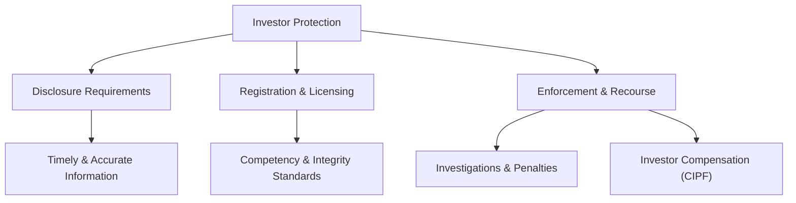
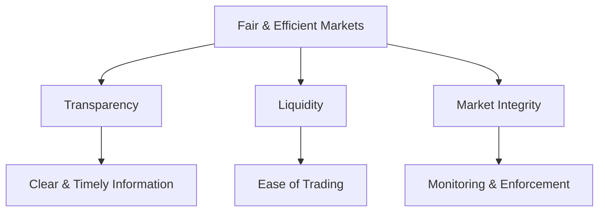
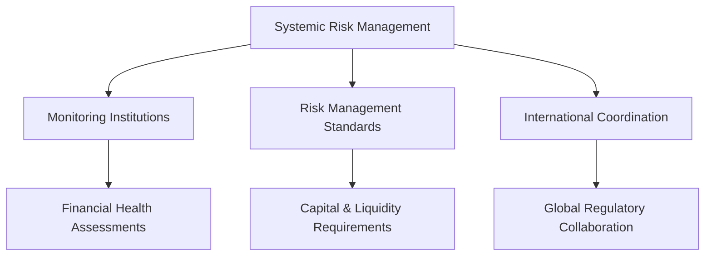
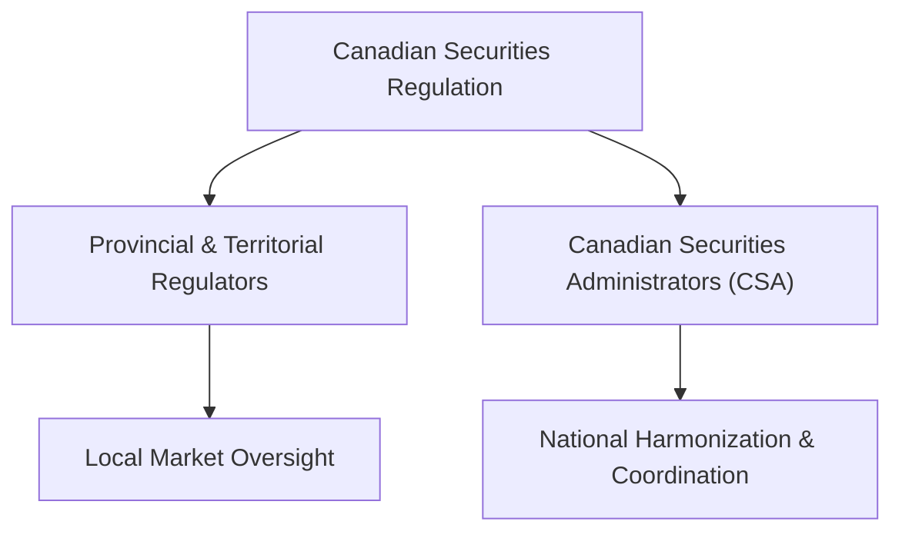

## General Principles of Securities Regulation in Canada

So, you've probably heard the phrase "securities regulation" tossed around a lot, right? Maybe you've wondered, "What exactly does that mean, and why should I care?" Well, let me tell you a quick story first.

A few years ago, a friend of mine—let's call him Mike—decided to invest his savings into a promising tech startup. Mike was excited; the company had a flashy website, charismatic founders, and promised huge returns. But, um, here's the catch: the company wasn't properly registered, didn't disclose essential financial information, and eventually vanished overnight. Mike lost everything. Ouch.

This unfortunate story highlights exactly why securities regulation exists. It's all about protecting investors like Mike, ensuring markets are fair and transparent, and preventing systemic risks that could shake the entire financial system.

Let's dive deeper into the core principles that guide securities regulation in Canada.

### Investor Protection: Keeping Investors Safe

Investor protection is the cornerstone of securities regulation. Regulators aim to ensure that investors like you and me are treated fairly, receive accurate and timely information, and have recourse if things go wrong. This means:

- **Disclosure Requirements:** Companies issuing securities must provide detailed, truthful, and timely information about their financial health, operations, and risks. Think of disclosure as the nutrition label on your cereal box—without it, you'd have no idea what you're consuming.

- **Registration and Licensing:** Investment professionals and firms must be registered and licensed with regulatory authorities like the Canadian Investment Regulatory Organization (CIRO). This ensures they meet specific standards of competency, integrity, and financial stability.

- **Enforcement and Recourse:** If misconduct occurs, regulators can investigate, impose penalties, and even ban individuals from the industry. Investors also have avenues for compensation through mechanisms like the Canadian Investor Protection Fund (CIPF).

Here's a quick visual to illustrate how investor protection works:

### Fair and Efficient Markets: Keeping the Playing Field Level

Ever watched a hockey game where one team has an unfair advantage? Not fun, right? Similarly, securities regulation ensures fairness and efficiency in financial markets. This means:

- **Transparency:** Investors must have access to clear, accurate, and timely market information. Transparency helps investors make informed decisions and promotes trust in the market.

- **Liquidity:** Regulators encourage market structures that allow securities to be easily bought and sold without significant price disruptions. Liquidity ensures investors can enter and exit positions smoothly.

- **Market Integrity:** Regulators closely monitor trading activities to prevent market manipulation, insider trading, and other unfair practices.

Here's a simple diagram showing how fair and efficient markets are maintained:

### Reduction of Systemic Risk: Keeping the Financial System Stable

Remember the financial crisis of 2008? Yeah, that wasn't fun for anyone. Systemic risk—the risk that one financial institution's failure could trigger widespread instability—is something regulators take very seriously. To manage systemic risk, regulators:

- **Monitor Financial Institutions:** Regularly assess the financial health and risk management practices of major market participants.

- **Implement Risk Management Standards:** Require firms to maintain adequate capital and liquidity buffers to absorb potential losses.

- **Coordinate Across Jurisdictions:** Collaborate with international regulators to address global risks and prevent contagion across markets.

Here's how systemic risk management looks visually:

### Public Confidence: Trust is Everything

Public confidence is like the glue holding financial markets together. Without trust, investors would withdraw their funds, markets would dry up, and the economy would suffer. Regulators build and maintain public confidence by:

- **Rigorous Enforcement:** Swiftly addressing misconduct and imposing meaningful penalties.

- **Transparency and Communication:** Clearly communicating regulatory actions, market risks, and investor rights.

- **Investor Education:** Providing resources and tools to help investors understand markets, risks, and their rights.

### Canada's Regulatory Structure: Provincial and Territorial Collaboration

Now, here's something interesting: unlike many countries with a single national securities regulator, Canada has a decentralized system. Each province and territory has its own securities regulator. But don't worry—it's not as chaotic as it sounds! These regulators collaborate closely through the Canadian Securities Administrators (CSA) to harmonize rules and standards across Canada.

Think of the CSA as the conductor of an orchestra, ensuring all provincial regulators play in harmony. This structure allows flexibility to address local market needs while maintaining consistent national standards.

Here's a quick snapshot of Canada's regulatory framework:

### Glossary of Key Terms

Let's quickly recap some key terms we've covered:

- **Securities Regulation:** Laws, rules, and guidelines governing the issuance, trading, and management of securities.
- **Transparency:** Availability of clear, accurate, and timely information to investors.
- **Systemic Risk:** Risk that the failure of one financial institution could trigger widespread instability.
- **Liquidity:** Ease with which securities can be bought or sold without significantly affecting their price.
- **Disclosure:** Process by which issuers provide relevant financial and operational information to investors.

### Additional Resources for Further Exploration

Want to dive deeper? Here are some excellent resources:

- **Canadian Securities Administrators (CSA)** official website: [https://www.securities-administrators.ca](https://www.securities-administrators.ca)
- **Book:** "Canadian Securities Regulation" by David Johnston, Kathleen Doyle Rockwell, and Cristie Ford.
- **Online Course:** CSI's "Canadian Securities Course (CSC®)" [https://www.csi.ca/student/en_ca/courses/csi/csc.xhtml](https://www.csi.ca/student/en_ca/courses/csi/csc.xhtml)

Anyway, securities regulation might seem complex at first glance, but it's fundamentally about protecting investors, ensuring market fairness, managing risk, and maintaining trust. Understanding these principles not only helps you navigate the financial markets confidently but also makes you a more informed and responsible investor.

## Test Your Knowledge: Canadian Securities Regulation Principles Quiz



### What is the primary purpose of securities regulation in Canada?

- [x] Protecting investors and maintaining market integrity.
- [ ] Maximizing profits for financial institutions.
- [ ] Encouraging risky investments.
- [ ] Reducing market transparency.

> **Explanation:** Securities regulation primarily aims to protect investors, ensure fair and efficient markets, and maintain public confidence.

### Which organization coordinates securities regulation across Canada's provinces and territories?

- [x] Canadian Securities Administrators (CSA)
- [ ] Canadian Investment Regulatory Organization (CIRO)
- [ ] Canadian Investor Protection Fund (CIPF)
- [ ] Bank of Canada

> **Explanation:** The CSA coordinates securities regulation across provinces and territories, harmonizing rules and standards.

### What does "disclosure" refer to in securities regulation?

- [x] Providing investors with accurate and timely financial information.
- [ ] Keeping financial information confidential.
- [ ] Limiting investor access to market data.
- [ ] Encouraging insider trading.

> **Explanation:** Disclosure involves providing investors with accurate, timely, and complete information to make informed decisions.

### Which of the following best describes systemic risk?

- [x] The risk that one institution's failure could destabilize the entire financial system.
- [ ] The risk of investing in a single stock.
- [ ] The risk of individual investors losing money.
- [ ] The risk of market transparency.

> **Explanation:** Systemic risk refers to the potential for one institution's failure to cause widespread instability.

### What is liquidity in financial markets?

- [x] The ease of buying or selling securities without significantly affecting their price.
- [ ] The difficulty of trading securities.
- [ ] The process of disclosing financial information.
- [ ] The risk of market manipulation.

> **Explanation:** Liquidity refers to how easily securities can be traded without causing significant price changes.

### What does CIPF stand for?

- [x] Canadian Investor Protection Fund
- [ ] Canadian Investment Regulatory Organization
- [ ] Canadian Investment Regulatory Organization
- [ ] Canadian Investment Protection Framework

> **Explanation:** CIPF protects investors' assets if a member firm becomes insolvent.


