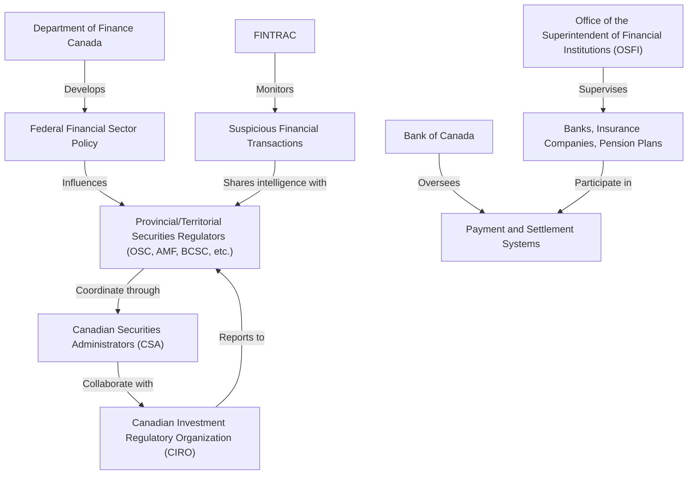

## 3.2 Key Government Players Involved in Securities Regulation

So, you've probably heard the phrase "it takes a village," right? Well, when it comes to securities regulation in Canada, it's more like "it takes a whole city." Seriously. There's a whole network of government bodies, regulators, and organizations working together to keep the Canadian financial markets fair, transparent, and stable. Let's dive in and get to know these key players.

### Provincial and Territorial Securities Regulators

First things first, Canada doesn't have a single national securities regulator. Instead, each province and territory has its own securities commission or authority. For example, Ontario has the Ontario Securities Commission (OSC), Quebec has the Autorité des marchés financiers (AMF), and British Columbia has the British Columbia Securities Commission (BCSC). These provincial and territorial regulators are responsible for administering securities laws, registering market participants, and enforcing compliance within their jurisdictions.

Think of them as local sheriffs, each responsible for maintaining law and order in their own town. They ensure that companies and individuals comply with securities laws, investigate potential misconduct, and protect investors from fraud and unfair practices.

### Canadian Securities Administrators (CSA)

Now, having multiple provincial regulators could get messy, right? Imagine if each province had completely different rules—chaos! That's where the Canadian Securities Administrators (CSA) step in. The CSA is an umbrella organization representing all provincial and territorial securities regulators. Their main job? Harmonizing and coordinating securities regulations across Canada.

The CSA develops national instruments, policies, and guidelines, ensuring consistency and cooperation among the provinces. They also run systems like the System for Electronic Document Analysis and Retrieval (SEDAR), where companies file their financial disclosures. Basically, CSA is like the conductor of an orchestra, making sure everyone plays in tune.

For more info, check out the [CSA official website](https://www.securities-administrators.ca).

### Canadian Investment Regulatory Organization (CIRO)

CIRO is Canada's national self-regulatory organization (SRO) overseeing investment dealers, mutual fund dealers, and marketplace activities. Formed from the amalgamation of the former Investment Industry Regulatory Organization of Canada (IIROC) and Mutual Fund Dealers Association of Canada (MFDA), CIRO ensures compliance with securities laws and industry standards.

CIRO sets rules for dealer conduct, supervises trading activities, and disciplines firms or individuals who break the rules. If provincial regulators are the sheriffs, think of CIRO as the neighborhood watch—keeping an eye on day-to-day activities and ensuring everyone behaves responsibly.

Visit [CIRO's official website](https://www.ciro.ca) for more details.

### Office of the Superintendent of Financial Institutions (OSFI)

Switching gears a bit, let's talk about OSFI. OSFI is a federal agency responsible for regulating and supervising federally regulated financial institutions, including banks, insurance companies, and pension plans. Their main goal is ensuring these institutions remain financially sound and stable.

Why does this matter for securities? Well, banks and insurance companies are major players in financial markets. If they get into trouble, it could have ripple effects throughout the economy. OSFI's oversight helps prevent such scenarios, making them a crucial part of Canada's financial safety net.

Check out OSFI's resources at [OSFI official website](https://www.osfi-bsif.gc.ca).

### Bank of Canada

Ah, the Bank of Canada—our central bank. While you might know them best for setting interest rates, they also play a key role in maintaining financial system stability. They oversee payment and settlement systems, ensuring transactions between financial institutions happen smoothly and securely.

Think of the Bank of Canada as the heartbeat of the financial system. If it stops or skips a beat, the whole system suffers. Their policies and actions help maintain investor confidence and market stability.

### Department of Finance Canada

The Department of Finance Canada is responsible for developing federal financial sector policy and legislation, including securities-related legislation. They set the stage by drafting laws and regulations that shape how financial markets operate.

Imagine them as architects, designing the blueprint for Canada's financial system. Their policies influence everything from investor protection to market transparency.

### Financial Transactions and Reports Analysis Centre of Canada (FINTRAC)

Finally, let's talk about FINTRAC. This federal agency focuses on detecting, preventing, and deterring money laundering and terrorist financing activities. Financial institutions, including securities dealers, must report suspicious transactions to FINTRAC.

FINTRAC analyzes these reports, identifies potential threats, and shares intelligence with law enforcement and regulatory agencies. They're like financial detectives, piecing together clues to uncover criminal activities.

Learn more at [FINTRAC official website](https://www.fintrac-canafe.gc.ca).

### Visualizing the Regulatory Framework

Let's visualize how these organizations interact:

### Practical Example: Regulatory Collaboration in Action

Let's say a securities dealer in Ontario is suspected of insider trading. Here's how the regulatory collaboration might unfold:

- The Ontario Securities Commission (OSC) initiates an investigation.
- CIRO provides trading data and compliance records.
- FINTRAC checks for suspicious financial transactions linked to the dealer.
- If a bank is involved, OSFI ensures the bank's internal controls are adequate.
- CSA coordinates with other provincial regulators if the issue crosses provincial borders.
- The Department of Finance reviews policies to prevent future occurrences.

This teamwork ensures comprehensive oversight and swift action.

### Best Practices and Common Pitfalls

- **Best Practice:** Stay informed about regulatory updates from CIRO and CSA. Regularly review their websites and subscribe to newsletters.
- **Common Pitfall:** Ignoring provincial differences. Even with harmonization, some provincial rules differ. Always verify local regulations.
- **Best Practice:** Maintain robust compliance systems to meet FINTRAC reporting requirements.
- **Common Pitfall:** Neglecting OSFI guidelines if your firm interacts with federally regulated institutions.

### Wrapping Up

Whew! That's quite the regulatory ecosystem, isn't it? Understanding these key players helps you navigate Canada's securities landscape confidently. Remember, compliance isn't just about avoiding penalties—it's about building trust, protecting investors, and ensuring market integrity.

---

## Test Your Knowledge: Canadian Securities Regulation Key Players Quiz



### What is the primary role of the Canadian Securities Administrators (CSA)?

- [x] Harmonizing and coordinating securities regulations across provinces and territories.
- [ ] Directly supervising banks and insurance companies.
- [ ] Setting monetary policy and interest rates.
- [ ] Investigating terrorist financing activities.

> **Explanation:** The CSA's main role is to harmonize and coordinate securities regulations across Canada, ensuring consistency among provincial regulators.

### Which organization is responsible for overseeing investment dealers and mutual fund dealers in Canada?

- [x] Canadian Investment Regulatory Organization (CIRO)
- [ ] Bank of Canada
- [ ] FINTRAC
- [ ] OSFI

> **Explanation:** CIRO is the national self-regulatory organization overseeing investment dealers, mutual fund dealers, and marketplace activities.

### OSFI primarily supervises which types of institutions?

- [x] Banks, insurance companies, and pension plans
- [ ] Mutual fund dealers only
- [ ] Provincial securities commissions
- [ ] Stock exchanges

> **Explanation:** OSFI regulates federally regulated financial institutions, including banks, insurance companies, and pension plans.

### Which organization is responsible for detecting money laundering and terrorist financing?

- [x] FINTRAC
- [ ] CSA
- [ ] Department of Finance Canada
- [ ] CIRO

> **Explanation:** FINTRAC is Canada's financial intelligence unit responsible for detecting, preventing, and deterring money laundering and terrorist financing.

### Which organization sets monetary policy and oversees payment systems in Canada?

- [x] Bank of Canada
- [ ] OSFI
- [ ] CIRO
- [ ] CSA

> **Explanation:** The Bank of Canada oversees monetary policy and payment and settlement systems.

### Which body develops federal financial sector policy and legislation?

- [x] Department of Finance Canada
- [ ] CIRO
- [ ] OSFI
- [ ] FINTRAC

> **Explanation:** The Department of Finance Canada develops federal financial sector policies and securities-related legislation.

### Provincial securities regulators are primarily responsible for:

- [x] Administering securities laws within their jurisdiction.
- [ ] Supervising banks and pension plans.
- [ ] Setting national interest rates.
- [ ] Investigating international financial crimes.

> **Explanation:** Provincial regulators administer securities laws, register market participants, and enforce compliance within their jurisdictions.

### Which organization oversees Canada's payment and settlement systems?

- [x] Bank of Canada
- [ ] OSFI
- [ ] CSA
- [ ] CIRO

> **Explanation:** The Bank of Canada oversees Canada's payment and settlement systems.

### CIRO was formed by the amalgamation of which two former organizations?

- [x] IIROC and MFDA
- [ ] OSFI and FINTRAC
- [ ] CSA and OSC
- [ ] Bank of Canada and OSFI

> **Explanation:** CIRO was formed by merging the former IIROC and MFDA.

### Which regulator would investigate insider trading within a specific province?

- [x] Provincial securities regulator (e.g., OSC)
- [ ] OSFI
- [ ] FINTRAC
- [ ] Department of Finance Canada

> **Explanation:** Provincial securities regulators initiate investigations into securities violations within their jurisdiction.

### Which organization supervises federally regulated financial institutions like banks and insurance companies?

- [x] OSFI
- [ ] CSA
- [ ] CIRO
- [ ] FINTRAC

> **Explanation:** OSFI supervises federally regulated financial institutions, including banks, insurance companies, and pension plans.


