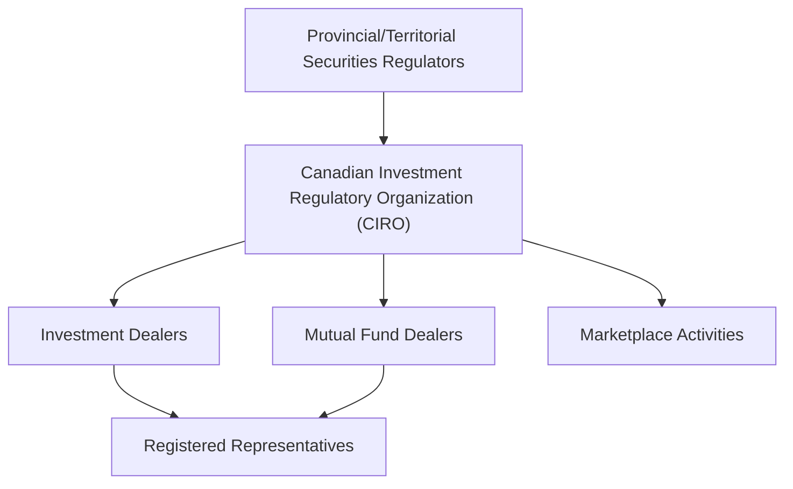

## 3.3 Self-Regulatory Organization (CIRO)

So, let's talk about CIRO—Canada's primary self-regulatory organization (SRO) for investment dealers, mutual fund dealers, and marketplace activities. If you've been around the Canadian financial industry for a while, you might remember the days when we had two separate SROs: the Investment Industry Regulatory Organization of Canada (IIROC) and the Mutual Fund Dealers Association of Canada (MFDA). Well, as of January 1, 2023, these two merged into one unified body, initially called the "New SRO," but officially renamed the Canadian Investment Regulatory Organization (CIRO) on June 1, 2023. And honestly, this merger has simplified things quite a bit.

### What Exactly is CIRO?

CIRO is an SRO authorized by provincial and territorial securities regulators to oversee the conduct, proficiency, and business practices of its members. Think of CIRO as the industry's watchdog—keeping an eye on things to ensure everyone plays by the rules, protecting investors, and maintaining market integrity. CIRO's members include investment dealers, mutual fund dealers, and firms involved in trading activities across equity and debt marketplaces.

### CIRO's Core Responsibilities

CIRO has several key responsibilities, each critical to maintaining investor confidence and market integrity. Let's break these down:

#### Registration and Oversight of Member Firms and Employees

CIRO ensures that all member firms and their registered representatives meet strict registration requirements. This includes verifying qualifications, ensuring firms have adequate capital, and confirming that they follow robust compliance procedures. CIRO regularly audits member firms to ensure ongoing compliance with securities regulations.

For example, imagine a new investment dealer wants to enter the Canadian market. Before it can start operations, CIRO will thoroughly review its business plans, financial stability, internal controls, and the qualifications of its employees. Only after passing this rigorous review can the firm become a CIRO member and start serving clients.

#### Enforcement of Rules and Regulations

CIRO doesn't just set rules—it actively enforces them. Through regular audits, investigations, and disciplinary actions, CIRO ensures that member firms and their employees adhere to established standards. If a firm or individual violates CIRO rules or securities laws, CIRO can impose sanctions ranging from fines and suspensions to permanent bans from the industry.

Here's a quick example: Suppose a registered representative engages in unauthorized trading or misleads clients about investment risks. CIRO would investigate the matter thoroughly, and if misconduct is confirmed, it could impose disciplinary actions, including fines, mandatory retraining, or even suspending the representative's license.

#### Setting Proficiency Standards and Continuing Education Requirements

CIRO sets clear proficiency standards for registered representatives, ensuring they have the necessary knowledge and skills to provide sound investment advice. This includes mandatory courses like the Conduct and Practices Handbook Course (CPH®) you're studying right now. CIRO also mandates ongoing continuing education to ensure representatives stay current with industry developments, regulatory changes, and ethical standards.

Think about it: the financial industry evolves rapidly. New products, changing regulations, emerging risks—it's a lot to keep up with. CIRO's proficiency standards and continuing education requirements ensure that registered representatives remain knowledgeable and competent throughout their careers.

#### Promoting Investor Protection and Ethical Practices

At its core, CIRO exists to protect investors. By enforcing transparent, ethical business practices, CIRO helps investors make informed decisions and trust the financial system. This includes clear guidelines on client communication, disclosure requirements, suitability assessments, and handling client complaints.

Let's say a client feels their advisor recommended unsuitable investments. CIRO provides clear channels for clients to file complaints and ensures these complaints are investigated fairly and transparently. This commitment to investor protection is fundamental to maintaining trust in Canada's financial markets.

### CIRO's Relationship with Provincial and Territorial Regulators

Now, CIRO doesn't operate in isolation. It works closely with provincial and territorial securities regulators, like the Ontario Securities Commission (OSC) or the British Columbia Securities Commission (BCSC). These regulators oversee CIRO's activities, ensuring it fulfills its mandate effectively.

Here's how the regulatory framework looks visually:

This collaboration ensures consistency in regulation across Canada, avoiding duplication and confusion. CIRO regularly communicates with regulators, sharing information, coordinating enforcement actions, and jointly developing regulatory policies.

### Practical Example: CIRO in Action

Let's walk through a practical scenario to see how CIRO operates:

Imagine a routine CIRO audit uncovers discrepancies in a firm's client records. The firm appears to have recommended high-risk investments to conservative investors without proper documentation or suitability assessments. CIRO initiates an investigation, reviewing client files, interviewing staff, and analyzing trading records.

If CIRO confirms misconduct, it might impose sanctions, such as fines, mandatory training for the firm's representatives, or even suspending the firm's operations temporarily. CIRO would also work with the firm to implement corrective actions, ensuring future compliance.

This proactive approach helps prevent larger issues down the road, protecting investors and maintaining market integrity.

### Common Pitfalls and Best Practices

Working within CIRO's regulatory framework isn't always straightforward. Here are some common pitfalls and best practices to keep in mind:

- **Pitfall:** Neglecting continuing education requirements.
  - **Best Practice:** Stay proactive—regularly check CIRO's website for updates on educational requirements and deadlines.

- **Pitfall:** Poor documentation of client interactions and suitability assessments.
  - **Best Practice:** Maintain detailed, accurate records of all client communications, recommendations, and suitability assessments. Remember, if it's not documented, it didn't happen!

- **Pitfall:** Misunderstanding compliance obligations.
  - **Best Practice:** Regularly review CIRO's rules and guidelines. When in doubt, consult your firm's compliance department or CIRO directly.

### Glossary of Key Terms

- **Self-Regulatory Organization (SRO):** An organization authorized by securities regulators to regulate the conduct and business practices of its members.
- **Registered Representative:** An individual licensed to trade securities and provide investment advice to clients.
- **Proficiency Standards:** Educational and professional requirements established by CIRO for individuals working in the securities industry.

### Additional Resources

For more detailed information, check out these resources:

- CIRO official website: [https://www.ciro.ca](https://www.ciro.ca)
- CSI's "Conduct and Practices Handbook Course (CPH®)": [https://www.csi.ca/student/en_ca/courses/csi/cph.xhtml](https://www.csi.ca/student/en_ca/courses/csi/cph.xhtml)

---

## Test Your Knowledge: CIRO and Canadian Securities Regulation Quiz



### What is CIRO's primary role in Canada's financial industry?

- [x] Overseeing investment dealers, mutual fund dealers, and marketplace activities.
- [ ] Managing Canada's monetary policy.
- [ ] Directly regulating banks and insurance companies.
- [ ] Providing investment advice to individual investors.

> **Explanation:** CIRO is Canada's primary self-regulatory organization responsible for overseeing investment dealers, mutual fund dealers, and marketplace activities.

### Which two organizations merged to form CIRO?

- [x] IIROC and MFDA
- [ ] OSC and BCSC
- [ ] CIPF and CDIC
- [ ] TSX and TSXV

> **Explanation:** CIRO was formed by merging the Investment Industry Regulatory Organization of Canada (IIROC) and the Mutual Fund Dealers Association of Canada (MFDA).

### CIRO enforces rules through which methods?

- [x] Audits, investigations, and disciplinary actions.
- [ ] Public voting and referendums.
- [ ] Market surveys and opinion polls.
- [ ] Voluntary compliance only.

> **Explanation:** CIRO actively enforces rules through audits, investigations, and disciplinary actions.

### Who oversees CIRO's activities?

- [x] Provincial and territorial securities regulators.
- [ ] The Bank of Canada.
- [ ] Federal government ministries.
- [ ] Canadian Investor Protection Fund (CIPF).

> **Explanation:** CIRO operates under the oversight of provincial and territorial securities regulators.


