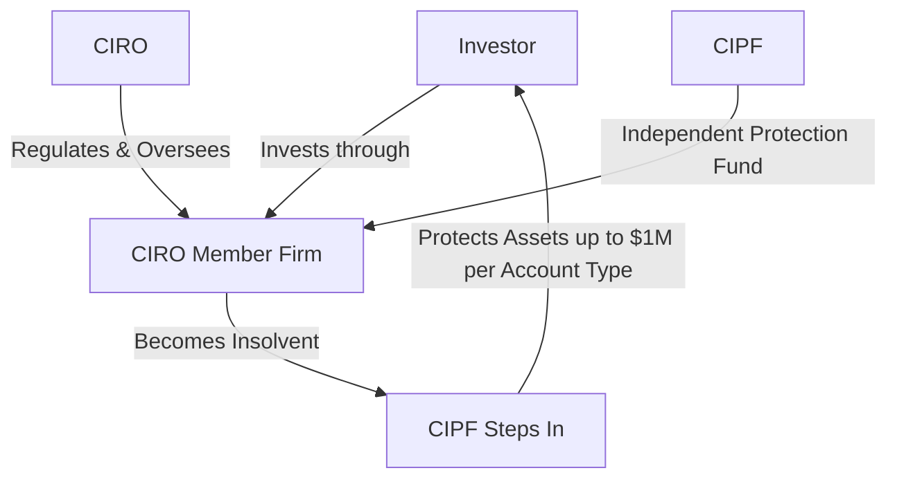

## 3.4 Investor Protection Funds

So, imagine this scenario: you've diligently saved money, done your research, and finally decided to invest through a reputable investment dealer. Everything seems great—until one day, you wake up to the news that your investment dealer has become insolvent. Panic sets in. "What happens to my investments now?" you wonder. Well, thankfully, in Canada, we have something called investor protection funds to help you sleep better at night. Let's dive into what these funds are, how they work, and why they're so crucial in the Canadian financial landscape.

### What Exactly Are Investor Protection Funds?

Investor protection funds are designed to protect investors like you and me if our investment firms become insolvent. Insolvency, simply put, means the firm can't meet its financial obligations—basically, they're broke. These funds step in to ensure investors don't lose their hard-earned money due to the financial troubles of their investment dealers.

In Canada, the primary investor protection fund is the **Canadian Investor Protection Fund (CIPF)**. Historically, there was also the MFDA Investor Protection Corporation (MFDA IPC), but after the amalgamation of IIROC and MFDA into the Canadian Investment Regulatory Organization (CIRO) on January 1, 2023, CIPF became Canada's sole investor protection fund. So, if you see references to MFDA IPC, just remember it's now part of CIPF.

### Understanding the Canadian Investor Protection Fund (CIPF)

CIPF is an independent, non-profit organization established to protect client assets held by investment dealers who are members of CIRO. It's important to note that CIPF doesn't protect against market losses or poor investment decisions. If your stocks tank because the market crashes or you picked a dud investment, unfortunately, CIPF won't cover that. But if your investment dealer goes bankrupt or becomes insolvent, CIPF steps in to ensure your assets are returned to you, up to specified limits.

Here's a quick breakdown of what CIPF covers:

- Cash balances
- Securities (stocks, bonds, mutual funds, ETFs, etc.)
- Futures contracts
- Segregated insurance funds held by the dealer

What CIPF doesn't cover:

- Losses due to market fluctuations
- Poor investment advice or unsuitable recommendations
- Fraudulent activities by third parties unrelated to dealer insolvency

### How Much Protection Does CIPF Provide?

CIPF provides coverage up to CAD $1 million per client for each separate account type. Now, what exactly does "separate account type" mean? Well, CIPF categorizes accounts into different types, and each type gets its own coverage limit. These categories include:

- General accounts (cash accounts, margin accounts, etc.)
- Registered Retirement Savings Plans (RRSPs)
- Registered Retirement Income Funds (RRIFs)
- Registered Education Savings Plans (RESPs)
- Registered Disability Savings Plans (RDSPs)
- Tax-Free Savings Accounts (TFSAs)

Let's say you have $500,000 in a cash account and another $750,000 in your RRSP with the same dealer. If the dealer becomes insolvent, CIPF coverage would protect both accounts separately, meaning you'd be fully covered up to $1 million per account type. Pretty reassuring, right?

### Real-Life Example: The Case of ABC Investments

Let's walk through a hypothetical scenario to illustrate how CIPF protection works in practice.

Imagine you have the following assets with ABC Investments, a CIRO member firm:

| Account Type | Asset Value |
|--------------|-------------|
| Cash Account | $300,000    |
| RRSP Account | $800,000    |
| TFSA Account | $150,000    |

Unfortunately, ABC Investments runs into severe financial difficulties and becomes insolvent. Without CIPF, you'd be in a tough spot. But here's how CIPF would step in:

- **Cash Account:** Fully covered ($300,000 is below the $1 million limit).
- **RRSP Account:** Fully covered ($800,000 is below the $1 million limit).
- **TFSA Account:** Fully covered ($150,000 is below the $1 million limit).

In this scenario, you'd recover all your assets. Phew! Crisis averted.

### The Role of CIRO in Investor Protection

Since the amalgamation of IIROC and MFDA into CIRO, the regulatory landscape has become much simpler and more streamlined. CIRO now oversees investment dealers, mutual fund dealers, and market integrity across equity and debt marketplaces. While CIPF remains independent of CIRO, both organizations work closely together to ensure investor protection and market confidence.

Here's a simple diagram illustrating how CIRO and CIPF interact:

### Informing Clients About CIPF Coverage

As a registered representative, it's your responsibility to clearly inform your clients about CIPF coverage. Clients should understand exactly what's covered, what's not, and the limits of protection. Transparency is key here. Make sure your clients know that CIPF coverage doesn't shield them from market risks or poor investment decisions. It's strictly a safety net in case the dealer itself goes under.

### Common Misconceptions and Pitfalls

One common misconception is that CIPF covers all types of investment losses. Um, nope, that's not how it works. Remember, CIPF doesn't protect against market losses or bad investment choices. Another pitfall is assuming unlimited coverage. The $1 million limit per account type is firm, so clients with assets exceeding these limits should consider diversifying across multiple firms to maximize protection.

### Best Practices for Investors and Advisors

- **Stay Informed:** Regularly review CIPF coverage details and stay updated on any changes.
- **Diversify Assets:** If you have substantial assets, consider spreading them across multiple CIRO member firms to maximize CIPF protection.
- **Maintain Accurate Records:** Keep detailed records of your account holdings and transactions. This documentation can be invaluable if your dealer becomes insolvent.

### Additional Resources for Further Exploration

For more detailed information, check out these official resources:

- **CIPF Official Website:** [https://www.cipf.ca](https://www.cipf.ca)
- **CIRO Investor Protection Information:** [https://www.ciro.ca](https://www.ciro.ca)

These sites offer comprehensive details, FAQs, and updates on investor protection in Canada.

### Wrapping Up

Investor protection funds like CIPF play a crucial role in maintaining investor confidence and financial stability in Canada. While we all hope never to need them, it's comforting to know they're there, just in case. Understanding how CIPF works, its coverage limits, and your responsibilities as an advisor or investor can make all the difference in navigating unexpected financial storms.

Now, let's test your understanding with a quick quiz!

## Investor Protection Funds in Canada: CIPF and CIRO Coverage Quiz



### What is the primary purpose of the Canadian Investor Protection Fund (CIPF)?

- [x] To protect investors against losses due to dealer insolvency.
- [ ] To protect investors against market losses.
- [ ] To guarantee returns on investments.
- [ ] To provide compensation for poor investment advice.

> **Explanation:** CIPF specifically protects investors if their investment dealer becomes insolvent, not against market losses or poor investment decisions.

### What is the maximum CIPF coverage per account type?

- [x] CAD $1 million
- [ ] CAD $500,000
- [ ] Unlimited coverage
- [ ] CAD $2 million

> **Explanation:** CIPF provides coverage up to CAD $1 million per client for each separate account type.

### Which of the following is NOT covered by CIPF?

- [ ] Cash balances
- [ ] Securities like stocks and bonds
- [x] Losses due to market fluctuations
- [ ] Futures contracts

> **Explanation:** CIPF does not cover losses resulting from market fluctuations or poor investment choices.

### After the amalgamation of IIROC and MFDA, which organization became Canada's sole investor protection fund?

- [x] Canadian Investor Protection Fund (CIPF)
- [ ] MFDA Investor Protection Corporation (MFDA IPC)
- [ ] Canadian Investment Regulatory Organization (CIRO)
- [ ] Canadian Securities Administrators (CSA)

> **Explanation:** After the amalgamation, CIPF became Canada's sole investor protection fund.

### Which organization regulates investment dealers and mutual fund dealers in Canada as of 2023?

- [ ] MFDA
- [ ] IIROC
- [x] CIRO
- [ ] CIPF

> **Explanation:** CIRO regulates investment dealers and mutual fund dealers after the amalgamation of MFDA and IIROC.


