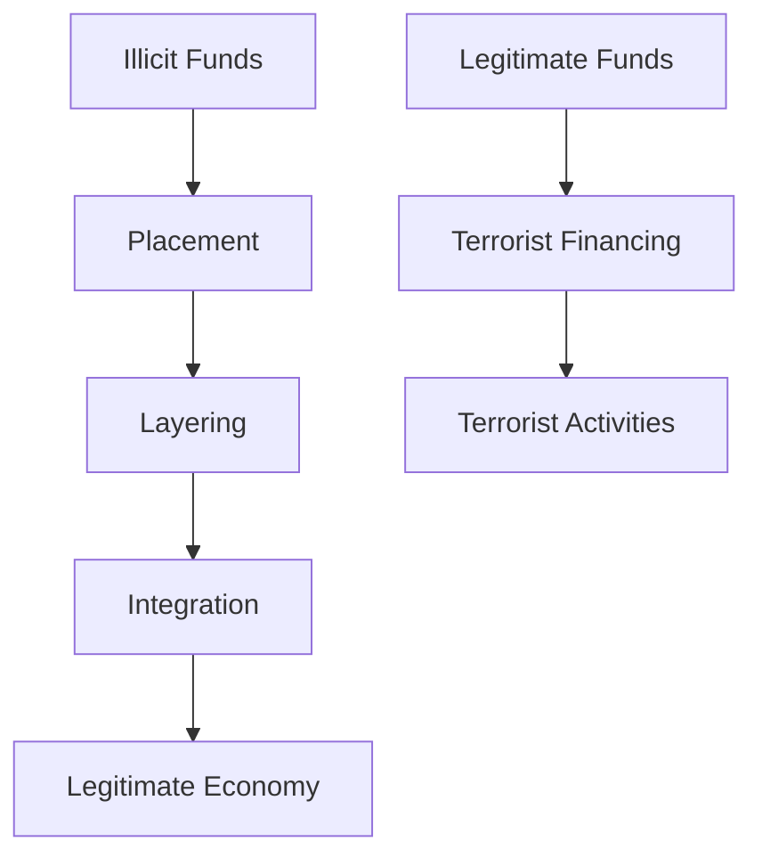
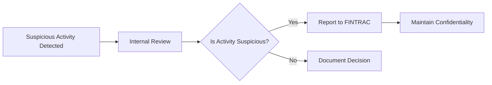

## 3.5 Money Laundering and Terrorist Financing in the Securities Industry

Money laundering and terrorist financing—two terms that, let's be honest, sound like something straight out of a spy movie—are unfortunately very real threats in today's financial landscape. And the securities industry, with its complex transactions and global reach, can sometimes become an attractive playground for criminals looking to hide or move illicit funds. That's why, in Canada, securities firms have to follow strict regulations to keep these shady activities at bay. Let's dive into what this means, how it works, and why it's crucial for anyone working in the industry.

### Understanding Money Laundering and Terrorist Financing

Before we jump into compliance programs, let's quickly clarify what we're dealing with here:

- **Money Laundering (AML)**: This is all about disguising illegally obtained money—think drug trafficking, fraud, corruption—to make it look like it came from a legitimate source. Criminals typically do this through a three-stage process:
  1. **Placement**: Introducing dirty money into the financial system.
  2. **Layering**: Moving funds around to obscure their origin.
  3. **Integration**: Reintroducing the "cleaned" money back into the economy.

- **Terrorist Financing (ATF)**: Unlike money laundering, terrorist financing often involves funds that might actually come from legitimate sources. The key difference? These funds are directed towards supporting terrorist activities. It's about the destination, not the origin.

Here's a quick visual to help you grasp these concepts:

### Why is AML and ATF Compliance Critical?

Well, aside from the obvious moral and ethical reasons, compliance is essential for maintaining the integrity of Canada's financial markets. If the securities industry were to become a haven for criminals, it could severely damage investor confidence, market stability, and Canada's international reputation. Plus, firms that fail to comply face hefty fines, legal actions, and serious reputational damage. Trust me, no firm wants to be the poster child for financial crime.

### Regulatory Framework: FINTRAC and CIRO

In Canada, the Financial Transactions and Reports Analysis Centre of Canada (FINTRAC) is the primary regulator responsible for overseeing AML and ATF compliance. FINTRAC collects, analyzes, and discloses financial intelligence to law enforcement and other agencies. Securities firms must report suspicious transactions and certain prescribed transactions (like large cash transactions over $10,000) directly to FINTRAC.

Since June 2023, the Canadian Investment Regulatory Organization (CIRO)—formerly IIROC and MFDA—has been the national self-regulatory body overseeing investment dealers, mutual fund dealers, and market integrity. CIRO ensures its members follow AML and ATF regulations through regular audits, inspections, and enforcement actions.

### Key Components of AML and ATF Compliance Programs

Every securities firm in Canada must have a comprehensive compliance program. Let's break down the essential elements:

#### 1. Client Identification and Verification (Know Your Client - KYC)

KYC is the cornerstone of AML and ATF compliance. Firms must identify and verify every client's identity before opening an account or conducting transactions. This involves:

- Collecting personal information (name, address, date of birth, occupation).
- Verifying identity through government-issued IDs or reliable sources.
- Understanding the client's financial situation, investment objectives, and risk tolerance.

Here's a simple example:

> Imagine a new client, John Doe, wants to open a brokerage account. Your firm must collect John's personal details, verify his identity (say, through a driver's license or passport), and document his financial background and investment goals. If John seems reluctant to provide information or gives inconsistent details, that's a red flag.

#### 2. Ongoing Monitoring of Client Transactions

It's not enough to just identify clients at the start. Firms must continuously monitor client activities to detect unusual or suspicious transactions. This includes:

- Reviewing transactions regularly to spot patterns or anomalies.
- Ensuring transactions align with the client's stated objectives and financial profile.
- Investigating and documenting any unusual activities promptly.

For example:

> Let's say a client who typically invests conservatively suddenly starts making large, frequent international wire transfers. Hmm, that's definitely something you'd want to look into further.

#### 3. Reporting Suspicious Transactions to FINTRAC

If a firm identifies suspicious activity, it's legally obligated to report it to FINTRAC. Reports must be timely, detailed, and confidential. Firms must not inform the client that a report has been filed (this is called "tipping off," and it's a big no-no).

Here's a quick flowchart of the reporting process:

#### 4. Employee Training and Awareness Programs

Compliance isn't just the responsibility of a firm's compliance department. Every employee needs to understand their role in preventing money laundering and terrorist financing. Firms must provide regular training programs covering:

- AML and ATF regulations and obligations.
- Recognizing suspicious activities and red flags.
- Reporting procedures and internal policies.

A quick personal anecdote: I remember my first AML training session vividly. Initially, it felt like just another box-ticking exercise. But when our trainer shared real-life cases of how seemingly innocent transactions funded serious crimes, it really hit home. It made me realize how crucial vigilance is in our industry.

### Common Red Flags to Watch Out For

Here are some typical warning signs that might indicate money laundering or terrorist financing:

- Clients reluctant to provide identification or providing inconsistent information.
- Transactions that don't match the client's profile or stated objectives.
- Frequent, large, or unexplained wire transfers, especially internationally.
- Clients who seem overly interested in secrecy or anonymity.
- Sudden changes in transaction patterns or investment behavior.

### Best Practices and Common Pitfalls

To stay ahead of the game, firms should:

- Regularly update compliance policies to reflect regulatory changes.
- Invest in robust transaction monitoring software.
- Foster a culture of compliance and openness among employees.
- Conduct periodic internal audits to identify and address gaps proactively.

Common pitfalls include:

- Treating compliance as a mere formality rather than a critical function.
- Failing to document processes and decisions adequately.
- Ignoring employee concerns or reports of suspicious activities.

### Additional Resources for Further Exploration

To deepen your understanding, check out these resources:

- **FINTRAC Official Website:** [https://www.fintrac-canafe.gc.ca](https://www.fintrac-canafe.gc.ca)
- **CSI's AML/ATF Compliance Course:** [https://www.csi.ca/student/en_ca/courses/csi/aml.xhtml](https://www.csi.ca/student/en_ca/courses/csi/aml.xhtml)

---

## Test Your Knowledge: AML and ATF Compliance in Canada's Securities Industry



### What is the primary regulatory body responsible for AML and ATF oversight in Canada?

- [x] FINTRAC
- [ ] CIRO
- [ ] CIPF
- [ ] Bank of Canada

> **Explanation:** FINTRAC (Financial Transactions and Reports Analysis Centre of Canada) is Canada's primary regulator for AML and ATF compliance.

### Which of the following is NOT a stage of money laundering?

- [ ] Placement
- [ ] Layering
- [ ] Integration
- [x] Diversification

> **Explanation:** Diversification is not a recognized stage of money laundering. The three stages are placement, layering, and integration.

### What does KYC stand for in AML compliance?

- [x] Know Your Client
- [ ] Keep Your Compliance
- [ ] Know Your Compliance
- [ ] Keep Your Client

> **Explanation:** KYC stands for "Know Your Client," involving client identification and verification.

### Which of these is considered a suspicious activity red flag?

- [x] Frequent large international wire transfers without clear purpose
- [ ] Regular small investments in mutual funds
- [ ] Consistent investment aligned with client's stated objectives
- [ ] Providing detailed identification documents promptly

> **Explanation:** Frequent large international transfers without clear purpose are suspicious.

### True or False: Firms must inform clients when they report suspicious transactions to FINTRAC.

- [ ] True
- [x] False

> **Explanation:** Informing clients ("tipping off") is strictly prohibited.


