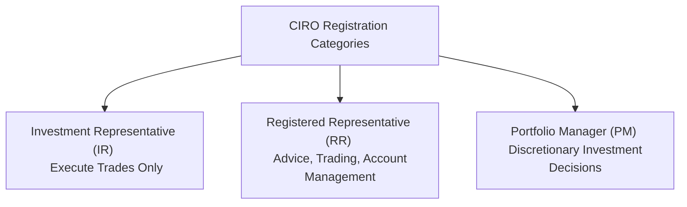

## 4.1 Registration Requirements of a Registered Representative

So, you're thinking about becoming a Registered Representative (RR), huh? Or maybe you're already one and just want to make sure you're ticking all the boxes. Either way, it's crucial to understand the registration requirements set out by the Canadian Investment Regulatory Organization (CIRO). Trust me, you don't want to mess around with compliance—it's not fun getting those awkward emails from the compliance department. Been there, done that.

Let's break it down clearly and simply, so you know exactly what's expected of you.

### Proficiency Requirements: Getting Your Foot in the Door

First things first: before you can even think about advising clients or trading securities, you've got to prove you know your stuff. CIRO sets specific proficiency standards to ensure every RR has a solid foundation in securities knowledge, ethical standards, and regulatory compliance.

Here's what you need to complete:

- **Canadian Securities Course (CSC®)**: This is your bread and butter. It covers everything from investment products and portfolio management to economic principles and market structures. Seriously, it's like the Bible of Canadian securities.

- **Conduct and Practices Handbook Course (CPH®)**: This course (the one you're reading right now!) dives deeper into the ethical and regulatory aspects of the securities industry. It teaches you how to navigate tricky ethical dilemmas and stay compliant with CIRO's rules.

Once you've successfully completed these courses, you're on your way to becoming a registered representative.

### Continuous Education (CE): Staying Sharp and Up-to-Date

Okay, you've passed your exams—congrats! But wait, there's more. CIRO requires you to keep learning throughout your career. Continuous Education (CE) ensures you're always aware of the latest industry developments, regulatory changes, and best practices.

Here's how CE typically works:

- **Compliance Credits**: These focus on regulatory updates, ethical standards, and compliance practices. CIRO mandates a certain number of compliance credits every CE cycle.

- **Professional Development Credits**: These cover broader industry knowledge, such as new investment products, financial planning strategies, and economic trends.

Your sponsoring firm usually helps you track these credits, but ultimately, it's your responsibility to ensure you're meeting the requirements. Don't slack off here—missing CE requirements can lead to fines or even suspension of your registration. Ouch.

### Disclosure Obligations: Honesty Is the Best Policy

Life happens, right? Maybe you hit a rough patch financially or had a run-in with the law (hopefully not!). Whatever the case, CIRO expects you to be upfront about any material changes in your personal or professional circumstances.

Material changes include things like:

- Criminal charges or convictions
- Bankruptcy or insolvency proceedings
- Regulatory investigations or disciplinary actions
- Changes in employment status or firm affiliation

If anything significant happens, you've got to disclose it promptly to CIRO. And by promptly, I mean ASAP—not next month, not next year. Failure to disclose can lead to serious disciplinary actions. Transparency really is key here.

### Understanding Registration Categories and Permitted Activities

Not all Registered Representatives are created equal. CIRO defines specific registration categories, each with its own permitted activities. It's essential to know exactly what you're allowed (and not allowed) to do within your registration category.

Common registration categories include:

- **Investment Representative (IR)**: Authorized to execute trades but cannot provide investment advice.
- **Registered Representative (RR)**: Authorized to provide investment advice, trade securities, and manage client accounts.
- **Portfolio Manager (PM)**: Authorized to make discretionary investment decisions on behalf of clients.

Make sure you're crystal clear on your category and stick to your permitted activities. Venturing outside your scope can land you in hot water with CIRO—and trust me, that's not a place you want to be.

Here's a quick visual summary to help you out:

### Annual Registration Renewal: Keep Your Status Active

Every year, your registration needs to be renewed. Typically, your sponsoring firm handles the paperwork and fees, but it's your job to make sure everything's submitted on time. Missing the renewal deadline can lead to suspension or termination of your registration, and nobody wants that hassle.

Here's a simplified look at the annual renewal process:

### Consequences of Non-Compliance: Don't Learn the Hard Way

Let's talk consequences. CIRO takes compliance seriously—very seriously. Non-compliance can result in disciplinary actions, including:

- Fines (which can be hefty)
- Suspension of registration (temporary loss of your ability to work)
- Revocation of registration (permanent loss of your RR status)
- Public disclosure of disciplinary actions (not exactly great for your reputation)

Believe me, you don't want to be the RR whose disciplinary action is publicly listed on CIRO's website. Clients notice these things, and it can seriously damage your career.

### Best Practices for Staying Compliant

So, how do you avoid compliance pitfalls? Here are some practical tips:

- **Stay Organized**: Keep detailed records of your CE credits, disclosures, and registration documents.
- **Communicate Regularly with Compliance**: Build a good relationship with your firm's compliance department. They're there to help you, not just to nag you.
- **Stay Informed**: Regularly check CIRO's website and communications for regulatory updates and changes.
- **Ask Questions**: If you're unsure about something, don't guess—ask your compliance officer or CIRO directly.

### Real-Life Example: The Case of Alex

Let me tell you about Alex, a friend of mine who became an RR a few years back. Alex was great with clients, knew his stuff, but he got a little sloppy with his CE credits. He figured, "Eh, I'll catch up next year." Well, CIRO didn't see it that way. Alex ended up with a temporary suspension and had to scramble to complete his credits and get reinstated. It was stressful, embarrassing, and totally avoidable.

Don't be like Alex. Stay on top of your requirements.

### Additional Resources and Further Reading

Want to dive deeper? Here are some great resources:

- [CIRO Registration Information](https://www.ciro.ca)
- [Canadian Securities Institute (CSI) Courses](https://www.csi.ca/student/en_ca/courses/csi/csc.xhtml)
- Recommended Reading: "Canadian Securities Course (CSC®) Textbook," CSI Global Education Inc.

---

## Test Your Knowledge: CIRO Registration Requirements for Registered Representatives Quiz



### What mandatory courses must a Registered Representative complete to meet CIRO proficiency requirements?

- [x] Canadian Securities Course (CSC®) and Conduct and Practices Handbook Course (CPH®)
- [ ] Mutual Funds Licensing Course and Wealth Management Essentials
- [ ] Financial Planning Supplement and Investment Management Techniques
- [ ] Derivatives Fundamentals Course and Options Licensing Course

> **Explanation:** The mandatory proficiency courses required by CIRO for Registered Representatives are the Canadian Securities Course (CSC®) and the Conduct and Practices Handbook Course (CPH®).

### How often must Registered Representatives renew their registration with CIRO?

- [x] Annually
- [ ] Every two years
- [ ] Every five years
- [ ] Only upon changing firms

> **Explanation:** Registered Representatives must renew their registration annually through their sponsoring firm.

### Which of the following is considered a material change requiring prompt disclosure to CIRO?

- [x] Bankruptcy proceedings
- [ ] Change of residential address within the same city
- [ ] Completion of additional voluntary training courses
- [ ] Joining a local business networking group

> **Explanation:** Bankruptcy proceedings are considered a material change and must be promptly disclosed to CIRO.

### What are the two main types of Continuous Education (CE) credits required by CIRO?

- [x] Compliance Credits and Professional Development Credits
- [ ] Ethical Credits and Technical Credits
- [ ] Regulatory Credits and Financial Planning Credits
- [ ] Investment Credits and Trading Credits

> **Explanation:** CIRO requires Registered Representatives to complete Compliance Credits and Professional Development Credits as part of their Continuous Education.

### Which of the following is NOT a permitted activity for an Investment Representative (IR)?

- [ ] Executing trades
- [x] Providing investment advice
- [ ] Processing client orders
- [ ] Confirming trade executions

> **Explanation:** Investment Representatives (IR) are not authorized to provide investment advice.

### What could happen if you fail to disclose a material change to CIRO?

- [x] Suspension or revocation of registration
- [ ] Increased salary
- [ ] Automatic promotion
- [ ] No consequences

> **Explanation:** Failing to disclose material changes can lead to suspension or revocation of your registration.

### Which of the following is NOT considered a material change?

- [ ] Criminal charges
- [ ] Bankruptcy
- [x] Change in personal residence address
- [ ] Regulatory disciplinary action

> **Explanation:** A change in personal residence address is typically not considered a material change requiring immediate disclosure.


