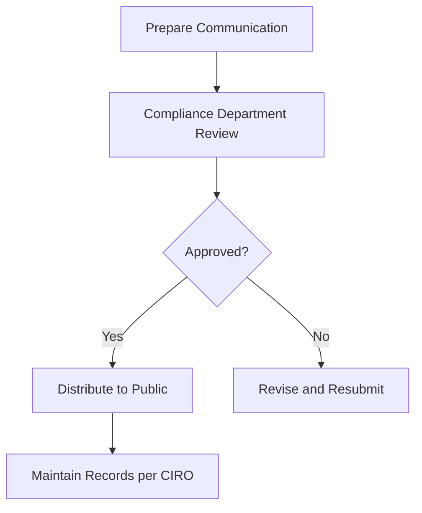

## 4.2 Communication with the Public

When I first started out as a Registered Representative (RR), I remember being pretty excited about sharing investment opportunities with clients. I mean, who wouldn't be? But I quickly learned that communicating with the public isn't as simple as just chatting about stocks or bonds. It's actually a highly regulated area, and for good reason. Misleading or unclear communication can lead to serious misunderstandings, financial losses, and even regulatory penalties. So, let's dive into how you, as an RR, can communicate effectively, ethically, and compliantly with your clients and the public.

### Why Clear Communication Matters

First things first—why is clear communication so crucial? Well, think of it this way: your clients rely heavily on your expertise and advice. If your communication isn't clear, accurate, or balanced, you risk misleading them, even unintentionally. Misunderstandings can lead to poor investment decisions, damaged relationships, and regulatory scrutiny. CIRO (Canadian Investment Regulatory Organization) takes this seriously, and so should you.

### The Five Pillars of Effective Communication

To keep things simple, let's break down effective communication into five key pillars:

1. **Accuracy:** Ensure all information you provide is factually correct. Double-check your sources and data before sharing them.
2. **Clarity:** Use language your clients can easily understand. Avoid jargon or technical terms unless you clearly explain them.
3. **Fairness:** Present information objectively, without bias or exaggeration. Don't cherry-pick data just to make something look good.
4. **Balance:** Always provide both potential benefits and risks associated with investments. Clients deserve the full picture.
5. **Transparency:** Clearly distinguish between facts, opinions, and forecasts. Clients should never be confused about the nature of the information you're sharing.

### Regulatory Compliance: CIRO and Provincial Guidelines

Now, let's talk about the rules. CIRO, along with provincial regulators, has established clear guidelines for public communication. These guidelines apply to everything—advertisements, social media posts, presentations, emails, letters, and even casual conversations if they're investment-related.

Here's a quick checklist to ensure compliance:

- **Prior Approval:** Always get your firm's compliance department to review and approve marketing materials or sales literature before distribution. Trust me, it's better to wait a bit than to face regulatory trouble later.
- **Risk Disclosure:** Clearly disclose all relevant risks and limitations associated with investment products or strategies. Never downplay or omit risks.
- **Recordkeeping:** Maintain detailed records of all client communications, including emails, letters, and notes from meetings. CIRO mandates this to protect both you and your clients.

Here's a visual summary of the compliance process:

### Navigating Social Media Responsibly

Ah, social media—it's both a blessing and a curse for financial professionals. On one hand, platforms like LinkedIn, Twitter, and Facebook offer fantastic opportunities to connect with clients and prospects. On the other hand, they pose significant compliance risks. Here's how you can navigate social media responsibly:

- **Know Your Firm's Policies:** Each firm has specific guidelines for social media use. Familiarize yourself with these and stick to them.
- **Separate Personal from Professional:** Clearly distinguish between your personal opinions and professional advice. Avoid mixing the two.
- **Avoid Specific Recommendations:** Social media isn't the place to give specific investment advice or recommendations. Keep posts general and educational.
- **Monitor and Archive Posts:** Your firm likely has tools to archive social media interactions. Ensure your posts are monitored and archived according to CIRO's recordkeeping requirements.

Here's an example scenario to illustrate responsible social media use:

**Good Example:**  
"Understanding diversification is key to managing investment risk. Curious about how this works? Let's chat!"

**Bad Example:**  
"ABC Corp stock is a guaranteed winner! Buy now!"

See the difference? The first is educational and compliant; the second is specific, misleading, and non-compliant.

### Differentiating Facts, Opinions, and Forecasts

One of the trickiest parts of communication is clearly differentiating between facts, opinions, and forecasts. Here's a simple breakdown:

- **Facts:** Verifiable data or information. ("The TSX Composite Index closed at 20,000 points today.")
- **Opinions:** Personal views or interpretations. ("I believe the technology sector has strong growth potential.")
- **Forecasts:** Predictions about future events or performance. ("I expect interest rates to rise by 1% next year.")

Always clearly label opinions and forecasts as such, and remind clients that these aren't guarantees. Transparency here builds trust and reduces misunderstandings.

### Practical Example: Client Email Communication

Let's look at a quick example of a compliant client email:

> "Hi Alex,
>
> Thanks for your question about the XYZ Balanced Fund. Historically, balanced funds aim to provide a mix of growth and income, but it's important to remember they aren't risk-free. Market fluctuations can impact returns, and past performance doesn't guarantee future results.
>
> In my opinion, this fund could align well with your moderate-risk profile, but let's discuss this further to ensure it fits your specific goals.
>
> Best regards,  
> Jamie"

Notice how the email clearly differentiates facts ("balanced funds aim to provide growth and income"), risks ("market fluctuations can impact returns"), and opinion ("In my opinion..."). This approach is clear, balanced, and compliant.

### Recordkeeping Requirements: Staying Organized

CIRO mandates strict recordkeeping requirements for client communications. Why? Because accurate records protect you, your clients, and your firm if disputes or regulatory inquiries arise. Here's what you should do:

- Keep copies of all client correspondence (emails, letters, meeting notes).
- Archive communications securely and systematically, typically through your firm's approved systems.
- Ensure records are easily retrievable for audits or reviews.

Here's a quick visual of best practices for recordkeeping:

### Common Pitfalls and How to Avoid Them

Let's quickly run through some common pitfalls I've seen RRs stumble into (and yes, I've made some of these mistakes myself!):

- **Overpromising Returns:** Never imply guaranteed returns. Always disclose risks clearly.
- **Using Complex Jargon:** Keep language simple and clear. Clients appreciate clarity.
- **Ignoring Compliance Approval:** Always get prior approval for marketing materials. Skipping this step can lead to serious trouble.
- **Neglecting Social Media Guidelines:** Social media is heavily monitored. Stay compliant and professional.

### Wrapping It Up: Your Role as an RR

At the end of the day, effective communication isn't just about compliance—it's about building trust and long-term relationships with your clients. By communicating clearly, transparently, and compliantly, you protect your clients, your firm, and your own professional reputation.

For further reading, I highly recommend checking out ["Social Media Compliance for Financial Professionals"](https://www.amazon.ca/Social-Media-Compliance-Financial-Professionals/dp/1118959073) by Stuart Fross and Richard Marshall. It's a fantastic resource for navigating today's digital communication landscape.

And of course, always refer back to [CIRO's Communication Guidelines](https://www.ciro.ca) for the most up-to-date regulatory information.

## Test Your Knowledge: CIRO Communication Compliance Quiz



### What must Registered Representatives (RRs) ensure about all communications with the public?

- [x] Communications must be accurate, clear, fair, balanced, and not misleading.
- [ ] Communications can be promotional and exaggerated as long as they attract clients.
- [ ] Communications only need to be accurate; clarity and fairness are optional.
- [ ] Communications do not require compliance approval if distributed informally.

> **Explanation:** CIRO mandates that all communications must be accurate, clear, fair, balanced, and not misleading to protect investors.

### Before distributing marketing materials, RRs must:

- [x] Obtain prior approval from their firm's compliance department.
- [ ] Distribute immediately to avoid delays.
- [ ] Get approval only if the material is controversial.
- [ ] Obtain approval only for printed materials, not electronic.

> **Explanation:** All marketing materials must receive compliance approval before distribution, regardless of format.

### Which of the following is a compliant social media post?

- [x] "Diversification helps manage investment risks. Let's discuss how it fits your goals!"
- [ ] "Buy XYZ stock now—it's guaranteed to double!"
- [ ] "Investing in ABC fund will eliminate all your risks."
- [ ] "I promise you'll make money with this investment."

> **Explanation:** The compliant post is educational, general, and does not promise specific returns or guarantees.


