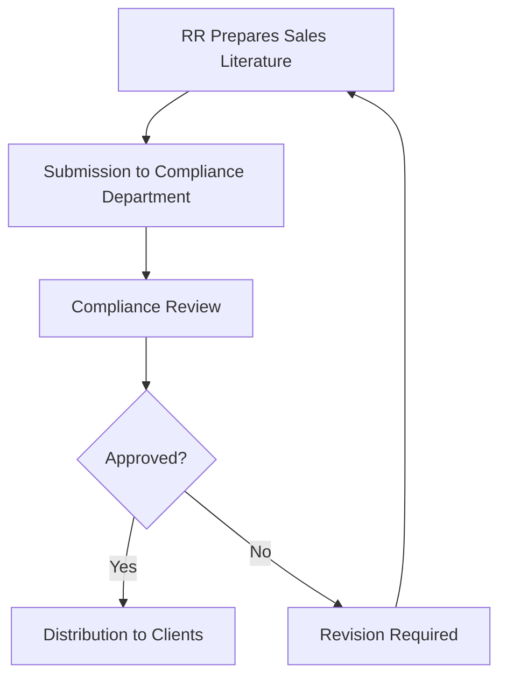
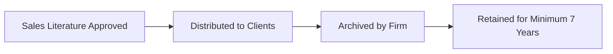

## 4.3 General Regulations and Guidelines for Sales Literature

So, you've probably seen those flashy investment brochures, right? You know, the ones promising "amazing returns" or "guaranteed profits"? Well, here's the thing—most of that flashy stuff is either misleading or straight-up against the rules. CIRO (the Canadian Investment Regulatory Organization) has some pretty clear guidelines on what you can and can't say in your sales literature. Let's dive into CIRO Rule 3600 and see what it's all about.

### Why Does CIRO Care So Much About Sales Literature?

Well, imagine you're a client. You see an ad promising sky-high returns without clearly mentioning the risks. You invest your hard-earned money, and boom—things don't pan out. You're understandably upset. CIRO's job is to make sure this doesn't happen. They ensure that all sales literature is accurate, fair, clear, and not misleading. Simple enough, right?

### CIRO Rule 3600: The Heart of Sales Literature Compliance

CIRO Rule 3600 is basically the rulebook for creating and distributing sales literature. It covers everything from accuracy and fairness to disclosures and record-keeping. Let's break down the key points:

#### Accuracy, Fairness, and Clarity

First things first, your sales literature has to be accurate. That means no exaggerated claims, no guarantees of performance, and definitely no misleading statements about potential returns or risks. If you're saying something, it better be backed up by solid facts.

For example, if your literature says something like, "Our mutual fund consistently outperforms the market," you'd better have solid historical data to back that up. And even then, you must clearly state that past performance doesn't guarantee future results.

#### Firm Identification and Responsibility

Ever seen a flyer or brochure and wondered, "Who exactly is behind this?" CIRO doesn't like mysteries. All sales literature must clearly identify the firm responsible for its preparation and distribution. This transparency helps clients know exactly who they're dealing with.

#### Disclosing Conflicts of Interest

Conflicts of interest are tricky. Let's say your firm receives special compensation for promoting certain products. If that's the case, you absolutely must disclose it. Clients deserve to know if your recommendations might be influenced by financial incentives or affiliations.

Here's a quick example:

- **Good disclosure:** "Our firm receives compensation from XYZ Mutual Fund Company for distributing their products, which may influence our recommendations."

- **Bad disclosure:** (None at all!)

#### Compliance Review and Approval

Okay, here's a big one. Before you send out any sales literature—brochures, emails, websites, social media posts—it needs to pass through your firm's compliance department. Yep, every single piece. Compliance officers will review the material to ensure it meets CIRO standards. Trust me, it's better to catch issues early rather than face regulatory headaches later.

Here's a simplified flowchart of the compliance review process:

#### Appropriate Disclaimers and Disclosures

If you're showing hypothetical or historical performance data, you absolutely must include clear disclaimers. For instance, hypothetical performance scenarios must explicitly state they're based on assumptions and may not reflect actual future results.

Here's a good example of a disclaimer:

> "The performance shown is hypothetical and based on assumptions. Actual results may vary significantly, and past performance does not guarantee future results."

#### Record Retention Requirements

CIRO requires firms to retain copies of all approved sales literature for at least seven years. Why? Well, if there's ever a dispute or regulatory inquiry, you'll need to provide evidence of what was communicated to clients. Keeping organized records is not just good practice—it's mandatory.

Here's a quick visual of the record retention process:

### Common Pitfalls and How to Avoid Them

Let's be real—mistakes happen. But some mistakes are more common than others. Here are a few pitfalls to watch out for:

- **Exaggerated Claims:** Avoid phrases like "guaranteed returns" or "risk-free." Nothing in investing is guaranteed or risk-free.

- **Incomplete Disclosures:** If there's a conflict of interest or compensation arrangement, disclose it clearly. Transparency builds trust.

- **Skipping Compliance Review:** Never, ever distribute sales literature without compliance approval. It's tempting to skip this step when you're in a rush, but trust me, it's not worth the risk.

### Real-Life Scenario: The Case of the Misleading Brochure

Let me share a quick story. A few years back, a firm distributed brochures highlighting impressive returns from a particular investment fund. The brochure conveniently left out the fact that these returns were hypothetical and based on ideal market conditions. Clients invested, expecting similar results, and—you guessed it—things didn't go as planned.

CIRO stepped in, fined the firm heavily, and required them to issue corrective disclosures. The firm's reputation took a serious hit. Moral of the story? Always be transparent and follow CIRO guidelines.

### Practical Tips for Creating Compliant Sales Literature

To keep things simple, here's a quick checklist you can use:

- ✅ Clearly identify your firm.
- ✅ Avoid exaggerated claims and guarantees.
- ✅ Disclose conflicts of interest and compensation arrangements.
- ✅ Include disclaimers for hypothetical or historical performance.
- ✅ Get compliance approval before distribution.
- ✅ Retain records for at least seven years.

### Glossary of Key Terms

- **CIRO Rule 3600:** CIRO regulation governing the preparation, review, approval, and distribution of sales literature.
- **Hypothetical Performance:** Illustrations of potential investment outcomes based on assumed scenarios or conditions.
- **Conflict of Interest:** A situation where an RR's personal or professional interests may compromise their duty to act in the client's best interest.

### Additional Resources for Further Exploration

Want to dive deeper? Here are some great resources:

- [CIRO Rule 3600 – Sales Literature](https://www.ciro.ca)
- Recommended Reading: "Advertising and Sales Literature Compliance Handbook," Canadian Securities Institute.

Remember, compliance isn't just about avoiding trouble—it's about building trust and credibility with your clients. And trust me, that's worth its weight in gold.

## Test Your Knowledge: CIRO Rule 3600 and Sales Literature Compliance Quiz



### What is the primary purpose of CIRO Rule 3600?

- [x] To ensure sales literature is accurate, fair, clear, and not misleading.
- [ ] To limit the amount of sales literature firms can distribute.
- [ ] To control the marketing budget of investment firms.
- [ ] To promote aggressive sales tactics.

> **Explanation:** CIRO Rule 3600 is designed to ensure that sales literature provided to clients is accurate, fair, clear, and not misleading.

### Which of the following statements is acceptable in sales literature?

- [ ] "Guaranteed returns of 15% annually."
- [x] "Past performance does not guarantee future results."
- [ ] "Risk-free investment opportunity."
- [ ] "You will definitely double your money."

> **Explanation:** Only the statement clearly indicating that past performance does not guarantee future results is acceptable.

### How long must firms retain copies of approved sales literature according to CIRO?

- [ ] 2 years
- [ ] 5 years
- [x] 7 years
- [ ] 10 years

> **Explanation:** CIRO requires firms to retain copies of all approved sales literature for a minimum of seven years.

### What must sales literature clearly identify?

- [x] The firm responsible for its preparation and distribution.
- [ ] The personal financial details of the RR.
- [ ] The exact number of clients who have invested.
- [ ] The RR's personal investment returns.

> **Explanation:** Sales literature must clearly identify the firm responsible for its preparation and distribution.

### Which of these scenarios represents a conflict of interest that must be disclosed?

- [x] Receiving compensation from a mutual fund company for recommending their products.
- [ ] Recommending a product based solely on client suitability.
- [ ] Providing unbiased financial education.
- [ ] Offering general market commentary.

> **Explanation:** Receiving compensation for recommending specific products is a conflict of interest that must be disclosed.

### Who must review and approve sales literature before distribution?

- [ ] The RR who created it.
- [x] The firm's compliance department.
- [ ] The client receiving it.
- [ ] CIRO directly.

> **Explanation:** The firm's compliance department must review and approve all sales literature before distribution.

### What must be included when presenting hypothetical performance data?

- [x] Appropriate disclaimers and disclosures.
- [ ] A guarantee of future performance.
- [ ] Personal testimonials from satisfied clients.
- [ ] A promise of similar future returns.

> **Explanation:** Appropriate disclaimers and disclosures are required when presenting hypothetical performance data.

### What happens if compliance does not approve sales literature?

- [ ] The RR can distribute it anyway.
- [x] The RR must revise and resubmit it for compliance review.
- [ ] The RR can appeal directly to CIRO.
- [ ] The literature is automatically destroyed.

> **Explanation:** If compliance does not approve, the RR must revise and resubmit for further review.

### Can sales literature include hypothetical performance data?

- [x] Yes, but only with clear disclaimers and disclosures.
- [ ] Yes, without any disclosures.
- [ ] No, hypothetical data is never allowed.
- [ ] Only if guaranteed by the RR.

> **Explanation:** Hypothetical performance data is allowed but must include clear disclaimers and disclosures.

### What should you avoid including in your sales literature?

- [x] Exaggerated claims and guarantees.
- [ ] Clear identification of your firm.
- [ ] Appropriate disclaimers.
- [ ] Compliance approval statements.

> **Explanation:** Exaggerated claims and guarantees must always be avoided to comply with CIRO Rule 3600.


