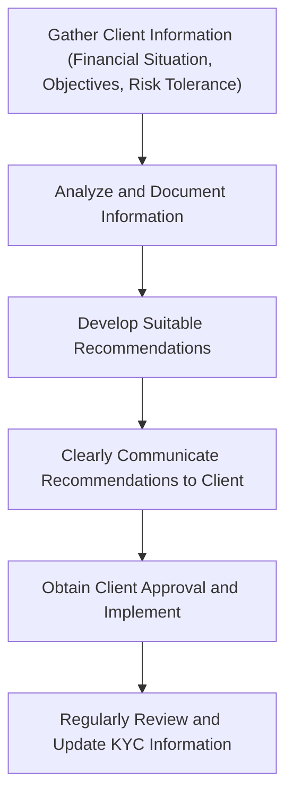

## 4.4 Dealing with Clients

Okay, let's be real for a second—working with clients is probably one of the most rewarding yet challenging aspects of being a Registered Representative (RR). It's not just about crunching numbers or picking stocks; it's about building trust, maintaining integrity, and ensuring your clients' interests always come first. So, how exactly do you navigate this crucial part of your role? Let's dive in.

### Acting Honestly, Fairly, and in Good Faith

First things first—honesty and fairness aren't just nice-to-haves; they're absolute musts. Imagine this: your client, Mr. Patel, is excited about a hot new tech IPO he heard about from his golfing buddy. But after doing your homework, you realize it's way too risky for his conservative investment profile. Sure, you could make a quick commission, but that's not the point, right? Your duty is to act honestly, fairly, and in good faith, even if it means telling Mr. Patel something he doesn't want to hear.

In short, always prioritize your client's best interests above your own. This builds trust, credibility, and long-term relationships—something far more valuable than any short-term gain.

### Clear, Accurate, and Timely Communication

Ever had a conversation where you walked away more confused than when you started? Yeah, we've all been there. But as an RR, your job is to make sure your clients never feel that way. Clear, accurate, and timely communication is essential.

When discussing investment products, strategies, or risks, avoid jargon and overly technical terms. Instead, break things down into simple, relatable language. For instance, instead of saying, "This fund has a high standard deviation," you might say, "This fund's value can fluctuate significantly, meaning it could go up or down quite a bit in a short period."

Providing timely information is equally important. If there's a significant market event or change in a client's portfolio, don't wait for them to call you—reach out proactively. Clients appreciate being kept in the loop, and it demonstrates your commitment to their financial well-being.

### Maintaining Confidentiality

Confidentiality is non-negotiable. Think about it—would you trust someone who casually shares your personal financial details at a dinner party? Probably not. As an RR, you're entrusted with sensitive information about your clients' financial situations, goals, and even personal lives. It's your responsibility to protect this information diligently.

Only disclose client information when you have explicit consent or when required by law. For example, if a client's accountant requests information, always confirm with your client first before sharing anything. And remember, confidentiality extends to digital security too—so make sure your cybersecurity practices are up-to-date (more on this in [Section 4.5 Privacy and Cybersecurity](/chapter-4/4.5-privacy-and-cybersecurity)).

### Promptly Addressing Client Inquiries and Concerns

Imagine you're a client who's worried about recent market volatility. You send your RR an email, and then...crickets. Not exactly reassuring, right? Promptly addressing client inquiries and concerns is crucial. Even if you don't have an immediate answer, acknowledge their message and let them know you're working on it.

When responding, provide thorough explanations and documentation if needed. For instance, if a client questions a recent trade, clearly outline the rationale behind your recommendation, referencing their investment objectives and risk tolerance. This transparency helps clients feel informed and confident in your guidance.

### Avoiding and Managing Conflicts of Interest

Conflicts of interest—ugh, they're tricky. Ideally, you'd avoid them altogether, but sometimes they're unavoidable. Maybe your firm offers incentives for recommending certain products, or perhaps you have a personal investment in a company you're recommending. When conflicts arise, transparency is key.

Clearly disclose any potential conflicts to your clients and obtain their consent before proceeding. For example, you might say, "Just so you're aware, our firm has a business relationship with XYZ Mutual Fund, which means we might benefit financially if you invest. However, I genuinely believe this fund aligns with your goals. Are you comfortable proceeding?"

This openness helps clients make informed decisions and maintains your credibility.

### Adhering to Know-Your-Client (KYC) and Suitability Obligations

Ah, the good old KYC and suitability obligations—these aren't just regulatory hoops to jump through. They're essential tools to ensure your recommendations genuinely serve your clients' best interests.

KYC involves gathering comprehensive information about your client's financial situation, investment objectives, and risk tolerance. Suitability obligations mean ensuring your recommendations align with this information. Let's say your client, Ms. Nguyen, is nearing retirement and has a low-risk tolerance. Recommending speculative cryptocurrency investments? Probably not suitable. Instead, you'd focus on stable, income-generating investments like bonds or dividend-paying stocks.

Here's a quick visual summary of the KYC and suitability process:

### Documenting Client Interactions and Advice

Documentation might not be the most thrilling part of your job, but trust me—it's incredibly important. Accurate and comprehensive records protect both you and your clients, especially if disputes or regulatory inquiries arise.

Document all client interactions, including meetings, phone calls, emails, and texts. Clearly record the advice provided, client decisions, and any relevant rationale. For instance, if a client declines your recommendation, note their reasons and your response. This practice ensures transparency and compliance with CIRO regulations.

### Real-Life Scenario: Putting It All Together

Let's wrap this up with a quick story. Meet Sarah, an RR who's been working with her client, Mr. Lee, for several years. Recently, Mr. Lee expressed interest in investing heavily in a speculative biotech stock. Sarah knew this didn't align with his conservative investment profile, so she:

- Clearly explained the risks and volatility associated with the stock.
- Reminded Mr. Lee of his original investment objectives and risk tolerance.
- Documented their conversation thoroughly.
- Suggested alternative investments better suited to his profile.

Ultimately, Mr. Lee appreciated Sarah's honesty and transparency. He decided to follow her advice, reinforcing their trust-based relationship.

### Best Practices Summary

Here's a quick recap of best practices when dealing with clients:

- Always prioritize client interests above your own.
- Communicate clearly, accurately, and promptly.
- Maintain strict confidentiality of client information.
- Address client inquiries and concerns quickly and thoroughly.
- Transparently disclose and manage conflicts of interest.
- Adhere strictly to KYC and suitability obligations.
- Document all client interactions and advice comprehensively.

### Additional Resources

For further reading and resources, check out:

- [CIRO Client Relationship Model (CRM2)](https://www.ciro.ca)
- Recommended Reading: *Client Relationship Management for Financial Advisors* by David J. Drucker and Joel P. Bruckenstein.

## Test Your Knowledge: Dealing with Clients Best Practices Quiz



### What is the primary obligation of a Registered Representative (RR) when dealing with clients?

- [x] Acting honestly, fairly, and in good faith, prioritizing client interests.
- [ ] Maximizing commissions and firm profitability.
- [ ] Providing investment advice without considering client profiles.
- [ ] Avoiding communication with clients to minimize conflicts.

> **Explanation:** RRs must always prioritize client interests, acting honestly, fairly, and in good faith.

### When should client information be disclosed?

- [x] Only with client consent or when required by law.
- [ ] Whenever requested by third parties.
- [ ] Freely, to build trust with other clients.
- [ ] Only during annual reviews.

> **Explanation:** Confidentiality is crucial; disclose client information only with explicit consent or legal requirement.

### What does KYC stand for?

- [x] Know-Your-Client
- [ ] Keep-Your-Commission
- [ ] Know-Your-Competition
- [ ] Keep-Your-Client

> **Explanation:** KYC stands for Know-Your-Client, a regulatory requirement to understand client profiles thoroughly.

### How should conflicts of interest be handled?

- [x] Clearly disclosed to clients, obtaining their consent before proceeding.
- [ ] Ignored, as long as the client doesn't ask.
- [ ] Hidden to avoid client discomfort.
- [ ] Managed internally without client knowledge.

> **Explanation:** Transparency and client consent are essential in managing conflicts of interest.

### Documentation of client interactions should be:

- [x] Accurate, comprehensive, and timely.
- [ ] Optional, based on RR preference.
- [ ] Limited to financial transactions only.
- [ ] Destroyed after one year.

> **Explanation:** Proper documentation protects both clients and RRs, ensuring clarity and compliance.


