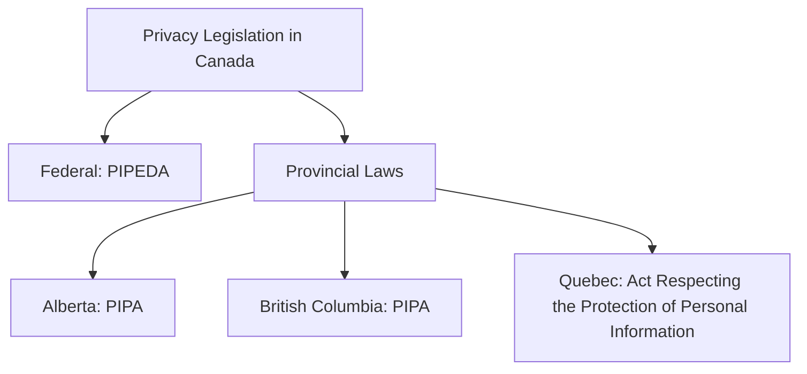
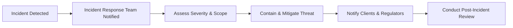

Privacy and cybersecurity—two terms that, let's be honest, can make even seasoned financial professionals break into a cold sweat. But here's the thing: in today's digital age, they're not just buzzwords. They're crucial components of your professional responsibility as a Registered Representative (RR). Protecting client information isn't just good practice—it's the law. So, let's dive into what you need to know, why it matters, and how you can stay ahead of the curve.

### Understanding Privacy Legislation: PIPEDA and Beyond

First things first, let's talk about privacy laws. In Canada, the primary legislation governing privacy in the private sector is the Personal Information Protection and Electronic Documents Act (PIPEDA). This federal law sets out clear guidelines on how you and your firm must collect, use, and disclose personal information.

Under PIPEDA, personal information includes anything that can identify an individual—names, addresses, social insurance numbers, financial details, and even opinions or evaluations about someone. The key principle? Consent. You must always obtain clear, informed consent from clients before collecting or using their personal information.

But wait, there's more! Depending on your province, additional provincial privacy laws may apply. For example, Alberta, British Columbia, and Quebec have their own privacy legislation that's substantially similar to PIPEDA. So, always double-check your local regulations.

Here's a quick visual breakdown:

### Cybersecurity: Why It Matters More Than Ever

Cybersecurity is all about protecting your firm's computer systems, networks, and data from unauthorized access, theft, or cyberattacks. And trust me, cyber threats are everywhere. From phishing emails to ransomware attacks, cybercriminals are constantly evolving their tactics. Just last year, a major Canadian financial firm experienced a data breach affecting thousands of clients. Not fun. And definitely not something you want to experience firsthand.

So, how do you stay safe? Well, it starts with robust cybersecurity policies and procedures. Your firm must implement comprehensive measures to safeguard client data, including:

- Firewalls and antivirus software
- Multi-factor authentication (MFA)
- Regular software updates and patches
- Data encryption for sensitive information
- Secure backups and disaster recovery plans

### Training and Education: Staying One Step Ahead

Here's a hard truth: cybersecurity isn't a "set it and forget it" kind of thing. It requires constant vigilance and regular training. As an RR, you'll need ongoing education to recognize and mitigate potential threats. Your firm should provide regular training sessions covering:

- Identifying phishing emails and social engineering attacks
- Creating strong, unique passwords and using password managers
- Understanding the risks of public Wi-Fi and unsecured networks
- Reporting suspicious activity promptly

And hey, if you're ever unsure about something, don't hesitate to ask your firm's IT department. Better safe than sorry, right?

### Incident Response Planning: Expecting the Unexpected

Even with the best cybersecurity measures in place, breaches can still happen. That's why your firm needs a solid incident response plan—a documented strategy outlining exactly what to do if (or when) a cybersecurity incident occurs.

A good incident response plan typically includes:

- Clear roles and responsibilities for team members
- Steps for identifying, containing, and mitigating the breach
- Procedures for notifying affected clients and regulatory authorities, like CIRO
- Communication strategies to manage public relations and client trust
- Post-incident reviews to learn and improve future responses

Here's a simplified example of an incident response workflow:

### Secure Communication: Protecting Client Data in Transit

Ever sent sensitive client information via email? Um, yeah, we've all been there. But here's the thing—regular email isn't secure. Cybercriminals can intercept emails and steal sensitive data. That's why it's crucial to use secure communication channels and encryption technologies whenever you're transmitting confidential information electronically.

Best practices include:

- Using encrypted email services or secure client portals
- Avoiding sending sensitive data via unsecured messaging apps or social media
- Verifying recipient identities before sharing confidential information
- Educating clients on secure communication methods

### Regular Cybersecurity Assessments: Finding Weaknesses Before Hackers Do

Think of cybersecurity assessments like regular health check-ups. They're essential for identifying vulnerabilities and addressing them before cybercriminals exploit them. Your firm should conduct regular audits and assessments, including:

- Penetration testing (ethical hacking) to simulate cyberattacks
- Vulnerability scanning to detect weaknesses in software and systems
- Reviewing access controls and user permissions regularly
- Ensuring compliance with regulatory standards and best practices

### Educating Clients: A Shared Responsibility

Cybersecurity isn't just your firm's responsibility—clients play a crucial role too. Educating clients about cybersecurity risks and best practices can significantly reduce their vulnerability to cyber threats. Encourage clients to:

- Use strong, unique passwords and enable multi-factor authentication
- Regularly monitor their accounts for suspicious activity
- Be cautious of unsolicited emails or messages requesting personal information
- Keep their devices and software updated with the latest security patches

Here's a quick client-friendly checklist you can share:

| Cybersecurity Best Practices for Clients |
|------------------------------------------|
| ✅ Use strong, unique passwords          |
| ✅ Enable multi-factor authentication    |
| ✅ Regularly monitor financial accounts  |
| ✅ Avoid clicking suspicious links       |
| ✅ Keep software and devices updated     |

### Real-Life Example: The Cost of Ignoring Cybersecurity

Let me share a quick story. A few years back, a small investment firm in Ontario neglected regular cybersecurity training and assessments, thinking, "We're too small to be targeted." Big mistake. A phishing email tricked one employee into revealing login credentials, leading to a massive data breach. Client trust plummeted, regulatory fines piled up, and the firm's reputation took a serious hit. Moral of the story? Cybersecurity isn't optional—it's essential.

### Wrapping It Up: Privacy and Cybersecurity as Core Responsibilities

Privacy and cybersecurity are integral parts of your professional duties as an RR. By understanding privacy laws like PIPEDA, implementing robust cybersecurity measures, staying educated, and proactively engaging clients, you can protect sensitive information, maintain client trust, and avoid costly breaches.

### Additional Resources for Further Exploration:

- [Office of the Privacy Commissioner of Canada](https://www.priv.gc.ca)
- Recommended Reading: "Cybersecurity for Financial Professionals," by Erdal Ozkaya and Milad Aslaner.

## Test Your Knowledge: Privacy and Cybersecurity Essentials Quiz



### What is the primary Canadian federal legislation governing privacy for private-sector organizations?

- [x] Personal Information Protection and Electronic Documents Act (PIPEDA)
- [ ] Canadian Privacy Act
- [ ] Digital Privacy and Security Act
- [ ] Financial Information Protection Act

> **Explanation:** PIPEDA is Canada's primary federal law governing the collection, use, and disclosure of personal information by private-sector organizations.

### Which of the following is NOT considered personal information under PIPEDA?

- [ ] Social insurance number
- [ ] Financial account details
- [x] Publicly available business address
- [ ] Personal opinions or evaluations about an individual

> **Explanation:** Publicly available business addresses are generally not considered personal information under PIPEDA.

### What is the main purpose of an incident response plan?

- [x] To outline steps for managing and mitigating cybersecurity incidents
- [ ] To prevent all cybersecurity breaches
- [ ] To train employees on cybersecurity basics
- [ ] To encrypt all client communications

> **Explanation:** An incident response plan provides clear steps and responsibilities for managing and mitigating cybersecurity incidents effectively.

### Which of these is an example of secure electronic communication?

- [ ] Sending sensitive data via regular email
- [x] Using encrypted email services or secure client portals
- [ ] Sharing client details through social media messaging
- [ ] Texting confidential information to clients

> **Explanation:** Encrypted email services or secure client portals protect sensitive information from unauthorized access.

### How often should cybersecurity training ideally occur?

- [ ] Only during employee onboarding
- [ ] Every five years
- [x] Regularly and continuously
- [ ] Only after a cybersecurity incident

> **Explanation:** Cybersecurity training should be ongoing and regular to keep staff aware of evolving threats.


