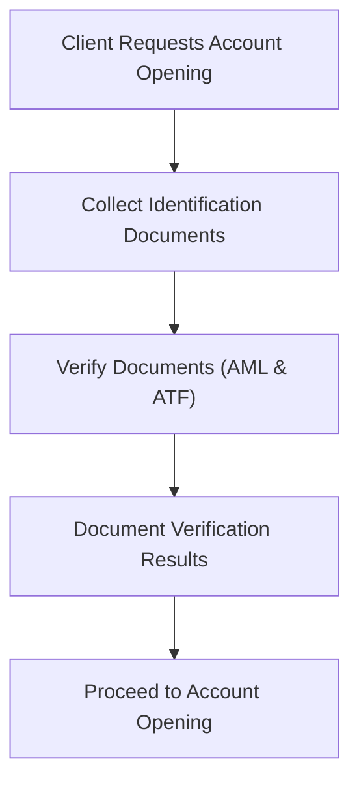
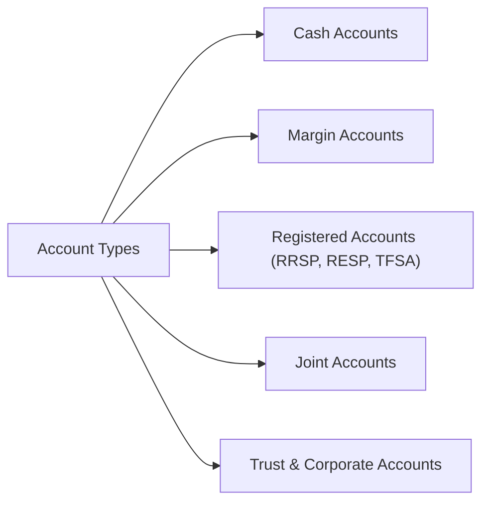
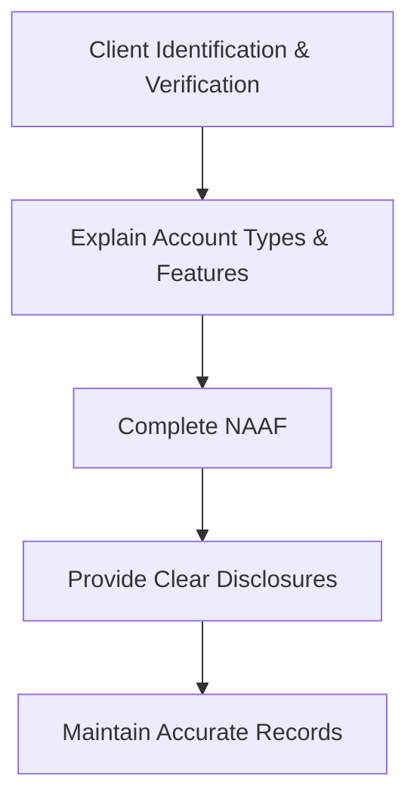

## 5.1 Opening Accounts

So, you're ready to open a new investment account for your client. Sounds straightforward, right? Well, not exactly. The account opening process in the Canadian securities industry is a critical step—and it's way more than just filling out a few forms. It's about laying the groundwork for a solid, compliant, and transparent relationship with your client. Let's dive into what you need to know to get it right.

### Why the Account Opening Process Matters

First off, let's talk about why this matters so much. The account opening process isn't just a formality—it's your first opportunity to build trust, understand your client's needs, and ensure compliance with regulatory standards. If you get this right, you're setting yourself and your client up for success. If you get it wrong, well, let's just say the consequences aren't pretty—think regulatory penalties, damaged reputation, and unhappy clients.

### Regulatory Framework: CIRO Rule 3800 and Beyond

In Canada, the account opening process is governed by CIRO Rule 3800, provincial securities regulations, and privacy laws. CIRO (the Canadian Investment Regulatory Organization) is the national self-regulatory body overseeing investment dealers, mutual fund dealers, and market integrity. CIRO Rule 3800 specifically outlines minimum standards for account opening, client identification, and record-keeping.

Here's a quick overview of what CIRO Rule 3800 covers:

- Client identification and verification
- Documentation requirements
- Record-keeping standards
- Disclosure obligations
- Special account types (margin, joint, corporate, registered accounts)

You can check out the full details directly from CIRO's official website: [CIRO Rule 3800 – Client Accounts](https://www.ciro.ca/rules-and-regulations).

### Step-by-Step Guide to Opening an Account

Let's break this down into manageable steps:

#### Step 1: Client Identification and Verification (AML & ATF Compliance)

Before anything else, you must verify your client's identity. This isn't just a good practice—it's a legal requirement under Canada's anti-money laundering (AML) and anti-terrorist financing (ATF) regulations. The Financial Transactions and Reports Analysis Centre of Canada (FINTRAC) provides clear guidelines on this.

You'll typically need:

- Government-issued photo ID (passport, driver's license)
- Proof of address (utility bill, bank statement)
- Employment information
- Financial details (income, net worth, investment objectives)

Here's a simplified visual of the identification process:

#### Step 2: Explaining Account Types and Features

It's your responsibility to clearly explain different account types, their features, fees, and risks. Clients need to understand exactly what they're signing up for. Common account types include:

- **Cash Accounts:** Clients pay in full for securities purchased.
- **Margin Accounts:** Clients borrow funds from the brokerage to purchase securities.
- **Registered Accounts:** Tax-advantaged accounts like RRSPs, RESPs, and TFSAs.
- **Joint Accounts:** Accounts held by two or more individuals.
- **Trust and Corporate Accounts:** Accounts opened for legal entities or trusts, each with unique documentation requirements.

Let's quickly illustrate this:

#### Step 3: Completing the New Account Application Form (NAAF)

The New Account Application Form (NAAF) is the cornerstone of the account opening process. It captures all essential client information and ensures compliance with regulatory requirements. Make sure the NAAF is complete, accurate, and signed by the client.

#### Step 4: Disclosures and Client Understanding

Transparency is key. You must clearly disclose:

- Fees and charges
- Risks associated with investments
- Firm's obligations and limitations
- Client's rights and responsibilities

Make sure your client fully understands these disclosures. It's not enough to just hand them a document—you need to actively engage them in the conversation.

#### Step 5: Record-Keeping and Documentation

Proper documentation is crucial. CIRO Rule 3800 mandates that firms maintain accurate and complete records of all account opening documentation and client interactions. These records must be easily retrievable for regulatory audits and compliance checks.

Here's a quick visual summary of the account opening process:

### Special Considerations for Unique Account Types

Let's briefly touch on some unique account types and their specific requirements:

- **Margin Accounts:** Require additional disclosures about borrowing risks and margin calls.
- **Joint Accounts:** Clearly define ownership structure (joint tenants vs. tenants-in-common).
- **Trust and Corporate Accounts:** Require additional legal documentation (trust agreements, corporate resolutions, articles of incorporation).
- **Registered Accounts (RRSP, RESP, TFSA):** Have specific tax implications and contribution limits that must be clearly explained.

### Common Pitfalls and How to Avoid Them

I've seen plenty of professionals stumble during the account opening process. Here are some common pitfalls to watch out for:

- **Incomplete Documentation:** Always double-check that every required field on the NAAF is filled out.
- **Insufficient Client Verification:** Don't skip or rush through AML and ATF checks—this can lead to serious regulatory issues.
- **Poor Client Communication:** Make sure your client truly understands what they're signing up for. Ask questions, encourage dialogue, and document these interactions.

### Real-World Example: The Importance of Thoroughness

Let me share a quick story. A few years ago, a colleague rushed through the account opening process for a high-net-worth client. He skipped some AML checks, assuming the client was reputable. Turns out, the client was involved in money laundering. The firm faced significant fines and reputational damage. Moral of the story? Never cut corners.

### Best Practices for Opening Accounts

- **Be Thorough:** Take your time and ensure every step is completed correctly.
- **Stay Informed:** Regularly review CIRO updates and FINTRAC guidelines.
- **Communicate Clearly:** Engage your clients actively and ensure they understand their accounts.
- **Document Everything:** Keep meticulous records of all interactions and documentation.

### Additional Resources for Further Exploration

To deepen your understanding, check out these resources:

- [CIRO Rule 3800 – Client Accounts](https://www.ciro.ca/rules-and-regulations)
- [FINTRAC Guidelines on AML and ATF](https://www.fintrac-canafe.gc.ca/guidance-directives/overview-apercu-eng)
- Book: *Canadian Securities Regulation* by David Johnston, Kathleen Rockwell, and Cristie Ford (LexisNexis Canada)

---

## Test Your Knowledge: Opening Investment Accounts and CIRO Compliance Quiz



### What is the primary regulatory rule governing account opening procedures in Canada?

- [x] CIRO Rule 3800
- [ ] FINTRAC Rule 500
- [ ] CSA Rule 2500
- [ ] CIPF Rule 1000

> **Explanation:** CIRO Rule 3800 outlines the minimum standards for account opening, client identification, and record-keeping.

### Which of the following is NOT typically required for client identification under AML regulations?

- [ ] Government-issued photo ID
- [ ] Proof of address
- [x] Social media profile
- [ ] Employment information

> **Explanation:** Social media profiles are not acceptable identification documents under AML regulations.

### What type of account allows clients to borrow funds to purchase securities?

- [ ] Cash account
- [x] Margin account
- [ ] TFSA
- [ ] RESP

> **Explanation:** Margin accounts allow clients to borrow funds to purchase securities, unlike cash accounts.

### Why is clear disclosure important during the account opening process?

- [x] To ensure clients understand fees, risks, and obligations
- [ ] To speed up the account opening process
- [ ] To avoid providing documentation
- [ ] To bypass regulatory audits

> **Explanation:** Clear disclosures ensure clients fully understand the fees, risks, and their obligations, promoting transparency and compliance.

### Which organization provides guidelines on AML and ATF compliance in Canada?

- [ ] CIRO
- [x] FINTRAC
- [ ] CIPF
- [ ] Bank of Canada

> **Explanation:** FINTRAC provides guidelines on AML and ATF compliance in Canada.

### Which account type allows clients to borrow funds from the investment dealer to purchase securities?

- [ ] Cash account
- [x] Margin account
- [ ] TFSA
- [ ] RESP

> **Explanation:** Margin accounts allow clients to borrow funds from the dealer to invest.

### What additional documentation is typically required when opening a corporate account?

- [x] Corporate resolutions and articles of incorporation
- [ ] Personal social media accounts
- [ ] Personal tax returns
- [ ] Personal references

> **Explanation:** Corporate accounts require corporate resolutions and articles of incorporation.

### What is the main purpose of AML and ATF regulations?

- [x] To prevent money laundering and terrorist financing
- [ ] To increase investment returns
- [ ] To simplify client onboarding
- [ ] To minimize paperwork

> **Explanation:** AML and ATF regulations are designed to prevent financial crimes like money laundering and terrorist financing.

### Which organization provides guidelines on AML and ATF compliance in Canada?

- [ ] CIRO
- [x] FINTRAC
- [ ] CIPF
- [ ] Bank of Canada

> **Explanation:** FINTRAC provides guidelines on AML and ATF compliance in Canada.

### Which of the following accounts has specific tax implications and contribution limits?

- [ ] Margin account
- [x] TFSA
- [ ] Cash account
- [ ] Corporate account

> **Explanation:** TFSAs have specific tax implications and annual contribution limits.

### Why is meticulous record-keeping important in the account opening process?

- [x] To comply with regulatory audits and compliance checks
- [ ] To avoid client interactions
- [ ] To reduce client communication
- [ ] To increase investment returns

> **Explanation:** Accurate record-keeping ensures compliance with regulatory requirements and facilitates audits and compliance checks.


