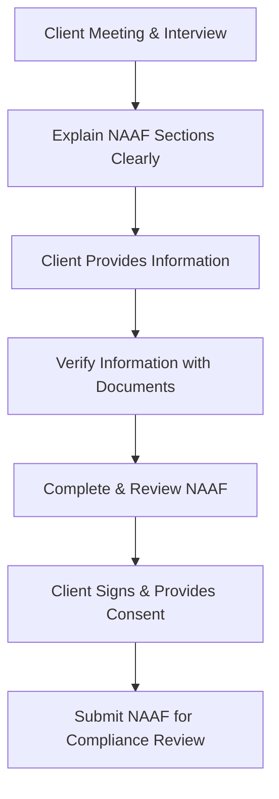

When I first started working in the financial industry, I remember thinking, "How complicated can opening an account really be?" Well, turns out, it's a bit more involved than just jotting down a client's name and address. The New Account Application Form (NAAF) is actually a cornerstone document in our industry. It's not just paperwork—it's the foundation of the entire client-advisor relationship, regulatory compliance, and ongoing suitability assessments. So, let's dive into what exactly the NAAF is, why it's so important, and how to ensure you're completing it accurately and effectively.

### What Exactly is the NAAF?

The New Account Application Form (NAAF) is a mandatory document used by investment dealers in Canada to gather critical client information when opening a new account. Think of it as the blueprint for understanding your client. It captures everything from basic identification details to financial circumstances, investment objectives, risk tolerance, and investment knowledge. It's the document that allows advisors to truly "know their client" (KYC)—a fundamental regulatory and ethical obligation.

### Key Information Captured on the NAAF

Here's a quick rundown of the essential information typically included on a NAAF:

- **Personal Identification:** Full legal name, date of birth, residential address, citizenship, Social Insurance Number (SIN), and employment details.
- **Financial Circumstances:** Annual income, net worth, liquid assets, liabilities, and financial obligations.
- **Investment Objectives:** What exactly does the client want? Growth, income, preservation of capital, or maybe a combination?
- **Risk Tolerance:** How comfortable is the client with fluctuations in their portfolio? Are they conservative, moderate, or aggressive investors?
- **Investment Knowledge and Experience:** Does the client have a solid understanding of financial markets, or are they relatively new to investing?
- **Consent and Authorizations:** Client's consent to terms and conditions, fee structures, trading authorizations, and privacy disclosures.

### Why is the NAAF So Important?

Well, aside from being a regulatory requirement, the NAAF serves several critical purposes:

1. **Foundation for Suitability Assessments:** Advisors use the information on the NAAF to ensure investment recommendations align with the client's financial situation, objectives, and risk tolerance.
2. **Regulatory Compliance:** CIRO (Canadian Investment Regulatory Organization) regularly audits firms to ensure compliance with KYC and suitability obligations. A properly completed NAAF is your best defense during audits.
3. **Dispute Resolution:** If a client ever disputes a trade or investment recommendation, the NAAF provides documented evidence of the client's stated objectives and risk tolerance at the time of account opening.

### Ensuring Accuracy and Completeness

One of the biggest pitfalls I've seen in practice is incomplete or inaccurate NAAFs. Trust me, you don't want to be scrambling to explain discrepancies during a regulatory audit or client complaint. Here are some best practices to ensure accuracy:

- **Verify Client Information:** Always cross-reference client-provided details with valid identification documents (passport, driver's license, etc.) and supplementary sources (bank statements, tax returns, etc.).
- **Clear Communication:** Take the time to explain each section of the form to your client. Make sure they fully understand the questions and implications of their responses.
- **Avoid Assumptions:** Never assume a client's risk tolerance or investment objectives based on age, occupation, or appearance. Always ask explicitly and document their responses clearly.

Here's a quick visual overview of the NAAF completion process:

### Real-World Example: Meet Sarah

Let's look at a practical example. Sarah, a 35-year-old software engineer, comes to you to open an investment account. She earns $120,000 annually, has a net worth of around $300,000, and is saving primarily for retirement. After discussing her goals, you determine she's comfortable with moderate risk and has a good understanding of investing basics.

When completing Sarah's NAAF, you carefully document:

- Her personal details (verified by her driver's license and utility bill).
- Financial circumstances (verified by recent pay stubs and bank statements).
- Investment objectives (growth and income).
- Risk tolerance (moderate).
- Investment knowledge (intermediate).

Sarah reviews the completed form, signs it, and you submit it for compliance review. Now, if Sarah ever questions an investment recommendation, you have clear documentation to support your decisions.

### Updating the NAAF Regularly

Life changes, right? Clients get married, divorced, change jobs, inherit money, or experience financial setbacks. Because of this, firms must regularly review and update the NAAF to reflect changes in client circumstances, regulatory requirements, or firm policies. CIRO recommends reviewing client information at least annually or whenever significant life changes occur.

Here's a quick guide to when you should update the NAAF:

| Event or Change | Action Required |
|-----------------|-----------------|
| Change in marital status | Update NAAF |
| Significant income change | Update NAAF |
| Change in employment | Update NAAF |
| Major financial windfall or loss | Update NAAF |
| Change in investment objectives or risk tolerance | Update NAAF |

### Common Pitfalls and How to Avoid Them

I've seen my fair share of NAAF-related headaches. Here are some common pitfalls and tips to avoid them:

- **Incomplete Information:** Always double-check that every section is filled out. Blank spaces are red flags during audits.
- **Outdated Information:** Set reminders to regularly review and update client information.
- **Misunderstood Risk Tolerance:** Clearly explain risk tolerance levels to clients. Use examples and scenarios to ensure they truly understand their comfort level.

### Glossary of Key Terms

- **NAAF (New Account Application Form):** A mandatory document used by investment dealers to collect essential client information and establish the account relationship.
- **Suitability Assessment:** A regulatory requirement ensuring investment recommendations align with the client's financial situation, objectives, and risk tolerance.
- **Risk Tolerance:** The degree of variability in investment returns that a client is willing and able to withstand.

### Additional Resources for Further Exploration

Want to dive deeper? Here are some excellent resources:

- [CIRO Guidance on NAAF Completion](https://www.ciro.ca/guidance)
- [Canadian Securities Administrators (CSA) – Client Focused Reforms](https://www.securities-administrators.ca/client-focused-reforms/)
- Online Course: ["Know Your Client (KYC) and Suitability Obligations," Canadian Securities Institute (CSI)](https://www.csi.ca/student/en_ca/courses/csi/kyc.xhtml)

The NAAF isn't just paperwork—it's the cornerstone of your client relationships, regulatory compliance, and professional integrity. So, take the time to get it right. Your future self (and your compliance department) will thank you!

## Test Your Knowledge: New Account Application Form (NAAF) Essentials Quiz



### What is the primary purpose of the New Account Application Form (NAAF)?

- [x] To gather essential client information and establish the client-advisor relationship.
- [ ] To provide investment recommendations.
- [ ] To document trading history.
- [ ] To calculate client taxes.

> **Explanation:** The NAAF is primarily used to collect essential client information and establish the foundation for the client-advisor relationship, ensuring suitability and regulatory compliance.

### Which of the following is NOT typically included in a NAAF?

- [ ] Client's risk tolerance.
- [ ] Client's investment objectives.
- [x] Client's medical history.
- [ ] Client's financial circumstances.

> **Explanation:** Medical history is not typically requested on a NAAF, as it's not directly relevant to investment suitability assessments.

### How often should the NAAF be reviewed and updated?

- [ ] Only when the account is first opened.
- [x] Regularly, at least annually or whenever significant life changes occur.
- [ ] Every five years.
- [ ] Only during regulatory audits.

> **Explanation:** The NAAF should be reviewed regularly, at least annually, or whenever significant life changes occur to ensure accuracy and ongoing suitability.

### What is "risk tolerance"?

- [ ] The client's financial net worth.
- [x] The degree of variability in investment returns a client is willing and able to withstand.
- [ ] The client's investment knowledge.
- [ ] The client's annual income.

> **Explanation:** Risk tolerance refers to how much variability or volatility in investment returns a client is comfortable and able to handle.

### Which regulatory body oversees compliance with NAAF requirements in Canada?

- [ ] IIROC
- [ ] MFDA
- [x] CIRO
- [ ] CSA

> **Explanation:** CIRO (Canadian Investment Regulatory Organization) is the current regulatory body overseeing compliance with NAAF and other regulatory requirements.


