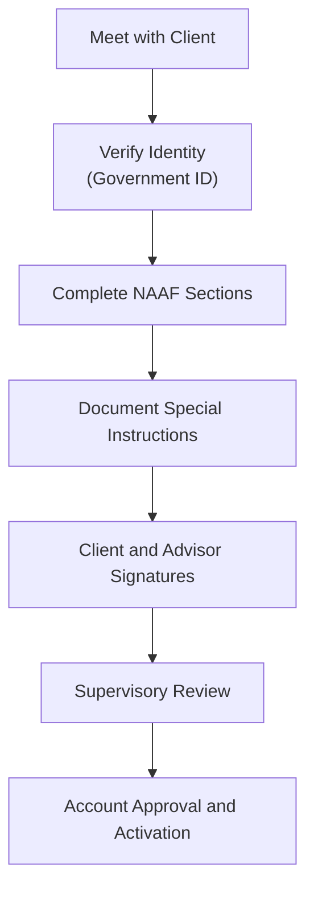

## Completing the New Account Application Form (NAAF): Essential Guidelines and Best Practices

So, you've met your client, discussed their financial goals, and now it's time to officially get things rolling. Enter the New Account Application Form, or as we affectionately call it, the NAAF. Honestly, this form might seem straightforward at first glance, but trust me—it's one of the most crucial documents you'll handle as an advisor. Not only is it a regulatory requirement, but it's also foundational for building a solid, transparent relationship with your client. Let's dive into how to complete it accurately, efficiently, and in compliance with CIRO and FINTRAC guidelines.

### Why the NAAF Matters So Much

First things first, why all the fuss about a simple form? Well, the NAAF isn't just paperwork—it's essentially your client's financial blueprint. It captures critical information about their identity, financial situation, investment objectives, risk tolerance, and more. Regulators like CIRO and FINTRAC rely on accurate NAAFs to ensure advisors are acting in their clients' best interests and adhering to anti-money laundering (AML) and anti-terrorist financing (ATF) regulations.

Think of the NAAF as your roadmap. If it's incomplete or inaccurate, you risk regulatory trouble, client dissatisfaction, and potential financial losses. So yeah, it's kind of a big deal.

### Step-by-Step Guide to Completing the NAAF

Let's break this down into manageable steps. Each section of the NAAF has its nuances, so we'll tackle them one by one.

#### Step 1: Client Identification and Verification

Before anything else, you must verify your client's identity. CIRO and FINTRAC guidelines require that you confirm identity using valid, government-issued identification. Acceptable forms include:

- Passport
- Driver's license
- Provincial health card (where permitted)
- Permanent resident card

Always document the type, number, expiry date, and issuing jurisdiction. And here's a pro tip: make sure the ID is current and hasn't expired. You'd be surprised how often advisors overlook this simple detail.

#### Step 2: Personal Information

Next, you'll fill in the client's personal details, including:

- Full legal name
- Date of birth
- Residential address
- Contact information (phone numbers, email addresses)
- Employment status and occupation

Be thorough here. If the client has multiple addresses (like a seasonal home), document them clearly. Also, employment details are crucial for assessing financial stability and potential conflicts of interest.

#### Step 3: Financial Information

Now, onto the financial stuff. This section covers:

- Annual income
- Net worth (liquid and fixed assets)
- Liabilities (mortgages, loans, credit card debts)
- Investment experience and knowledge

Here's where things can get a bit sensitive. Some clients might feel uncomfortable disclosing detailed financial information. It's your job to explain clearly why this information is essential. A simple, empathetic explanation usually does the trick: "I know this feels personal, but understanding your financial picture helps me recommend investments that truly fit your needs."

#### Step 4: Investment Objectives and Risk Tolerance

Ah, the heart of the NAAF. This section defines what your client hopes to achieve through investing and how much risk they're willing to take on. Typical investment objectives include:

- Capital preservation
- Income generation
- Growth
- Speculation

Risk tolerance levels generally range from conservative to aggressive. Take your time here. Discuss scenarios, ask hypothetical questions, and use relatable examples. For instance, "If your investment dropped 20% in value overnight, how would you feel? Would you panic, or see it as a buying opportunity?" These conversations help you gauge their true comfort level.

#### Step 5: Account Type and Special Instructions

Specify clearly the type of account (e.g., cash, margin, RRSP, TFSA) and document any special instructions or restrictions. If the client has specific preferences—like avoiding certain industries or investments—note these explicitly. Clarity here prevents misunderstandings down the road.

#### Step 6: Client Acknowledgements and Signatures

Finally, ensure your client thoroughly reviews and signs the form. Clients must acknowledge they've provided accurate information and understand the terms and conditions. And don't forget your own signature! Your sign-off confirms you've reviewed the form, verified the client's identity, and discussed all relevant details.

### Documenting Special Instructions and Deviations

Sometimes, clients have unique requests or instructions that deviate from standard procedures. Maybe they insist on investing in something outside their stated risk tolerance, or perhaps they have specific ethical investing preferences. Whatever the case, document these clearly and comprehensively. Include detailed notes explaining the client's rationale and your discussions. This documentation protects both you and your client if questions arise later.

### Supervisory Review: Your Safety Net

Once you've completed the NAAF, it doesn't just vanish into a filing cabinet. Nope—it's reviewed by designated supervisory personnel. This internal compliance review ensures accuracy, completeness, and adherence to regulatory standards. Supervisors might ask for clarifications or additional documentation. Don't take this personally; it's a critical step in maintaining regulatory compliance and protecting everyone involved.

Here's a quick visual summary of the NAAF completion and review process:

### Common Pitfalls and How to Avoid Them

Let's face it—mistakes happen. But when it comes to the NAAF, even minor errors can lead to headaches. Here are some common pitfalls:

- **Incomplete Information:** Double-check every field. Missing details can delay account opening or trigger compliance issues.
- **Outdated Identification:** Always verify that IDs are current and valid.
- **Misaligned Investment Objectives:** Ensure the client's stated objectives and risk tolerance align with their actual financial situation and expressed preferences.
- **Poor Documentation:** Clearly document all client interactions, special instructions, and clarifications. If it's not documented, regulators assume it didn't happen.

### Real-World Example: The Case of the Missing Signature

I once knew an advisor who rushed through the NAAF process, forgetting to have the client sign the form. Seems minor, right? Well, compliance flagged it during supervisory review, and the advisor had to track down the client—who was vacationing overseas—for a signature. It delayed the account opening by weeks and strained the client relationship. Moral of the story? Slow down, review carefully, and never skip signatures.

### Resources for Further Exploration

- [FINTRAC Client Identification Requirements](https://www.fintrac-canafe.gc.ca/guidance-directives/client-eng)
- Book: ["Compliance and Regulation in the Canadian Securities Industry"](https://www.csi.ca/student/en_ca/courses/csi/compliance.xhtml), by Canadian Securities Institute (CSI)

### Glossary

- **FINTRAC (Financial Transactions and Reports Analysis Centre of Canada):** Canada's financial intelligence unit responsible for AML and ATF compliance.
- **Supervisory Review:** Internal compliance process ensuring accuracy, completeness, and regulatory adherence of account documentation.

---

## Test Your Knowledge: Completing the NAAF Quiz



### Why is accurate completion of the NAAF critical?

- [x] It ensures regulatory compliance and effective client relationship management.
- [ ] It guarantees high investment returns.
- [ ] It eliminates all investment risks.
- [ ] It simplifies tax reporting.

> **Explanation:** Accurate NAAF completion ensures regulatory compliance, proper client management, and alignment of investments with client objectives.

### Which identification is NOT acceptable for verifying client identity?

- [ ] Passport
- [ ] Driver's license
- [x] Expired provincial health card
- [ ] Permanent resident card

> **Explanation:** Identification must be current and valid; expired documents are not acceptable.

### What should you do if a client provides special investment instructions?

- [x] Document the instructions clearly and comprehensively.
- [ ] Ignore them if they deviate from standard procedures.
- [ ] Only verbally acknowledge them.
- [ ] Advise the client to reconsider.

> **Explanation:** Clearly documenting special instructions protects both advisor and client.

### Who reviews the completed NAAF for compliance?

- [ ] The client
- [ ] FINTRAC directly
- [x] Designated supervisory personnel
- [ ] The advisor alone

> **Explanation:** Supervisory personnel review completed NAAFs to ensure regulatory compliance.

### What is the primary purpose of documenting client financial information?

- [x] To ensure investment recommendations align with the client's financial situation.
- [ ] To report to tax authorities.
- [ ] To determine the client's credit score.
- [ ] To market additional financial products.

> **Explanation:** Financial information ensures investment suitability and alignment with client objectives.

### Which identification is NOT acceptable for verifying client identity?

- [ ] Passport
- [ ] Driver's license
- [x] Expired identification documents
- [ ] Permanent resident card

> **Explanation:** Expired identification is not acceptable for verifying client identity.

### Who reviews and approves completed NAAFs?

- [x] Designated supervisory personnel.
- [ ] The client themselves.
- [ ] External auditors.
- [ ] FINTRAC directly.

> **Explanation:** Internal supervisory personnel review NAAFs to ensure compliance and accuracy.

### What is FINTRAC?

- [x] Canada's financial intelligence unit responsible for detecting money laundering and terrorist financing.
- [ ] A Canadian investment fund.
- [ ] A regulatory body overseeing securities exchanges.
- [ ] A private investment firm.

> **Explanation:** FINTRAC analyzes financial transactions to detect and prevent money laundering and terrorist financing.

### Which identification document is NOT typically acceptable for NAAF purposes?

- [ ] Passport
- [ ] Driver's license
- [x] Expired provincial health card
- [ ] Permanent resident card

> **Explanation:** Identification documents must be current and valid; expired IDs are unacceptable.

### What happens after supervisory review of the NAAF?

- [x] Account approval and activation.
- [ ] Immediate investment execution.
- [ ] Automatic rejection of the account.
- [ ] Client receives a regulatory fine.

> **Explanation:** Once approved, the account is activated and ready for transactions.

### How should you handle incomplete sections on the NAAF?

- [x] Follow up with the client immediately to obtain missing information.
- [ ] Fill in assumptions based on your judgment.
- [ ] Leave them blank and submit anyway.
- [ ] Wait until the client notices.

> **Explanation:** Immediate follow-up ensures accuracy and compliance, preventing delays.


