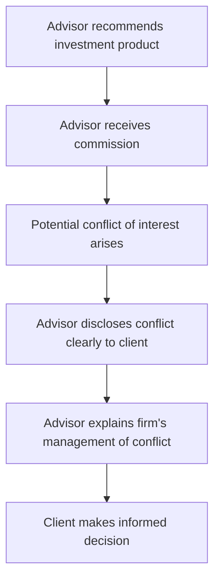
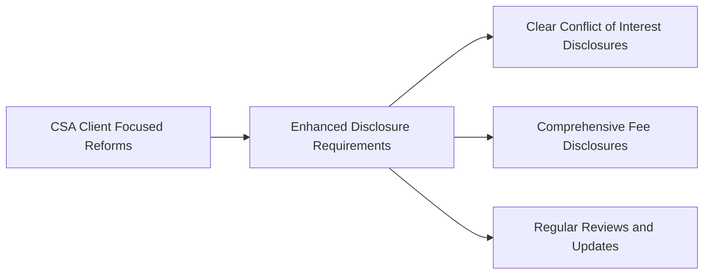

## 5.4 Disclosures

So, let's talk about disclosures. You know, the stuff that advisors and firms have to tell their clients upfront. It's not exactly the most glamorous part of the job, but trust me—it's one of the most crucial. Proper disclosure isn't just about ticking regulatory boxes; it's about building trust, transparency, and protecting both clients and advisors. If you've ever had a client say, "Wait, I didn't know about that fee!" then you already know how important clear disclosures can be.

### Why Disclosures Matter

Think of disclosures as the fine print made clear. They're the financial industry's way of saying, "Hey, here's everything you need to know—no surprises." When advisors provide clear, accurate, and timely disclosures, clients can make informed decisions. And informed clients are happy clients. Well, usually.

Imagine this scenario: Your client, Susan, invests in a mutual fund you recommended. A month later, she sees a fee deducted from her account that she wasn't expecting. She's upset, you're scrambling to explain, and suddenly, trust takes a hit. Proper disclosures prevent these awkward moments by clearly communicating fees, charges, commissions, potential conflicts of interest, and risks associated with investment products and strategies.

### Key Elements of Effective Disclosures

Effective disclosures aren't just about handing over a thick stack of documents and hoping for the best. They must be:

- **Clear and Understandable:** Avoid technical jargon. Seriously, no one wants to read a disclosure that sounds like it was written by a lawyer for another lawyer. Use plain language that your grandma would understand.
- **Accurate and Complete:** Don't leave out important details. If there's a fee, disclose it. If there's a conflict of interest, disclose it. If an investment carries specific risks, disclose them clearly.
- **Timely:** Disclosures should happen before the client makes any decisions or transactions. After-the-fact disclosures? Not helpful. And probably not compliant.
- **Documented:** Always put disclosures in writing. Verbal disclosures might be convenient, but they're also easy to forget or dispute. Written documentation protects both you and your client.

### Common Types of Disclosures

Let's break down some of the most common disclosures you'll encounter:

#### Fees and Charges

Clients need to know exactly what they're paying for. Whether it's management fees, transaction charges, or account maintenance fees, transparency is key. Here's a quick example:

| Fee Type                | Description                           | Example Amount |
|-------------------------|---------------------------------------|----------------|
| Management Fee          | Annual fee for managing investments   | 1.5% per year  |
| Transaction Commission  | Fee per trade executed                | $9.99 per trade|
| Account Maintenance Fee | Annual fee for maintaining the account| $100 annually  |

#### Conflicts of Interest

Ah, conflicts of interest—the phrase that makes every advisor cringe a little. But conflicts aren't inherently bad; they're inevitable in many business relationships. The key is disclosure and management.

A conflict of interest arises when your personal or financial interests could interfere with your duty to act in your client's best interests. For example, if your firm receives higher commissions for selling certain products, that's a conflict. You must disclose this clearly and explain how your firm manages or mitigates it—perhaps through internal policies, independent reviews, or compensation structures that align your interests with your client's.

Here's a simple visual to illustrate conflict disclosure:

#### Investment Risks

Every investment carries some level of risk. Clients must understand these risks upfront. For instance, investing in equities carries market risk (the risk of losing money due to market fluctuations), while bonds may carry interest rate risk (the risk of bond prices falling when interest rates rise).

Clearly explaining these risks helps clients align their investment choices with their risk tolerance and financial goals.

### Regulatory Requirements: CSA Client Focused Reforms

In Canada, disclosures aren't just good practice—they're mandatory. The Canadian Securities Administrators (CSA) introduced Client Focused Reforms (CFRs) to enhance investor protection. These reforms clarify and strengthen the obligations of advisors and firms, especially regarding disclosures.

Under CFRs, advisors must:

- Clearly disclose all material conflicts of interest.
- Explain how these conflicts are managed or mitigated.
- Provide comprehensive fee disclosures.
- Regularly review and update disclosures to reflect changes in products, services, or regulations.

Here's a quick diagram summarizing the disclosure obligations under CFRs:

### Best Practices for Advisors and Firms

So, how can you ensure your disclosures meet regulatory standards and client expectations? Here are some best practices:

- **Use Checklists:** Create standardized checklists to ensure all required disclosures are consistently provided.
- **Client-Friendly Documents:** Develop disclosure documents that are easy to read and visually appealing. Bullet points, tables, and simple language go a long way.
- **Regular Training:** Provide ongoing training for advisors to stay updated on disclosure requirements and best practices.
- **Periodic Reviews:** Regularly review your firm's disclosure practices to ensure compliance with evolving regulations and industry standards.

### Real-World Example: The Importance of Disclosure

Let me share a quick story. I once had a colleague—let's call him Mike—who was meticulous about disclosures. He'd spend extra time walking clients through every fee, every risk, every potential conflict. Some advisors thought he was overdoing it. But guess what? Mike had the highest client retention rate in the firm. Clients trusted him implicitly because he was transparent from day one. That's the power of proper disclosure.

### Common Pitfalls and How to Avoid Them

Despite best intentions, advisors sometimes fall into common disclosure pitfalls:

- **Assuming Clients Understand:** Never assume your client knows what you're talking about. Always check for understanding.
- **Relying on Verbal Disclosures Alone:** Always document disclosures in writing. Verbal disclosures can easily be forgotten or misunderstood.
- **Overloading Clients with Information:** Balance thoroughness with clarity. Too much information at once can overwhelm clients. Break disclosures into manageable sections.

### Glossary of Key Terms

- **Conflict of Interest:** A situation where an advisor's personal or financial interests may interfere with their duty to act in the client's best interests.
- **CSA Client Focused Reforms:** Regulatory amendments designed to enhance investor protection by clarifying and strengthening the obligations of advisors and firms.

### Additional Resources

Want to dive deeper? Check out these valuable resources:

- [CSA Client Focused Reforms](https://www.securities-administrators.ca/client-focused-reforms/)
- Online Course: ["Conflicts of Interest and Disclosure Obligations"](https://www.csi.ca/student/en_ca/courses/csi/conflicts.xhtml), Canadian Securities Institute (CSI)

Proper disclosure isn't just regulatory compliance—it's ethical practice, good business, and the foundation of trust in client relationships. So, take disclosures seriously. Your clients (and your career) will thank you.

## Test Your Knowledge: Securities Industry Disclosure Practices Quiz



### Why is proper disclosure essential in the securities industry?

- [x] It ensures transparency and protects clients.
- [ ] It reduces paperwork for advisors.
- [ ] It guarantees investment returns.
- [ ] It eliminates all investment risks.

> **Explanation:** Proper disclosure ensures transparency, allowing clients to make informed decisions and protecting their interests.

### Which of the following must be clearly disclosed to clients?

- [x] Fees and charges
- [x] Conflicts of interest
- [x] Investment risks
- [ ] Advisor's personal investment portfolio details

> **Explanation:** Advisors must disclose fees, conflicts of interest, and investment risks. Personal portfolio details are not required disclosures.

### What is a conflict of interest?

- [x] A situation where an advisor's personal interests could interfere with their duty to clients.
- [ ] A disagreement between two clients.
- [ ] A client's dissatisfaction with investment returns.
- [ ] A regulatory violation by the firm.

> **Explanation:** A conflict of interest occurs when an advisor's personal or financial interests may conflict with their obligation to act in the client's best interests.

### What regulatory reform specifically addresses disclosure obligations in Canada?

- [x] CSA Client Focused Reforms
- [ ] SEC Disclosure Act
- [ ] FINRA Transparency Initiative
- [ ] Basel III Accord

> **Explanation:** The CSA Client Focused Reforms specifically enhance disclosure obligations in Canada.


