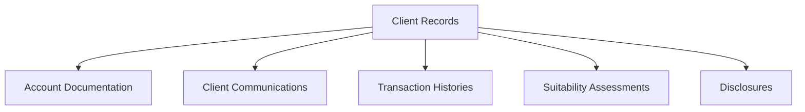
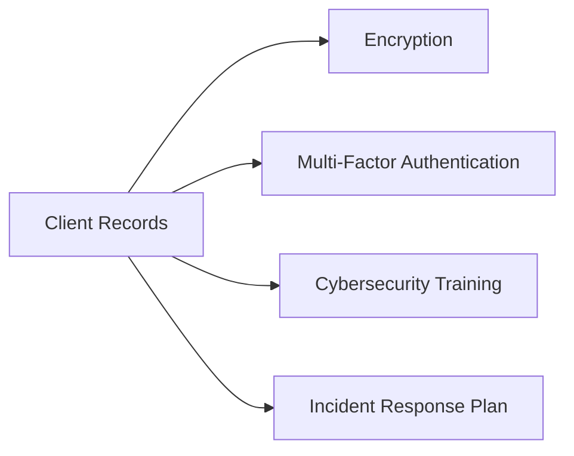

## 5.5 Client Records

Maintaining accurate, complete, and secure client records isn't just a regulatory requirement—it's a cornerstone of effective client relationship management. Think about it: how can you possibly provide solid financial advice if you don't have a clear, detailed picture of your client's financial situation, goals, and history? Exactly, you can't. That's why client records are so crucial.

Let's dive into why client records matter, what they must include, how to manage them effectively, and some practical tips to stay compliant with CIRO Rule 3800 and Canadian privacy laws.

### Why Client Records Matter

First off, client records are your lifeline. They help you:

- Understand your client's financial situation and investment objectives.
- Provide suitable investment recommendations.
- Demonstrate compliance with regulatory requirements.
- Protect yourself and your firm in case of disputes or audits.

I remember a colleague who once faced a CIRO audit. He was meticulous about record-keeping, and when the auditors came knocking, he was able to quickly provide all required documentation. He breezed through the audit without a hitch. On the flip side, I've seen advisors scramble because their records were incomplete or disorganized—trust me, you don't want to be in their shoes.

### What Should Client Records Include?

According to CIRO Rule 3800 and provincial securities laws, your client records must include:

- **Account Documentation:** Completed New Account Application Forms (NAAF), account agreements, and any updates or amendments.
- **Communications:** Emails, letters, notes from meetings, and phone call summaries with clients.
- **Transaction Histories:** Detailed records of all trades, deposits, withdrawals, and account transfers.
- **Suitability Assessments:** Documentation of suitability reviews, investment recommendations, and rationale behind investment decisions.
- **Disclosures:** Evidence of all disclosures provided to clients, including fees, conflicts of interest, and risks associated with investments.

Here's a quick visual summary:

### Implementing Robust Record-Keeping Systems

To comply with CIRO Rule 3800, your firm must implement robust record-keeping systems and procedures. This means having clear policies, secure storage solutions, and regular audits of your record-keeping practices.

Here are some best practices:

- **Digitize Records:** Paper records are so last century. Digital records are easier to organize, search, and back up. Plus, they're environmentally friendly.
- **Use Secure Cloud Storage:** Choose reputable cloud providers that offer encryption, multi-factor authentication, and regular security audits.
- **Regular Backups:** Schedule automatic backups of your records to prevent data loss.
- **Access Controls:** Limit access to client records to authorized personnel only, and regularly review access permissions.
- **Audit Trails:** Maintain detailed logs of who accessed records, when, and what changes were made.

Here's a practical example: Imagine you're advising a client, Sarah, who recently changed jobs and now has a higher income and different investment goals. You update her NAAF, document your conversation, and adjust her investment strategy accordingly. Your firm's secure cloud storage automatically logs these updates, timestamps them, and backs them up. If CIRO ever asks, you're ready to go.

### Regularly Updating Client Records

Life happens, right? Clients get married, divorced, have kids, change jobs, retire—you name it. Your records must reflect these changes. Regularly updating client records ensures your investment recommendations remain suitable and compliant.

Here's a quick checklist for updating client records:

- Annual reviews of client information.
- Immediate updates after significant life events.
- Regular communication with clients to verify accuracy.
- Documentation of all updates and client confirmations.

Let's say your client, Mike, calls to tell you he's inherited a substantial sum of money. You immediately document this conversation, update his financial profile, reassess his risk tolerance, and adjust his investment strategy. This proactive approach keeps you compliant and builds trust with Mike.

### Protecting Client Records: Privacy and Cybersecurity

Protecting client records isn't just good practice—it's the law. Canadian privacy laws, including the Personal Information Protection and Electronic Documents Act (PIPEDA), require firms to safeguard client information against unauthorized access, loss, or destruction.

Cybersecurity threats are real and evolving. Just last year, a major Canadian financial firm experienced a data breach, exposing sensitive client information. The fallout was messy—financial losses, regulatory penalties, and damaged reputations. You definitely don't want that.

Here are essential cybersecurity measures to protect client records:

- **Encryption:** Encrypt data both in transit and at rest.
- **Multi-Factor Authentication (MFA):** Require MFA for accessing client records.
- **Cybersecurity Training:** Regularly train staff on recognizing and preventing cyber threats.
- **Incident Response Plan:** Develop and regularly test a clear plan for responding to cybersecurity incidents.

Here's a simplified diagram of cybersecurity measures:

### Common Pitfalls and How to Avoid Them

Even the best advisors can stumble when it comes to client records. Here are some common pitfalls and strategies to avoid them:

- **Incomplete Documentation:** Always document client interactions thoroughly. If it's not documented, it didn't happen (at least in the eyes of regulators).
- **Outdated Information:** Schedule regular client reviews and updates. Set reminders in your CRM system.
- **Poor Cybersecurity Practices:** Invest in cybersecurity training and robust security systems. Don't skimp here—it's worth every penny.
- **Non-Compliance with Regulations:** Stay informed about CIRO rules and provincial securities laws. Regularly review your firm's compliance procedures.

### Glossary of Key Terms

- **Record-Keeping:** The systematic documentation, storage, and management of client information and account activities.
- **Cybersecurity:** Measures and practices designed to protect electronic data and systems from unauthorized access or cyber threats.

### Additional Resources

To dive deeper into client records, privacy, and cybersecurity, check out these resources:

- [CIRO Rule 3800 – Record-Keeping Requirements](https://www.ciro.ca/rules-and-regulations)
- [Office of the Privacy Commissioner of Canada – Privacy Guidelines](https://www.priv.gc.ca/en/privacy-topics/privacy-laws-in-canada/)
- Book: "Cybersecurity for Financial Professionals," by Canadian Securities Institute (CSI)

---

## Test Your Knowledge: Client Records and Record-Keeping Best Practices Quiz



### Why is maintaining accurate client records essential?

- [x] To provide suitable investment recommendations.
- [x] To demonstrate compliance with regulatory requirements.
- [ ] To minimize client interactions.
- [ ] To avoid cybersecurity measures.

> **Explanation:** Accurate client records enable advisors to provide suitable recommendations and demonstrate regulatory compliance.

### Which of the following must be included in client records according to CIRO Rule 3800?

- [x] Transaction histories
- [x] Suitability assessments
- [ ] Personal hobbies of the client
- [ ] Social media passwords

> **Explanation:** CIRO Rule 3800 requires transaction histories and suitability assessments to be documented, not personal hobbies or passwords.

### What is a best practice for securely storing client records?

- [x] Using encrypted cloud storage with multi-factor authentication.
- [ ] Storing records openly on shared drives.
- [ ] Keeping all records in paper format only.
- [ ] Allowing unrestricted employee access.

> **Explanation:** Secure cloud storage with encryption and multi-factor authentication is a recommended best practice.

### How often should client records be updated?

- [ ] Only when the client requests it.
- [x] Regularly and after significant life events.
- [ ] Every five years.
- [ ] Never, once created.

> **Explanation:** Client records should be updated regularly and after significant life events to ensure accuracy and suitability.

### Which Canadian law governs the protection of client information?

- [x] Personal Information Protection and Electronic Documents Act (PIPEDA)
- [ ] Canadian Anti-Spam Legislation (CASL)
- [ ] Criminal Code of Canada
- [ ] Canada Labour Code

> **Explanation:** PIPEDA governs the protection and privacy of personal information in Canada.


