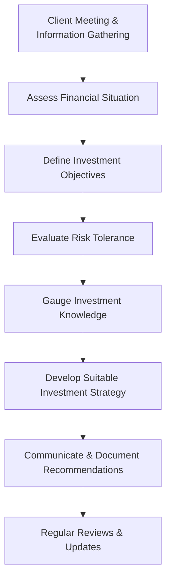

## 6.1 Suitability of Investments and Investment Strategies

So, you've probably heard the phrase "one size fits all," right? Well, when it comes to investments, that's about as far from the truth as you can get. Every investor is unique, with their own financial situation, goals, risk tolerance, and investment knowledge. That's why understanding and applying the concept of suitability is absolutely crucial for investment professionals. Let's dive in and unpack what suitability really means and how you can ensure your recommendations are spot-on for your clients.

### Understanding Suitability: What's the Big Deal?

Suitability is basically the obligation you have as an investment professional to make sure your recommendations fit your client's specific circumstances. It's not just a good idea—it's a regulatory requirement enforced by the Canadian Investment Regulatory Organization (CIRO). And trust me, you don't want to mess around with CIRO compliance. It protects your clients, your reputation, and your career.

### Key Components of Suitability Assessment

When assessing suitability, there are four main areas you need to consider carefully:

#### Financial Situation

First things first, you need a clear snapshot of your client's financial health. This includes:

- **Income and Net Worth:** How much money do they earn, and what's their total net worth?
- **Liquidity Needs:** Do they need quick access to cash, or can they afford to tie up funds for longer periods?
- **Debt Levels:** Are they carrying significant debt? High debt can limit investment flexibility.
- **Financial Stability:** Do they have a stable income source, or is their financial situation volatile?

Here's a quick example: Imagine your client, Sarah, earns $120,000 annually, has a net worth of $500,000, minimal debt, and stable employment. Her liquidity needs are low because she has an emergency fund. This financial stability allows her to consider longer-term, less liquid investments comfortably.

#### Investment Objectives

Next, clearly define what your client wants to achieve. Common objectives include:

- **Capital Preservation:** Protecting the principal amount invested.
- **Income Generation:** Regular income through dividends or interest.
- **Capital Appreciation:** Growing the investment over time.
- **Speculative Growth:** High-risk investments aiming for significant returns.

For instance, if Sarah's primary goal is retirement planning, she might prioritize capital appreciation and income generation over speculative growth.

#### Risk Tolerance

Ah, risk tolerance—this one's tricky because it involves both psychology and financial reality. You need to assess:

- **Psychological Comfort:** How comfortable is your client with market fluctuations?
- **Financial Capacity:** Can they financially withstand potential losses?

Let's say Sarah feels anxious about market volatility but has significant financial capacity to absorb losses. Your role is to balance her psychological comfort with her financial reality, perhaps recommending a moderately conservative portfolio.

#### Investment Knowledge and Experience

Finally, gauge your client's understanding of investments. Are they seasoned investors or complete beginners? This impacts the complexity of products you can recommend.

If Sarah has limited investment knowledge, you'll need to educate her thoroughly and recommend straightforward products initially.

### The Suitability Assessment Process

Here's a visual breakdown of the suitability assessment process:

### Regular Suitability Reviews: Life Happens!

Life isn't static, right? People get married, divorced, retire, inherit money, or lose jobs. Any significant life event can drastically alter a client's suitability profile. Regular reviews are essential to ensure your recommendations remain appropriate.

For example, if Sarah inherits $200,000, her financial situation and possibly her objectives and risk tolerance might shift significantly. Regular check-ins help you stay on top of these changes.

### Documentation: Your Best Friend in Compliance

Seriously, document everything. Every conversation, every assessment, every recommendation. Proper documentation isn't just about regulatory compliance; it's your best defense if disputes arise.

Here's a quick checklist for documentation:

- Client's financial details and objectives
- Risk tolerance assessments
- Investment recommendations and rationale
- Client acknowledgments and agreements
- Records of regular reviews and updates

### Communicating Recommendations Clearly

Transparency is key. Clearly explain why you're recommending a particular investment or strategy. Clients appreciate understanding your rationale—it builds trust and confidence.

For instance, instead of just saying, "I recommend this balanced mutual fund," explain, "Given your moderate risk tolerance, stable financial situation, and goal of retirement in 15 years, this balanced mutual fund offers an appropriate mix of growth and income."

### Avoiding Conflicts of Interest

Here's a golden rule: never recommend products based solely on commissions or incentives. Always prioritize suitability and client interests above personal gain. CIRO takes conflicts of interest very seriously, and so should you.

### Common Pitfalls and How to Avoid Them

- **Ignoring Changes in Client Circumstances:** Regularly update client information.
- **Overestimating Client Knowledge:** Always confirm understanding; educate when necessary.
- **Misjudging Risk Tolerance:** Use structured questionnaires and discussions to accurately gauge risk tolerance.
- **Poor Documentation:** Make detailed notes immediately after client interactions.

### Real-Life Case Study: Suitability in Action

Let's revisit Sarah. Initially, she had a moderate risk tolerance, stable income, and retirement goals. After inheriting money, she expressed interest in speculative investments. However, after discussing her discomfort with potential losses, you both agreed to allocate only a small portion to speculative assets, keeping the majority in balanced and income-generating investments. This tailored approach demonstrates excellent suitability practice.

### Glossary of Key Terms

- **Suitability Obligation:** The regulatory requirement ensuring investment recommendations align with client-specific circumstances.
- **Risk Tolerance:** The degree of variability in investment returns an investor is willing and able to withstand.
- **Investment Objectives:** Financial goals an investor aims to achieve through investing.
- **Know Your Client (KYC):** Regulatory requirement to gather detailed client information ensuring suitable recommendations.

### Additional Resources for Further Exploration

- **CIRO Rule 3400 – Suitability:** [CIRO Rule 3400](https://www.ciro.ca/rules-and-enforcement/rules)
- **CSA Staff Notice 31-336 – Guidance on Suitability Obligations:** [CSA Staff Notice 31-336](https://www.securities-administrators.ca/)
- **Book:** "Investment Suitability and Risk Management" by Robert A. Jaeger
- **Online Course:** CSI’s "Investment Advisor Training Program" – [CSI Investment Advisor Training](https://www.csi.ca/student/en_ca/courses/csi/iatr.xhtml)

---

## Test Your Knowledge: Investment Suitability and Client Strategies Quiz



### What is the primary purpose of the suitability obligation?

- [x] To ensure investment recommendations align with client-specific circumstances.
- [ ] To maximize commissions for investment professionals.
- [ ] To promote speculative investments.
- [ ] To simplify regulatory compliance.

> **Explanation:** Suitability obligations protect clients by ensuring recommendations match their financial situation, objectives, risk tolerance, and knowledge.

### Which factor is NOT typically considered when assessing a client's financial situation?

- [ ] Income level
- [ ] Debt obligations
- [x] Favorite investment brands
- [ ] Liquidity needs

> **Explanation:** Personal preferences for investment brands are not relevant to assessing financial suitability.

### Why is documenting suitability assessments critical?

- [x] It demonstrates compliance with regulatory requirements.
- [x] It helps mitigate potential disputes.
- [ ] It increases commission rates.
- [ ] It simplifies investment choices.

> **Explanation:** Proper documentation protects both the client and advisor by clearly recording the rationale behind recommendations.

### When should suitability reviews be conducted?

- [x] Regularly and after significant life changes.
- [ ] Only when opening a new account.
- [ ] Every five years.
- [ ] Only at the client's request.

> **Explanation:** Regular reviews ensure recommendations remain appropriate as client circumstances evolve.

### Which factor is NOT typically part of a suitability assessment?

- [ ] Financial situation
- [ ] Risk tolerance
- [ ] Investment knowledge
- [x] Advisor's personal investment preferences

> **Explanation:** The advisor's personal preferences should never influence client-specific recommendations.


